# LocalServe Marketplace — Phase 2 System Architecture

**Document ID:** LS-ARCH-002  
**Version:** 1.0.0  
**Status:** Phase 2 baseline candidate  
**Date:** 2026-08-06  
**Parent specification:** `LOCAL_SERVE_PRODUCT_SPECIFICATION.md` version 1.0.1  
**Audience:** Product, engineering, security, QA, DevOps, operations, and academic evaluators

---

## 1. Purpose and architecture contract

This document converts the Phase 1 product requirements into an implementation-ready system architecture. It defines the boundaries, responsibilities, communication patterns, trust zones, deployment tiers, scaling approach, and architectural decisions that later database, API, backend, frontend, testing, and deployment phases must follow.

The following Phase 1 decisions remain authoritative and are not redefined here:

- Product/code identifier: `LocalServe Marketplace` / `localserve`.
- Roles: `CUSTOMER`, `PROVIDER`, and separately managed `ADMIN`.
- API namespace: `/api/v1`.
- Canonical booking, payment, offer, verification, dispute, payout, and notification statuses.
- Java 21/Spring Boot modular monolith, MongoDB, Redis, Kafka, Spring WebSocket/STOMP, Next.js, and React Native.
- Server-authoritative booking/payment behavior, immutable double-entry ledger, and platform-held delayed settlement.
- Final-year constraint: the complete core journey runs locally; expensive, regulated, and hyperscale capabilities are honestly classified.

### 1.1 Phase 2 scope

This phase defines architecture but does not yet create MongoDB schemas, complete endpoint contracts, application code, or deployment manifests. Those belong to Phases 3–13.

### 1.2 Architecture success criteria

The architecture is acceptable only if it:

1. Makes invalid booking and financial outcomes structurally difficult.
2. Preserves module ownership while keeping one understandable Spring Boot deployment for the student build.
3. Runs on a capable laptop with Docker Compose and scales through stateless replicas, partitioned events, caching, and managed infrastructure.
4. Separates customer, provider, and admin experiences and authorization boundaries.
5. Supports real-time dispatch, chat, tracking, notifications, and presence without treating a socket as the source of truth.
6. Keeps restricted documents, precise location, payment data, and administrative actions within explicit trust boundaries.
7. Makes third-party failures recoverable through idempotency, timeouts, queues, reconciliation, and operator workflows.
8. Is explainable by a final-year team during a viva and avoids microservices or abstractions that do not solve a current problem.

---

## 2. Architecture drivers and quality attributes

| Priority | Driver | Architectural response |
|---:|---|---|
| 1 | Money and booking correctness | State machine, optimistic concurrency, idempotency, MongoDB transactions, immutable ledger, outbox/inbox, reconciliation |
| 2 | Security and privacy | Separate admin trust zone, least privilege, short-lived tokens, rotating refresh tokens, private object storage, encryption, masking, audited access |
| 3 | Final-year feasibility | Modular monolith, one repository, Docker Compose, managed/sandbox adapters, seeded demo, limited deployment units |
| 4 | Real-time experience | STOMP over WebSocket, Redis fan-out/presence, Kafka durable events, authoritative REST recovery |
| 5 | Availability and recovery | Stateless APIs, bounded retries, Resilience4j, queues, health probes, backups, replay-safe consumers, runbooks |
| 6 | Horizontal scale | Independent API/WebSocket/worker scaling, event partitioning, Redis cache, geospatial indexes, read models, CDN/object storage |
| 7 | Maintainability | DDD bounded contexts, hexagonal module interiors, DTO/domain/document separation, ArchUnit, explicit contracts |
| 8 | Observability | OpenTelemetry traces, structured logs, RED/saturation/business metrics, SLOs, audit separation |

### 2.1 Key architectural constraints

- MongoDB is the operational source of truth. Redis, Kafka, search indexes, dashboards, and client caches are derived or coordination systems.
- An external gateway call never occurs inside a database transaction.
- Kafka delivery is at-least-once. Business effects are exactly-once-like through idempotency and inbox/outbox records.
- Redis distributed locks may reduce contention but never replace database predicates, unique constraints, or aggregate version checks.
- Booking commands use REST/application services. WebSocket carries authorized real-time input for chat/location and distributes updates; it cannot directly set booking or payment status.
- A customer-facing `COMPLETED` booking is not proof of payout. Release and payout remain separate finance workflows.
- The internal held-funds ledger is not described as a licensed escrow account.

---

## 3. System context

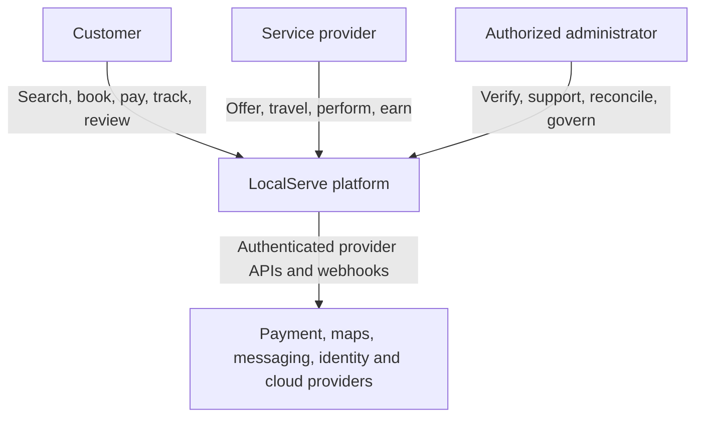
```mermaid
flowchart TD
    customer["Customer"]
    provider["Service provider"]
    admin["Authorized administrator"]
    platform["LocalServe platform"]
    external["Payment, maps, messaging, identity and cloud providers"]

    customer -->|"Search, book, pay, track, review"| platform
    provider -->|"Offer, travel, perform, earn"| platform
    admin -->|"Verify, support, reconcile, govern"| platform
    platform -->|"Authenticated provider APIs and webhooks"| external
```

### 3.1 Actors and boundaries

| Actor/system | Trust level | Main boundary |
|---|---|---|
| Customer browser/mobile | Untrusted client | All input and displayed status are revalidated server-side |
| Provider browser/mobile | Untrusted field client | Location, evidence, OTP, offer, and payout requests are verified and scoped |
| Admin browser | Privileged but untrusted endpoint | Separate origin, mandatory stronger authentication, least privilege, audited actions |
| LocalServe application | Trusted application tier | Enforces authorization, state, financial, privacy, and integration policies |
| MongoDB/Redis/Kafka/storage | Restricted data tier | Private networking, service identities, encryption, backup, no direct user access |
| External providers | Third-party boundary | Signed webhooks, scoped credentials, timeouts, minimization, reconciliation, vendor controls |

---

## 4. High-level container architecture

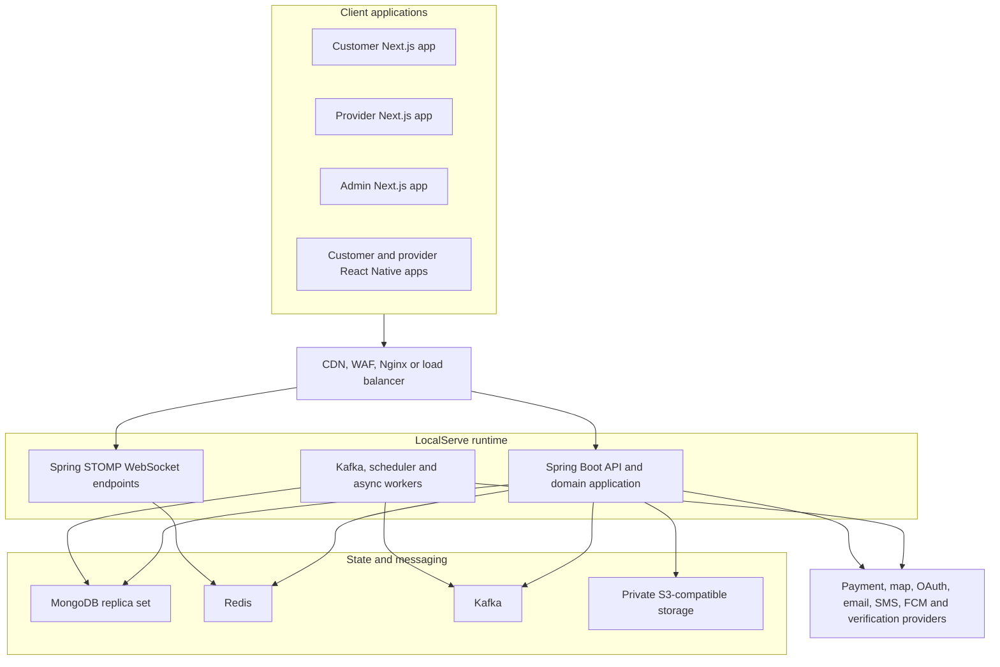
```mermaid
flowchart TD
    subgraph clients["Client applications"]
        cweb["Customer Next.js app"]
        pweb["Provider Next.js app"]
        aweb["Admin Next.js app"]
        mobile["Customer and provider React Native apps"]
    end

    edge["CDN, WAF, Nginx or load balancer"]

    subgraph runtime["LocalServe runtime"]
        api["Spring Boot API and domain application"]
        socket["Spring STOMP WebSocket endpoints"]
        workers["Kafka, scheduler and async workers"]
    end

    subgraph data["State and messaging"]
        mongo["MongoDB replica set"]
        redis["Redis"]
        kafka["Kafka"]
        objects["Private S3-compatible storage"]
    end

    providers["Payment, map, OAuth, email, SMS, FCM and verification providers"]

    clients --> edge
    edge --> api
    edge --> socket
    api --> mongo
    api --> redis
    api --> kafka
    api --> objects
    socket --> redis
    workers --> kafka
    workers --> mongo
    workers --> providers
    api --> providers
```

### 4.1 Deployment units

The code is a modular monolith, but runtime responsibilities may be started with different Spring profiles from the same build artifact:

| Deployment unit | Responsibility | Student build | Scaled deployment |
|---|---|---|---|
| `localserve-api` | REST, authentication, synchronous application commands/queries | One container | Multiple stateless replicas |
| `localserve-realtime` | STOMP connections, chat/location input, user queues, socket fan-out | Same API process or one container | Independent WebSocket replicas |
| `localserve-worker` | Kafka consumers, outbox publishing, notifications, reconciliation, scheduled commands | Same application or one container | Multiple consumer groups by workload |
| Customer web | Public/search and customer dashboard | One Next.js container | CDN + multiple server replicas where SSR is used |
| Provider web | Provider onboarding and operations | One Next.js container | Independent replicas |
| Admin web | Privileged operations | One separately routed container | Private/restricted origin and independent replicas |

The student default uses one backend container with API, real-time, and worker profiles enabled to remain easy to run. Production can split the same artifact by profile before any domain becomes a microservice.

### 4.2 Request classification

| Interaction | Primary path | Consistency |
|---|---|---|
| Login, booking commands, payment-order creation, admin action | HTTPS REST | Immediate authoritative response |
| Catalog/profile/search reads | HTTPS REST with cache/read model | Strong enough for eligibility; eventual for noncritical aggregates |
| Chat/location/typing input | Authenticated STOMP application destination | Persist/validate before acknowledgement where durable |
| Booking/payment/offer updates | Kafka domain event to authorized WebSocket user queue | Eventual, ordered per aggregate; REST refresh is authoritative |
| Notification delivery | Kafka command/event to async worker | Eventual with retry/dead-letter |
| Payment webhook | Public HTTPS webhook with raw-body verification | Durable receipt then idempotent processing |
| Reporting/analytics | Event-fed projections/aggregations | Eventual with freshness displayed |

---

## 5. Backend architecture

### 5.1 Repository and build structure

```text
localserve/
├── pom.xml
├── backend/
│   ├── pom.xml
│   ├── shared-kernel/
│   ├── identity-access/
│   ├── people/
│   ├── catalog-search/
│   ├── location/
│   ├── booking-dispatch/
│   ├── finance/
│   ├── communication/
│   ├── reputation-growth/
│   ├── case-management/
│   ├── administration-analytics/
│   ├── file-management/
│   └── application/
├── web/
│   ├── apps/customer/
│   ├── apps/provider/
│   ├── apps/admin/
│   └── packages/
├── mobile/
│   ├── apps/customer/
│   ├── apps/provider/
│   └── packages/
├── infrastructure/
│   ├── compose/
│   ├── nginx/
│   ├── kubernetes/
│   ├── terraform/
│   └── observability/
├── tests/
│   ├── e2e/
│   ├── performance/
│   └── security/
└── docs/
```

The repository is a monorepo. Maven builds the backend; a pinned `pnpm` workspace manages web/mobile packages. Root commands introduced in later phases provide `make dev`, `make test`, and `make demo` style entry points without hiding the underlying commands students must understand.

### 5.2 Modular monolith component map

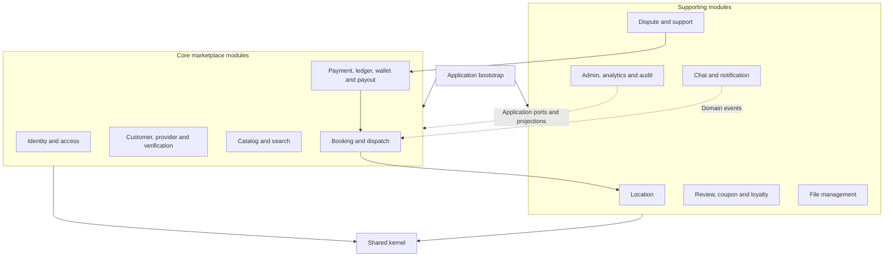
```mermaid
flowchart TD
    app["Application bootstrap"]
    shared["Shared kernel"]

    subgraph core["Core marketplace modules"]
        identity["Identity and access"]
        people["Customer, provider and verification"]
        catalog["Catalog and search"]
        booking["Booking and dispatch"]
        finance["Payment, ledger, wallet and payout"]
    end

    subgraph support["Supporting modules"]
        location["Location"]
        communication["Chat and notification"]
        reputation["Review, coupon and loyalty"]
        cases["Dispute and support"]
        admin["Admin, analytics and audit"]
        files["File management"]
    end

    app --> core
    app --> support
    core --> shared
    support --> shared
    booking --> location
    finance --> booking
    cases --> finance
    communication -.->|"Domain events"| booking
    admin -.->|"Application ports and projections"| core
```

Mermaid arrows show high-level allowed interaction, not permission to reach another module's repositories. Exact dependency rules are below.

### 5.3 Module responsibilities and ownership

| Maven module | Logical bounded contexts | Owns | May call synchronously |
|---|---|---|---|
| `shared-kernel` | Cross-cutting value types and contracts | Money, currency, public ID, clock, correlation, domain-event envelope, safe error primitives | Nothing |
| `identity-access` | Identity and Access, User sessions | Credentials, OAuth links, roles/permissions, sessions, refresh families, OTP/recovery, auth logs | Shared kernel, notification port |
| `people` | Customer, Provider, Verification | Customer/provider profiles, addresses, skills, availability, verification cases/doc references, payout destination metadata | Identity contracts, file contracts |
| `catalog-search` | Category/Service, Search | Catalog, price guidance, serviceability metadata, normalized search fields, provider discovery projections | Location query port, provider eligibility projection |
| `location` | Location | Provider latest durable location, service zones, geospatial eligibility, tracking retention policies | Shared kernel, map provider port |
| `booking-dispatch` | Booking, Dispatch | Booking aggregate, status history, offers, dispatch waves, OTP purpose state, timelines, scheduled commands | People/catalog/location contracts, finance command port |
| `finance` | Payment, Held Funds, Ledger, Wallet, Payout, Refund | Payment attempts, verified webhook receipts, double-entry ledger, balances, releases, refunds, withdrawals, payouts, reconciliation | Booking application contract, gateway/payout adapters |
| `communication` | Chat, Notification, Presence | Conversations/messages/receipts, notification jobs/templates/preferences, delivery attempts; ephemeral presence in Redis | Booking participation query, identity safe-contact port |
| `reputation-growth` | Review, Rating, Coupon, Referral, Loyalty | Reviews/moderation, rating aggregates, coupon campaign/usage, promotional credit rules | Booking eligibility, finance promotion posting port |
| `case-management` | Dispute, Support | Dispute aggregate, evidence links, decisions/appeals, support tickets, case SLA | Booking timeline, finance freeze/resolution, chat evidence and file ports |
| `administration-analytics` | Admin, Configuration, CMS, Audit, Analytics | Admin accounts/policies, feature flags, settings, audit records, analytics projections, CMS/campaign configuration | Other modules' explicit admin application ports only |
| `file-management` | File Management | Upload sessions, file metadata, classification, quarantine/scan, storage keys, signed-access audit | Object storage/scanner adapters |
| `application` | Bootstrap and composition | Spring Boot main class, configuration assembly, security filter chain composition, consumer/profile activation | All modules through documented configuration |

### 5.4 Dependency rules

1. A module owns its domain model, application services, persistence documents, repositories, and internal adapters.
2. No module imports another module's persistence package or Mongo document.
3. Synchronous cross-module access uses a small exported application contract such as `ProviderEligibilityQuery` or `FreezeHeldFundsCommand`.
4. Side effects and projections use versioned domain events. Consumers cannot assume an event is delivered once.
5. `shared-kernel` contains stable value types, not business services, general DTOs, or a dumping ground of helpers.
6. `administration-analytics` never bypasses domain rules. An admin action invokes the owning module's permissioned command.
7. A module may maintain its own read projection from another module's event rather than creating a runtime dependency for high-volume queries.
8. ArchUnit tests fail the build on forbidden package/module dependencies and direct controller-to-repository access.

### 5.5 Hexagonal structure inside each module

```text
com.localserve.<module>/
├── domain/
│   ├── model/
│   ├── service/
│   ├── policy/
│   └── event/
├── application/
│   ├── port/in/
│   ├── port/out/
│   ├── command/
│   ├── query/
│   └── service/
├── adapter/
│   ├── in/web/
│   ├── in/messaging/
│   ├── out/persistence/
│   ├── out/integration/
│   └── out/messaging/
└── config/
```

- Controllers validate transport shape, create commands, invoke input ports, and map results. They contain no business policy.
- Application services define use-case orchestration and transaction boundaries.
- Domain objects enforce invariants and produce domain events without depending on Spring, MongoDB, Kafka, or HTTP.
- Output ports abstract persistence, clock, maps, payment, messaging, storage, and other systems.
- Adapters translate external representations and failure modes into typed application results.

### 5.6 Command, query, and event flow

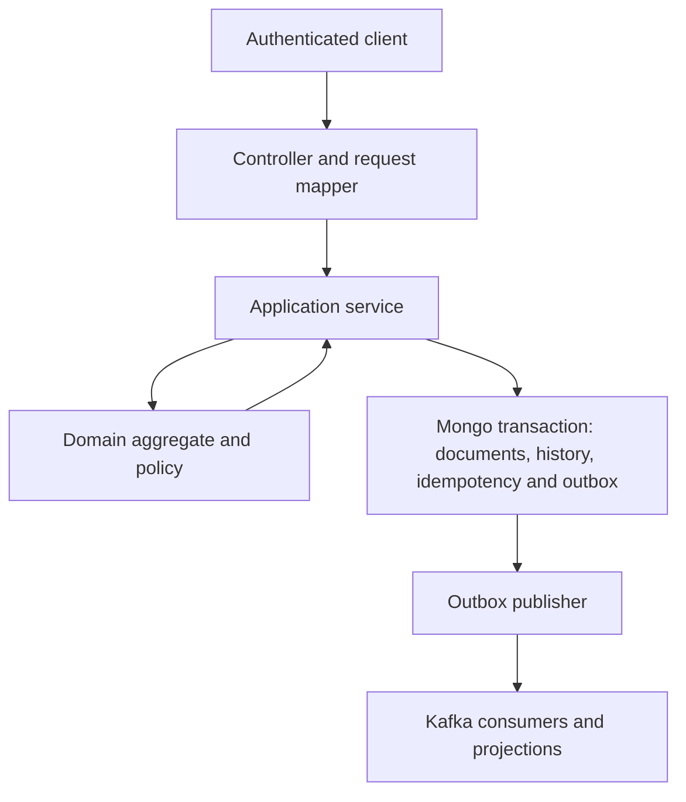
```mermaid
flowchart TD
    client["Authenticated client"]
    controller["Controller and request mapper"]
    service["Application service"]
    domain["Domain aggregate and policy"]
    transaction["Mongo transaction: documents, history, idempotency and outbox"]
    publisher["Outbox publisher"]
    consumers["Kafka consumers and projections"]

    client --> controller
    controller --> service
    service --> domain
    domain --> service
    service --> transaction
    transaction --> publisher
    publisher --> consumers
```

### 5.7 Transaction boundaries

- A normal command changes one aggregate and its history/idempotency/outbox entries in one MongoDB transaction.
- A critical cross-module command may update multiple owned collections in one MongoDB transaction because modules share one replica set. An application orchestrator uses exported ports; it does not access foreign repositories.
- Payment gateway, map, SMS, email, FCM, object storage, and verification calls occur before or after local transactions through a saga-like workflow.
- External results are recorded first, then applied idempotently. A crash between external success and local application is recovered through webhook/polling/reconciliation.
- Long-running scheduled actions store a command record with due time and expected aggregate version. Workers claim, revalidate, and execute it; generic schedulers never write business status directly.

### 5.8 Outbox and inbox architecture

1. The aggregate produces a versioned domain event.
2. The application transaction stores the aggregate change and outbox record together.
3. The outbox worker claims unpublished records using lease/owner fields and publishes to Kafka.
4. Publication confirmation marks the record published; uncertain outcomes may republish.
5. Side-effecting consumers store an inbox/deduplication record keyed by consumer and event ID in the same transaction as their local effect.
6. Event ordering is guaranteed only per aggregate partition key. Consumers reject stale aggregate versions or rebuild projections.
7. Dead-letter records retain original event metadata, sanitized error, attempts, ownership, and replay history.

This design intentionally does not use event sourcing. MongoDB stores current aggregates and required append-only histories; Kafka provides integration events and rebuildable projections.

### 5.9 Error contract

All REST errors use a stable problem-details-style envelope containing:

- `type`, `title`, `status`, `code`, and safe `detail`.
- `instance`, `correlationId`, and `timestamp`.
- Field violations with code/path/message for validation errors.
- `currentVersion` and safe current state for optimistic-lock conflicts where appropriate.
- No stack trace, secret, token, full document number, gateway raw error, or internal class name.

Domain error codes are namespaced, for example `BOOKING.INVALID_TRANSITION`, `PAYMENT.SIGNATURE_INVALID`, and `AUTH.REFRESH_REUSE_DETECTED`. Exact codes and HTTP mappings are frozen in Phase 4.

---

## 6. Web frontend architecture

### 6.1 Monorepo structure

```text
web/
├── apps/
│   ├── customer/
│   ├── provider/
│   └── admin/
├── packages/
│   ├── design-system/
│   ├── api-client/
│   ├── auth-client/
│   ├── realtime-client/
│   ├── maps-client/
│   ├── forms/
│   ├── observability/
│   ├── testing/
│   ├── eslint-config/
│   └── tsconfig/
├── package.json
├── pnpm-workspace.yaml
└── turbo.json
```

The three Next.js applications are separate deployment units with separate routes, navigation, access guards, and visual emphasis. They share low-level design, API, authentication, real-time, and testing packages—not role-specific pages or permissions.

### 6.2 Application boundaries

| Application | Primary route/origin | Responsibilities | Security posture |
|---|---|---|---|
| Customer | `www` / customer origin | Discovery, provider comparison, booking, payment, tracking, chat, review, wallet/credits, support | Public pages plus authenticated customer routes |
| Provider | `provider` origin | Onboarding, documents, online status, offers, work execution, OTPs, earnings, payout, support | Approved-provider gates and higher-risk location/file permissions |
| Admin | `admin` origin | Verification, operations, finance, dispute, content, analytics, monitoring, permissions | No public signup, stronger session/2FA, strict CSP, audited actions |

Admin code is not bundled into public applications. Admin cookies/tokens are host-scoped and do not share a broad parent-domain cookie with public apps.

### 6.3 Web application layers

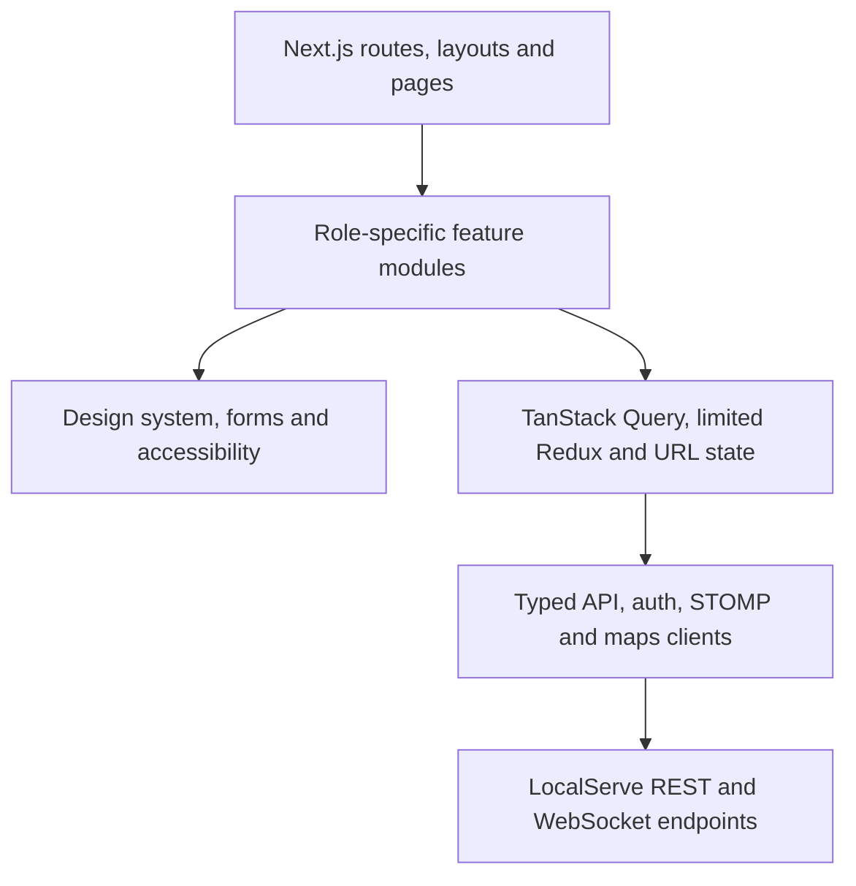
```mermaid
flowchart TD
    routes["Next.js routes, layouts and pages"]
    features["Role-specific feature modules"]
    shared["Design system, forms and accessibility"]
    state["TanStack Query, limited Redux and URL state"]
    clients["Typed API, auth, STOMP and maps clients"]
    backend["LocalServe REST and WebSocket endpoints"]

    routes --> features
    features --> shared
    features --> state
    state --> clients
    clients --> backend
```

### 6.4 State ownership

| State type | Owner/tool | Examples |
|---|---|---|
| Server state | TanStack Query | Profiles, catalog, booking, offers, wallet views, notifications |
| Form state | React Hook Form + Zod | Registration, onboarding, address, booking, dispute, admin decision |
| Cross-page transient client state | Small Redux Toolkit slices | Booking draft, active-role context, real-time connection/reconnect metadata |
| URL state | Next router/search parameters | Search query, filters, sort, admin list cursor/filter |
| Harmless local preferences | Local storage with schema/version | Theme, reduced data preference, last non-sensitive filter |
| Authentication secrets | Memory plus secure HttpOnly refresh cookie | Access token in memory; opaque refresh token never exposed to JavaScript |

Redux does not duplicate TanStack Query resources. Payment, booking, OTP, and payout success are not persisted as client truth.

### 6.5 Rendering and data-fetching strategy

- Public catalog/category/marketing pages may use server rendering or incremental caching for discovery and performance.
- Personalized dashboards and money/status views fetch authenticated data from the Spring backend and always honor `Cache-Control: no-store` where sensitive.
- The browser receives a short-lived access token after secure refresh and holds it in memory. On reload, it calls the protected refresh endpoint using the HttpOnly cookie and CSRF/origin defenses.
- Server Components never receive a broadly scoped long-lived token. Any server-side authenticated call uses a narrowly designed session bridge introduced only if its threat model is approved.
- Mutations include idempotency/expected-version headers where required and invalidate/refetch affected queries after authoritative success.

### 6.6 Role-specific navigation

| Customer | Provider | Admin |
|---|---|---|
| Home/search | Dashboard | Overview/health |
| Services/categories | Incoming offers | Customers/providers |
| Active booking/tracking | Current booking/navigation | Verification queue |
| Bookings/history | Schedule/availability | Bookings/dispatch |
| Favorites/repeat | Services/pricing | Payments/ledger/reconciliation |
| Wallet/rewards | Earnings/wallet/payouts | Disputes/refunds/payouts |
| Chat/notifications | Reviews/performance | Catalog/coupons/CMS |
| Addresses/profile/support | Documents/profile/support | Support/audit/settings |

Bottom navigation is used on mobile-width customer/provider screens; desktop uses an accessible sidebar/top bar. Admin uses dense but keyboard-operable tables, filters, queues, and detail drawers/pages.

### 6.7 Design system and accessibility

- Tailwind tokens define color, typography, spacing, radius, elevation, motion, and semantic status across light/dark/high-contrast modes.
- shadcn/ui primitives are wrapped in LocalServe components so validation, focus, loading, permissions, and analytics behavior remain consistent.
- Status colors are accompanied by text/icon; focus order, live regions, error summaries, reduced motion, target size, and 200% zoom are acceptance-tested.
- Skeletons reserve layout and are hidden/announced correctly for assistive technology; a loading state never masks a failed or stale payment state.
- Destructive and financial actions use explicit summary/confirmation and do not rely on a toast as the only result.

### 6.8 Frontend resilience

- The API client attaches correlation, locale, client version, idempotency, and expected-version metadata as appropriate.
- It retries only safe idempotent reads and explicitly approved commands; it never blindly retries payment, payout, OTP, or booking transitions.
- A global error boundary reports a sanitized incident ID and preserves recoverable drafts.
- Socket reconnect triggers REST refetch of active booking/conversation summaries.
- Offline mode permits read-only cached safe views and explicit draft/evidence queues; critical commands remain pending until server acknowledgement.
- Feature flags are evaluated from signed/authenticated configuration and always have a safe default.

---

## 7. Mobile architecture

### 7.1 Scope and structure

React Native with TypeScript uses separate customer and provider applications plus shared packages:

```text
mobile/
├── apps/
│   ├── customer/
│   └── provider/
├── packages/
│   ├── design-system/
│   ├── api-client/
│   ├── auth/
│   ├── realtime/
│   ├── maps-location/
│   ├── notifications/
│   ├── offline/
│   └── testing/
└── package.json
```

Expo development builds/prebuild may be used to keep the final-year workflow manageable while retaining native modules for secure storage, FCM/APNs, camera, uploads, maps, and controlled background location. Production is not dependent on Expo Go.

### 7.2 Shared and separate concerns

| Shared | Customer-specific | Provider-specific |
|---|---|---|
| Design tokens/components | Discovery and booking | Availability and incoming offers |
| Typed REST/STOMP clients | Payment and live tracking | Foreground/background work tracking |
| Secure session handling | Addresses and favorites | Evidence camera/upload |
| Error/offline infrastructure | Review/dispute | OTP entry, earnings and payout |
| Push/deep-link router | Customer support | Document onboarding and expiry |

### 7.3 Mobile security and offline policy

- Access and refresh credentials use platform secure storage; no token is placed in AsyncStorage or logs.
- Device registration and push tokens are session-bound and revocable.
- Certificate pinning remains a risk-based production option with a documented rotation/break-glass strategy; it is not hardcoded blindly in the student demo.
- Background provider location is active only while online/assigned under explicit OS permission and visible product controls.
- The offline queue stores only approved idempotent operations with encrypted sensitive payloads and expiration. Payment confirmation, OTP success, and arbitrary state transitions are never synthesized offline.
- Media uploads are resumable using upload-session IDs and checksums; sensitive cached files are deleted after verified upload or retention timeout.

### 7.4 Mobile navigation

Customer and provider apps use independent navigation trees. Authentication, onboarding, active booking, modal safety/payment confirmation, and deep-linked notification routes are state-aware. A deep link never bypasses server authorization or step-up checks.

---

## 8. Real-time architecture

### 8.1 Principles

- MongoDB booking/chat state remains authoritative.
- Kafka carries durable business events; Redis Pub/Sub distributes ephemeral fan-out between WebSocket instances.
- Presence and typing indicators are ephemeral Redis records with TTL.
- Sensitive updates prefer per-user queues over publicly guessable topics.
- Each real-time payload contains event ID/type/version, aggregate ID/version, occurred time, correlation ID, and minimal authorized content.
- Reconnection always reconciles through REST; clients do not depend on replaying every socket frame.

### 8.2 Real-time topology

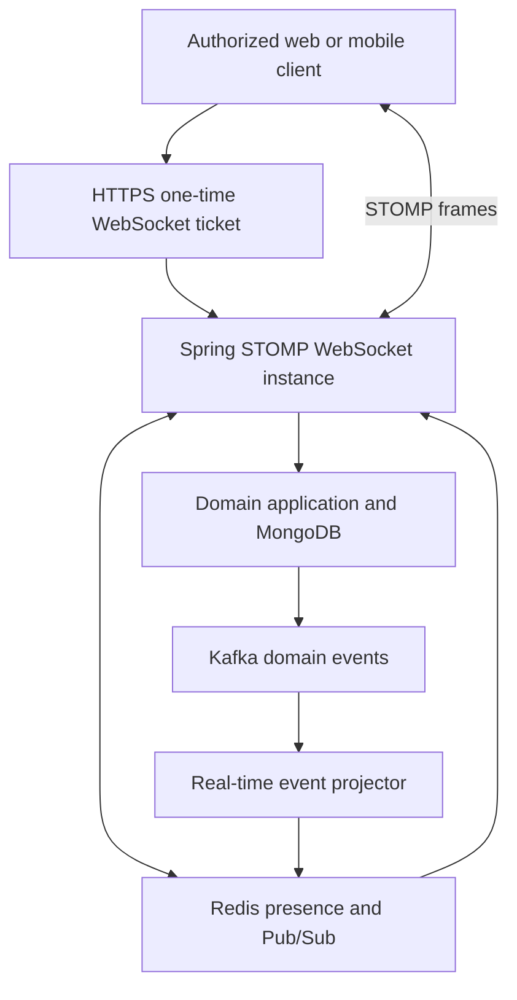
```mermaid
flowchart TD
    client["Authorized web or mobile client"]
    ticket["HTTPS one-time WebSocket ticket"]
    ws["Spring STOMP WebSocket instance"]
    redis["Redis presence and Pub/Sub"]
    domain["Domain application and MongoDB"]
    kafka["Kafka domain events"]
    fanout["Real-time event projector"]

    client --> ticket
    ticket --> ws
    client <-->|"STOMP frames"| ws
    ws <--> redis
    ws --> domain
    domain --> kafka
    kafka --> fanout
    fanout --> redis
    redis --> ws
```

### 8.3 Connection security

1. Authenticated client calls `POST /api/v1/realtime/tickets` over HTTPS.
2. Backend creates a random, single-use, 60-second Redis ticket bound to user, session, active role, origin, and allowed channel class.
3. Client opens `/ws`/SockJS using the ticket; the server atomically consumes it.
4. STOMP `CONNECT` establishes the authenticated principal; subscription interceptors authorize every destination.
5. Session revocation, suspension, or permission change can publish a disconnect/invalidate event.

This avoids putting a reusable JWT in a WebSocket query string. Exact duration and destination names are frozen in Phase 4.

### 8.4 Destination classes

| Class | Example intent | Authorization |
|---|---|---|
| User queue | Booking/offer/payment/notification updates for one user | Server maps authenticated principal; client cannot choose another user ID |
| Booking participant queue | Chat, typing, read receipt, tracking for active booking | Customer or selected/assigned provider; booking-stage policy |
| Provider request queue | Time-bound nearby service requests | Approved/online/eligible provider cohort only |
| Admin monitoring queue | Operational aggregate updates | Specific admin permission; sanitized payload |
| Application input | Chat send, receipt, typing, location update | Message-level authorization, validation, rate limit, idempotency where durable |

### 8.5 Chat flow

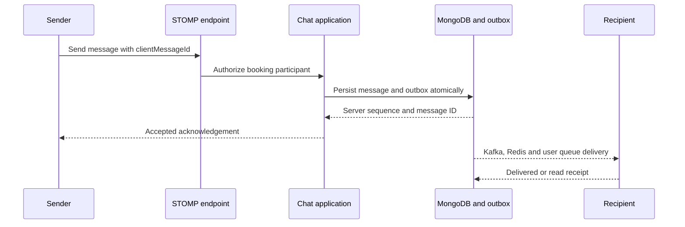
```mermaid
sequenceDiagram
    participant Sender
    participant Socket as STOMP endpoint
    participant Chat as Chat application
    participant Store as MongoDB and outbox
    participant Recipient

    Sender->>Socket: Send message with clientMessageId
    Socket->>Chat: Authorize booking participant
    Chat->>Store: Persist message and outbox atomically
    Store-->>Chat: Server sequence and message ID
    Chat-->>Sender: Accepted acknowledgement
    Store-->>Recipient: Kafka, Redis and user queue delivery
    Recipient-->>Store: Delivered or read receipt
```

- Durable messages are acknowledged only after persistence.
- `clientMessageId` plus sender/conversation uniqueness prevents duplicates.
- Server sequence orders messages; client time is informational.
- Attachments use the file workflow and remain unavailable until ownership/type/scan checks pass.
- Dispute/admin chat access is a separate purpose-bound query with audit, not a normal subscription.

### 8.6 Horizontal WebSocket scaling

- Load balancer distributes initial connections. A client remains on one instance for the lifetime of that connection.
- Redis stores `presence:{userId}:{sessionId}` with TTL and the current node identifier.
- A real-time projector publishes authorized user/event envelopes to Redis channels; the instance holding the user session delivers the frame.
- Sticky sessions are unnecessary for native WebSocket after upgrade. They may be enabled only for a SockJS transport that requires them.
- Per-node and global admission limits protect memory. The server rejects overload with reconnect guidance and jitter.
- Location/typing events are sampled/coalesced; booking/payment events are never dropped by the durable Kafka path.

---

## 9. Location architecture

### 9.1 Location data paths

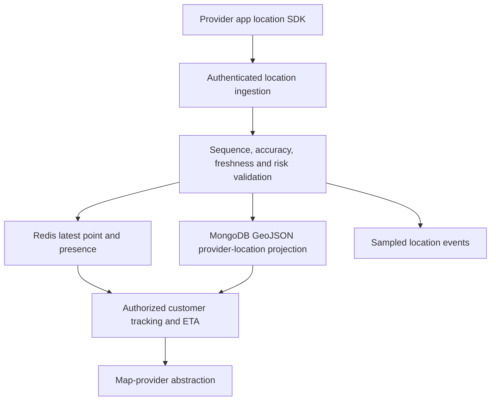
```mermaid
flowchart TD
    provider["Provider app location SDK"]
    ingest["Authenticated location ingestion"]
    validate["Sequence, accuracy, freshness and risk validation"]
    redis["Redis latest point and presence"]
    mongo["MongoDB GeoJSON provider-location projection"]
    kafka["Sampled location events"]
    tracking["Authorized customer tracking and ETA"]
    maps["Map-provider abstraction"]

    provider --> ingest
    ingest --> validate
    validate --> redis
    validate --> mongo
    validate --> kafka
    redis --> tracking
    mongo --> tracking
    tracking --> maps
```

### 9.2 Location responsibilities

| Path | Store/frequency | Purpose |
|---|---|---|
| Latest online provider point | Redis, short TTL, high-frequency/coalesced | Presence, freshest tracking, stale detection |
| Searchable provider point | MongoDB GeoJSON `Point`, throttled durable update | `2dsphere` nearby-provider query required by Phase 1 |
| Active booking tracking history | MongoDB time-bounded/TTL or partitioned collection | Timeline, dispute evidence summary, service analytics under retention policy |
| Durable sampled event | Kafka, adaptive rate | Analytics, heatmaps, projection recovery where approved |
| Customer service address | Booking/address domain with restricted precision | Serviceability and selected-provider navigation |

### 9.3 Update policy

- Provider app sends sequence number, observed time, longitude/latitude, horizontal accuracy, motion state where permitted, and app/session context.
- Server rejects impossible coordinates, stale sequence/time, unacceptable accuracy for the action, unapproved provider, invalid session, or update outside allowed status.
- Update frequency adapts: slower when online/stationary, faster while traveling to an assigned booking, stopped after closure/offline/permission revocation.
- Mongo search projection is updated at a lower bounded rate than Redis tracking to protect write capacity.
- Dispatch uses a maximum location age and accuracy threshold. A provider with stale data is not presented as immediately nearby.

### 9.4 Map abstraction

`MapProvider` exposes geocode, reverse geocode, autocomplete, route, distance/ETA, and provider health/capability methods. Adapters include:

- `GoogleMapsProvider` for configured environments.
- `DeterministicTestMapProvider` for automated tests and classroom demonstration without paid credentials.
- A future secondary provider without changing domain requests/responses.

Provider-native response objects are never exposed through LocalServe APIs. Cache keys use normalized input, provider/version, and purpose-specific TTL. Exact address/autocomplete responses are not cached globally with personal identifiers.

### 9.5 Privacy controls

- Broadcasting providers receive approximate zone/distance only.
- The selected provider receives precise destination only after configured booking/payment conditions.
- Customer sees provider location only during the authorized active window.
- Location histories have explicit purpose and short retention. Aggregated heatmaps enforce minimum cohorts and spatial blurring.
- Support/admin access requires permission, case purpose, and audit; routine customer-service agents do not browse precise histories.

---

## 10. Notification architecture

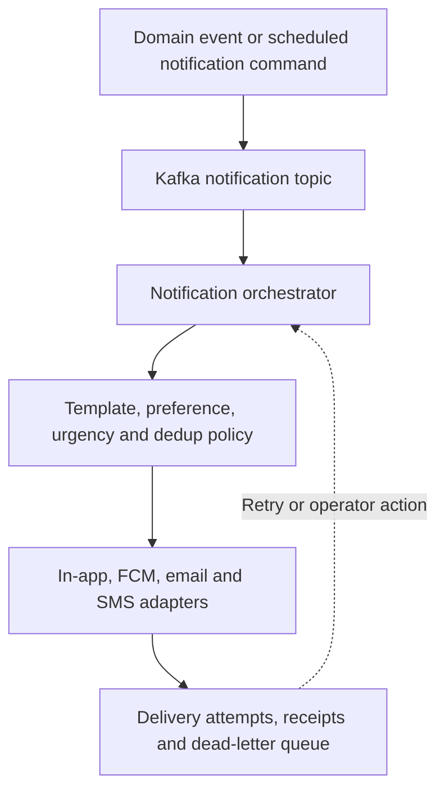
```mermaid
flowchart TD
    event["Domain event or scheduled notification command"]
    kafka["Kafka notification topic"]
    orchestrator["Notification orchestrator"]
    policy["Template, preference, urgency and dedup policy"]
    channels["In-app, FCM, email and SMS adapters"]
    status["Delivery attempts, receipts and dead-letter queue"]

    event --> kafka
    kafka --> orchestrator
    orchestrator --> policy
    policy --> channels
    channels --> status
    status -.->|"Retry or operator action"| orchestrator
```

### 10.1 Delivery workflow

1. A domain event does not contain rendered message text or unrestricted sensitive data.
2. Notification consumer creates a logical notification using an idempotency key such as recipient + event + template + schedule slot.
3. Policy resolves locale, approved template version, preferences, mandatory status, urgency, quiet hours, fallback, and redaction.
4. Channel jobs are enqueued separately so an SMS outage does not block email/push/in-app.
5. Adapters enforce timeout, provider rate limit, circuit breaker, and request idempotency where available.
6. Provider receipts update delivery status. Bounded retry with jitter handles transient errors; permanent errors dead-letter with a safe reason.
7. Admin monitoring shows queue age, attempts, provider health, failure category, owner, and replay controls without message secrets.

### 10.2 Channel implementations

| Channel | Local/student mode | Configured mode |
|---|---|---|
| In-app | MongoDB notification inbox + WebSocket user queue | Same |
| Push | Notification sink recording payload metadata | Firebase Cloud Messaging |
| Email | Mailpit SMTP | Approved SMTP/email service |
| SMS/OTP | Secure test delivery sink with non-production visibility | Approved SMS provider adapter |
| WhatsApp | Not shown as active | Future approved provider adapter |

OTP delivery uses notification infrastructure, but OTP generation, hash, purpose, expiry, attempts, and consumption remain owned by identity/booking modules.

---

## 11. Booking and dispatch architecture

### 11.1 Booking aggregate boundary

The booking aggregate owns the canonical state machine and includes only the data needed to enforce booking invariants plus immutable snapshots/references. Offers, verbose history, messages, location history, payments, and evidence are separate aggregates/collections linked by public booking ID.

Only `BookingCommandService` may request a booking transition. It delegates to a transition policy that checks:

- Current status and `expectedVersion`.
- Actor role, identity, booking relationship, and permissions.
- Required payment/offer/OTP/evidence/dispute conditions.
- Time window, category/zone policy snapshot, and feature flag version.
- Idempotency key and prior command outcome.

The result transaction writes booking, append-only status history, timeline, idempotency outcome, scheduled follow-up commands, and outbox events.

### 11.2 Dispatch flow

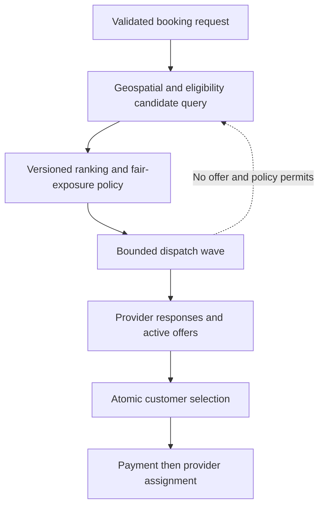
```mermaid
flowchart TD
    request["Validated booking request"]
    candidate["Geospatial and eligibility candidate query"]
    rank["Versioned ranking and fair-exposure policy"]
    wave["Bounded dispatch wave"]
    offers["Provider responses and active offers"]
    selection["Atomic customer selection"]
    payment["Payment then provider assignment"]

    request --> candidate
    candidate --> rank
    rank --> wave
    wave --> offers
    offers --> selection
    selection --> payment
    wave -.->|"No offer and policy permits"| candidate
```

### 11.3 Candidate eligibility

Dispatch evaluates an indexed provider projection containing only the necessary fields:

- Provider verification/approval and account status.
- Online status, presence freshness, current workload/capacity.
- Skill/service/category credentials and document validity.
- Schedule/break, service zone/radius, current GeoJSON point, accuracy/age.
- Booking-type eligibility, including emergency opt-in/equipment.
- Safety/risk exclusion and customer/provider block relationship.

The projection is updated from provider/location events and can be rebuilt. Before final offer acceptance/selection, the owning modules revalidate critical eligibility to prevent stale projection decisions.

### 11.4 Dispatch waves and fairness

- Each request creates a dispatch plan with versioned radius, cohort size, wave delay, total expiry, and ranking policy.
- Requests are sent to a bounded provider cohort through Kafka and authorized user queues.
- Provider offer creation rechecks offer expiry, booking state, provider capacity, and uniqueness.
- Ranking combines ETA, skill fit, reliability, workload, fair exposure, and policy factors; weights are versioned and auditable.
- A provider is not penalized for offers outside declared availability/radius/skills.
- No automatic final assignment occurs; customer selection remains required.

### 11.5 Booking orchestration sequence

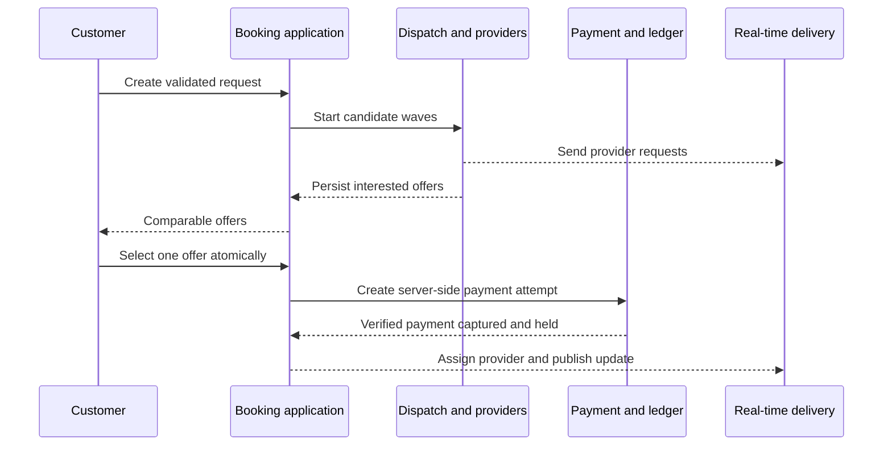
```mermaid
sequenceDiagram
    participant Customer
    participant Booking as Booking application
    participant Dispatch as Dispatch and providers
    participant Finance as Payment and ledger
    participant Realtime as Real-time delivery

    Customer->>Booking: Create validated request
    Booking->>Dispatch: Start candidate waves
    Dispatch-->>Realtime: Send provider requests
    Dispatch-->>Booking: Persist interested offers
    Booking-->>Customer: Comparable offers
    Customer->>Booking: Select one offer atomically
    Booking->>Finance: Create server-side payment attempt
    Finance-->>Booking: Verified payment captured and held
    Booking-->>Realtime: Assign provider and publish update
```

### 11.6 OTP architecture

- Start and Completion OTPs are separate purpose-bound credentials generated with a cryptographically secure random source.
- Only a slow hash/protected verifier plus booking/purpose/issuance version/expiry/attempt count is stored in Redis and required durable metadata.
- The customer receives OTP through an approved channel; API responses and logs never return it.
- Provider submits OTP through an authenticated booking command. The server atomically checks booking, assigned provider, purpose, issuance version, status, expiry, attempts, and one-time consumption.
- Successful verification and the corresponding booking transition occur in one controlled workflow. Replays become deterministic no-ops/conflicts.
- Admin cannot read an OTP. A support override is a separate exceptional workflow with step-up, reason, evidence, and audit, and cannot pretend OTP verification occurred.

### 11.7 Canonical status ownership

`booking-dispatch` owns the unchanged public booking statuses from Phase 1:

`CREATED`, `SEARCHING_PROVIDERS`, `PROVIDERS_FOUND`, `PROVIDER_SELECTED`, `PAYMENT_PENDING`, `PAYMENT_COMPLETED`, `PROVIDER_ASSIGNED`, `PROVIDER_ON_THE_WAY`, `PROVIDER_ARRIVED`, `START_OTP_PENDING`, `IN_PROGRESS`, `COMPLETION_PENDING`, `CUSTOMER_CONFIRMATION_PENDING`, `COMPLETED`, `DISPUTED`, `CANCELLED`, `REFUNDED`, and `CLOSED`.

`finance` owns the unchanged payment statuses:

`CREATED`, `PENDING`, `AUTHORIZED`, `CAPTURED`, `HELD`, `RELEASE_PENDING`, `RELEASED`, `PARTIALLY_REFUNDED`, `REFUNDED`, `FAILED`, `CANCELLED`, `DISPUTED`, and `FROZEN`.

Status enums may be shared as API contract values, but only the owning module's domain transition command can change them. Projections and clients display status; they do not assign it.

---

## 12. Payment, held-funds ledger, and payout architecture

### 12.1 Component architecture

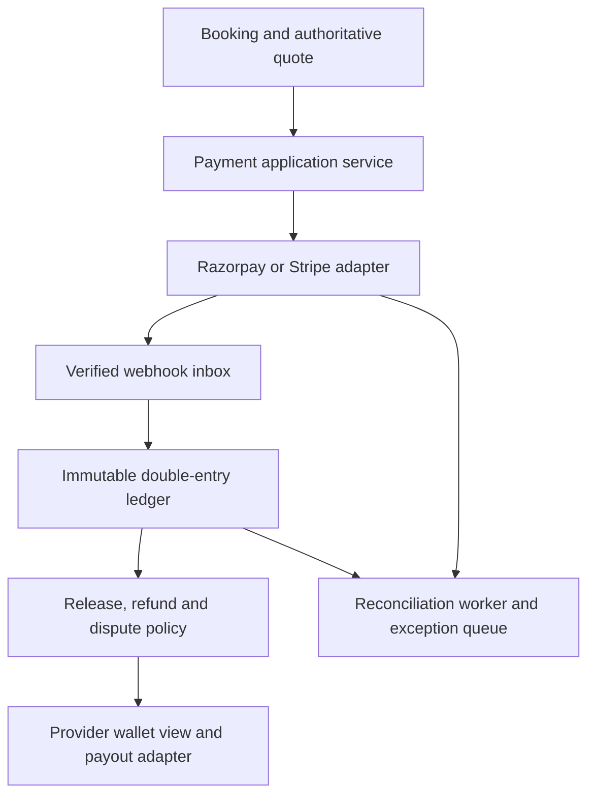
```mermaid
flowchart TD
    booking["Booking and authoritative quote"]
    payment["Payment application service"]
    gateway["Razorpay or Stripe adapter"]
    webhook["Verified webhook inbox"]
    ledger["Immutable double-entry ledger"]
    release["Release, refund and dispute policy"]
    payout["Provider wallet view and payout adapter"]
    reconcile["Reconciliation worker and exception queue"]

    booking --> payment
    payment --> gateway
    gateway --> webhook
    webhook --> ledger
    ledger --> release
    release --> payout
    gateway --> reconcile
    ledger --> reconcile
```

### 12.2 Gateway port

The domain depends on a `PaymentGateway` capability interface, not SDK objects. Capabilities include:

- Create/expire payment order or intent.
- Fetch authenticated payment status.
- Verify webhook signature against the exact raw body and timestamp/provider policy.
- Capture where separate capture is supported/configured.
- Create/fetch full or partial refund.
- Create/fetch transfer/payout/linked-account operation when product access exists.
- Normalize provider error category, retry safety, provider request ID, and reconciliation reference.

Adapters are `RazorpayGatewayAdapter`, `StripeGatewayAdapter`, and `DeterministicSandboxGatewayAdapter`. The deterministic adapter is allowed only outside production and produces signed test webhooks through the same ingress path.

### 12.3 Payment capture flow

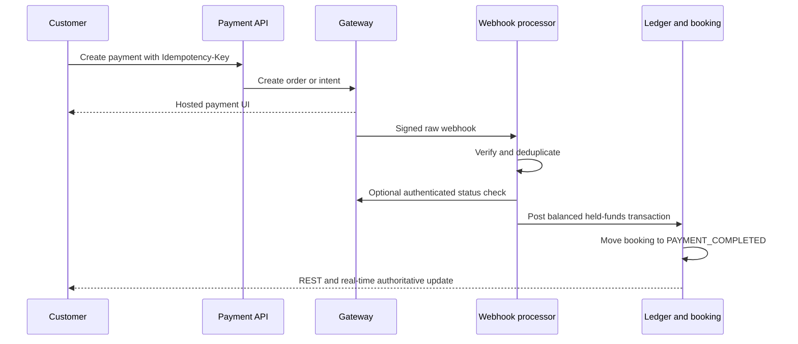
```mermaid
sequenceDiagram
    participant Customer
    participant LocalServe as Payment API
    participant Gateway
    participant Processor as Webhook processor
    participant Domain as Ledger and booking

    Customer->>LocalServe: Create payment with Idempotency-Key
    LocalServe->>Gateway: Create order or intent
    Gateway-->>Customer: Hosted payment UI
    Gateway->>Processor: Signed raw webhook
    Processor->>Processor: Verify and deduplicate
    Processor->>Gateway: Optional authenticated status check
    Processor->>Domain: Post balanced held-funds transaction
    Domain->>Domain: Move booking to PAYMENT_COMPLETED
    Domain-->>Customer: REST and real-time authoritative update
```

The frontend redirect/success callback is a user-experience hint only. It triggers a status refresh; it cannot mark the payment successful.

### 12.4 Webhook ingress

1. Dedicated endpoint receives bounded raw bytes before JSON transformation.
2. It chooses the gateway by configured route, not an untrusted payload field.
3. Signature and timestamp/replay policy are verified with a versioned secret.
4. A durable webhook receipt stores gateway event ID, safe metadata, body hash/encrypted restricted payload reference, verification outcome, and processing status.
5. Valid duplicate events return a safe success without repeating effects.
6. Processing uses idempotency plus authenticated gateway lookup for ambiguous/high-risk events.
7. The endpoint acknowledges after durable receipt; expensive downstream work is asynchronous.
8. Failed processing enters a retriable/owned exception queue. Invalid signatures never reach business consumers.

### 12.5 Ledger model

The ledger is append-only and double-entry. Phase 3 defines exact collections and accounts, but the architecture requires:

| Category | Example accounts |
|---|---|
| Assets/receivables | Gateway receivable, settlement bank clearing, provider recovery receivable |
| Customer/platform liabilities | Held customer funds, refundable payable, promotional credit liability |
| Provider liabilities | Provider pending payable, available payable, payout clearing, frozen payable |
| Revenue/tax | Platform commission revenue, convenience/emergency fees, tax payable |
| Expenses/adjustments | Gateway fee expense, platform-funded discount, support credit, write-off |

Every financial transaction group has one currency, balanced debit/credit totals, source type/ID, booking/payment reference, reason, actor/system, idempotency key, correlation ID, and immutable creation time. Corrections use compensating entries; cached wallet balances are projections and are reconciled to postings.

### 12.6 Held-funds and release workflow

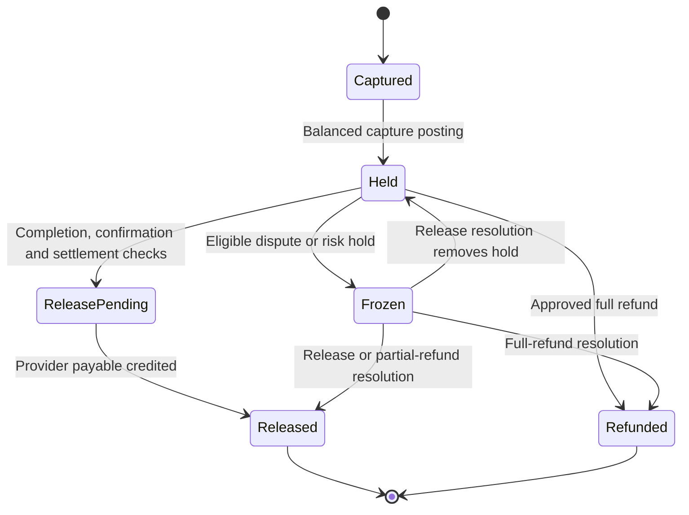
```mermaid
stateDiagram-v2
    [*] --> Captured
    Captured --> Held: Balanced capture posting
    Held --> Frozen: Eligible dispute or risk hold
    Frozen --> Held: Release resolution removes hold
    Held --> ReleasePending: Completion, confirmation and settlement checks
    ReleasePending --> Released: Provider payable credited
    Held --> Refunded: Approved full refund
    Frozen --> Refunded: Full-refund resolution
    Frozen --> Released: Release or partial-refund resolution
    Released --> [*]
    Refunded --> [*]
```

Release evaluation requires:

- Booking completion and Completion OTP condition.
- Customer confirmation or an allowed low-risk timeout path.
- No active dispute, safety hold, chargeback, fraud hold, or reconciliation block.
- Required settlement/cooling period elapsed.
- Provider remains eligible to receive the amount.
- Ledger/payment/gateway amount and currency reconcile.

The evaluator records each rule outcome and the policy version. It posts commission, tax, adjustments, and provider payable atomically. External payout is a later workflow.

### 12.7 Dispute freeze and resolution

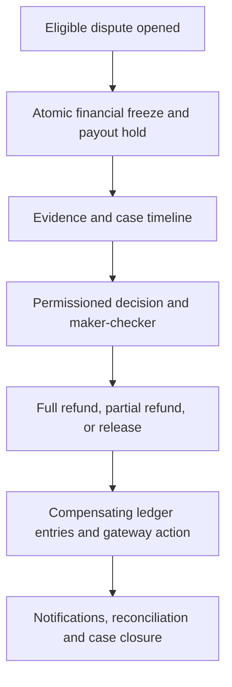
```mermaid
flowchart TD
    dispute["Eligible dispute opened"]
    freeze["Atomic financial freeze and payout hold"]
    evidence["Evidence and case timeline"]
    decision["Permissioned decision and maker-checker"]
    outcome["Full refund, partial refund, or release"]
    entries["Compensating ledger entries and gateway action"]
    close["Notifications, reconciliation and case closure"]

    dispute --> freeze
    freeze --> evidence
    evidence --> decision
    decision --> outcome
    outcome --> entries
    entries --> close
```

Opening a dispute and freezing locally available held/provider-payable funds is one idempotent application transaction. If funds already left the controlled balance, finance creates a recovery/chargeback case rather than editing history or allowing a negative balance silently.

### 12.8 Refund architecture

- Refund calculation is server-side and bounded by captured amount minus prior successful/pending refunds.
- A refund command first reserves the refundable amount in the ledger/workflow to prevent concurrent over-refund.
- Gateway request uses a stable provider idempotency/reference key.
- Webhook/poll/reconciliation finalizes success or releases the reservation after a confirmed terminal failure.
- Partial refund does not erase original capture/release postings.
- Booking status follows the canonical Phase 1 rule: full refund can become `REFUNDED`; partial refund returns service lifecycle to `COMPLETED` before eventual `CLOSED`.

### 12.9 Provider wallet and payout

Wallet views expose ledger-derived `pending`, `available`, `frozen`, and `paidOut` balances. Withdrawal workflow:

1. Validate provider status, reauthentication/step-up, verified destination, amount, limits, cooling period, available balance, freeze, and risk policy.
2. Atomically reserve available payable and create idempotent withdrawal request.
3. Auto-approve or route to maker-checker based on policy and threshold.
4. Payout worker submits through the configured adapter outside the transaction.
5. Signed callback or authenticated polling finalizes paid/failed/reversed state and balanced postings.
6. Uncertain outcomes remain `PROCESSING` and reconcile; they are never blindly retried under a new external reference.

### 12.10 Reconciliation

Reconciliation runs continuously for webhooks and daily for settlement completeness:

- Match gateway order, payment, refund, transfer, payout, and settlement records.
- Match LocalServe payment attempts, booking totals, ledger transaction groups, balances, and workflow states.
- Detect missing webhook, amount/currency mismatch, duplicate external object, orphan payment, stuck processing, unbalanced group, and settlement shortfall.
- Automatically repair only by safe replay/idempotent command; never edit posted ledger entries.
- Create an exception with severity, owner, SLA, evidence, proposed action, and resolution history.

Financial dashboards read from ledger/reconciliation projections, not ad hoc sums of booking status.

---

## 13. Security architecture

### 13.1 Trust-zone architecture

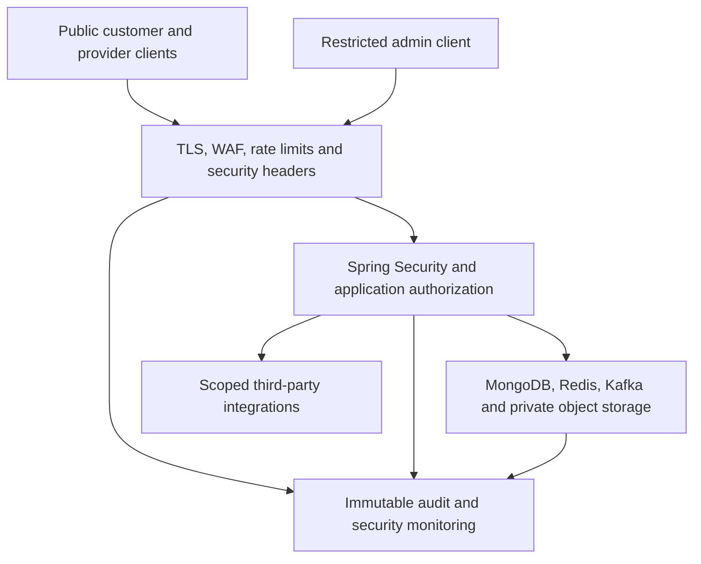
```mermaid
flowchart TD
    public["Public customer and provider clients"]
    admin["Restricted admin client"]
    edge["TLS, WAF, rate limits and security headers"]
    app["Spring Security and application authorization"]
    restricted["MongoDB, Redis, Kafka and private object storage"]
    providers["Scoped third-party integrations"]
    audit["Immutable audit and security monitoring"]

    public --> edge
    admin --> edge
    edge --> app
    app --> restricted
    app --> providers
    edge --> audit
    app --> audit
    restricted --> audit
```

### 13.2 Authentication architecture

#### Access tokens

- Signed JWT, default lifetime 10 minutes, audience `localserve-api` or stricter admin audience.
- Claims are minimal: issuer, subject public ID, session ID, role memberships/active role, permission-version reference, audience, issued/expiry time, token ID.
- RSA signing keys are held in a secrets/KMS-backed keystore, exposed as rotating public JWKs, and never committed.
- API validates issuer, audience, algorithm allowlist, signature, time with small bounded skew, session/account status policy, and permission version where needed.

#### Refresh tokens

- Opaque random tokens; only a strong hash and metadata are stored.
- Web refresh token uses `Secure`, `HttpOnly`, host-scoped, appropriate `SameSite` cookie. Refresh/logout endpoints require CSRF token and origin validation.
- Mobile refresh token uses platform secure storage.
- Every refresh rotates token and records parent/family. Reuse revokes the family and produces a security alert.
- Session metadata supports named devices, last activity, IP-region/user-agent summary, current/all-device logout, expiry, revocation, and risk status.

#### OAuth and phone OTP

- Spring OAuth 2.0 Client owns Google authorization-code flow with state, nonce, PKCE where applicable, exact redirect allowlist, and verified identity-linking policy.
- Matching an unverified email never automatically links accounts.
- OTP values are never stored/logged in plaintext. Redis records hash, purpose, subject, expiry, attempts, resend limits, and issuance version.
- Login/recovery responses resist enumeration. IP/account/device/risk rate limits use Redis atomic scripts or a vetted rate-limit library.

#### Admin authentication

- Admin identity has no public registration and no public-role upgrade path.
- Privileged admins require TOTP 2FA at launch; higher-risk finance/role/export/document actions require recent step-up.
- Admin inactivity/absolute session timeouts are shorter; “remember me” is not available for privileged sessions.
- Emergency break-glass accounts are disabled by default, hardware/secret-managed, alert on use, and require post-use review.

### 13.3 Authorization architecture

Authorization occurs at three layers:

1. **Route/method:** Spring Security checks authentication, active role, audience, and coarse permission.
2. **Application service:** Policy checks ownership, booking relationship, account/provider status, state, purpose, and field/action-specific permission.
3. **Repository predicate:** High-risk mutations include target/actor/state/version predicates so a stale or unauthorized write cannot succeed after a race.

Example permissions use domain verbs, such as `provider.verification.review`, `payment.refund.propose`, `payment.refund.approve`, `identity.document.view`, and `audit.export`. Admin roles are sets of permissions; no controller hardcodes a job title.

### 13.4 Data classification

| Class | Examples | Required controls |
|---|---|---|
| Public | Published service/category, approved public provider summary | Integrity, moderation, cache controls |
| Internal | Feature configuration, non-sensitive operations metadata | Authenticated staff/service access |
| Confidential | Customer/profile/contact, booking details, chat, non-precise analytics | Encryption, RBAC, masking, retention |
| Restricted identity | Aadhaar/PAN/licence/selfie/certificates, verification result | Field/object encryption, private storage, purpose permission, signed access, audit, strict retention |
| Restricted financial | Bank/UPI destination, payment/ledger/payout/refund details | Encryption/tokenization, masking, maker-checker, no client/gateway secrets |
| Restricted location | Precise current/history coordinates and service address | Time/purpose-bound disclosure, short retention, access audit |
| Secret | Password/refresh/OTP verifier, signing/payment/OAuth/storage keys | Hash or secrets manager/KMS, rotation, never returned/logged |

### 13.5 Sensitive file architecture

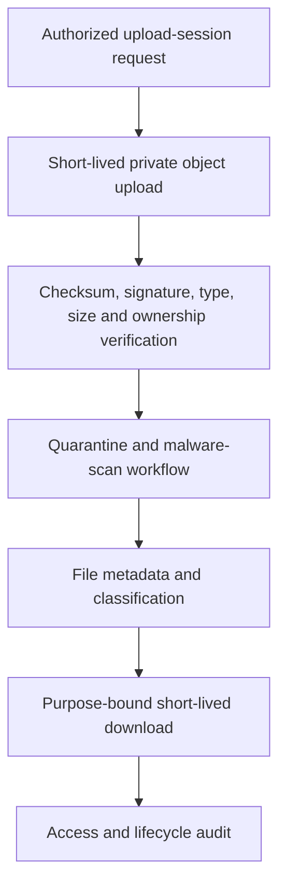
```mermaid
flowchart TD
    request["Authorized upload-session request"]
    upload["Short-lived private object upload"]
    verify["Checksum, signature, type, size and ownership verification"]
    quarantine["Quarantine and malware-scan workflow"]
    metadata["File metadata and classification"]
    access["Purpose-bound short-lived download"]
    audit["Access and lifecycle audit"]

    request --> upload
    upload --> verify
    verify --> quarantine
    quarantine --> metadata
    metadata --> access
    access --> audit
```

- Client filename and MIME type are advisory; server inspects signature and applies an allowlist.
- Object keys are random/non-enumerable and do not contain Aadhaar, PAN, user name, phone, or email.
- Bucket/origin is private with public access blocked. Cloudinary is not used for restricted identity evidence.
- Metadata extraction strips EXIF/location where unnecessary. Image/PDF decompression limits prevent resource abuse.
- Signed read URLs are short-lived, content-disposition controlled, and granted after purpose/permission checks. Every restricted read is audited.
- Scan unavailable means quarantine, not automatic approval.

### 13.6 Security headers and browser controls

- Strict transport security, TLS redirect, no MIME sniffing, controlled referrer policy, frame ancestors, permissions policy, and explicit CORS origins.
- Content Security Policy uses nonces/hashes and restricted script/connect/image/frame sources for each application.
- Admin origin has the strictest policy and does not embed third-party marketing/analytics scripts.
- Payment provider frames/redirects are allowlisted narrowly and environment-specifically.
- Request/body/upload limits are applied at edge and application.

### 13.7 Threat model summary

| Threat | Example attack | Primary controls | Detection/recovery |
|---|---|---|---|
| Credential stuffing | Reused passwords/OTP spraying | Argon2id, rate limits, breached-password check, 2FA, device/risk signals | Auth metrics, alert, session revocation |
| Refresh-token theft | Replay rotated token | HttpOnly/secure storage, rotation, family reuse detection | Revoke family, notify user, investigate device |
| Broken object authorization | Guess another booking/document ID | Application ownership policy, opaque public IDs, repository predicate | 403 metrics, audit, security test |
| NoSQL/operator injection | Client supplies Mongo operators or sort/field injection | Typed DTOs/criteria, allowlisted fields, validation | WAF/app signal, SAST/DAST |
| Webhook forgery/replay | Fake payment capture | Raw-body signature, timestamp, event dedup, provider lookup | Security alert, no business effect |
| Double spend/refund/payout | Concurrent/retried money command | Idempotency, unique constraints, reservations, ledger, reconciliation | Finance exception and freeze |
| OTP bypass | Reuse/cross-booking OTP | Purpose/booking/provider binding, hash, expiry, attempts, atomic consume | Auth/booking security event |
| Location spoofing/scraping | Fake provider point or tracking another booking | Session/sequence/accuracy/risk checks, participant policy, minimal payload | Anomaly metric, provider review |
| Malicious file | Polyglot/malware/decompression bomb | Signature/type/size checks, quarantine, scan, processing limits | Quarantine case, deletion/incident flow |
| Admin insider abuse | Export identity data or self-approve refund | Least privilege, 2FA/step-up, maker-checker, DLP/export expiry, immutable audit | Alert and access review |
| Kafka/Redis abuse | Unauthorized publish/read or poisoning | Private network, TLS/auth/ACLs, schema validation, key namespace, no user access | Broker metrics, consumer quarantine |
| Log leakage | Token/OTP/document data in logs | Structured allowlist/redaction, safe exception mapping, test scanners | DLP alerts and incident response |

### 13.8 Secrets and key management

- Local development reads non-production values from ignored `.env` files generated from `.env.example`; secret-scanning prevents commits.
- Cloud uses AWS Secrets Manager/Parameter Store and KMS or equivalent. Workload identity grants only required secrets.
- Separate credentials per environment and integration; rotation supports overlapping key versions for JWT/webhook validation.
- Secret values are never rendered in admin configuration, health endpoints, logs, errors, traces, or build output.
- Compromise runbooks cover immediate revoke/rotate, consumer replay, forced session logout, provider coordination, and post-incident validation.

---

## 14. Audit, analytics, and observability architecture

### 14.1 Three separate evidence streams

| Stream | Purpose | Mutability/access |
|---|---|---|
| Application observability | Diagnose performance/errors | Retention-based operational logs; restricted operators |
| Immutable audit | Prove security/admin/domain-sensitive actions | Append-only/tamper-evident, dedicated permission, no application delete |
| Product analytics | Measure funnels/aggregates | Privacy-minimized events/projections; not source for money/status |

Audit and analytics are not derived solely from application text logs.

### 14.2 Observability pipeline

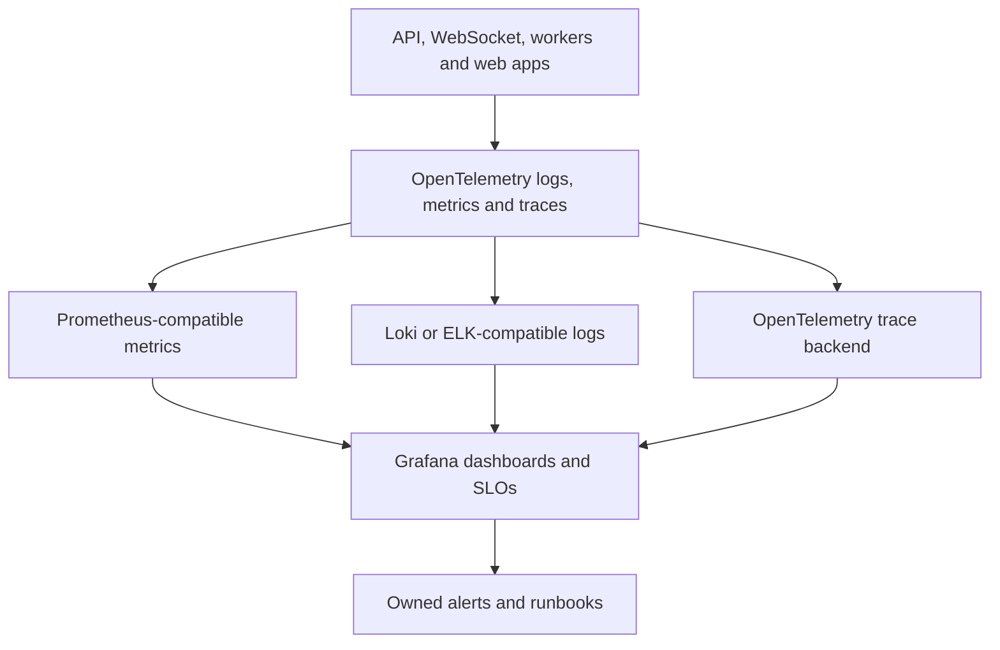
```mermaid
flowchart TD
    runtime["API, WebSocket, workers and web apps"]
    telemetry["OpenTelemetry logs, metrics and traces"]
    metrics["Prometheus-compatible metrics"]
    logs["Loki or ELK-compatible logs"]
    traces["OpenTelemetry trace backend"]
    dashboards["Grafana dashboards and SLOs"]
    alerts["Owned alerts and runbooks"]

    runtime --> telemetry
    telemetry --> metrics
    telemetry --> logs
    telemetry --> traces
    metrics --> dashboards
    logs --> dashboards
    traces --> dashboards
    dashboards --> alerts
```

### 14.3 Required telemetry

- HTTP/STOMP rate, errors, duration, active connections, reconnects, subscriptions, denied messages.
- JVM threads/heap/GC, pools, container CPU/memory, queue saturation.
- Mongo query duration/errors/transactions/replica health; Redis latency/memory/evictions; Kafka lag/rebalance/DLQ.
- Dispatch candidate count, wave latency, first-offer time, selection conflicts.
- Payment webhook verification/lag, ledger posting, release/refund/payout/reconciliation exceptions.
- Notification queue age/provider outcome/fallback; file scan/upload; map provider latency/error.
- Business SLIs from versioned events, paired with freshness and never containing sensitive values.

Trace/log attributes use safe public IDs and correlation IDs. Chat text, OTP, password, raw token, full address, precise location, document number, bank details, webhook raw payload, and signed URL are prohibited.

### 14.4 Health endpoints

| Endpoint | Purpose | Behavior |
|---|---|---|
| Liveness | Process can make progress | Does not fail because a remote dependency is temporarily unavailable |
| Readiness | Instance can safely receive its configured workload | Checks essential local pools and dependency policy without causing cascading probes |
| Startup | Initialization/migration/config complete | Allows slow cold start without restart loop |
| Detailed admin health | Authorized operational diagnosis | Sanitized dependency status; never public or secret-bearing |

### 14.5 SLO and alert ownership

| Capability | Primary SLI | Owner/runbook focus |
|---|---|---|
| Authentication | Successful eligible login/refresh rate and latency | Identity/security |
| Booking | Valid command availability, dispatch first-wave latency | Booking/marketplace |
| Payment | Verified webhook ingestion and processing lag | Finance engineering |
| Real time | Connected-delivery latency and connection error rate | Communication/SRE |
| Location | Accepted freshness and tracking delivery | Location/SRE |
| Notifications | Critical logical notification delivery within SLO | Communication/operations |
| Reconciliation | Daily completion and unowned exceptions | Finance operations |

Fast-burn and slow-burn error-budget alerts page only when action is required. Lower-severity trends create tickets rather than alert fatigue.

---

## 15. Deployment architecture

### 15.1 Tier A — student laptop and CI

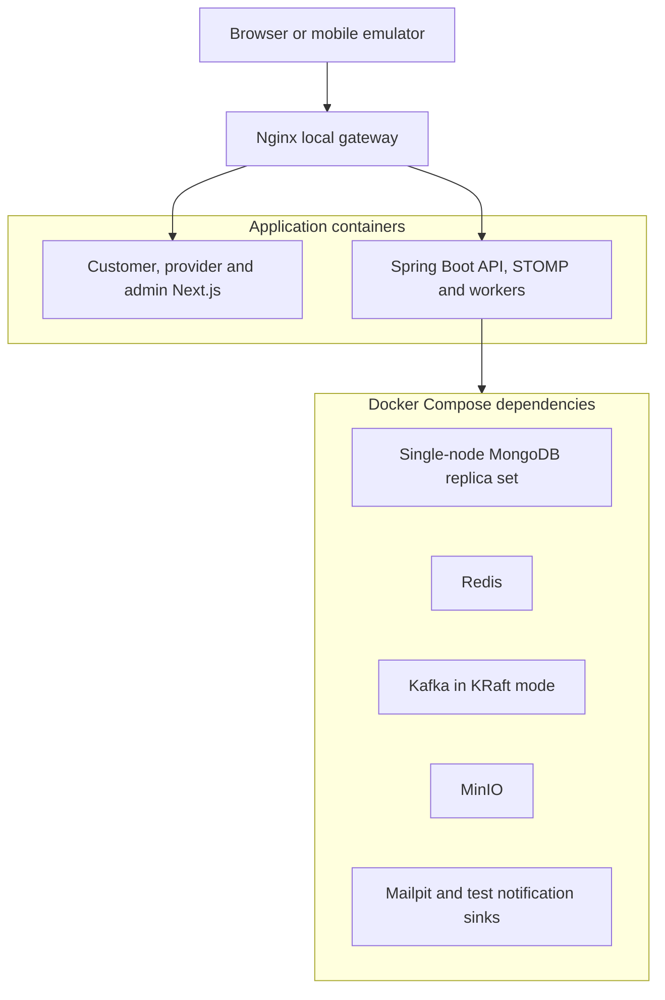
```mermaid
flowchart TD
    browser["Browser or mobile emulator"]
    nginx["Nginx local gateway"]

    subgraph apps["Application containers"]
        web["Customer, provider and admin Next.js"]
        backend["Spring Boot API, STOMP and workers"]
    end

    subgraph dependencies["Docker Compose dependencies"]
        mongo["Single-node MongoDB replica set"]
        redis["Redis"]
        kafka["Kafka in KRaft mode"]
        minio["MinIO"]
        mailpit["Mailpit and test notification sinks"]
    end

    browser --> nginx
    nginx --> web
    nginx --> backend
    backend --> dependencies
```

Local Docker Compose uses profiles:

- `core`: MongoDB replica set, Redis, Kafka, MinIO, Mailpit, backend, and three web apps.
- `observability`: Prometheus, Grafana, and local log/trace collector.
- `tools`: optional development UIs, excluded from deployable production configuration.
- `demo`: deterministic map, OTP, notification, payment, and payout adapters plus seeded accounts/data.

The single-node MongoDB instance is configured as a replica set because transactions require it. It is a local convenience, not a production high-availability claim.

### 15.2 Tier B — final-year cloud demonstration

A cost-controlled demonstration may use one AWS EC2 instance with Docker Compose and Nginx/TLS, plus S3 for objects. It is suitable for classroom review and controlled pilot access, not for public high-availability claims.

Minimum controls:

- Custom VPC/security groups; only HTTPS and restricted administration access exposed.
- No database, Redis, Kafka, MinIO/admin UI, Actuator details, or Docker socket on the public internet.
- Route 53/domain and TLS through ACM/load balancer or an approved Nginx certificate workflow.
- EBS encryption and snapshots; S3 private bucket with public access blocked.
- Secrets injected from AWS Secrets Manager/Parameter Store or instance role, not committed `.env`.
- CloudWatch/OTel logs and health alerts; automated backup and restore instructions.
- Deployment clearly labeled `DEMONSTRATION`, with limited real user/sensitive data.

### 15.3 Tier C — production-ready AWS target

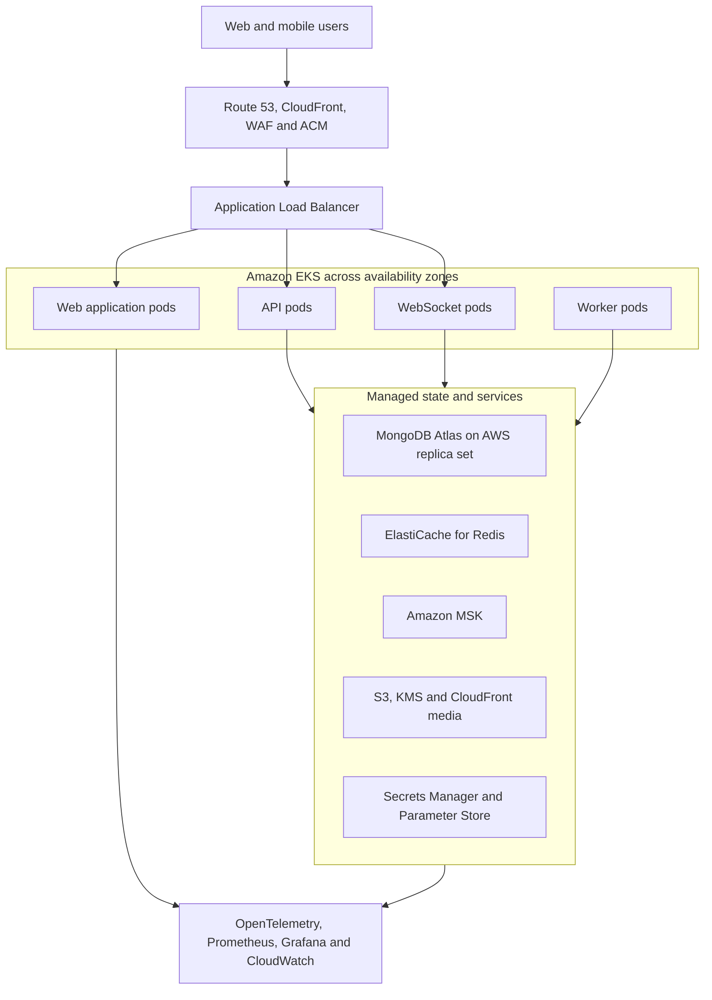
```mermaid
flowchart TD
    users["Web and mobile users"]
    dns["Route 53, CloudFront, WAF and ACM"]
    edge["Application Load Balancer"]

    subgraph eks["Amazon EKS across availability zones"]
        web["Web application pods"]
        api["API pods"]
        ws["WebSocket pods"]
        workers["Worker pods"]
    end

    subgraph managed["Managed state and services"]
        mongo["MongoDB Atlas on AWS replica set"]
        redis["ElastiCache for Redis"]
        kafka["Amazon MSK"]
        storage["S3, KMS and CloudFront media"]
        secrets["Secrets Manager and Parameter Store"]
    end

    observe["OpenTelemetry, Prometheus, Grafana and CloudWatch"]

    users --> dns
    dns --> edge
    edge --> web
    edge --> api
    edge --> ws
    api --> managed
    ws --> managed
    workers --> managed
    eks --> observe
    managed --> observe
```

The architecture chooses MongoDB Atlas on AWS rather than Amazon DocumentDB because LocalServe depends on MongoDB behavior such as GeoJSON/`2dsphere`, transactions, indexes, and compatibility that must be verified against the actual database. A later ADR may approve another fully compatible managed MongoDB offering only after test evidence.

### 15.4 Production network segmentation

- Public subnets contain only load-balancing/NAT infrastructure as required.
- EKS nodes/pods and managed data endpoints use private subnets/security groups.
- Database, Redis, Kafka, storage, secrets, and telemetry access uses workload identity and least-privilege network policy.
- Admin origin may add identity-aware access/VPN policy without preventing authorized operational access.
- Egress is controlled; applications reach only required provider endpoints through auditable routes.
- Separate AWS accounts/projects for production and non-production are preferred; production data never populates lower environments.

### 15.5 Kubernetes workload model

| Workload | Scaling signal | Availability controls |
|---|---|---|
| API | CPU, request concurrency, p95 latency | ≥2 replicas, topology spread, PDB, readiness, rolling update |
| WebSocket | Active connections, event loop/thread/memory, outbound frames | Independent replicas, long drain, reconnect guidance, topology spread |
| Kafka worker | Consumer lag, processing latency | Consumer-group replicas bounded by partitions, graceful rebalance |
| Scheduler/outbox | Due/lease backlog | Leader/lease or competing idempotent workers, no singleton correctness assumption |
| Web apps | Request rate/SSR CPU | CDN caching, independent replicas |

Rolling deployment is default. Blue-green/canary is used for high-risk authentication/payment changes. Database/event/API compatibility follows expand–migrate–contract so old and new versions overlap safely.

### 15.6 CI/CD stages

1. Source checkout, toolchain pin verification, secret scan, license/policy check.
2. Backend compile/unit/ArchUnit/static analysis; frontend lint/type/unit/accessibility tests.
3. Testcontainers integration, API/security tests, WebSocket tests, contract tests.
4. Build deterministic container images, generate SBOM, sign/attest, scan dependencies/images/IaC.
5. Deploy ephemeral/staging environment; run migration dry-run, smoke and E2E critical journey.
6. Manual approval for production finance/auth/schema changes; deploy canary/rolling.
7. Automated health/SLO verification with rollback or forward-fix decision.
8. Record artifact versions, configuration/flag versions, migration state, and release notes.

GitHub Actions is the initial CI/CD engine. Production cloud authentication uses short-lived OIDC federation, never long-lived AWS keys stored in repository secrets.

---

## 16. Scaling strategy

### 16.1 Scale in stages

| Stage | Architecture | Trigger to advance |
|---|---|---|
| Student/demo | One backend, three web apps, Docker dependencies | Academic/demo needs only |
| Early launch | Multiple stateless API replicas, managed Mongo/Redis/object storage, small Kafka, CDN | Real users and availability requirement |
| Growth | Split API/WebSocket/workers, targeted read models/cache, more Kafka partitions, zone-aware dispatch | Sustained SLO/capacity evidence |
| Large scale | Mongo sharding, regional event/data strategy, extracted hot bounded contexts | Measured database/team/deployment bottleneck and approved ADR |

No microservice extraction occurs solely because the platform “may serve millions.” Evidence must identify the bottleneck and safe data/contract boundary.

### 16.2 Stateless application scaling

- API instances hold no durable session, idempotency, job, or booking state in memory.
- Refresh/session metadata and rate limits live in MongoDB/Redis under documented durability rules.
- WebSocket connection-local subscriptions are ephemeral; presence/fan-out uses Redis and state recovery uses REST/MongoDB.
- Background workers use Kafka consumer groups and leased/idempotent jobs.
- Uploaded bytes travel directly to private object storage after server authorization rather than through API memory where practical.

### 16.3 MongoDB scaling

- Phase 3 designs compound indexes around actual query shapes and validates them with explain plans.
- Cursor pagination uses stable indexed sort keys/public IDs; unbounded skip/offset is avoided.
- Geospatial provider search uses a dedicated compact projection with `2dsphere` index and eligibility predicates.
- Histories, events, locations, messages, and notifications use time/aggregate partition-friendly models and retention/archival.
- Read concern/write concern are chosen by invariant: financial/booking commands favor acknowledged majority durability; eventually consistent analytics use projections.
- Read replicas may serve eligible stale-tolerant reads. Authorization/booking/payment decisions do not use stale secondary data blindly.
- Future shard keys favor stable distribution and routing. Candidate examples are geographic zone plus hashed public ID for location/supply, and hashed aggregate ID for high-volume histories; Phase 3/14 must validate before adoption.

### 16.4 Redis scaling

- Separate logical/key namespaces and preferably clusters for cache/rate limit versus real-time presence/coordination at high scale.
- Every ephemeral key has an intentional TTL; no unbounded lists.
- Cache-aside entries include schema/version and event-driven invalidation for catalog/config/provider projections.
- Booking/payment source documents are not replaced by Redis objects.
- Atomic Lua/functions are narrowly used for rate windows, single-use tickets, presence and compare/delete operations.
- Eviction policy and memory alerts reflect whether a cluster contains reconstructable cache or security/session metadata.

### 16.5 Kafka scaling

| Topic family | Partition key | Reason |
|---|---|---|
| Booking/offer | `bookingId` | Preserve aggregate ordering |
| Payment/ledger/refund | `paymentId` or financial aggregate ID | Preserve financial workflow ordering |
| Provider lifecycle | `providerId` | Ordered eligibility/profile projection |
| Chat | `conversationId` | Message projection order |
| Notification commands | `recipientId` or notification ID | Fair parallel delivery and dedup |
| Location sampled events | `providerId` | Per-provider sequence while distributing load |
| Audit | Target/actor-derived key with event ID | Throughput plus traceability; no business dependency on total order |

- Topic retention matches replay/recovery needs and privacy policy.
- Consumers bound batch size, concurrency, processing time, retry, and dead-letter behavior.
- Large binary content never enters Kafka; events carry private object references and safe metadata.
- Backpressure first reduces/coalesces disposable location/typing frequency, not durable booking/payment events.

### 16.6 Caching policy

| Suitable | Usually unsuitable |
|---|---|
| Published catalog, safe provider cards, feature/config projections, search suggestions, map reference data | Authoritative booking transition decision, current payment/ledger balance without validation, OTP verifier result, admin permission decision with long TTL |

Every cache defines key, owner, source of truth, TTL, invalidation, maximum staleness, size limit, security classification, and fallback. Cache failure should degrade performance, not correctness.

### 16.7 CDN and media

- Static web assets, public catalog images, and approved review/provider image variants use CDN caching with content hashes.
- Private documents/evidence never become public CDN objects. If a signed CDN distribution is used, authorization and very short validity remain.
- Images are resized/transcoded asynchronously with safe limits; clients request responsive variants.
- Cache invalidation uses versioned object keys rather than broad purge where possible.

---

## 17. Resilience and failure handling

### 17.1 Resilience4j policy

| Pattern | Applied to | Rule |
|---|---|---|
| Timeout | All external providers and bounded internal calls | Shorter than upstream request/job budget; no infinite socket/read timeout |
| Circuit breaker | Maps, notification, OAuth lookup, payment reads, verification | Opens on measured failure class; payment writes require careful reconciliation, not blind fallback |
| Retry | Safe reads and idempotent provider commands | Bounded exponential backoff with jitter; no nested retry explosion |
| Bulkhead | Payment, map, notification, file scan, admin export | Separate pools/concurrency limits protect core booking/auth |
| Rate limiter | Public auth/OTP/search/upload/webhook and provider APIs | User/IP/device/provider/global dimensions; safe error and retry metadata |

### 17.2 Failure-mode behavior

| Failure | User/system behavior |
|---|---|
| MongoDB unavailable | Readiness fails; writes reject safely; no in-memory success; clients retry only safe operations |
| Redis unavailable | Cache degrades to Mongo where safe; new OTP/rate-critical/realtime-ticket actions fail closed; existing REST core remains as policy allows |
| Kafka unavailable | Outbox accumulates; committed core command remains valid; real-time/notification delay is visible and alerted |
| Payment gateway timeout after submission | Payment remains pending/unknown; poll/reconcile; do not create a second charge blindly |
| Invalid/missing payment webhook | No success transition; reconciliation fetches authenticated status and creates exception |
| Map outage | Manual address and last-known tracking remain; ETA shown unavailable/stale; dispatch policy may pause new instant requests |
| SMS outage | Approved channel fallback/test support policy; OTP is not exposed in API; issue/expiry remain valid |
| Object scanner outage | Upload remains quarantined and unavailable for review |
| WebSocket outage | REST status/chat refresh and push/in-app fallback; socket reconnect with jitter |
| Worker crash | Kafka/lease redelivery; inbox/idempotency prevents duplicate effect |

### 17.3 Graceful shutdown

Deployment marks an instance unready, stops new socket/API/job intake, drains HTTP, sends reconnect guidance/close to sockets, completes or safely abandons leased jobs, commits Kafka offsets only after effects, and closes pools within a bounded termination window.

---

## 18. Backup, disaster recovery, and multi-region evolution

### 18.1 Backup architecture

- MongoDB continuous backup/PITR with encrypted snapshots and cross-account/region copy according to policy.
- S3 versioning/object lock where appropriate, lifecycle and replication for restricted documents/evidence.
- Redis is reconstructed for cache/presence; any security/session metadata requiring durability also has an authoritative Mongo record or appropriate persistence/backup.
- Kafka is not the sole store for current financial/booking truth; critical replay window and configuration are backed up/mananged.
- Secrets, infrastructure state, configuration schemas, and deployment manifests have controlled backup/version history.
- Restore drills validate referential/ledger consistency, not just that files can be copied.

### 18.2 Recovery order

1. Restore network/identity/secrets and MongoDB authoritative data.
2. Validate ledger balance, booking/payment state, and object evidence availability.
3. Restore Kafka/consumers/outbox publishing and rebuild projections.
4. Rehydrate required Redis metadata/cache/presence; do not restore stale presence as online.
5. Enable read traffic, then controlled writes, then payment/payout/dispatch after reconciliation gates.
6. Publish status and operate exception queues until financial/provider reconciliation is clean.

### 18.3 Multi-region future readiness

The initial system is single-region, multi-AZ. Future regional expansion uses zone/region ownership and data-residency analysis before active-active writes. Candidate evolution:

- Route customers/providers to a home service region.
- Keep one authoritative writer for a booking/financial aggregate.
- Replicate public catalog and safe read models globally.
- Use cross-region object replication and event bridging with globally unique event IDs.
- Fail over only after fencing old writers and reconciling payment/webhook routing.

Active-active payment or booking writes are not introduced until conflict, legal, provider-webhook, and operational recovery models are proven.

---

## 19. Testing architecture

### 19.1 Test layers

| Layer | Tools | Architectural purpose |
|---|---|---|
| Domain unit/property | JUnit 5, AssertJ, property/mutation tools where valuable | State transitions, money arithmetic, policies, idempotency decisions without Spring |
| Application unit | JUnit 5, Mockito | Orchestration, ports, authorization policy, failure mapping |
| Module integration | Spring Boot Test slices, Testcontainers | Mongo transactions/indexes, Redis atomic behavior, Kafka outbox/inbox, security filter chain |
| Architecture | ArchUnit, Maven dependency checks | Enforce module/package/layer ownership and no repository leakage |
| Contract | Spring Cloud Contract/WireMock or equivalent | Gateway/map/notification adapters, webhook request/signature behavior, client API compatibility |
| API/security | MockMvc, REST Assured, Spring Security Test | Validation, error contract, RBAC/ownership, CSRF/CORS, rate limit, idempotency |
| Real time | Embedded/test broker plus STOMP clients | Ticket, connect/subscribe authorization, message persistence/order, reconnect recovery |
| Frontend | Vitest/Jest, React Testing Library, axe | Component, form, state, role route, loading/error/accessibility behavior |
| End to end | Playwright | Customer/provider/admin critical journey across apps |
| Performance | Gatling or JMeter | API, dispatch, WebSocket, location, Kafka lag and datastore limits |
| Security | OWASP ZAP, SAST/SCA/IaC/container/secret scan | OWASP and supply-chain gates |

### 19.2 Critical deterministic scenario

The `demo`/E2E profile creates one deterministic full flow:

1. Seed approved provider, customer, admin, catalog, service zone, gateway/map adapters, and test notification sinks.
2. Customer creates instant booking.
3. Two providers receive requests and submit offers.
4. Customer selects one and completes signed sandbox payment.
5. Provider travels, arrives, and verifies Start OTP.
6. Provider completes with evidence and verifies Completion OTP.
7. One test path confirms/release/payout; another opens dispute/freeze/partial refund.
8. Customer reviews only the eligible completed booking.
9. Admin views audit/reconciliation without direct database editing.

The scenario is repeatable and cleans up by isolated test namespace/database. It is the primary classroom demonstration and regression gate.

### 19.3 Failure and concurrency tests

- Two concurrent offer selections; one succeeds.
- Cancel versus Start OTP; one policy-valid state wins.
- Replayed payment webhook; one capture/ledger posting.
- Dispute freeze versus release; no withdrawn frozen funds.
- Concurrent partial refunds; never exceed remaining amount.
- Replayed payout request/callback; one external logical payout.
- Kafka redelivery after consumer crash; one side effect.
- Mongo/Redis/Kafka/payment/map/notification failure injection with documented degraded behavior.
- WebSocket reconnect and missed event; REST refresh restores truth.
- Backup restore and ledger/reconciliation integrity verification.

---

## 20. Initial integration-event contract

Phase 3 defines event persistence/schema and Phase 4 defines payloads. Phase 2 locks the envelope and representative event taxonomy.

### 20.1 Event envelope

Every durable integration event contains:

- `eventId` UUIDv7.
- `eventType` canonical Kafka/event name.
- `eventVersion` integer/semantic major.
- `occurredAt` UTC timestamp.
- `producer`, `environment`, and schema reference.
- `aggregateType`, `aggregateId`, and `aggregateVersion`.
- `correlationId`, `causationId`, and optional safe actor reference.
- Minimal event-specific `data`; no token, OTP, document number, precise location, chat body, signed URL, or gateway secret.

### 20.2 Representative events

| Domain | Event names |
|---|---|
| Identity | `localserve.identity.session-created.v1`, `localserve.identity.session-revoked.v1`, `localserve.identity.account-suspended.v1` |
| Provider | `localserve.provider.verification-submitted.v1`, `localserve.provider.provider-approved.v1`, `localserve.provider.availability-changed.v1` |
| Booking | `localserve.booking.booking-created.v1`, `localserve.booking.providers-found.v1`, `localserve.booking.provider-selected.v1`, `localserve.booking.booking-status-changed.v1` |
| Payment | `localserve.payment.payment-captured.v1`, `localserve.payment.payment-held.v1`, `localserve.payment.payment-released.v1`, `localserve.payment.refund-completed.v1` |
| Dispute | `localserve.dispute.dispute-opened.v1`, `localserve.dispute.payment-frozen.v1`, `localserve.dispute.dispute-resolved.v1` |
| Communication | `localserve.chat.message-created.v1`, `localserve.notification.notification-requested.v1` |
| Reputation | `localserve.review.review-created.v1`, `localserve.coupon.coupon-consumed.v1` |
| Audit/analytics | `localserve.audit.audit-event-recorded.v1`, privacy-minimized analytics events in a separate family |

Event names use past tense and never include an environment or physical topic partition in the logical name. Topic coalescing versus one-topic-per-family is a Phase 3 operational decision.

---

## 21. Architecture Decision Records

These ADR summaries are accepted by this Phase 2 baseline unless marked conditional. Detailed standalone ADR files may be created when implementation introduces alternatives or migration impact.

### ADR-001 — Modular monolith before microservices

**Decision:** Build one Spring Boot modular monolith with enforced Maven/ArchUnit boundaries and profile-separated runtime roles.  
**Why:** It supports transactions, simple deployment, refactoring, and final-year understanding while preserving extraction boundaries.  
**Consequences:** One repository/deployable backend initially; hot domains may later be extracted only with measured justification.

### ADR-002 — Use 11 bounded business/support modules plus shared kernel and application

**Decision:** Use the 13-module map in Section 5: 11 bounded business/support modules, one shared kernel, and one bootstrap application, rather than one Maven module per small feature.  
**Why:** It preserves DDD ownership without creating an unmanageable 25-module student build.  
**Consequences:** Logical contexts such as Payment/Ledger/Wallet/Payout share the `finance` build module but retain internal package/application boundaries.

### ADR-003 — MongoDB replica set as operational source of truth

**Decision:** Use MongoDB replica-set transactions and owned collections; Redis/Kafka/analytics are not authoritative.  
**Why:** It satisfies the fixed stack, geospatial search, document modeling, transactions, and local/managed availability.  
**Consequences:** Phase 3 must design query-first indexes, transaction scope, archival, and sharding-ready IDs carefully.

### ADR-004 — Transactional outbox/inbox with Kafka

**Decision:** Store domain changes and outbox atomically; publish at-least-once; consumers deduplicate in inbox/local invariants.  
**Why:** It prevents lost events without pretending MongoDB and Kafka share a distributed transaction.  
**Consequences:** Duplicate delivery is normal; every side-effecting consumer must be replay-safe.

### ADR-005 — REST commands plus STOMP real-time delivery

**Decision:** REST/application services own authoritative business commands; STOMP handles chat/location inputs and real-time delivery.  
**Why:** REST offers clear idempotency/version/error behavior, while sockets improve live UX.  
**Consequences:** Socket reconnect always refetches state; no client treats frame history as authority.

### ADR-006 — Redis for ephemeral coordination, not durable business state

**Decision:** Redis owns cache, OTP verifier metadata, rate windows, WebSocket tickets/presence, latest high-frequency point, and short locks.  
**Why:** Low latency and TTL/atomic operations fit these concerns.  
**Consequences:** Each key class needs durability/fail-closed/degradation policy and a source/reconstruction path.

### ADR-007 — Three separate Next.js applications in one web monorepo

**Decision:** Customer, provider, and admin are separate apps sharing controlled packages.  
**Why:** Meets role-specific UX/deployment/security while avoiding three duplicated repositories.  
**Consequences:** Admin bundles/cookies/origin remain isolated; shared packages cannot contain role authorization truth.

### ADR-008 — Two React Native applications with shared packages

**Decision:** Customer and provider mobile flows are separate apps; use Expo development builds/prebuild where suitable.  
**Why:** Provider background location/evidence and customer booking/payment are distinct operational experiences.  
**Consequences:** Shared API/design/realtime packages reduce duplication; release pipelines remain independent.

### ADR-009 — Short JWT access token plus rotating opaque refresh token

**Decision:** Access JWT defaults to 10 minutes; refresh is opaque, hashed, session/family-bound, rotated, and reuse-detected. Web stores refresh in host-scoped HttpOnly cookie; mobile uses secure storage.  
**Why:** Balances stateless API scale with device/session revocation and browser security.  
**Consequences:** Refresh/session infrastructure and CSRF/origin controls are mandatory; permission/session-sensitive endpoints can consult current metadata.

### ADR-010 — Authorized payment-provider adapters plus internal double-entry ledger

**Decision:** Razorpay/Stripe adapters handle external money; LocalServe records held funds, release, refund, wallet view, and payout in an immutable sub-ledger.  
**Why:** Prevents frontend trust and gives auditable internal accounting without falsely claiming legal escrow.  
**Consequences:** Gateway records and ledger require continuous/daily reconciliation; legal/product approval gates production use.

### ADR-011 — Private S3-compatible object storage with MinIO locally

**Decision:** Use a storage port, MinIO in local mode, private S3-compatible storage in cloud, and quarantine/signed access for restricted files.  
**Why:** It gives a real local workflow and secure scalable storage.  
**Consequences:** Public media transformation is separate; identity evidence never uses a public bucket/URL.

### ADR-012 — Three deployment tiers

**Decision:** Docker Compose for student/CI, single-VM Compose only for controlled demonstration, and EKS/managed services as production target.  
**Why:** Separates what students can run from what public scale requires.  
**Consequences:** Documentation must label tier and capability honestly; Tier B is not marketed as highly available production.

### ADR-013 — One-time WebSocket connection tickets

**Decision:** Create a short-lived, single-use Redis ticket through authenticated HTTPS rather than placing a reusable JWT in a socket URL.  
**Why:** Query strings leak through logs/history more easily and browser WebSocket headers are constrained.  
**Consequences:** Redis is required for new connections; socket clients implement ticket refresh/reconnect.

### ADR-014 — Customer choice, not automatic provider assignment

**Decision:** Dispatch produces comparable time-bound provider offers; customer atomically selects one.  
**Why:** This is a locked product principle and differentiates discovery from ride-hailing auto-assignment.  
**Consequences:** Offer consistency, expiration, selection races, and price/ETA comparison are core booking responsibilities.

### ADR-015 — No event sourcing

**Decision:** Store current aggregates plus required immutable histories and integration events; do not reconstruct every aggregate solely from Kafka.  
**Why:** Event sourcing would add disproportionate complexity for the final-year build.  
**Consequences:** Domain histories/ledger are explicit; Kafka projections can be replayed without making Kafka the only truth.

---

## 22. Requirement-to-architecture traceability

| Phase 1 requirement family | Primary architecture ownership | Main supporting controls/evidence |
|---|---|---|
| `IAM-*` | `identity-access`, security filter chain, Redis, admin trust zone | ADR-009/013, token/session/OTP/rate-limit flows, audit |
| `CUS-*` | `people`, customer web/mobile | Role routes, address/privacy contracts, query/cache policy |
| `PRV-*`, `OPS-*` | `people`, provider web/mobile, `file-management`, `location` | Verification workflow, private files, availability/location, payout destination step-up |
| `CAT-*`, `SRC-*` | `catalog-search`, provider discovery projection | Query-first indexes, cache, `2dsphere` projection, future search extraction |
| `LOC-*` | `location`, Redis, MongoDB, map port, provider mobile | Sequence/accuracy/freshness, retention, progressive disclosure |
| `BKG-*` | `booking-dispatch` | State machine, optimistic version, transaction/outbox, dispatch waves, OTP architecture |
| `PAY-*` | `finance` | Gateway port, verified webhook inbox, double-entry ledger, freeze/refund/payout/reconciliation |
| `RT-*` | `communication`, realtime profile, Redis/Kafka | One-time ticket, authorized user queues, persistent chat, REST recovery |
| `NTF-*` | `communication` notification pipeline | Template/preference policy, channel isolation, retry/DLQ, delivery monitoring |
| `REV-*` | `reputation-growth` | Booking eligibility, unique review, aggregate projection, moderation events |
| `DSP-*`, `SUP-*` | `case-management`, finance/file/chat ports | Atomic freeze, append-only evidence, maker-checker, purpose access |
| `CUP-*` | `reputation-growth`, finance promotion port | Reservation/idempotency, budget counters, funded ledger components |
| `ADM-*` | Admin web, `administration-analytics`, owning module admin ports | Separate origin/account, permissions, step-up, maker-checker, immutable audit |
| `ANL-*`, `AUD-*` | `administration-analytics`, Kafka projections, separate audit stream | Metric dictionary/freshness, no money authority, tamper evidence |
| `FIL-*` | `file-management`, private object storage | Upload session, signature/type/size/checksum, quarantine/scan, signed read/audit |
| `NFR-AVL/REL/PERF` | Deployment tiers, scaling and resilience | Stateless replicas, outbox/inbox, SLOs, backpressure, failure matrix |
| `NFR-SEC/PRI` | Security architecture and data classification | Threat model, encryption, masking, secrets, trust zones, access audit |
| `NFR-A11Y/ENG/OBS` | Web/mobile design, module boundaries, telemetry | WCAG design, ArchUnit, OTel/log/metric/trace pipeline |

No Phase 1 requirement family is left without an architectural owner.

---

## 23. Configuration and environment contract

Phase 2 does not require secrets to view the document. Later runtime configuration uses validated typed properties and the following environment-variable families. Exact optionality/defaults are defined in Phase 5/13.

### 23.1 Core application

`APP_ENV`, `APP_BASE_URL`, `APP_ALLOWED_ORIGINS`, `APP_PUBLIC_HOST`, `APP_PROVIDER_HOST`, `APP_ADMIN_HOST`, `SERVER_PORT`, `SPRING_PROFILES_ACTIVE`, `CORRELATION_HEADER_NAME`.

### 23.2 Data and messaging

`MONGODB_URI`, `MONGODB_DATABASE`, `MONGODB_TRANSACTION_TIMEOUT`, `REDIS_URI`, `REDIS_KEY_PREFIX`, `KAFKA_BOOTSTRAP_SERVERS`, `KAFKA_SECURITY_PROTOCOL`, `KAFKA_CONSUMER_GROUP_PREFIX`, `KAFKA_SCHEMA_REGISTRY_URL` where selected.

### 23.3 Authentication and security

`JWT_ISSUER`, `JWT_AUDIENCE`, `JWT_ADMIN_AUDIENCE`, `JWT_SIGNING_KEY_REFERENCE`, `JWT_ACCESS_TTL`, `REFRESH_TOKEN_TTL`, `REFRESH_REMEMBER_TTL`, `COOKIE_DOMAIN`, `COOKIE_SECURE`, `CSRF_ALLOWED_ORIGINS`, `PASSWORD_PEPPER_REFERENCE`, `DATA_ENCRYPTION_KEY_REFERENCE`.

### 23.4 OAuth and communications

`GOOGLE_CLIENT_ID`, `GOOGLE_CLIENT_SECRET`, `GOOGLE_REDIRECT_URI`, `SMTP_HOST`, `SMTP_PORT`, `SMTP_USERNAME`, `SMTP_PASSWORD`, `SMS_PROVIDER`, `SMS_API_KEY_REFERENCE`, `FCM_PROJECT_ID`, `FCM_CREDENTIALS_REFERENCE`.

### 23.5 Payments

`PAYMENT_DEFAULT_GATEWAY`, `RAZORPAY_KEY_ID`, `RAZORPAY_KEY_SECRET_REFERENCE`, `RAZORPAY_WEBHOOK_SECRET_REFERENCE`, `STRIPE_PUBLISHABLE_KEY`, `STRIPE_SECRET_KEY_REFERENCE`, `STRIPE_WEBHOOK_SECRET_REFERENCE`, `PAYMENT_WEBHOOK_BASE_URL`, `PAYOUT_PROVIDER`, `SETTLEMENT_HOLD_DURATION`.

### 23.6 Maps and files

`MAP_PROVIDER`, `GOOGLE_MAPS_API_KEY_REFERENCE`, `OBJECT_STORAGE_ENDPOINT`, `OBJECT_STORAGE_REGION`, `OBJECT_STORAGE_BUCKET_PRIVATE`, `OBJECT_STORAGE_ACCESS_KEY_REFERENCE`, `OBJECT_STORAGE_SECRET_KEY_REFERENCE`, `OBJECT_STORAGE_KMS_KEY_REFERENCE`, `MALWARE_SCANNER_ENDPOINT`.

### 23.7 Observability

`OTEL_SERVICE_NAME`, `OTEL_EXPORTER_OTLP_ENDPOINT`, `OTEL_TRACES_SAMPLER`, `METRICS_EXPORT_ENABLED`, `LOG_FORMAT`, `LOG_LEVEL_ROOT`, `SENTRY_DSN_REFERENCE` where used.

Rules:

- Names ending in `_REFERENCE` identify a secret-manager/KMS reference, not a secret value.
- Production starts fail closed when a mandatory secret/config is missing or unsafe.
- Startup validation reports only the missing/invalid key name and safe constraint.
- Environment variables configure deployment; business rules such as commission and cancellation are versioned administrative settings, not arbitrary untracked environment changes.

---

## 24. Phase 2 completion record

### Completed deliverables

- High-level system context and container architecture.
- Backend modular-monolith architecture, Maven module ownership, allowed dependencies, hexagonal structure, transactions, outbox/inbox, and error contract.
- Three-application Next.js frontend architecture and role-specific navigation/security.
- Separate customer/provider React Native architecture with secure/offline/background-location policy.
- Real-time STOMP, Redis fan-out/presence, Kafka event, chat, reconnect, and horizontal-scaling architecture.
- Location ingestion, GeoJSON search projection, tracking, map-provider abstraction, and privacy architecture.
- Notification orchestration, channel adapters, retry/fallback, delivery status, and local/production modes.
- Booking aggregate, dispatch wave, provider eligibility, fairness, selection, and OTP architecture.
- Payment gateway, verified webhook, held-funds double-entry ledger, release, freeze, refund, wallet, payout, and reconciliation architecture.
- Security trust zones, token/session model, authorization layers, data classification, file security, browser controls, threat model, and secrets strategy.
- Audit/analytics/observability separation, telemetry pipeline, health model, and SLO ownership.
- Student, demonstration, and production AWS deployment tiers; Kubernetes workload model and CI/CD stages.
- Scaling, caching, MongoDB/Redis/Kafka/CDN, resilience, backpressure, backup, disaster recovery, and multi-region evolution.
- Testing architecture, deterministic demonstration journey, failure/concurrency suite, initial event contract, 15 ADRs, and Phase 1 traceability matrix.
- 20 Mermaid architecture/sequence/state diagrams.

### Important architectural decisions

- One Spring Boot modular monolith with 11 bounded business/support modules, one shared kernel, and one bootstrap application.
- API, WebSocket, and worker responsibilities can scale separately from the same artifact before microservice extraction.
- MongoDB replica set is authoritative; Redis is ephemeral coordination; Kafka uses outbox/inbox and at-least-once delivery.
- REST owns booking/payment commands; STOMP provides authorized chat/location input and live user queues.
- Customer/provider/admin Next.js apps are independently deployed within one monorepo; admin identity/origin is isolated.
- Payment success requires verified provider evidence and balanced ledger posting; release and payout are separate workflows.
- Docker Compose is the complete final-year runtime; single-VM cloud is demonstration-only; EKS/managed services are the production target.

### Project files created

- `docs/PHASE_2_SYSTEM_ARCHITECTURE.md` — complete Phase 2 architecture and decision baseline.

### Database changes

- None are applied in Phase 2.
- Collection ownership, transaction boundaries, source-of-truth rules, geospatial projection, ledger requirements, outbox/inbox, retention, and scaling constraints are defined for Phase 3.

### APIs added

- No executable APIs are added in Phase 2.
- REST/STOMP/webhook interaction classes, `/api/v1`, one-time WebSocket ticket concept, error envelope, idempotency/versioning, and event envelope are architecturally defined for Phase 4.

### Security controls added

- No runtime security implementation is added in this architecture phase.
- Trust zones, access/refresh/session design, admin 2FA/step-up, three-layer authorization, data classification, file quarantine/signed access, webhook verification, browser controls, secrets/KMS, threat mitigations, and audit separation are defined.

### Tests added

- No executable tests are added in Phase 2.
- Unit, module integration, architecture, contract, API/security, WebSocket, frontend, E2E, performance, security, failure, concurrency, and recovery test boundaries are defined.

### Environment variables required

- None to read or review Phase 2.
- Future runtime variable names and secret-reference rules are defined in Section 23; no secret values are included.

### Instructions to run the current phase

Phase 2 is documentation-only. Open this Markdown file in a Mermaid-capable GitHub-compatible viewer. Review ADRs, deployment tiers, and module ownership before Phase 3. No server, database, container, or paid integration is required yet.

### Remaining work for Phase 3 — Database Design

Phase 3 must create:

1. MongoDB collection-by-collection designs for all Phase 1 entities, with field types, ownership, validation, references/embedding decisions, audit/version/soft-delete policy, and sample documents.
2. Unique, compound, partial, TTL, text/search, and `2dsphere` indexes tied to named query patterns and explain-plan expectations.
3. Booking/status/offer, payment/ledger/refund/payout, dispute/evidence, chat/message, notification, auth/session, and audit data invariants.
4. Double-entry account/chart design and balanced transaction examples for capture, hold, release, commission, refund, freeze, payout, reversal, coupon, and adjustments.
5. Redis key structures, TTLs, atomic operations, durability/fail-closed rules, and memory bounds.
6. Kafka topics, partition keys, retention, envelope/payload schemas, compatibility rules, retry/DLQ topics, outbox/inbox schemas, and event examples.
7. Migration/versioning, archival, retention, anonymization/deletion, backup/restore, sharding/read-replica readiness, and seed strategy.
8. Data-model traceability to Phase 1 requirements and Phase 2 owning modules.

Phase 3 must not expose MongoDB documents as API DTOs or change canonical names/statuses without an ADR and migration plan.

---

## Appendix A — Capability implementation legend

| Label | Meaning in later phases |
|---|---|
| `IMPLEMENTED_AND_TESTED` | Complete local core logic with automated evidence |
| `SANDBOX_INTEGRATED` | Real provider adapter exercised with non-production credentials/webhooks |
| `SIMULATED_BEHIND_REAL_PORT` | Deterministic non-production adapter uses the same contract and never fakes frontend success |
| `ARCHITECTURE_READY` | Contracts/design/manifests exist, but no claim of live provider/scale/regulated capability |

## Appendix B — Phase 2 approval checklist

Approve the Phase 2 baseline when stakeholders agree that:

- module boundaries and ownership are understandable and sufficient;
- the full final-year core can run through Docker Compose;
- separate role experiences and admin trust boundaries are correct;
- booking/payment/ledger/dispute invariants have one architectural owner;
- external integration modes are represented honestly;
- Tier B is demonstration-only and Tier C is the production target;
- scaling and microservice evolution are evidence-driven; and
- Phase 3 may now freeze collections, indexes, Redis keys, Kafka topics, and event schemas.
