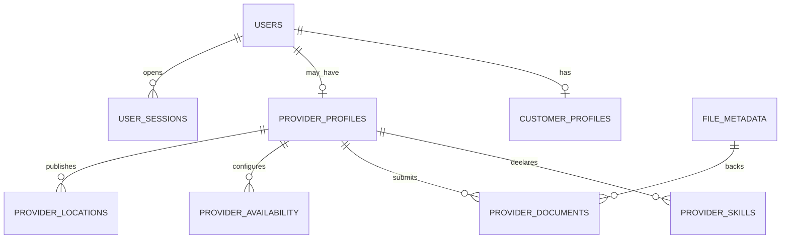
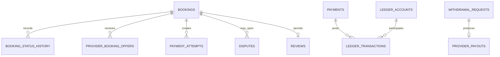
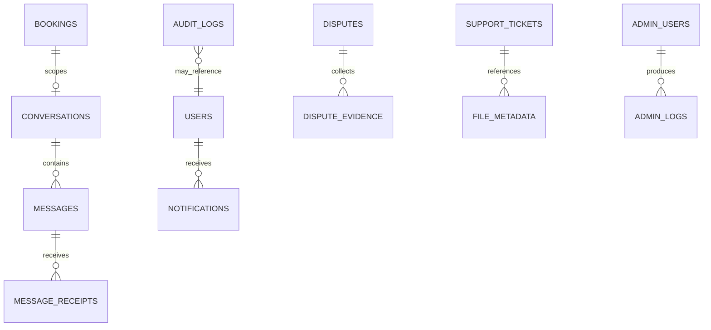

# LocalServe Marketplace — Phase 3 Database Design

**Document ID:** LS-DATA-003  
**Version:** 1.0.0  
**Status:** Phase 3 baseline candidate  
**Date:** 2026-08-06  
**Parent specifications:** `LOCAL_SERVE_PRODUCT_SPECIFICATION.md` v1.0.1 and `PHASE_2_SYSTEM_ARCHITECTURE.md` v1.0.0  
**Primary operational database:** MongoDB replica set  
**Distributed/ephemeral state:** Redis  
**Durable event backbone:** Apache Kafka

---

## 1. Purpose and data contract

This document freezes the data design that Phases 4–14 must use. It defines collection ownership, document boundaries, field/type conventions, references versus embedding, indexes, validation, transaction invariants, sample documents, ledger design, Redis keys, Kafka topics/schemas, migration, retention, archival, backup, deletion, and scale evolution.

It does not expose MongoDB documents as API models. Phase 4 creates separate request/response contracts, and Phase 5 maps between API DTOs, domain models, and persistence documents.

### 1.1 Non-negotiable inherited rules

- Public IDs are UUIDv7 strings. MongoDB `_id` is internal and never returned by an API.
- Money is a signed BSON `long` in minor units plus ISO 4217 currency; floating-point money is forbidden.
- UTC BSON `date` is used for stored instants; API rendering uses ISO-8601 and user timezone.
- Coordinates use GeoJSON `[longitude, latitude]`.
- Booking/payment/status enums remain exactly as defined in Phase 1.
- MongoDB is authoritative. Redis caches/coordinates and Kafka integrates; neither replaces booking/ledger truth.
- Financial and audit histories are append-only; corrections use compensating records.
- Cross-module writes occur only through application ports and explicit transaction orchestration.
- Sensitive identifiers, documents, bank/UPI data, exact location, and secrets are encrypted/masked and excluded from logs/events.

### 1.2 Phase 3 completion criteria

The design must:

1. Assign every collection to one Phase 2 module.
2. Support every Phase 1 entity and critical query without unbounded scans.
3. Define indexes with a named query purpose and bounded pagination.
4. Make duplicate booking selection, payment capture, refund, ledger posting, payout, review, coupon use, and event consumption preventable through unique constraints/idempotency.
5. Keep documents below MongoDB size limits through bounded embedding and referenced histories.
6. Define data retention, legal hold, deletion/anonymization, backup, restoration, archival, and migration.
7. Remain complete in Docker Compose while being replica/sharding/read-model ready.

---

## 2. Database-wide conventions

### 2.1 Database and collection naming

| Concern | Convention |
|---|---|
| Database | `localserve_<environment>`; production environment isolation normally uses separate clusters/projects, not only database names |
| Collections | Lower snake case plural, for example `provider_booking_offers` |
| Fields | Lower camel case, for example `providerId`, `createdAt` |
| Public ID | `id`: lowercase canonical UUIDv7 string; unique index |
| Internal ID | `_id`: MongoDB `ObjectId`; persistence-only |
| Reference | Public UUIDv7 string named `<entity>Id`; no MongoDB `DBRef` |
| Schema version | `schemaVersion`: positive integer |
| Optimistic lock | `version`: nonnegative integer, incremented atomically |
| Audit | `createdAt`, `createdBy`, `updatedAt`, `updatedBy` where mutable |
| Soft deletion | `deletedAt`, `deletedBy`, `deletionReasonCode` only where policy allows |
| Retention deletion | `expireAt`/`purgeAt` BSON date with a single-field TTL index |
| Status | Upper snake case string enum |

Cross-collection references use public IDs to keep events, exports, tests, and eventual extraction understandable. `_id` may be included in internal covered indexes but is not a domain identifier.

### 2.2 BSON type mapping

| Domain type | BSON representation | Rule |
|---|---|---|
| Money | `long amountMinor` + `string currency` | Checked Java `long` arithmetic; no double/float |
| Instant | BSON `date` | UTC only |
| Local schedule time | `string HH:mm` plus IANA `timeZone` and day-of-week enum | Converted to instants using versioned rules |
| Public ID | `string` UUIDv7 | Regex/format validation in application and selected JSON Schema validators |
| Email/phone lookup | Keyed HMAC lookup hash | Actual value encrypted; hash supports equality/uniqueness |
| Password/token/OTP | Argon2id or keyed/slow verifier hash | Never reversible/plaintext |
| Coordinate | GeoJSON `Point` | Valid longitude/latitude and accuracy metadata |
| Percentage/rate | Integer basis points or rational fields | Example: 15% = `1500` basis points |
| Arbitrary metadata | Bounded typed subdocument | No free unbounded map from client input |
| File | Reference to `file_metadata.id` | Bytes remain in private object storage |

### 2.3 Common document fields

Mutable aggregate roots use:

```json
{
  "_id": "ObjectId (internal)",
  "id": "UUIDv7",
  "schemaVersion": 1,
  "version": 0,
  "createdAt": "BSON date",
  "createdBy": "principal/system public ID",
  "updatedAt": "BSON date",
  "updatedBy": "principal/system public ID",
  "deletedAt": null,
  "deletedBy": null,
  "deletionReasonCode": null
}
```

Append-only documents omit `updated*`, `version`, and soft-delete fields unless a processing-status envelope must change. Financial/audit content itself remains immutable even if processing metadata changes.

### 2.4 Sensitive-field representation

| Data | Stored representation |
|---|---|
| Email/phone | Encrypted value, keyed lookup hash, verified flag, last-safe display mask |
| Aadhaar/PAN/licence identifier | Prefer not stored raw; keep type, masked/last4, keyed duplicate-detection hash, verification reference; encrypted raw only if approved |
| Bank account/UPI | Encrypted provider token/details, keyed lookup hash, mask, verification state; no PIN/CVV |
| Address text/instructions | Encrypted restricted subdocument plus safe locality/postcode/service-zone fields where needed |
| Exact location | GeoJSON only in restricted collections/fields with short retention and purpose controls |
| Webhook body | Body digest plus encrypted/quarantined restricted payload reference when required for evidence/replay |
| Chat body | Encrypted-at-rest content field; search/moderation projection only with explicit policy |

Production encryption uses application/client-side envelope encryption with KMS-managed key references and authenticated encryption. Local mode uses a non-production key supplied outside source control through the same encryption port. Lookup HMAC keys are separate from encryption keys and rotate with dual-read/reindex support.

### 2.5 Validation policy

- New collections start with `$jsonSchema` validation, `validationLevel: strict`, `validationAction: error` after compatible migrations complete.
- During expand/backfill migrations, validation may temporarily be `moderate`; rollback/exit criteria are documented.
- Application validation remains primary for cross-field/domain rules; database validation protects shape/type/enums/required fields.
- Unknown client fields never pass directly to persistence. Persistence mappers create allowlisted documents.
- Status, currency, country, role, principal type, account type, and classification use allowlisted enums.
- Maximum lengths/counts are enforced for every string/array/map, even when not all limits appear in the abbreviated examples below.

### 2.6 Index policy

1. Every index has an owner, named query, selectivity/cardinality expectation, sort order, and removal review date.
2. Unique indexes enforce business uniqueness where possible; application checks alone are insufficient.
3. Partial indexes exclude deleted/inactive documents only when supported query predicates always include the filter.
4. TTL indexes contain one date field. TTL cleanup is asynchronous and never drives business deadlines.
5. Array fields are bounded; designs avoid multiple-array compound multikey indexes.
6. Indexes are measured using representative `explain("executionStats")`; rejected scans/large sorts fail performance review.
7. Writes with critical invariants use majority acknowledgement in production. Analytics indexes do not burden hot transactional collections without evidence.

### 2.7 Pagination policy

- High-volume lists use cursor pagination over a stable compound index such as `(createdAt DESC, id DESC)`.
- Cursor contains signed/encoded last sort values plus filter/sort version; it is not a raw Mongo query.
- Admin page/offset pagination is allowed only for bounded datasets and capped offsets.
- Messages use `(conversationId, sequence)`; ledger statements use `(entries.accountId, occurredAt, id)`; booking history uses role ID plus `(createdAt, id)`.
- Count totals are approximate/projection-based for large lists unless exact count is explicitly required.

### 2.8 Transaction and concurrency policy

- Transactions require MongoDB replica-set mode in every environment, including local Docker.
- A command predicate includes `id`, `version`, expected status/ownership, and non-deleted state; zero modified documents becomes a typed conflict/authorization result.
- Unique indexes and immutable idempotency records resolve races such as duplicate selection/review/refund/payout/webhook/event consumption.
- External calls never run inside MongoDB transactions. State uses `PENDING`/`PROCESSING` plus webhook/poll/reconciliation recovery.
- Transaction bodies are short, bounded, and retry-safe for transient transaction labels. The application does not retry a non-idempotent external call.

---

## 3. Relationship and embedding strategy

### 3.1 Identity and provider relationships



### 3.2 Booking and finance relationships



### 3.3 Communication and operations relationships



### 3.4 Embed versus reference decisions

| Data | Decision | Reason |
|---|---|---|
| Booking service/address/pricing/policy/selected-provider summary | Embed immutable versioned snapshots | Booking contract must survive catalog/profile changes and read atomically |
| Booking history/timeline/offers | Reference separate collections | Unbounded growth, independent querying and retention |
| Provider skills/documents/availability | Reference | Independent lifecycle, indexes, review, expiration, bounded provider profile |
| Payment pricing/tax/fee snapshot | Embed | Financial calculation evidence is bounded and immutable |
| Ledger postings | Embed bounded entries inside one ledger transaction document | Atomic balance, immutable transaction group, normally 2–16 entries |
| Conversation messages/receipts | Reference | High volume, cursor pagination, independent retention |
| Review photos/evidence/documents | Reference file IDs | Bytes live outside MongoDB; scan/access lifecycle is independent |
| Role permission codes | Embed bounded permission-code array in role | Small, versioned, read frequently; permission catalog remains referenced by code |
| Notification delivery attempts | Reference | Retries/channels may grow independently; logical notification stays compact |
| Dispute evidence/activities | Reference | Append-only case history and variable volume |
| Wallet balance | Store as projection with ledger checkpoint | Fast display; immutable ledger remains the source of truth |
| Provider discovery data | Denormalized projection per provider-service pair | Avoid multikey/geospatial complexity and cross-collection joins on hot search |

No array is allowed to grow without a documented maximum. Histories, messages, attempts, evidence, offers, audit records, and ledger transactions are always separate documents.

---

## 4. Collection ownership and inventory

The inventory below defines 91 authoritative aggregates, append-only histories, workflow records, and rebuildable projections. A local student profile may omit non-MVP projections until the owning feature is enabled, but enabled collection names and ownership do not change.

### 4.1 Identity, access, and administration identity

| Collection | Owner/release | Main fields and relationships | Key indexes and retention |
|---|---|---|---|
| `users` | Identity / MVP | Public account, encrypted email/phone, lookup hashes, password hash, role memberships, verification/account status | Unique `id`; unique partial email/phone lookup hash; account status; soft delete/anonymize |
| `oauth_accounts` | Identity / MVP | `userId`, provider, providerSubject, encrypted safe profile metadata, link/last-login time | Unique `(provider, providerSubject)`; unique `(userId, provider)` |
| `user_sessions` | Identity / MVP | Public/admin principal realm, user/admin ID, session/device metadata, risk, expiry/revocation | `(principalType, principalId, revokedAt, lastSeenAt desc)`; unique `id`; TTL `purgeAt` after audit window |
| `refresh_tokens` | Identity / MVP | Session/family IDs, token hash, parent ID, issued/expiry/rotated/revoked/reuse metadata | Unique token hash; `(familyId, revokedAt)`; TTL `purgeAt` after expiry/reuse window |
| `auth_activity_logs` | Identity / MVP | Append-only login/OTP/recovery/session action, outcome/reason, safe IP/device/region, correlation | `(principalId, occurredAt desc)`; `(eventType, outcome, occurredAt)`; archive policy |
| `device_tokens` | Communication / MVP | User/session/device, FCM/APNs token ciphertext/hash, platform/app, status, last seen | Unique token lookup hash; `(userId, status, updatedAt)`; purge inactive |
| `consent_records` | Identity / MVP | User, purpose, notice/terms version, action, locale, source, evidence digest | `(userId, purpose, occurredAt desc)`; append-only and legal retention |
| `account_deletion_requests` | Identity / MVP | User, requested/verified/scheduled/completed state, legal holds, per-module erasure progress | Unique active request per user; `(status, scheduledFor)`; preserve safe outcome audit |
| `admin_users` | Administration / MVP | Separate admin identity, encrypted contacts, password/MFA state, role IDs, status, step-up/security metadata | Unique email lookup hash; unique `id`; `(status, roleIds)` |
| `roles` | Administration / MVP | Realm, name/code, bounded permission codes, status, version | Unique `(realm, code)`; cacheable; no hard delete when assigned |
| `permissions` | Administration / MVP | Stable permission code, domain/action, risk level, description, deprecation | Unique `code`; append/deprecate rather than rename silently |

### 4.2 People, provider verification, and files

| Collection | Owner/release | Main fields and relationships | Key indexes and retention |
|---|---|---|---|
| `customer_profiles` | People / MVP | `userId`, name, avatar file, locale/timezone, preferences summary, metrics snapshot | Unique `userId`; unique `id`; soft delete/anonymize |
| `provider_profiles` | People / MVP | `userId`, public/business profile, experience, verification/approval, service radius, rating summary, operational status | Unique `userId`; `(approvalStatus, operationalStatus)`; profile updates versioned |
| `addresses` | People / MVP | User, type/label, encrypted address/instructions, safe locality/postcode, restricted GeoJSON point, service zone | `(userId, deletedAt, updatedAt desc)`; partial unique default per user/type if used |
| `provider_skills` | People / MVP | Provider, service/skill ID, experience, verification/status, price configuration reference | Unique active `(providerId, serviceId)`; `(serviceId, status, providerId)` |
| `provider_availability` | People / MVP | Provider timezone, weekly rules, breaks/exceptions, effective range, capacity | Unique `(providerId, effectiveFrom)`; `(providerId, status, effectiveFrom desc)` |
| `provider_documents` | People / MVP | Provider, document type, masked identifier/hash, file ID, issue/expiry, verification status, reviewer | Unique active `(providerId, documentType, documentScope)` where policy; expiry/status queue indexes |
| `verification_requests` | People / MVP | Provider application, submitted snapshot/version, required checks, decisions, SLA, assigned reviewer | `(status, priority, submittedAt)`; `(providerId, createdAt desc)`; unique active application where policy |
| `payout_destinations` | People / MVP | Provider, type `BANK`/`UPI`, encrypted/tokenized details, mask/hash, verification, cooling period, status | Unique provider/type lookup hash; `(providerId, status, verifiedAt desc)` |
| `file_metadata` | File / MVP | Owner/principal, purpose/classification, object key, checksum, detected type/size, scan, lifecycle, encryption key reference | Unique checksum scoped by owner/purpose only if dedup permitted; owner/purpose/status indexes |
| `upload_sessions` | File / MVP | Requester, intended owner/purpose, expected type/size/checksum, object key, expiry, completion/scan state | Unique `id`; `(requesterId, status, createdAt)`; TTL `expireAt` for incomplete sessions |
| `file_access_logs` | File / MVP | Append-only restricted file read/write/delete/sign request, actor, purpose, case/correlation, outcome | `(fileId, occurredAt desc)`; `(actorId, occurredAt desc)`; security retention |
| `user_blocks` | Communication / MVP | Blocking user, blocked user/provider, scope, reason category, booking/case reference, active interval | Unique active `(blockerId, blockedId, scope)`; used by search/dispatch/chat eligibility |

### 4.3 Catalog, serviceability, search, and location

| Collection | Owner/release | Main fields and relationships | Key indexes and retention |
|---|---|---|---|
| `categories` | Catalog / MVP | Slug, localized name/content, media, publication/status/order, effective dates | Unique active slug; `(status, displayOrder)`; archive not hard delete |
| `subcategories` | Catalog / MVP | Category ID, slug, localized content, status/order/effective dates | Unique `(categoryId, slug)`; `(categoryId, status, displayOrder)` |
| `services` | Catalog / MVP | Subcategory/category, slug, localized content, requirements, duration, booking types, evidence/credential rules | Unique active slug; `(subcategoryId, status, displayOrder)`; normalized search fields |
| `service_pricing` | Catalog / MVP | Service/zone, pricing model, guidance/min/max, fee/tax/commission rule refs, currency, effective dates/version | Unique `(serviceId, serviceZoneId, effectiveFrom, version)`; active effective-date lookup |
| `service_zones` | Location / MVP | Zone code/name, GeoJSON polygon/multipolygon, timezone, operating/category/emergency policy | Unique `code`; `boundary: 2dsphere`; `(status, priority)` |
| `provider_locations` | Location / MVP | One durable latest point per provider, GeoJSON, accuracy, observed/received time, sequence, zone/status | Unique `providerId`; `location: 2dsphere`; `(serviceZoneId, observedAt)` |
| `provider_location_history` | Location / MVP | Sampled time-series point, accuracy, booking/online purpose, sequence, risk flags, expiry | Time-series meta provider/booking and time observed; TTL policy; no public queries |
| `provider_discovery_projection` | Catalog/Search / MVP | One document per provider-service pair: approval/online/availability/capacity, scalar service/zone, GeoJSON point, rating/experience/price summary | Unique `(providerId, serviceId)`; compound equality + `location: 2dsphere`; rebuildable |
| `search_history` | Catalog/Search / V1 | User, normalized/encrypted query reference, service/category/filter/zone summary, occurred time, deletion/expiry | `(userId, occurredAt desc)`; TTL `expireAt`; opt-out/delete |
| `favorite_providers` | Reputation/Growth / V1 | Customer, provider, created time, optional source | Unique `(customerId, providerId)`; `(customerId, createdAt desc)` |
| `recently_viewed_providers` | Reputation/Growth / V1 | Customer/provider, last viewed, bounded count/expiry | Unique `(customerId, providerId)`; `(customerId, viewedAt desc)`; TTL/trim policy |
| `popular_search_terms` | Catalog/Search / V1 | Aggregated term/service/zone/window, count/score, privacy threshold | Unique `(termKey, serviceZoneId, windowStart)`; TTL/archive; rebuildable |

### 4.4 Booking, dispatch, scheduling, and integration infrastructure

| Collection | Owner/release | Main fields and relationships | Key indexes and retention |
|---|---|---|---|
| `bookings` | Booking / MVP | Customer, selected/assigned provider, type/status/version, schedule, service/address/pricing/policy snapshots, OTP verification summaries, current financial refs | Unique `id`; customer/provider history and active queues; status/schedule worker indexes |
| `booking_status_history` | Booking / MVP | Append-only booking status transition, from/to, actor, command/policy version, reason, correlation | Unique `(bookingId, bookingVersion)`; `(bookingId, occurredAt, id)` |
| `provider_booking_offers` | Booking / MVP | Booking/provider, offer status/version, estimate/ETA/breakdown, expiry, selection/rejection metadata | Unique `(bookingId, providerId)`; booking active offers; provider inbox/history; TTL only after retention |
| `dispatch_waves` | Booking / MVP | Booking, wave number/policy, radius/cohort/candidates, requested provider IDs or digest, timing/outcome | Unique `(bookingId, waveNumber)`; `(status, dueAt)`; archive with booking |
| `booking_timeline_events` | Booking / MVP | User-visible/system timeline event, actor, safe metadata, visibility, occurred time | `(bookingId, occurredAt, id)`; append-only |
| `provider_active_assignments` | Booking / MVP | Provider/capacity token, booking, assignment status/expiry/version | Unique active provider/capacity slot; supports atomic assignment race protection |
| `scheduled_commands` | Booking/Platform / MVP | Command type, aggregate/expected version, due time, payload reference, status, lease, attempts, result/purge | `(status, dueAt)`; lease index; TTL `purgeAt` after terminal retention |
| `idempotency_records` | Platform / MVP | Principal/scope/key hash, request digest, resource/result, status, expiry, financial retention flag | Unique `(scope, principalId, keyHash)`; TTL only when safe/nonfinancial |
| `outbox_events` | Platform / MVP | Event envelope/payload, aggregate, topic/key, publication status, lease/attempts, created/published/purge | `(status, nextAttemptAt)`; `(aggregateId, aggregateVersion)`; TTL `purgeAt` after published archive |
| `inbox_events` | Platform / MVP | Consumer, event ID/type, aggregate version, received/processed/result/purge | Unique `(consumerName, eventId)`; `(status, receivedAt)`; TTL after replay window |

### 4.5 Finance, ledger, wallet, refund, and reconciliation

| Collection | Owner/release | Main fields and relationships | Key indexes and retention |
|---|---|---|---|
| `payment_attempts` | Finance / MVP | Booking/customer, gateway, idempotency/request digest, quoted amount, gateway order/intent, status, expiry/errors | Unique `(bookingId, idempotencyKeyHash)`; unique gateway order ID; status/expiry queue |
| `payments` | Finance / MVP | Booking/customer, gateway IDs, amount/breakdown/currency, canonical status, captured/held/release/refund totals, reconciliation state | Unique `bookingId` for single-payment policy or payment sequence; unique gateway payment ID; finance queues |
| `payment_webhook_receipts` | Finance / MVP | Gateway/event ID/type, body digest/restricted payload ref, signature result, received/processing state, attempts | Unique `(gateway, gatewayEventId)`; `(processingStatus, nextAttemptAt)`; immutable receipt metadata |
| `ledger_accounts` | Finance / MVP | Account owner/type/currency/normal side/status, posted debit/credit/current balance projection/checkpoint | Unique `(ownerType, ownerId, accountType, currency)`; account status/type |
| `ledger_transactions` | Finance / MVP | Immutable transaction header plus balanced bounded embedded entries, source, booking/payment/refund/payout refs, policy/correlation | Unique `(sourceType, sourceId, transactionType)` or idempotency reference; multikey account statement index |
| `wallets` | Finance / MVP | Owner/type/currency, pending/available/frozen/paidOut projection, ledger checkpoint, version | Unique `(ownerType, ownerId, currency)`; never authoritative without ledger checkpoint |
| `wallet_transactions` | Finance / MVP | Rebuildable user-facing statement line linked to ledger transaction, bucket change, amount/balance snapshot | Unique projection source; `(walletId, occurredAt desc, id desc)` |
| `refunds` | Finance / MVP | Payment/booking, requested/approved amount/reason, status, gateway ID, reservation/final ledger refs, approvals | Unique idempotency/source; unique gateway refund ID; status/next action |
| `withdrawal_requests` | Finance / MVP | Provider/wallet/destination, amount, status, risk/approval/maker-checker, reserved ledger ref, idempotency | Unique provider idempotency; `(status, requestedAt)`; provider history |
| `provider_payouts` | Finance / MVP | Withdrawal/provider/destination, gateway reference, amount/status, attempts/callback, ledger refs | Unique withdrawal ID; unique gateway payout ID; status/reconciliation queue |
| `payout_webhook_receipts` | Finance / MVP | Provider event receipt/digest/signature/dedup/processing state | Unique `(provider, eventId)`; same safe receipt pattern as payment webhooks |
| `reconciliation_runs` | Finance / MVP | Scope/gateway/date/window, checkpoints, counts/amounts, state, started/completed, report file | Unique `(scope, gateway, periodStart, periodEnd)`; recent run index |
| `reconciliation_exceptions` | Finance / MVP | Run, entity/type/severity, expected/actual safe data, owner/SLA/status/actions/resolution | Unique open exception fingerprint; `(status, severity, createdAt)` |
| `invoices` | Finance / MVP | Booking/customer/provider, unique invoice number, immutable tax/line snapshots, file ID, status/version | Unique invoice number; unique booking/type/version; financial retention |
| `financial_holds` | Finance / MVP | Payment/ledger/provider/booking, hold type/amount/status, dispute/risk reference, applied/released metadata | Unique active hold fingerprint; `(status, releaseEligibleAt)`; append outcome history |

### 4.6 Communication, notifications, reputation, and growth

| Collection | Owner/release | Main fields and relationships | Key indexes and retention |
|---|---|---|---|
| `conversations` | Communication / MVP | Booking, participant IDs/roles, status, sequence counter, last-message safe summary, retention/visibility | Unique booking conversation; participant/status/recent indexes |
| `messages` | Communication / MVP | Conversation/sequence/sender, client message ID, encrypted body/type, file refs, moderation/visibility, timestamps | Unique `(conversationId, sequence)`; unique `(conversationId, senderId, clientMessageId)` |
| `message_receipts` | Communication / MVP | Message/recipient/device optional, delivered/read times/status | Unique `(messageId, recipientId)`; recipient unread/recent indexes |
| `notifications` | Communication / MVP | Recipient, type/category, template/version, safe rendered content/ref, action, status/read, scheduled/expiry | `(recipientId, createdAt desc, id desc)`; unread partial index; TTL only promotional/expired policy |
| `notification_templates` | Communication / MVP | Key/channel/locale/version, subject/body variables, classification/approval/status/effective range | Unique `(templateKey, channel, locale, version)`; active effective lookup |
| `notification_delivery_attempts` | Communication / MVP | Notification/channel/provider, attempt/idempotency, request digest, outcome/provider ID/error, retry time | Unique `(notificationId, channel, attemptNumber)`; `(status, nextAttemptAt)` |
| `notification_preferences` | Communication / MVP | User, per-category/channel consent, quiet hours/timezone, policy/consent version | Unique `userId`; versioned changes also produce consent/audit records |
| `reviews` | Reputation/Growth / MVP | Booking/customer/provider, rating/text/photo file IDs, verified, moderation/status, edit deadline/version | Unique `bookingId`; provider/status/created indexes; text bounded |
| `rating_aggregates` | Reputation/Growth / MVP | Provider/service optional, count/sum/distribution/weighted score, source checkpoint/version | Unique `(providerId, serviceId)`; rebuildable projection |
| `review_reports` | Reputation/Growth / MVP | Review/reporter, reason/evidence, status/moderator/decision | Unique active `(reviewId, reporterId)`; moderation queue |
| `coupons` | Reputation/Growth / MVP | Code hash/display code, scope/benefit/funding/budget/limits/status/effective dates/version | Unique code lookup hash; active effective/scope indexes |
| `coupon_usage` | Reputation/Growth / MVP | Coupon/user/booking/payment, reservation/consumption/release, discount/funding, expiry/idempotency | Unique eligible use rule; unique booking/coupon; `(status, expireAt)` |
| `referrals` | Reputation/Growth / V1 | Referrer/referred user, code/campaign, qualifying event, state, reward ledger refs | Unique referred-user/campaign; referrer history |
| `loyalty_accounts` | Reputation/Growth / V1 | Customer/program/tier, point balance projection, pending/expiry, ledger checkpoint/version | Unique `(customerId, programId)` |
| `loyalty_transactions` | Reputation/Growth / V1 | Account, earn/redeem/expire/adjust, points, source/idempotency, occurred/expiry | Unique source/type; account statement cursor index |
| `provider_performance_snapshots` | Reputation/Growth / V1 | Provider/window, acceptance/completion/cancellation/rating/response/earnings metrics and definition version | Unique `(providerId, windowType, windowStart)`; rebuildable |

### 4.7 Cases, support, audit, configuration, CMS, and analytics

| Collection | Owner/release | Main fields and relationships | Key indexes and retention |
|---|---|---|---|
| `disputes` | Case Management / MVP | Booking/payment, opener/parties, category/requested outcome, status/version/SLA, freeze refs, decision/appeal summary | Unique active booking dispute where policy; admin queue and party history indexes |
| `dispute_evidence` | Case Management / MVP | Dispute, submitter/visibility/type, file/message/location/payment reference, statement, checksum/version | `(disputeId, createdAt, id)`; append-only; legal hold aware |
| `dispute_activities` | Case Management / MVP | Append-only status/comment/internal note/request/deadline/decision activity with visibility | `(disputeId, occurredAt, id)`; admin/party filtered reads |
| `support_tickets` | Case Management / MVP | Requester, booking/payment/provider refs, category/priority/status/SLA/assignment/subject | `(status, priority, nextSlaAt)`; requester history; owner queue |
| `support_ticket_messages` | Case Management / MVP | Ticket, sender/visibility, encrypted body, file refs, sequence/time | Unique `(ticketId, sequence)`; ticket cursor |
| `admin_logs` | Administration / MVP | Append-only admin authentication/session/security activity | `(adminUserId, occurredAt desc)`; event/outcome index; security retention |
| `audit_logs` | Administration / MVP | Append-only/tamper-evident actor/action/target, redacted before/after digest/diff, reason, correlation/trace, outcome, hash chain | Target and actor cursors; event/time; immutable/archive |
| `system_settings` | Administration / MVP | Typed key/scope/value ciphertext or structured value, validation schema/version, effective dates, owner/status | Unique `(key, scopeType, scopeId, effectiveFrom, version)`; active lookup |
| `feature_flags` | Administration / MVP | Key, default, environment/audience rules, owner, status, expiry/review, version/change summary | Unique key; active cache projection; changes audited |
| `cms_pages` | Administration / V1 | Slug/locale/version, title/content blocks, status/approval/schedule/SEO | Unique `(slug, locale, version)`; active publication lookup |
| `homepage_banners` | Administration / V1 | Locale/audience/zone, media/file, action, schedule/order/status/experiment | Active schedule/audience indexes; bounded result |
| `promotional_campaigns` | Administration / V1 | Audience snapshot/rules, channel/template/budget/frequency, consent/status/schedule/metrics | `(status, scheduledAt)`; owner/recent indexes |
| `analytics_daily_metrics` | Administration / MVP | Metric key/definition version/date/dimensions with privacy-safe counts/sums/rates, source checkpoint | Unique metric/date/dimension hash; rebuildable/warehouse export |
| `failed_jobs` | Administration / MVP | Job/event/consumer, safe payload reference, error category, attempts, owner/status/replay/audit | `(status, severity, nextActionAt)`; unique failure fingerprint where safe |
| `data_subject_requests` | Administration / MVP | Authenticated privacy request type, requester, scope, status/SLA, module tasks, holds, export/file ref, resolution | `(status, dueAt)`; requester history; restricted access |

---

## 5. Critical document designs and samples

Samples use synthetic values and relaxed JSON for readability. Dates are stored as BSON dates, monetary integers as BSON `long`, `_id` as ObjectId, and encrypted/HMAC strings are illustrative non-secret markers.

### 5.1 User and session documents

#### `users`

Required invariants:

- At least one verified login method is required before normal activation.
- Public user roles contain only `CUSTOMER` and/or approved `PROVIDER`; `ADMIN` is forbidden in this collection.
- Email/phone lookup hashes are unique only when present and not retired.
- Password hash is Argon2id and never returned; OAuth/phone-only accounts may omit it.
- Suspension/deletion immediately affects authorization even if a short access token has not expired.

```json
{
  "_id": "ObjectId(66b400000000000000000001)",
  "id": "0191265e-8c2f-7a1b-8d90-22ac9e460001",
  "schemaVersion": 1,
  "version": 4,
  "realm": "PUBLIC",
  "email": {
    "ciphertext": "enc:v1:synthetic-email",
    "lookupHash": "hmac:v1:synthetic-email-hash",
    "mask": "r***@example.test",
    "verifiedAt": "2026-08-06T10:00:00Z"
  },
  "phone": {
    "ciphertext": "enc:v1:synthetic-phone",
    "lookupHash": "hmac:v1:synthetic-phone-hash",
    "mask": "+91******3210",
    "verifiedAt": "2026-08-06T10:02:00Z"
  },
  "passwordHash": "$argon2id$synthetic-not-a-real-hash",
  "roleMemberships": [
    {
      "role": "CUSTOMER",
      "status": "ACTIVE",
      "grantedAt": "2026-08-06T10:02:00Z"
    },
    {
      "role": "PROVIDER",
      "status": "PENDING_APPROVAL",
      "grantedAt": "2026-08-06T10:05:00Z"
    }
  ],
  "accountStatus": "ACTIVE",
  "permissionVersion": 3,
  "preferredLocale": "en-IN",
  "timeZone": "Asia/Kolkata",
  "createdAt": "2026-08-06T10:00:00Z",
  "createdBy": "SELF_REGISTRATION",
  "updatedAt": "2026-08-06T10:05:00Z",
  "updatedBy": "0191265e-8c2f-7a1b-8d90-22ac9e460001",
  "deletedAt": null,
  "deletedBy": null,
  "deletionReasonCode": null
}
```

Indexes:

```javascript
db.users.createIndex({ id: 1 }, { unique: true, name: "ux_users_id" });
db.users.createIndex(
  { "email.lookupHash": 1 },
  {
    unique: true,
    name: "ux_users_email_lookup",
    partialFilterExpression: { "email.lookupHash": { $type: "string" }, deletedAt: null }
  }
);
db.users.createIndex(
  { "phone.lookupHash": 1 },
  {
    unique: true,
    name: "ux_users_phone_lookup",
    partialFilterExpression: { "phone.lookupHash": { $type: "string" }, deletedAt: null }
  }
);
db.users.createIndex(
  { accountStatus: 1, updatedAt: -1 },
  { name: "ix_users_status_updated" }
);
```

#### `user_sessions`

```json
{
  "_id": "ObjectId(66b400000000000000000002)",
  "id": "0191265e-8c2f-7a1b-8d90-22ac9e460010",
  "schemaVersion": 1,
  "principalType": "PUBLIC_USER",
  "principalId": "0191265e-8c2f-7a1b-8d90-22ac9e460001",
  "activeRole": "CUSTOMER",
  "device": {
    "deviceIdHash": "hmac:v1:synthetic-device",
    "name": "Chrome on Windows",
    "platform": "WEB",
    "userAgentSummary": "Chrome/151 Windows",
    "trusted": false
  },
  "ip": {
    "addressHash": "hmac:v1:synthetic-ip",
    "country": "IN",
    "region": "Punjab"
  },
  "riskLevel": "LOW",
  "createdAt": "2026-08-06T10:10:00Z",
  "lastSeenAt": "2026-08-06T10:20:00Z",
  "absoluteExpiresAt": "2026-09-05T10:10:00Z",
  "revokedAt": null,
  "revocationReasonCode": null,
  "purgeAt": "2026-12-05T10:10:00Z"
}
```

#### `refresh_tokens`

```json
{
  "_id": "ObjectId(66b400000000000000000003)",
  "id": "0191265e-8c2f-7a1b-8d90-22ac9e460011",
  "schemaVersion": 1,
  "sessionId": "0191265e-8c2f-7a1b-8d90-22ac9e460010",
  "familyId": "0191265e-8c2f-7a1b-8d90-22ac9e460012",
  "parentTokenId": null,
  "tokenHash": "hmac:v1:synthetic-refresh-token",
  "issuedAt": "2026-08-06T10:10:00Z",
  "expiresAt": "2026-09-05T10:10:00Z",
  "rotatedAt": null,
  "replacedByTokenId": null,
  "revokedAt": null,
  "reuseDetectedAt": null,
  "purgeAt": "2026-12-05T10:10:00Z"
}
```

The rotation transaction inserts the child token, marks the current token rotated/replaced, and updates session activity. A unique token hash and family query support reuse response. TTL cleanup occurs only after the post-expiry detection/audit window.

### 5.2 Provider, verification, and geospatial documents

#### `provider_profiles`

```json
{
  "_id": "ObjectId(66b400000000000000000020)",
  "id": "0191265e-8c2f-7a1b-8d90-22ac9e460020",
  "schemaVersion": 1,
  "version": 8,
  "userId": "0191265e-8c2f-7a1b-8d90-22ac9e460001",
  "displayName": "Raj Technical Services",
  "profileSlug": "raj-technical-services-460020",
  "bio": "AC and appliance repair professional",
  "experienceMonths": 72,
  "profileImageFileId": "0191265e-8c2f-7a1b-8d90-22ac9e460021",
  "verificationStatus": "APPROVED",
  "approval": {
    "approvedAt": "2026-08-06T11:30:00Z",
    "approvedBy": "0191265e-8c2f-7a1b-8d90-22ac9e469001",
    "policyVersion": 2
  },
  "operationalStatus": "OFFLINE",
  "serviceRadiusMeters": 12000,
  "homeServiceZoneIds": ["0191265e-8c2f-7a1b-8d90-22ac9e462001"],
  "ratingSummary": {
    "count": 48,
    "averageBasisPoints": 46250,
    "weightedBasisPoints": 45120
  },
  "performanceSummary": {
    "acceptanceBasisPoints": 7200,
    "completionBasisPoints": 9400,
    "cancellationBasisPoints": 300
  },
  "createdAt": "2026-08-06T10:05:00Z",
  "createdBy": "0191265e-8c2f-7a1b-8d90-22ac9e460001",
  "updatedAt": "2026-08-06T11:30:00Z",
  "updatedBy": "0191265e-8c2f-7a1b-8d90-22ac9e469001",
  "deletedAt": null
}
```

`averageBasisPoints` represents rating × 10,000 (4.625 = 46,250) to avoid floating-point persistence. API mapping returns a formatted decimal.

#### `provider_documents`

```json
{
  "_id": "ObjectId(66b400000000000000000022)",
  "id": "0191265e-8c2f-7a1b-8d90-22ac9e460022",
  "schemaVersion": 1,
  "version": 2,
  "providerId": "0191265e-8c2f-7a1b-8d90-22ac9e460020",
  "documentType": "PAN",
  "documentScope": "IDENTITY_TAX",
  "identifier": {
    "mask": "A****1234*",
    "last4": "1234",
    "lookupHash": "hmac:v1:synthetic-pan"
  },
  "fileId": "0191265e-8c2f-7a1b-8d90-22ac9e460023",
  "issuedAt": null,
  "expiresAt": null,
  "verificationStatus": "APPROVED",
  "verification": {
    "method": "MANUAL_DOCUMENT_REVIEW",
    "reviewerId": "0191265e-8c2f-7a1b-8d90-22ac9e469001",
    "reviewedAt": "2026-08-06T11:20:00Z",
    "reasonCode": "DOCUMENT_VALID",
    "providerReference": null
  },
  "createdAt": "2026-08-06T10:30:00Z",
  "createdBy": "0191265e-8c2f-7a1b-8d90-22ac9e460001",
  "updatedAt": "2026-08-06T11:20:00Z",
  "updatedBy": "0191265e-8c2f-7a1b-8d90-22ac9e469001"
}
```

#### `provider_locations`

```json
{
  "_id": "ObjectId(66b400000000000000000024)",
  "id": "0191265e-8c2f-7a1b-8d90-22ac9e460024",
  "schemaVersion": 1,
  "version": 442,
  "providerId": "0191265e-8c2f-7a1b-8d90-22ac9e460020",
  "serviceZoneId": "0191265e-8c2f-7a1b-8d90-22ac9e462001",
  "location": {
    "type": "Point",
    "coordinates": [75.8573, 30.9009]
  },
  "horizontalAccuracyMeters": 12,
  "sequence": 8842,
  "observedAt": "2026-08-06T12:00:04Z",
  "receivedAt": "2026-08-06T12:00:05Z",
  "source": "PROVIDER_MOBILE",
  "purpose": "ONLINE_DISPATCH",
  "riskFlags": [],
  "updatedAt": "2026-08-06T12:00:05Z"
}
```

Indexes:

```javascript
db.provider_locations.createIndex(
  { providerId: 1 },
  { unique: true, name: "ux_provider_locations_provider" }
);
db.provider_locations.createIndex(
  { location: "2dsphere" },
  { name: "ix_provider_locations_geo" }
);
db.provider_locations.createIndex(
  { serviceZoneId: 1, observedAt: -1 },
  { name: "ix_provider_locations_zone_freshness" }
);
db.provider_discovery_projection.createIndex(
  { providerId: 1, serviceId: 1 },
  { unique: true, name: "ux_discovery_provider_service" }
);
db.provider_discovery_projection.createIndex(
  {
    serviceId: 1,
    serviceZoneId: 1,
    approvalStatus: 1,
    online: 1,
    location: "2dsphere"
  },
  { name: "ix_discovery_service_zone_status_geo" }
);
```

The hot nearby query uses scalar equality fields before the `2dsphere` field and a maximum distance. Final provider eligibility is revalidated against owning aggregates before offer/selection.

### 5.3 Booking and offer documents

#### `bookings`

```json
{
  "_id": "ObjectId(66b400000000000000000040)",
  "id": "0191265e-8c2f-7a1b-8d90-22ac9e464001",
  "schemaVersion": 1,
  "version": 9,
  "customerId": "0191265e-8c2f-7a1b-8d90-22ac9e460001",
  "bookingType": "INSTANT",
  "status": "PROVIDER_ASSIGNED",
  "serviceSnapshot": {
    "serviceId": "0191265e-8c2f-7a1b-8d90-22ac9e463001",
    "categoryId": "0191265e-8c2f-7a1b-8d90-22ac9e463010",
    "subcategoryId": "0191265e-8c2f-7a1b-8d90-22ac9e463011",
    "serviceName": "AC inspection and repair",
    "catalogVersion": 7,
    "requiredEvidence": ["AFTER_SERVICE_PHOTO"]
  },
  "addressSnapshot": {
    "addressId": "0191265e-8c2f-7a1b-8d90-22ac9e460030",
    "encryptedDetails": "enc:v1:synthetic-address",
    "safeLocality": "Ludhiana",
    "postalCode": "141001",
    "serviceZoneId": "0191265e-8c2f-7a1b-8d90-22ac9e462001",
    "location": {
      "type": "Point",
      "coordinates": [75.8486, 30.9010]
    }
  },
  "schedule": {
    "requestedFor": "2026-08-06T12:20:00Z",
    "timeZone": "Asia/Kolkata",
    "estimatedDurationMinutes": 90
  },
  "pricingSnapshot": {
    "currency": "INR",
    "serviceSubtotalMinor": 100000,
    "taxMinor": 0,
    "convenienceFeeMinor": 0,
    "emergencyFeeMinor": 0,
    "discountMinor": 0,
    "creditMinor": 0,
    "customerPayableMinor": 100000,
    "commissionBasisPoints": 1500,
    "pricingVersion": 4
  },
  "policySnapshot": {
    "cancellationPolicyVersion": 3,
    "settlementHoldSeconds": 86400,
    "customerConfirmationSeconds": 172800,
    "dispatchPolicyVersion": 5
  },
  "selectedOfferId": "0191265e-8c2f-7a1b-8d90-22ac9e464010",
  "selectedProviderId": "0191265e-8c2f-7a1b-8d90-22ac9e460020",
  "assignedProviderId": "0191265e-8c2f-7a1b-8d90-22ac9e460020",
  "selectedProviderSnapshot": {
    "displayName": "Raj Technical Services",
    "ratingBasisPoints": 46250,
    "experienceMonths": 72
  },
  "paymentId": "0191265e-8c2f-7a1b-8d90-22ac9e465001",
  "otpSummary": {
    "startVerifiedAt": null,
    "completionVerifiedAt": null
  },
  "activeDisputeId": null,
  "createdAt": "2026-08-06T12:01:00Z",
  "createdBy": "0191265e-8c2f-7a1b-8d90-22ac9e460001",
  "updatedAt": "2026-08-06T12:08:00Z",
  "updatedBy": "SYSTEM"
}
```

Indexes:

```javascript
db.bookings.createIndex({ id: 1 }, { unique: true, name: "ux_bookings_id" });
db.bookings.createIndex(
  { customerId: 1, createdAt: -1, id: -1 },
  { name: "ix_bookings_customer_history" }
);
db.bookings.createIndex(
  { assignedProviderId: 1, status: 1, "schedule.requestedFor": 1 },
  { name: "ix_bookings_provider_active_schedule" }
);
db.bookings.createIndex(
  { status: 1, updatedAt: 1 },
  { name: "ix_bookings_status_staleness" }
);
```

#### `provider_booking_offers`

```json
{
  "_id": "ObjectId(66b400000000000000000041)",
  "id": "0191265e-8c2f-7a1b-8d90-22ac9e464010",
  "schemaVersion": 1,
  "version": 2,
  "bookingId": "0191265e-8c2f-7a1b-8d90-22ac9e464001",
  "providerId": "0191265e-8c2f-7a1b-8d90-22ac9e460020",
  "status": "SELECTED_BY_CUSTOMER",
  "estimatedPrice": {
    "amountMinor": 100000,
    "currency": "INR",
    "breakdown": [
      { "code": "SERVICE", "amountMinor": 100000 }
    ]
  },
  "estimatedArrivalAt": "2026-08-06T12:30:00Z",
  "estimatedArrivalMinutes": 22,
  "message": "Inspection and repair estimate; parts require approval",
  "expiresAt": "2026-08-06T12:06:00Z",
  "respondedAt": "2026-08-06T12:03:00Z",
  "selectedAt": "2026-08-06T12:05:00Z",
  "createdAt": "2026-08-06T12:02:00Z",
  "updatedAt": "2026-08-06T12:05:00Z"
}
```

Offer creation has unique `(bookingId, providerId)`. Selection transaction predicates the booking/offer version and expiry, updates the winning offer, marks other active offers `NOT_SELECTED`, and advances the booking. If the losing-offer update set is large, offers are logically invalidated by booking selection version and asynchronously materialized; authorization always checks booking selection.

### 5.4 Payment, webhook, ledger, and wallet documents

#### `payments`

```json
{
  "_id": "ObjectId(66b400000000000000000050)",
  "id": "0191265e-8c2f-7a1b-8d90-22ac9e465001",
  "schemaVersion": 1,
  "version": 5,
  "bookingId": "0191265e-8c2f-7a1b-8d90-22ac9e464001",
  "customerId": "0191265e-8c2f-7a1b-8d90-22ac9e460001",
  "gateway": "RAZORPAY",
  "gatewayOrderId": "order_test_0001",
  "gatewayPaymentId": "pay_test_0001",
  "status": "HELD",
  "amount": {
    "amountMinor": 100000,
    "currency": "INR"
  },
  "breakdownSnapshot": {
    "serviceSubtotalMinor": 100000,
    "taxMinor": 0,
    "feesMinor": 0,
    "discountMinor": 0,
    "creditsMinor": 0
  },
  "capturedMinor": 100000,
  "heldMinor": 100000,
  "releasedMinor": 0,
  "refundedMinor": 0,
  "frozenMinor": 0,
  "captureLedgerTransactionId": "0191265e-8c2f-7a1b-8d90-22ac9e465010",
  "reconciliationStatus": "MATCHED",
  "capturedAt": "2026-08-06T12:07:00Z",
  "heldAt": "2026-08-06T12:07:01Z",
  "createdAt": "2026-08-06T12:05:30Z",
  "createdBy": "0191265e-8c2f-7a1b-8d90-22ac9e460001",
  "updatedAt": "2026-08-06T12:07:01Z",
  "updatedBy": "PAYMENT_WEBHOOK_PROCESSOR"
}
```

Indexes:

```javascript
db.payment_attempts.createIndex(
  { bookingId: 1, idempotencyKeyHash: 1 },
  { unique: true, name: "ux_payment_attempt_booking_idempotency" }
);
db.payment_attempts.createIndex(
  { gateway: 1, gatewayOrderId: 1 },
  {
    unique: true,
    name: "ux_payment_attempt_gateway_order",
    partialFilterExpression: { gatewayOrderId: { $type: "string" } }
  }
);
db.payments.createIndex(
  { bookingId: 1 },
  { unique: true, name: "ux_payments_booking" }
);
db.payments.createIndex(
  { gateway: 1, gatewayPaymentId: 1 },
  {
    unique: true,
    name: "ux_payments_gateway_payment",
    partialFilterExpression: { gatewayPaymentId: { $type: "string" } }
  }
);
db.payments.createIndex(
  { status: 1, reconciliationStatus: 1, updatedAt: 1 },
  { name: "ix_payments_finance_queue" }
);
```

If future split/milestone payments are enabled, ADR and migration replace unique `bookingId` with unique `(bookingId, paymentSequence)`; the MVP does not silently allow multiple captured payments.

#### `payment_webhook_receipts`

```json
{
  "_id": "ObjectId(66b400000000000000000051)",
  "id": "0191265e-8c2f-7a1b-8d90-22ac9e465011",
  "schemaVersion": 1,
  "gateway": "RAZORPAY",
  "gatewayEventId": "event_test_capture_0001",
  "eventType": "payment.captured",
  "bodyDigest": "sha256:synthetic-digest",
  "restrictedPayloadFileId": "0191265e-8c2f-7a1b-8d90-22ac9e467001",
  "signatureVerified": true,
  "signatureKeyVersion": 2,
  "receivedAt": "2026-08-06T12:07:00Z",
  "processingStatus": "PROCESSED",
  "attemptCount": 1,
  "processedAt": "2026-08-06T12:07:01Z",
  "resultResourceType": "PAYMENT",
  "resultResourceId": "0191265e-8c2f-7a1b-8d90-22ac9e465001",
  "lastErrorCode": null,
  "nextAttemptAt": null,
  "purgeAt": "2027-08-06T12:07:00Z"
}
```

The body is verified before deserialization. The unique gateway event index protects replay; payment/ledger idempotency protects gateways that omit stable event IDs or send different events for the same outcome.

#### `ledger_accounts`

```json
{
  "_id": "ObjectId(66b400000000000000000052)",
  "id": "0191265e-8c2f-7a1b-8d90-22ac9e465020",
  "schemaVersion": 1,
  "version": 42,
  "ownerType": "PROVIDER",
  "ownerId": "0191265e-8c2f-7a1b-8d90-22ac9e460020",
  "accountType": "PROVIDER_AVAILABLE_PAYABLE",
  "currency": "INR",
  "normalSide": "CREDIT",
  "status": "ACTIVE",
  "postedDebitMinor": 250000,
  "postedCreditMinor": 335000,
  "balanceMinor": 85000,
  "lastLedgerTransactionId": "0191265e-8c2f-7a1b-8d90-22ac9e465021",
  "createdAt": "2026-08-01T00:00:00Z",
  "updatedAt": "2026-08-06T13:00:00Z"
}
```

`balanceMinor` is a transactionally maintained projection. Reconciliation recomputes debit/credit totals from immutable transactions and compares the checkpoint; consumers never infer balance from `wallet_transactions`.

#### `ledger_transactions`

```json
{
  "_id": "ObjectId(66b400000000000000000053)",
  "id": "0191265e-8c2f-7a1b-8d90-22ac9e465021",
  "schemaVersion": 1,
  "transactionType": "RELEASE_HELD_FUNDS",
  "status": "POSTED",
  "currency": "INR",
  "sourceType": "PAYMENT_RELEASE",
  "sourceId": "0191265e-8c2f-7a1b-8d90-22ac9e465030",
  "idempotencyKeyHash": "hmac:v1:synthetic-release-key",
  "bookingId": "0191265e-8c2f-7a1b-8d90-22ac9e464001",
  "paymentId": "0191265e-8c2f-7a1b-8d90-22ac9e465001",
  "policy": {
    "commissionBasisPoints": 1500,
    "pricingVersion": 4,
    "releasePolicyVersion": 3
  },
  "entries": [
    {
      "entryId": "0191265e-8c2f-7a1b-8d90-22ac9e465101",
      "accountId": "0191265e-8c2f-7a1b-8d90-22ac9e465201",
      "side": "DEBIT",
      "amountMinor": 100000,
      "memoCode": "REDUCE_HELD_CUSTOMER_FUNDS"
    },
    {
      "entryId": "0191265e-8c2f-7a1b-8d90-22ac9e465102",
      "accountId": "0191265e-8c2f-7a1b-8d90-22ac9e465020",
      "side": "CREDIT",
      "amountMinor": 85000,
      "memoCode": "CREDIT_PROVIDER_AVAILABLE"
    },
    {
      "entryId": "0191265e-8c2f-7a1b-8d90-22ac9e465103",
      "accountId": "0191265e-8c2f-7a1b-8d90-22ac9e465202",
      "side": "CREDIT",
      "amountMinor": 15000,
      "memoCode": "RECOGNIZE_PLATFORM_COMMISSION"
    }
  ],
  "totalDebitMinor": 100000,
  "totalCreditMinor": 100000,
  "occurredAt": "2026-08-06T13:00:00Z",
  "createdAt": "2026-08-06T13:00:00Z",
  "createdBy": "PAYMENT_RELEASE_WORKER",
  "correlationId": "0191265e-8c2f-7a1b-8d90-22ac9e465999"
}
```

Ledger posting transaction:

1. Check unique `(sourceType, sourceId, transactionType)`/idempotency record.
2. Validate 2–16 entries, positive amounts, one currency, existing active accounts, and `totalDebitMinor == totalCreditMinor` using overflow-checked arithmetic.
3. Insert immutable `ledger_transactions` document.
4. Update each `ledger_accounts` debit/credit/balance/version with expected version or retry the local transaction.
5. Update wallet/payment/refund/payout projections and store outbox event in the same Mongo transaction.

Indexes:

```javascript
db.ledger_accounts.createIndex(
  { ownerType: 1, ownerId: 1, accountType: 1, currency: 1 },
  { unique: true, name: "ux_ledger_accounts_owner_type_currency" }
);
db.ledger_transactions.createIndex(
  { sourceType: 1, sourceId: 1, transactionType: 1 },
  { unique: true, name: "ux_ledger_transactions_source_type" }
);
db.ledger_transactions.createIndex(
  { "entries.accountId": 1, occurredAt: -1, id: -1 },
  { name: "ix_ledger_transactions_account_statement" }
);
db.ledger_transactions.createIndex(
  { bookingId: 1, occurredAt: 1, id: 1 },
  { name: "ix_ledger_transactions_booking" }
);
```

### 5.5 Communication, dispute, and audit samples

#### `messages`

```json
{
  "_id": "ObjectId(66b400000000000000000060)",
  "id": "0191265e-8c2f-7a1b-8d90-22ac9e466001",
  "schemaVersion": 1,
  "conversationId": "0191265e-8c2f-7a1b-8d90-22ac9e466000",
  "bookingId": "0191265e-8c2f-7a1b-8d90-22ac9e464001",
  "sequence": 18,
  "senderId": "0191265e-8c2f-7a1b-8d90-22ac9e460001",
  "senderRole": "CUSTOMER",
  "clientMessageId": "customer-device-message-000018",
  "messageType": "TEXT",
  "encryptedBody": "enc:v1:synthetic-chat-message",
  "fileIds": [],
  "visibility": "BOOKING_PARTICIPANTS",
  "moderationStatus": "NOT_REVIEWED",
  "createdAt": "2026-08-06T12:15:00Z",
  "editedAt": null,
  "deletedForParticipantsAt": null,
  "expireAt": "2028-08-06T12:15:00Z"
}
```

Conversation sequence is allocated atomically. The message insert and conversation summary/sequence update occur in one transaction; `(conversationId, senderId, clientMessageId)` makes client retries safe.

#### `disputes`

```json
{
  "_id": "ObjectId(66b400000000000000000061)",
  "id": "0191265e-8c2f-7a1b-8d90-22ac9e466010",
  "schemaVersion": 1,
  "version": 3,
  "bookingId": "0191265e-8c2f-7a1b-8d90-22ac9e464001",
  "paymentId": "0191265e-8c2f-7a1b-8d90-22ac9e465001",
  "openedByType": "CUSTOMER",
  "openedById": "0191265e-8c2f-7a1b-8d90-22ac9e460001",
  "providerId": "0191265e-8c2f-7a1b-8d90-22ac9e460020",
  "category": "WORK_NOT_COMPLETED",
  "requestedOutcome": "PARTIAL_REFUND",
  "statementCiphertext": "enc:v1:synthetic-dispute-statement",
  "status": "UNDER_REVIEW",
  "priority": "HIGH",
  "financialHoldIds": ["0191265e-8c2f-7a1b-8d90-22ac9e465040"],
  "assignedAdminId": "0191265e-8c2f-7a1b-8d90-22ac9e469001",
  "evidenceDueAt": "2026-08-08T12:00:00Z",
  "resolutionDueAt": "2026-08-13T12:00:00Z",
  "decisionSummary": null,
  "appeal": null,
  "createdAt": "2026-08-06T14:00:00Z",
  "createdBy": "0191265e-8c2f-7a1b-8d90-22ac9e460001",
  "updatedAt": "2026-08-06T14:05:00Z",
  "updatedBy": "0191265e-8c2f-7a1b-8d90-22ac9e469001"
}
```

Opening a qualifying dispute transaction updates booking/payment dispute state, inserts `financial_holds`, moves affected payable buckets where required, inserts dispute/status/timeline/outbox records, and uses one idempotency key. Evidence and activities remain append-only referenced collections.

#### `audit_logs`

```json
{
  "_id": "ObjectId(66b400000000000000000062)",
  "id": "0191265e-8c2f-7a1b-8d90-22ac9e466020",
  "schemaVersion": 1,
  "actor": {
    "principalType": "ADMIN",
    "principalId": "0191265e-8c2f-7a1b-8d90-22ac9e469001",
    "sessionId": "0191265e-8c2f-7a1b-8d90-22ac9e469010",
    "activeRoleCode": "DISPUTE_MANAGER"
  },
  "action": "DISPUTE.RESOLUTION_PROPOSED",
  "target": {
    "type": "DISPUTE",
    "id": "0191265e-8c2f-7a1b-8d90-22ac9e466010"
  },
  "reasonCode": "EVIDENCE_SUPPORTS_PARTIAL_REFUND",
  "beforeDigest": "sha256:synthetic-before",
  "afterDigest": "sha256:synthetic-after",
  "redactedDiff": {
    "status": { "from": "UNDER_REVIEW", "to": "RESOLVED_PARTIAL_REFUND" },
    "amountMinor": { "from": 0, "to": 20000 }
  },
  "outcome": "SUCCESS",
  "correlationId": "0191265e-8c2f-7a1b-8d90-22ac9e466999",
  "traceId": "synthetic-trace-id",
  "ipAddressHash": "hmac:v1:synthetic-admin-ip",
  "occurredAt": "2026-08-07T09:00:00Z",
  "previousHash": "sha256:synthetic-previous-record",
  "recordHash": "sha256:synthetic-current-record",
  "archivePartition": "2026-08"
}
```

The hash chain is an additional tamper-evidence signal, not a substitute for restricted write credentials, immutable backup/object-lock export, database audit controls, and reconciliation.

---

## 6. MongoDB validation and invariants

### 6.1 Booking validator fragment

```javascript
db.runCommand({
  collMod: "bookings",
  validator: {
    $jsonSchema: {
      bsonType: "object",
      required: [
        "id", "schemaVersion", "version", "customerId", "bookingType",
        "status", "serviceSnapshot", "addressSnapshot", "schedule",
        "pricingSnapshot", "policySnapshot", "createdAt", "updatedAt"
      ],
      properties: {
        id: { bsonType: "string", minLength: 36, maxLength: 36 },
        schemaVersion: { bsonType: "int", minimum: 1 },
        version: { bsonType: "long", minimum: 0 },
        customerId: { bsonType: "string" },
        bookingType: { enum: ["INSTANT", "SCHEDULED", "EMERGENCY"] },
        status: {
          enum: [
            "CREATED", "SEARCHING_PROVIDERS", "PROVIDERS_FOUND",
            "PROVIDER_SELECTED", "PAYMENT_PENDING", "PAYMENT_COMPLETED",
            "PROVIDER_ASSIGNED", "PROVIDER_ON_THE_WAY", "PROVIDER_ARRIVED",
            "START_OTP_PENDING", "IN_PROGRESS", "COMPLETION_PENDING",
            "CUSTOMER_CONFIRMATION_PENDING", "COMPLETED", "DISPUTED",
            "CANCELLED", "REFUNDED", "CLOSED"
          ]
        },
        selectedProviderId: { bsonType: ["string", "null"] },
        assignedProviderId: { bsonType: ["string", "null"] },
        paymentId: { bsonType: ["string", "null"] },
        activeDisputeId: { bsonType: ["string", "null"] },
        createdAt: { bsonType: "date" },
        updatedAt: { bsonType: "date" }
      }
    }
  },
  validationLevel: "strict",
  validationAction: "error"
});
```

The database validator protects shape and enum. The booking domain additionally validates allowed transition, actor, OTP/payment/evidence conditions, snapshot totals, and actor-specific field changes.

### 6.2 Provider location validator fragment

```javascript
db.runCommand({
  collMod: "provider_locations",
  validator: {
    $jsonSchema: {
      bsonType: "object",
      required: [
        "id", "schemaVersion", "version", "providerId", "serviceZoneId",
        "location", "horizontalAccuracyMeters", "sequence", "observedAt",
        "receivedAt", "source", "purpose"
      ],
      properties: {
        location: {
          bsonType: "object",
          required: ["type", "coordinates"],
          properties: {
            type: { enum: ["Point"] },
            coordinates: {
              bsonType: "array",
              minItems: 2,
              maxItems: 2,
              items: { bsonType: ["double", "decimal", "int", "long"] }
            }
          }
        },
        horizontalAccuracyMeters: { bsonType: ["double", "int", "long"], minimum: 0 },
        sequence: { bsonType: "long", minimum: 0 },
        observedAt: { bsonType: "date" },
        receivedAt: { bsonType: "date" }
      }
    }
  },
  validationLevel: "strict",
  validationAction: "error"
});
```

Application validation enforces longitude −180..180, latitude −90..90, freshness, accuracy threshold, increasing sequence, provider/session eligibility, and purpose/status policy before update.

### 6.3 Ledger transaction validator fragment

```javascript
db.runCommand({
  collMod: "ledger_transactions",
  validator: {
    $jsonSchema: {
      bsonType: "object",
      required: [
        "id", "schemaVersion", "transactionType", "status", "currency",
        "sourceType", "sourceId", "entries", "totalDebitMinor",
        "totalCreditMinor", "occurredAt", "createdAt", "createdBy"
      ],
      properties: {
        status: { enum: ["POSTED"] },
        currency: { bsonType: "string", minLength: 3, maxLength: 3 },
        entries: {
          bsonType: "array",
          minItems: 2,
          maxItems: 16,
          items: {
            bsonType: "object",
            required: ["entryId", "accountId", "side", "amountMinor", "memoCode"],
            properties: {
              side: { enum: ["DEBIT", "CREDIT"] },
              amountMinor: { bsonType: "long", minimum: 1 }
            }
          }
        },
        totalDebitMinor: { bsonType: "long", minimum: 1 },
        totalCreditMinor: { bsonType: "long", minimum: 1 },
        occurredAt: { bsonType: "date" },
        createdAt: { bsonType: "date" }
      }
    }
  },
  validationLevel: "strict",
  validationAction: "error"
});
```

MongoDB JSON Schema cannot sum entries. The finance domain validates equality, currency, account existence/status/normal side, overflow, permitted transaction shape, and unique source before the transaction. A periodic invariant job recomputes and alerts on any mismatch.

### 6.4 Message validator fragment

```javascript
db.runCommand({
  collMod: "messages",
  validator: {
    $jsonSchema: {
      bsonType: "object",
      required: [
        "id", "schemaVersion", "conversationId", "bookingId", "sequence",
        "senderId", "senderRole", "clientMessageId", "messageType",
        "visibility", "createdAt"
      ],
      properties: {
        sequence: { bsonType: "long", minimum: 1 },
        senderRole: { enum: ["CUSTOMER", "PROVIDER", "ADMIN", "SYSTEM"] },
        messageType: { enum: ["TEXT", "IMAGE", "FILE", "SYSTEM"] },
        encryptedBody: { bsonType: ["string", "null"], maxLength: 20000 },
        fileIds: { bsonType: "array", maxItems: 10, items: { bsonType: "string" } },
        createdAt: { bsonType: "date" }
      }
    }
  },
  validationLevel: "strict",
  validationAction: "error"
});
```

### 6.5 Cross-document invariant catalogue

| ID | Invariant | Enforcement |
|---|---|---|
| INV-BOOK-01 | Booking follows only Phase 1 state transitions | Domain state machine + expected `version` predicate + append-only unique history |
| INV-BOOK-02 | One provider offer per booking/provider | Unique `(bookingId, providerId)` |
| INV-BOOK-03 | Only one selected offer and assigned provider | Booking selection fields/version are authority; selection transaction and active-assignment unique key |
| INV-BOOK-04 | Provider cannot hold conflicting active capacity token | Unique `provider_active_assignments` key per provider/capacity slot |
| INV-OTP-01 | Start/Completion OTP is purpose/booking/version/provider bound and one-use | Redis atomic verification/consume plus durable booking verification summary/history |
| INV-PAY-01 | Frontend cannot create captured/held state | Only verified webhook/provider reconciliation application port may transition payment |
| INV-PAY-02 | `held + released + refunded = captured`; `frozen <= held`; all nonnegative | Finance domain checked arithmetic + periodic invariant reconciliation |
| INV-PAY-03 | One gateway event has one effective processing result | Unique webhook receipt + payment/ledger source idempotency |
| INV-LED-01 | Every ledger transaction balances per currency | Bounded embedded entries, checked sums, immutable insert, invariant job |
| INV-LED-02 | Posted ledger content cannot update/delete | Repository exposes insert/read only; database role denies update/delete; audit/backup detection |
| INV-REF-01 | Sum of successful/pending-reserved refunds never exceeds refundable amount | Payment row version predicate + refund reservation ledger/workflow + unique idempotency |
| INV-PAYO-01 | One logical withdrawal initiates at most one provider payout | Unique withdrawal-to-payout and stable provider reference; uncertain state reconciles |
| INV-WAL-01 | Wallet is a ledger projection, never independent credit authority | Updates share ledger transaction/checkpoint; nightly/full recomputation comparison |
| INV-REV-01 | One verified review per booking by its customer after eligibility | Unique `bookingId` + booking eligibility transaction/read validation |
| INV-CUP-01 | Coupon usage and campaign budget cannot oversubscribe | Reservation transaction/versioned budget counter + unique usage/idempotency |
| INV-MSG-01 | Conversation message order and retry are deterministic | Atomic sequence allocation + unique sequence and client message keys |
| INV-DSP-01 | Qualifying dispute freeze commits with case creation | One transaction across dispute, hold/payment/booking/history/outbox through ports |
| INV-FILE-01 | Restricted file is not readable before verified scan/ownership | File status/owner/purpose predicate before signed access; private bucket |
| INV-EVT-01 | Side-effecting event applies once per consumer | Unique inbox `(consumerName, eventId)` in same transaction as effect |

### 6.6 Immutability enforcement

- `ledger_transactions`, `booking_status_history`, `dispute_evidence`, `dispute_activities`, `consent_records`, `auth_activity_logs`, `admin_logs`, `audit_logs`, and published invoice snapshots are append-only.
- Production database roles separate application read/write by collection. Append-only repositories receive insert/find but no update/delete permission except controlled processing metadata fields in split workflow documents.
- Corrections add a compensating/status activity; they never replace evidence or postings.
- Periodic signed digests/export manifests and immutable object-storage archives detect unauthorized alteration.

---

## 7. Named query and index catalogue

The following queries are release-critical. Phase 5 repository tests must assert index names/plans using production-like cardinality.

| Query ID | Query and sort | Required index/strategy |
|---|---|---|
| Q-AUTH-01 | Find active user by email lookup hash | Unique partial `ux_users_email_lookup` |
| Q-AUTH-02 | Find active user by phone lookup hash | Unique partial `ux_users_phone_lookup` |
| Q-AUTH-03 | List active sessions for principal by latest activity | `(principalType, principalId, revokedAt, lastSeenAt desc)` |
| Q-AUTH-04 | Find refresh token by hash/family | Unique token hash; `(familyId, revokedAt)` |
| Q-PRV-01 | Admin verification queue by status/priority/submission | `(status, priority desc, submittedAt, id)` |
| Q-PRV-02 | Provider expiring documents | `(verificationStatus, expiresAt, providerId)` with bounded date range |
| Q-PRV-03 | Provider current availability rule | `(providerId, status, effectiveFrom desc)` |
| Q-SRC-01 | Nearby eligible providers for service/zone | Discovery compound equality + `location: 2dsphere`; bounded `$near` distance/result count |
| Q-SRC-02 | Published service list by subcategory/order | `(subcategoryId, status, displayOrder, id)` |
| Q-LOC-01 | Latest provider durable point | Unique `providerId` |
| Q-LOC-02 | Find service zone containing point | `boundary: 2dsphere`, active status applied |
| Q-BKG-01 | Customer booking history cursor | `(customerId, createdAt desc, id desc)` |
| Q-BKG-02 | Provider active/upcoming bookings | `(assignedProviderId, status, schedule.requestedFor, id)` |
| Q-BKG-03 | Booking active offers sorted ETA/price/rating | `(bookingId, status, estimatedArrivalAt, id)` plus bounded result |
| Q-BKG-04 | Due scheduled commands claim | `(status, dueAt, id)` with lease predicate |
| Q-PAY-01 | Payment by gateway ID | Unique `(gateway, gatewayPaymentId)` |
| Q-PAY-02 | Finance stuck/reconciliation queue | `(status, reconciliationStatus, updatedAt, id)` |
| Q-WEB-01 | Webhook dedup/processing queue | Unique `(gateway, gatewayEventId)`; `(processingStatus, nextAttemptAt)` |
| Q-LED-01 | Account statement cursor | `entries.accountId` + `(occurredAt desc, id desc)` multikey index |
| Q-LED-02 | Booking financial timeline | `(bookingId, occurredAt, id)` |
| Q-PAYO-01 | Withdrawal approval queue | `(status, requestedAt, id)` plus risk/amount filters if selective |
| Q-REC-01 | Open reconciliation exceptions | `(status, severity desc, createdAt, id)` |
| Q-CHAT-01 | Conversation messages before sequence | Unique `(conversationId, sequence)` used descending/range |
| Q-CHAT-02 | Unread messages/receipts for recipient | `(recipientId, readAt, messageId)` or maintained unread counter projection |
| Q-NTF-01 | User notification inbox cursor | `(recipientId, createdAt desc, id desc)` |
| Q-NTF-02 | Due delivery attempts | `(status, nextAttemptAt, id)` |
| Q-REV-01 | Provider approved reviews cursor | `(providerId, moderationStatus, createdAt desc, id desc)` |
| Q-CUP-01 | Coupon by code and active window | Unique code hash then application effective/scope validation |
| Q-DSP-01 | Admin dispute queue | `(status, priority desc, resolutionDueAt, id)` |
| Q-SUP-01 | Support SLA queue | `(status, priority desc, nextSlaAt, id)` |
| Q-AUD-01 | Audit by target or actor/time | `(target.type, target.id, occurredAt desc, id)` and `(actor.principalId, occurredAt desc, id)` |
| Q-CFG-01 | Active setting by key/scope/time | `(key, scopeType, scopeId, effectiveFrom desc, version desc)` |

### 7.1 Index budget and review

- Hot write collections (`provider_locations`, `messages`, `outbox_events`, `payment_webhook_receipts`) keep only indexes needed for critical reads/workers.
- Low-value admin filters use an analytics/read projection instead of adding every combination to transactional collections.
- Index size, write amplification, cache residency, selectivity, and usage statistics are reviewed before launch and quarterly.
- Unused indexes are hidden in staging/production observation before removal through a versioned migration.

---

## 8. Held-funds double-entry ledger design

### 8.1 Chart of accounts

Account codes are stable. New account types require finance review and a migration/event/API compatibility assessment.

| Account type | Class/normal side | Owner scope | Purpose |
|---|---|---|---|
| `GATEWAY_RECEIVABLE` | Asset / debit | Platform + gateway + currency | Captured by gateway but not yet settled to bank |
| `SETTLEMENT_BANK_CASH` | Asset / debit | Platform bank + currency | Reconciled platform settlement cash representation |
| `PROVIDER_RECOVERY_RECEIVABLE` | Asset / debit | Provider + currency | Amount contractually recoverable after reversal/chargeback where approved |
| `CUSTOMER_HELD_FUNDS` | Liability / credit | Booking/payment + currency | Captured/redemption value held pending service outcome |
| `CUSTOMER_REFUND_PAYABLE` | Liability / credit | Refund + currency | Approved/reserved refund not yet confirmed paid |
| `PROVIDER_PENDING_PAYABLE` | Liability / credit | Provider + currency | Completed but not yet release-eligible provider amount |
| `PROVIDER_AVAILABLE_PAYABLE` | Liability / credit | Provider + currency | Withdrawable provider balance |
| `PROVIDER_FROZEN_PAYABLE` | Liability / credit | Provider/hold + currency | Provider balance frozen by dispute/risk |
| `PAYOUT_CLEARING_PAYABLE` | Liability / credit | Payout + currency | Reserved/submitted provider payout not terminally settled |
| `PROMO_CREDIT_LIABILITY` | Liability / credit | Customer/program + currency | Non-withdrawable issued promotional credit |
| `TAX_PAYABLE` | Liability / credit | Tax jurisdiction/type + currency | Collected/withheld tax payable under approved tax model |
| `COMMISSION_REVENUE` | Revenue / credit | Platform/category + currency | Platform commission recognized at approved release point |
| `CONVENIENCE_FEE_REVENUE` | Revenue / credit | Platform + currency | Disclosed eligible convenience fee revenue |
| `EMERGENCY_FEE_REVENUE` | Revenue / credit | Platform or configured beneficiary | Disclosed eligible emergency fee component |
| `GATEWAY_FEE_EXPENSE` | Expense / debit | Platform + gateway + currency | Gateway processing/settlement expense |
| `PROMOTION_EXPENSE` | Expense / debit | Campaign + currency | Platform-funded coupon/referral/loyalty cost |
| `SUPPORT_CREDIT_EXPENSE` | Expense / debit | Platform/case + currency | Approved goodwill credit |
| `CHARGEBACK_LOSS_EXPENSE` | Expense / debit | Platform/risk + currency | Unrecoverable external reversal loss |

No generic “adjustment” account may be used without a reason-specific account and approval. Suspense/clearing accounts are time-bounded, reconciled, and alert when nonzero beyond SLA.

### 8.2 Posting rules

1. One transaction contains one currency and 2–16 positive entries.
2. Total debit equals total credit using checked `long` arithmetic.
3. A source business event creates at most one transaction of a given type.
4. Posted entries are immutable. A reversal references the original transaction ID and uses opposite entries.
5. Account balance changes and transaction insert occur in one Mongo transaction.
6. Balance sign/normal-side rules prevent impossible available/frozen liability unless an explicit recovery account/policy is used.
7. Display balance is not a ledger account itself; wallet buckets map to account balances/checkpoints.
8. Gateway fee, tax, platform commission, customer charge, and provider net remain separate components.

### 8.3 Balanced posting examples

All examples use INR minor units. `100000` means ₹1,000.00. Tax is omitted only to keep the examples readable; a real booking uses its stored tax snapshot.

#### A. Capture and hold customer payment

| Side | Account | Amount minor |
|---|---|---:|
| Debit | `GATEWAY_RECEIVABLE` | 100000 |
| Credit | `CUSTOMER_HELD_FUNDS` | 100000 |

#### B. Gateway settlement reaches platform bank

| Side | Account | Amount minor |
|---|---|---:|
| Debit | `SETTLEMENT_BANK_CASH` | 100000 |
| Credit | `GATEWAY_RECEIVABLE` | 100000 |

#### C. Release after completion with 15% commission

| Side | Account | Amount minor |
|---|---|---:|
| Debit | `CUSTOMER_HELD_FUNDS` | 100000 |
| Credit | `PROVIDER_AVAILABLE_PAYABLE` | 85000 |
| Credit | `COMMISSION_REVENUE` | 15000 |

#### D. Freeze a released-but-unpaid provider balance

| Side | Account | Amount minor |
|---|---|---:|
| Debit | `PROVIDER_AVAILABLE_PAYABLE` | 85000 |
| Credit | `PROVIDER_FROZEN_PAYABLE` | 85000 |

Removing the hold posts the exact reverse. If funds remain in `CUSTOMER_HELD_FUNDS`, `financial_holds` may freeze the amount without moving it; the release evaluator refuses it until the hold closes.

#### E. Approve and pay ₹200 partial refund before release

Refund reservation:

| Side | Account | Amount minor |
|---|---|---:|
| Debit | `CUSTOMER_HELD_FUNDS` | 20000 |
| Credit | `CUSTOMER_REFUND_PAYABLE` | 20000 |

Confirmed gateway refund:

| Side | Account | Amount minor |
|---|---|---:|
| Debit | `CUSTOMER_REFUND_PAYABLE` | 20000 |
| Credit | `SETTLEMENT_BANK_CASH` | 20000 |

Release remaining ₹800 at 15% commission:

| Side | Account | Amount minor |
|---|---|---:|
| Debit | `CUSTOMER_HELD_FUNDS` | 80000 |
| Credit | `PROVIDER_AVAILABLE_PAYABLE` | 68000 |
| Credit | `COMMISSION_REVENUE` | 12000 |

#### F. Reserve and settle provider payout

Payout submission/reservation:

| Side | Account | Amount minor |
|---|---|---:|
| Debit | `PROVIDER_AVAILABLE_PAYABLE` | 68000 |
| Credit | `PAYOUT_CLEARING_PAYABLE` | 68000 |

Confirmed payout:

| Side | Account | Amount minor |
|---|---|---:|
| Debit | `PAYOUT_CLEARING_PAYABLE` | 68000 |
| Credit | `SETTLEMENT_BANK_CASH` | 68000 |

A confirmed payout failure before funds leave reverses the reservation: debit payout clearing, credit provider available. An unknown result remains in clearing until reconciled.

#### G. Reversed payout returns funds

| Side | Account | Amount minor |
|---|---|---:|
| Debit | `SETTLEMENT_BANK_CASH` | 68000 |
| Credit | `PROVIDER_AVAILABLE_PAYABLE` | 68000 |

The reversal references the original payout and creates a provider notification/reconciliation record.

#### H. Issue and redeem platform promotional credit

Issue ₹100:

| Side | Account | Amount minor |
|---|---|---:|
| Debit | `PROMOTION_EXPENSE` | 10000 |
| Credit | `PROMO_CREDIT_LIABILITY` | 10000 |

Redeem ₹100 toward a ₹1,000 booking while ₹900 is captured externally:

| Side | Account | Amount minor |
|---|---|---:|
| Debit | `PROMO_CREDIT_LIABILITY` | 10000 |
| Credit | `CUSTOMER_HELD_FUNDS` | 10000 |

Together with the ₹900 external capture posting, held booking funds total ₹1,000. Promo credit never becomes withdrawable cash.

#### I. Gateway processing fee

| Side | Account | Amount minor |
|---|---|---:|
| Debit | `GATEWAY_FEE_EXPENSE` | 2000 |
| Credit | `SETTLEMENT_BANK_CASH` | 2000 |

Whether a fee reduces platform margin or is separately disclosed is a pricing/tax policy decision; it never silently reduces provider pay after the booking snapshot.

### 8.4 Financial transaction mapping

| Workflow | Required documents in one local transaction |
|---|---|
| Capture/hold | Payment version, ledger transaction/accounts, booking transition/history/timeline, inbox/idempotency, outbox |
| Release | Payment totals/status, hold evaluation, ledger/accounts, wallet projection, booking timeline, outbox |
| Refund reserve | Refund, payment reserved/refunded totals, ledger/accounts, booking/payment timeline, outbox |
| Refund final | Refund/gateway status, refund-payable clearing ledger, reconciliation state, notification event |
| Dispute freeze | Dispute, financial hold, payment/booking status, ledger bucket move if needed, histories, outbox |
| Withdrawal reserve | Withdrawal, wallet/account version, ledger/account bucket move, idempotency, outbox |
| Payout final/reversal | Payout/withdrawal, ledger/accounts, wallet projection, webhook inbox, reconciliation/outbox |

### 8.5 Wallet projection

`wallets` is updated only by the finance application inside a ledger transaction. The projection stores:

- Provider: `pendingMinor`, `availableMinor`, `frozenMinor`, `payoutClearingMinor`, `paidOutLifetimeMinor`.
- Customer: `promotionalAvailableMinor`, `promotionalPendingMinor`, `refundPendingMinor`; it is not a regulated cash wallet.
- `lastLedgerTransactionId`, `lastLedgerOccurredAt`, `projectionVersion`, and `reconciledAt`.

`wallet_transactions` provides user-friendly statements and may be rebuilt from ledger events. A projection discrepancy hides/marks the balance unavailable for risky actions until reconciliation; it is never corrected by editing statement rows.

### 8.6 Finance retention and access

- Ledger transactions/accounts, payments, refunds, payouts, invoices, and reconciliation evidence follow the approved financial retention baseline and legal hold; engineering launch default is eight years subject to legal/tax approval.
- Finance exports are private, purpose-bound, expiring, and audited.
- Operational support sees masked summaries; ledger posting, gateway references, bank masks, and reconciliation evidence require finance permissions.
- Application roles cannot update/delete posted ledger transactions. Break-glass database access is monitored and reconciled.

---

## 9. Redis data design

### 9.1 Principles

- Key prefix: `ls:<environment>:<domain>:<purpose>:<identifier>`.
- Redis Cluster hash tags `{...}` are used only when keys must participate in one atomic script/operation.
- Keys never contain plaintext email, phone, token, OTP, document number, full address, or bank/UPI data.
- Every key class declares data type, TTL, maximum size, source/reconstruction path, and failure behavior.
- Redis is not the source of booking, payment, ledger, payout, dispute, evidence, message, or audit truth.
- Logical Redis databases are not used for isolation in Cluster; environment/workload isolation uses separate clusters or prefixes/ACLs.

### 9.2 Key catalogue

| Key pattern | Type | TTL / bound | Purpose and failure behavior |
|---|---|---|---|
| `ls:<env>:auth:otp:{challengeId}` | Hash | 5 min; fixed fields | OTP hash/purpose/subject/issuance/attempts; fail closed if unavailable |
| `ls:<env>:auth:otp-send:{subjectHash}:<purpose>` | String/counter | 1–24 h window | Resend/day limits; fail closed or strict fallback policy |
| `ls:<env>:auth:revoked-jti:{jti}` | String | Remaining access-token lifetime | Immediate high-risk access-token revocation check |
| `ls:<env>:auth:permission-version:{principalId}` | String | 15 min + event invalidation | Accelerate permission version; current source in Mongo |
| `ls:<env>:rate:{dimension}:{bucket}` | String/hash | Window + jitter | Atomic fixed/sliding/token bucket; fail closed for auth/OTP/payment, controlled degrade for search |
| `ls:<env>:ws:ticket:{ticketHash}` | Hash | 60 s; single-use | WebSocket identity/session/role/origin; atomic get-delete; fail closed |
| `ls:<env>:presence:user:{userId}:{sessionId}` | Hash | 90 s, refreshed | Node/connection/lastSeen/role; absence means offline/unknown |
| `ls:<env>:presence:provider:{providerId}` | Hash | 90 s | Online/availability/connection summary; authoritative approval remains Mongo |
| `ls:<env>:location:latest:{providerId}` | Hash/GeoJSON bytes | 2–5 min | Fresh tracking point, accuracy, sequence; Mongo durable projection fallback |
| `ls:<env>:location:seq:{providerId}:{sessionId}` | String | Online session + 10 min | Reject older high-frequency updates atomically |
| `ls:<env>:dispatch:booking:{bookingId}` | Hash | Dispatch window + 1 h | Wave/expiry/candidate counters; booking/offers remain Mongo |
| `ls:<env>:dispatch:provider:{providerId}` | Set/zset | Short offer window; capped | Active request IDs for delivery; recover from Mongo/Kafka |
| `ls:<env>:availability:provider:{providerId}` | Hash | 5 min + invalidation | Computed current availability/capacity cache |
| `ls:<env>:cache:catalog:{locale}:{catalogVersion}` | String/compressed JSON | 15–60 min; bounded | Published catalog read cache; safe Mongo fallback |
| `ls:<env>:cache:service:{serviceId}:{version}` | String | 30 min | Safe service/pricing public projection |
| `ls:<env>:cache:provider-card:{providerId}:{version}` | String | 5–15 min | Public provider card; no precise/private data |
| `ls:<env>:cache:settings:{scopeHash}:{settingsVersion}` | String | 5 min + invalidation | Typed configuration projection; safe default/fallback |
| `ls:<env>:cache:feature-flags:{principalContextHash}` | String | 1–5 min | Evaluated nonsecret flags; kill-switch invalidation |
| `ls:<env>:cache:map:<operation>:{inputHash}` | String | Operation-specific | Safe provider-independent map result; no global personal-address cache |
| `ls:<env>:idempotency:{scope}:{principalId}:{keyHash}` | String/hash | Same as durable policy | Response accelerator; durable Mongo record remains authority for finance/booking |
| `ls:<env>:lock:{resourceType}:{resourceId}` | String token | 5–30 s | Short lease to reduce contention; database version/unique index still enforces correctness |
| `ls:<env>:unread:notifications:{userId}` | String counter | 30 d + rebuild | Fast badge; rebuild from notifications |
| `ls:<env>:unread:conversation:{conversationId}:{userId}` | String counter | Conversation lifecycle | Fast unread badge; receipts/messages authority |
| `ls:<env>:typing:{conversationId}:{userId}` | String | 5–10 s | Ephemeral typing indicator; never durable |
| `ls:<env>:notification:dedup:{recipientId}:{logicalKeyHash}` | String | Template/event window | Prevent repeated logical send; Mongo notification unique source remains evidence |
| `ls:<env>:scheduler:due` | Sorted set | Members bounded/claimed | Wake-up accelerator for due commands; Mongo scheduled commands authority |
| `ls:<env>:reconciliation:lease:{scope}` | String token | Short renewable lease | Prevent duplicate expensive run; unique Mongo run protects outcome |
| `ls:<env>:risk:device:{deviceHash}` | Hash/counters | Policy window | Privacy-minimized rate/risk signals, bounded fields |
| `ls:<env>:oauth:state:{stateHash}` | Hash | 10 min; single-use | State/nonce/PKCE/session binding; fail closed |
| `ls:<env>:upload:quota:{principalId}:{window}` | Counter | Window | Upload count/bytes abuse control; file metadata remains Mongo |

### 9.3 Atomic Redis operations

Redis functions/Lua scripts are versioned, checked into the repository, integration-tested, and limited to one hash slot where Cluster is used.

#### OTP verification

1. Fetch challenge hash fields.
2. Validate not locked/expired/purpose-bound in application plus constant-time hash comparison.
3. On wrong code, atomically increment attempts and set locked/consume when maximum reached.
4. On correct code, atomically mark/consume using compare-and-delete semantics.
5. Booking/account transition still occurs in MongoDB. If Mongo transaction fails after OTP consume, issuance version and a short verified-grant record allow one idempotent retry without exposing/reusing the OTP.

#### WebSocket ticket

Atomic get-and-delete ensures one connection consumes the ticket. The returned data includes session/principal/role/origin/expiry. A second use fails even within TTL.

#### Rate limit

The script accepts policy/version, dimension hash, current time supplied/validated, capacity, refill/window, and cost. It returns allowed, remaining, and retry-after. Policies cap key creation to prevent attacker-driven memory exhaustion.

#### Distributed lock

Acquire uses `SET key randomToken NX PX ttl`; release uses compare-token-delete script; renewal requires token ownership. Lock expiry never authorizes a business write—the MongoDB expected-version/unique predicate still decides.

### 9.4 Durability and degradation matrix

| Key class | Redis loss behavior |
|---|---|
| Catalog/provider/config/map cache | Fall back to Mongo/provider with bulkhead; performance degrades only |
| Presence/typing | Show offline/unknown; clients reconnect; do not infer booking status |
| Latest location | Use durable last point marked stale; pause unsafe dispatch/tracking if beyond threshold |
| OTP/OAuth state/WebSocket ticket | Fail closed and allow safe reissue after policy; never bypass |
| Rate limit | Auth/OTP/payment/upload fail closed or conservative local emergency limit; public reads may use bounded local fallback |
| Idempotency accelerator | Read/write durable Mongo idempotency record; latency increases |
| Scheduler/lease | Recover due work from Mongo scheduled records; no lost business deadline |
| Unread counters | Rebuild from Mongo; badge may temporarily show unknown |

### 9.5 Memory and operational limits

- Values have explicit maximum serialized size; large payloads go to Mongo/object storage.
- Sets/sorted sets are capped and cleaned by TTL/terminal events; no provider or user gets an unbounded event list.
- Production separates reconstructable caches from security/realtime metadata where eviction policies conflict.
- Alerts cover memory fragmentation, key growth by prefix, evictions, latency, blocked clients, replication, persistence, and failover.
- Keyspace notifications are not relied upon for correctness because delivery is not durable.

---

## 10. Kafka topic and event-schema design

### 10.1 Topic versus event type

Kafka topics group a domain's compatible events for operations. The event envelope `eventType` remains the canonical past-tense name from Phase 1/2, for example `localserve.booking.booking-status-changed.v1`. Consumers route by `eventType`; a topic name is not used as a business event name.

### 10.2 Topic catalogue

Local partitions are small (normally 3) and production partitions are capacity-tested; the table does not hardcode production counts.

| Topic | Partition key | Baseline retention | Producers/consumers |
|---|---|---|---|
| `localserve.identity.events.v1` | `userId` | 30 days | Identity → notification, audit, provider/search projections |
| `localserve.provider.events.v1` | `providerId` | 30 days | People → search, booking, notification, analytics |
| `localserve.catalog.events.v1` | Catalog aggregate ID | 30 days, compact selected keys if justified | Catalog → cache/search/web projections |
| `localserve.booking.events.v1` | `bookingId` | 90 days | Booking → finance, realtime, notification, analytics, cases |
| `localserve.dispatch.commands.v1` | `bookingId` | 7 days | Booking dispatcher → provider delivery worker |
| `localserve.payment.events.v1` | `paymentId` | 180 days plus immutable archive | Finance → booking, notification, audit, analytics, reconciliation |
| `localserve.dispute.events.v1` | `disputeId` | 180 days plus evidence archive | Cases/finance → notification, audit, analytics |
| `localserve.chat.events.v1` | `conversationId` | 30 days | Communication → realtime, receipts, moderation hooks |
| `localserve.notification.commands.v1` | `recipientId` | 14 days | All domains → notification orchestrator |
| `localserve.notification.events.v1` | `notificationId` | 30 days | Notification → analytics/admin monitoring |
| `localserve.location.events.v1` | `providerId` | 24–72 h sampled | Location → tracking/analytics/heatmap projections |
| `localserve.file.events.v1` | `fileId` | 30 days | File service → verification/case/notification |
| `localserve.audit.events.v1` | Target/actor-derived stable key | 180 days plus immutable audit archive | All sensitive domains → audit writer |
| `localserve.analytics.events.v1` | Subject/aggregate or random bucket | 30 days before warehouse/object archive | Privacy-minimized producers → analytics projections |

Every primary topic has operational retry and dead-letter companions where the consumer class needs them, such as:

- `localserve.notification.commands.retry-5m.v1`
- `localserve.notification.commands.retry-1h.v1`
- `localserve.notification.commands.dlq.v1`

Retry topics preserve original event ID and add retry metadata outside the canonical payload. A consumer cannot create a new business event ID merely to bypass inbox deduplication.

### 10.3 Event envelope JSON Schema

JSON Schema is the initial final-year-friendly serialization contract, stored in the repository and registered/validated in configured environments. Compatibility is `BACKWARD_TRANSITIVE` within a major event version.

```json
{
  "$schema": "https://json-schema.org/draft/2020-12/schema",
  "$id": "https://schemas.localserve.example/events/event-envelope-v1.json",
  "title": "LocalServeEventEnvelopeV1",
  "type": "object",
  "additionalProperties": false,
  "required": [
    "eventId", "eventType", "eventVersion", "occurredAt", "producer",
    "environment", "aggregateType", "aggregateId", "aggregateVersion",
    "correlationId", "data"
  ],
  "properties": {
    "eventId": { "type": "string", "format": "uuid" },
    "eventType": { "type": "string", "pattern": "^localserve\\.[a-z]+\\.[a-z0-9-]+\\.v[0-9]+$" },
    "eventVersion": { "type": "integer", "minimum": 1 },
    "occurredAt": { "type": "string", "format": "date-time" },
    "producer": { "type": "string", "maxLength": 80 },
    "environment": { "type": "string", "enum": ["local", "test", "staging", "production"] },
    "aggregateType": { "type": "string", "maxLength": 80 },
    "aggregateId": { "type": "string", "format": "uuid" },
    "aggregateVersion": { "type": "integer", "minimum": 0 },
    "correlationId": { "type": "string", "format": "uuid" },
    "causationId": { "type": ["string", "null"], "format": "uuid" },
    "actor": {
      "type": ["object", "null"],
      "additionalProperties": false,
      "properties": {
        "type": { "type": "string", "enum": ["CUSTOMER", "PROVIDER", "ADMIN", "SYSTEM"] },
        "id": { "type": ["string", "null"], "format": "uuid" }
      }
    },
    "data": { "type": "object" }
  }
}
```

JSON Schema tooling must validate the rule that `format: uuid` is ignored when a nullable value is `null`; the generated Java contract represents optional fields explicitly.

### 10.4 Booking status event example

```json
{
  "eventId": "0191265e-8c2f-7a1b-8d90-22ac9e468001",
  "eventType": "localserve.booking.booking-status-changed.v1",
  "eventVersion": 1,
  "occurredAt": "2026-08-06T12:08:00Z",
  "producer": "booking-dispatch",
  "environment": "test",
  "aggregateType": "BOOKING",
  "aggregateId": "0191265e-8c2f-7a1b-8d90-22ac9e464001",
  "aggregateVersion": 9,
  "correlationId": "0191265e-8c2f-7a1b-8d90-22ac9e468010",
  "causationId": "0191265e-8c2f-7a1b-8d90-22ac9e468011",
  "actor": {
    "type": "SYSTEM",
    "id": null
  },
  "data": {
    "fromStatus": "PAYMENT_COMPLETED",
    "toStatus": "PROVIDER_ASSIGNED",
    "customerId": "0191265e-8c2f-7a1b-8d90-22ac9e460001",
    "assignedProviderId": "0191265e-8c2f-7a1b-8d90-22ac9e460020",
    "bookingType": "INSTANT",
    "serviceId": "0191265e-8c2f-7a1b-8d90-22ac9e463001",
    "serviceZoneId": "0191265e-8c2f-7a1b-8d90-22ac9e462001"
  }
}
```

The event intentionally omits exact address/location, phone, chat, OTP, document, and full pricing/payment details. Authorized consumers query their owning/application port if a purpose requires more information.

### 10.5 Payment-held event example

```json
{
  "eventId": "0191265e-8c2f-7a1b-8d90-22ac9e468020",
  "eventType": "localserve.payment.payment-held.v1",
  "eventVersion": 1,
  "occurredAt": "2026-08-06T12:07:01Z",
  "producer": "finance",
  "environment": "test",
  "aggregateType": "PAYMENT",
  "aggregateId": "0191265e-8c2f-7a1b-8d90-22ac9e465001",
  "aggregateVersion": 5,
  "correlationId": "0191265e-8c2f-7a1b-8d90-22ac9e468021",
  "causationId": "0191265e-8c2f-7a1b-8d90-22ac9e468022",
  "actor": {
    "type": "SYSTEM",
    "id": null
  },
  "data": {
    "bookingId": "0191265e-8c2f-7a1b-8d90-22ac9e464001",
    "customerId": "0191265e-8c2f-7a1b-8d90-22ac9e460001",
    "amountMinor": 100000,
    "currency": "INR",
    "ledgerTransactionId": "0191265e-8c2f-7a1b-8d90-22ac9e465010"
  }
}
```

### 10.6 Event payload compatibility rules

Allowed within `.v1`:

- Add an optional field with a safe default.
- Add an enum only after tolerant-consumer verification or feature negotiation.
- Increase a nonsecurity maximum only after capacity review.

Not allowed within `.v1`:

- Rename/remove/change meaning or type of an existing field.
- Change partition key semantics.
- Make an optional field required.
- Change a monetary unit, ID format, timestamp meaning, privacy classification, or status meaning.

A breaking change publishes a `.v2` event during a dual-publish/dual-consume migration with explicit sunset evidence. Consumers ignore unknown fields but reject unknown major event versions to a controlled quarantine/DLQ.

### 10.7 Outbox schema

```json
{
  "_id": "ObjectId(66b400000000000000000070)",
  "id": "0191265e-8c2f-7a1b-8d90-22ac9e468030",
  "schemaVersion": 1,
  "eventId": "0191265e-8c2f-7a1b-8d90-22ac9e468001",
  "eventType": "localserve.booking.booking-status-changed.v1",
  "aggregateType": "BOOKING",
  "aggregateId": "0191265e-8c2f-7a1b-8d90-22ac9e464001",
  "aggregateVersion": 9,
  "topic": "localserve.booking.events.v1",
  "partitionKey": "0191265e-8c2f-7a1b-8d90-22ac9e464001",
  "payload": { "eventEnvelope": "bounded validated event object" },
  "status": "PENDING",
  "attemptCount": 0,
  "nextAttemptAt": "2026-08-06T12:08:00Z",
  "leaseOwner": null,
  "leaseUntil": null,
  "createdAt": "2026-08-06T12:08:00Z",
  "publishedAt": null,
  "brokerMetadata": null,
  "purgeAt": null
}
```

Outbox indexes:

```javascript
db.outbox_events.createIndex(
  { status: 1, nextAttemptAt: 1, createdAt: 1 },
  { name: "ix_outbox_publish_queue" }
);
db.outbox_events.createIndex(
  { aggregateId: 1, aggregateVersion: 1, eventType: 1 },
  { unique: true, name: "ux_outbox_aggregate_version_type" }
);
db.outbox_events.createIndex(
  { purgeAt: 1 },
  { expireAfterSeconds: 0, name: "ttl_outbox_purge" }
);
```

Published events receive `purgeAt` only after the configured replay/archive window and durable topic/archive confirmation.

### 10.8 Inbox and consumer behavior

For a side-effecting consumer:

1. Begin Mongo transaction.
2. Insert unique `(consumerName, eventId)` inbox with `PROCESSING` or detect existing outcome.
3. Validate schema/type/version and per-aggregate ordering policy.
4. Apply local effect/projection and any new outbox events.
5. Mark inbox `PROCESSED` with result digest/checkpoint; commit.
6. Commit Kafka offset only after database commit.

Crash after database commit and before offset commit causes redelivery; the inbox returns the stored no-op/result. A poison event is quarantined with safe error and original event reference; it is not skipped silently.

### 10.9 Consumer groups

| Consumer group | Topics | Responsibility |
|---|---|---|
| `realtime-projector-v1` | Booking/payment/chat/provider events | Minimal authorized user-queue fan-out via Redis |
| `notification-orchestrator-v1` | Notification commands | Create logical notifications/channel jobs |
| `provider-discovery-projector-v1` | Provider/catalog/location sampled events | Maintain provider-service geospatial projection |
| `rating-projector-v1` | Review events | Rebuild/update aggregates |
| `analytics-projector-v1` | Privacy-minimized domain/analytics events | Daily/funnel projections |
| `audit-writer-v1` | Audit events | Append immutable audit record and archive digest |
| `booking-finance-coordinator-v1` | Payment/dispute events | Idempotent booking/finance integration steps |

Consumer names/versions are stable because they form inbox uniqueness and replay identity. A rewritten consumer uses a new version/group and documented backfill.

---

## 11. Data lifecycle, retention, and privacy

### 11.1 Engineering retention baseline

These are launch engineering defaults, not legal conclusions. Legal, tax, payment-partner, employment/provider-contract, safety, and privacy review may lengthen or shorten them before production. A legal hold overrides scheduled deletion but is itself purpose-limited, permissioned, reviewed, and audited.

| Data family | Hot retention/default | Archive/purge behavior |
|---|---|---|
| OTP/OAuth state/WebSocket ticket | 5–10 min / 60 s | Redis TTL; no archive of secret/verifier |
| Presence/typing | 90 s / 10 s | Redis TTL; no archive |
| Rate-limit counters | Policy window + small jitter | Redis TTL; aggregate security metrics only |
| Access token revocation JTI | Remaining token lifetime | Redis TTL |
| Refresh/session metadata | Active lifetime + 90 days | Purge token hash; retain safe auth activity per policy |
| Auth/admin security activity | 12 months hot | Encrypted archive up to approved security retention |
| Provider latest exact point | While online/active + up to 24 h | Delete/scrub precise point after offline policy unless booking/legal hold |
| Active booking location history | Booking window + 90 days | Purge or privacy-reduced case evidence; legal/safety hold exception |
| Search/recent-view history | 90 days | TTL/purge; user deletion/opt-out |
| Upload sessions/quarantine failures | Hours to 7 days | TTL/delete bytes unless security evidence requires hold |
| Provider identity documents | Active provider relationship + proposed 180 days | Secure deletion/anonymized verification outcome; approved legal/contract hold |
| Bookings/offers/timelines | 24 months hot | Encrypted archive summary/details per financial/support policy |
| Chat/message receipts | 24 months after booking close | Purge unless open dispute/safety/legal hold; retain minimal moderation outcome if required |
| Transactional notifications | 12 months | Purge rendered content; retain safe event/delivery metrics |
| Promotional notifications | 90 days | Purge content/attempts; retain consent/campaign aggregate |
| Payment/ledger/refund/payout/invoice | Proposed 8 years | Encrypted immutable archive; legal/tax/payment approval required |
| Disputes/evidence/support | 3 years after close by default | Archive/purge based on severity/legal hold |
| Reviews/ratings | While published/accountable | Anonymize author on eligible deletion; preserve moderation/version history by policy |
| Audit logs | Proposed 7 years for privileged/financial audit | Immutable encrypted archive with signed manifests; legal approval required |
| Outbox/inbox | 30–90 days after terminal | TTL only after Kafka/archive/replay window; audit events retained separately |
| Analytics events | Raw 30 days | Aggregate/de-identify; daily metrics retained according to business/privacy policy |

### 11.2 TTL indexes

TTL is cleanup, not a scheduler. Business expiry is checked using current time and processed through domain commands; a document may remain briefly after `expireAt`.

```javascript
db.upload_sessions.createIndex(
  { expireAt: 1 },
  { expireAfterSeconds: 0, name: "ttl_upload_sessions_expire" }
);
db.search_history.createIndex(
  { expireAt: 1 },
  { expireAfterSeconds: 0, name: "ttl_search_history_expire" }
);
db.provider_booking_offers.createIndex(
  { purgeAt: 1 },
  { expireAfterSeconds: 0, name: "ttl_offers_purge" }
);
db.user_sessions.createIndex(
  { purgeAt: 1 },
  { expireAfterSeconds: 0, name: "ttl_sessions_purge" }
);
db.refresh_tokens.createIndex(
  { purgeAt: 1 },
  { expireAfterSeconds: 0, name: "ttl_refresh_tokens_purge" }
);
```

Financial, ledger, audit, evidence, and current aggregate collections do not receive a blanket TTL index.

### 11.3 Account deletion and anonymization workflow

1. Reauthenticate requester, record notice/consent withdrawal, create `account_deletion_requests`, revoke sessions/tokens, and prevent new bookings.
2. Query each owning module for active booking, dispute, payout, refund, support, legal, safety, tax, and fraud holds.
3. If blocked, show safe reason/category and review date; do not falsely mark deleted.
4. When eligible, replace user/profile personal fields with tombstone/anonymized values and destroy/revoke per-user encryption material where used.
5. Delete/rekey addresses, search history, devices, preferences, recent views, favorites, optional chat content, and private files according to retention/hold.
6. Preserve necessary financial/audit/booking references using pseudonymous public ID; remove direct contact/document fields and display identity.
7. Reviews follow policy: remove or anonymize author while preserving verified-booking/moderation integrity where lawful.
8. Each module task is idempotent and records safe completion; final request status changes only after verification queries pass.
9. A deletion certificate/summary contains no erased sensitive values and is delivered through a protected channel.

### 11.4 Legal hold

`legalHold` metadata is not copied blindly into every document. A restricted hold registry/case links subject/resource ranges, authority, purpose, start/review/end, and owner. Purge jobs consult an indexed hold projection. Applying/releasing a hold is a privileged audited action with no silent retroactive deletion.

### 11.5 Archival format

- Closed cold data is exported by collection/partition/window to encrypted object storage as versioned Parquet or JSON Lines plus schema ID.
- A manifest records collection, filter/window, row count, min/max IDs/times, schema version, checksums, encryption key reference, exporter version, and source checkpoint.
- Archive verification samples/decrypts/checksums and reconciles counts/financial totals before hot deletion.
- Restored archived data goes to an isolated recovery/analytics environment first; it is not written directly over current production documents.
- Archive queries require permission, purpose, bounded window, audit, and output expiration.

---

## 12. Migration and schema-version strategy

### 12.1 Migration tooling

Phase 5 uses a MongoDB-aware versioned migration runner with a distributed lock and immutable changelog, such as a compatible Mongock-style implementation selected and pinned at build time. Framework-owned changelog/lock collections are operational metadata and are not counted among the 91 domain collections.

Each migration has:

- Monotonic change ID, author/owner, module, description, code version, and checksum.
- Preconditions and safe idempotent check.
- Forward action, checkpoint/progress, performance budget, validation, rollback/compensation plan.
- Expected document/index counts and observability metrics.
- Compatibility window across old/new application versions.

### 12.2 Expand–backfill–validate–contract

1. **Expand:** Add optional new fields/collection/index; application reads old and new safely.
2. **Dual write/read:** New application writes both representations if required; events carry compatible optional data.
3. **Backfill:** Bounded batches ordered by `_id`/public ID with checkpoint, rate limit, retries, and no full collection lock.
4. **Validate:** Compare counts/digests/invariants, explain plans, lag, and error rates; raise validator strictness.
5. **Cut over:** Reads use new representation behind a flag after evidence.
6. **Contract:** Remove old writes/reads/fields/indexes in a later release after rollback window.

Destructive removal never ships in the same release that first stops writing the old representation.

### 12.3 Document `schemaVersion`

- New documents use the latest schema version.
- Repository mappers support the current version and explicitly approved prior versions during migration.
- Read-time migration may normalize small documents in memory but does not silently write on every read.
- Unknown future schema versions fail to a controlled error/alert, not partial deserialization.
- Events and documents have independent schema versions.

### 12.4 Index migrations

- Create indexes with stable names and explicit options through migrations, not application auto-index creation in production.
- Validate with representative staging data and production metrics before making a new query dependent on the index.
- Large index builds are scheduled/managed with capacity headroom and replica impact monitoring.
- Candidate removal is hidden/observed where supported, then removed in a later migration.
- Unique index introduction follows duplicate audit, repair/quarantine, and validation before build.

### 12.5 Data correction

Business corrections use domain commands and audit, not direct migration updates, unless the defect is systemic and an approved repair migration is safer. Ledger/audit corrections always append compensating records. A repair script has dry-run report, deterministic selection, bounded batch, idempotency, before/after digest, and approval.

---

## 13. Backup, restore, and disaster recovery

### 13.1 Backup plan

| System | Backup/control | Target inherited from Phase 1/2 |
|---|---|---|
| MongoDB | Managed continuous backup/PITR, encrypted snapshots, cross-account/region copy | Financial RPO ≤5 min/RTO ≤30 min; operational RPO ≤15 min/RTO ≤60 min |
| Private object storage | Versioning, encryption, replication, optional object lock, inventory/checksum | Evidence/doc RPO ≤15 min/RTO ≤2 h |
| Redis | Reconstruct caches/presence; approved persistence/replica for session/security metadata | Class-specific; never restore stale presence as online |
| Kafka | Multi-AZ replication, topic configs, replay retention, optional archive of critical event stream | Restore consumers from Mongo/outbox/archive |
| Schemas/config/IaC | Version control plus protected artifact/config backup | Required before application recovery |
| Secrets/keys | Managed service backup/rotation/recovery under separate access | Loss/compromise runbook tested |

### 13.2 Restore verification

A restore is successful only when:

- Document and archive checksums/counts match expected manifests.
- All ledger transactions balance and account/wallet projections reconcile.
- Payment, refund, payout, booking, dispute, and financial-hold cross-state invariants pass.
- Required private files exist and their metadata/checksum/classification match.
- Outbox/inbox/Kafka checkpoints do not cause lost or unsafe duplicate effects.
- Unique/TTL/geospatial/compound indexes and validators match migration state.
- Restored sessions/tokens are revoked or handled according to security recovery policy.
- Actual RPO/RTO and gaps are recorded in a signed drill report.

Quarterly restore drills use an isolated account/environment. At least one annual exercise simulates loss of a primary data tier plus payment-reconciliation catch-up.

### 13.3 Recovery sequencing

1. Fence writes and verify payment webhook routing/holding response.
2. Restore identity/secrets/network and MongoDB authoritative data.
3. Restore/verify object evidence and ledger/payment/booking invariants.
4. Restore Kafka consumers/outbox and rebuild projections.
5. Initialize Redis without stale presence/locks; warm only safe caches.
6. Enable read-only checks, then controlled writes; payment release/payout/dispatch resume last after reconciliation.

---

## 14. Scale, sharding, read replicas, and query evolution

### 14.1 Initial topology

- One MongoDB replica set per environment/region with majority writes for critical booking/finance/audit operations.
- Read preference `primary` for authorization, booking, payment, ledger, dispute, provider eligibility final checks, and active configuration.
- Secondary reads are allowed only for explicitly stale-tolerant history/reporting projections with a freshness indicator.
- Analytics aggregation migrates to event-fed warehouse/projections before it threatens operational workload.

### 14.2 Sharding readiness

Sharding is not enabled for the final-year or early-launch database. Candidate plans require production query evidence, cardinality simulation, resharding/rollback, and an ADR.

| Hot collection | Candidate routing/shard approach | Important caution |
|---|---|---|
| `provider_discovery_projection` | Zone + service routing with hashed provider component | Validate geospatial query support/targeting and unique-index prefix constraints |
| `provider_location_history` | Time-series meta by provider/region and time buckets | Retention/late events and cross-region privacy |
| `messages` | Hashed `conversationId` | Exact conversation queries route well; global moderation needs separate projection |
| `notifications` | Hashed `recipientId` | User inbox routes; admin global queries use analytics projection |
| Booking histories/timeline/offers | Hashed `bookingId` or region + hashed ID | Customer/provider cross-booking history needs separate projection/index strategy |
| `outbox_events`/`inbox_events` | Hashed aggregate/event/consumer key | Publisher/consumer queue query must avoid scatter-gather bottleneck |
| Ledger | Keep region/finance partition authoritative as long as possible | Cross-account balanced transaction must stay within a supported transaction/shard strategy |

The public UUIDv7 `id` remains globally unique through the ID generator. MongoDB unique indexes on sharded collections require shard-key-aware design; Phase 14 cannot add sharding without revisiting every uniqueness invariant.

### 14.3 Read-model evolution

- Provider discovery, rating, wallet statement, notification inbox, admin queue, and analytics metrics are explicit projections.
- OpenSearch is introduced only when Mongo search relevance/facet/scale measurements fail targets; source events and public result models already isolate the engine.
- Projections include `sourceVersion`/checkpoint and can be rebuilt into a new collection/index, validated, then atomically switched by configuration.
- A stale projection never authorizes final provider assignment, payment, refund, payout, or admin permission.

### 14.4 Aggregation strategy

- Operational aggregations use indexed leading `$match`, bounded `$sort`/`$limit`, and no unbounded `$lookup` on hot paths.
- Daily analytics consume Kafka into `analytics_daily_metrics` or a warehouse, not repeated full scans of bookings/payments.
- Geographic heatmaps aggregate by approved cells/zones and minimum cohort, never raw coordinates.
- Explain-plan and maximum-time limits are required for admin reports; large exports become async jobs with private files.

---

## 15. Seed and test-data strategy

### 15.1 Deterministic seed packs

Version-controlled seed definitions create:

- Roles/permissions, system settings, feature flags, notification templates.
- Service zones, categories, subcategories, services, pricing/policies.
- Synthetic customer, two approved providers, provider skills/schedules/locations, and admin roles.
- One complete successful booking and one dispute/refund scenario through application commands—not raw final-state inserts.
- Deterministic test map, signed sandbox webhook, OTP/notification sinks, files, reviews, ledger, and reconciliation expectations.

Seed commands are idempotent by stable seed keys and refuse production unless an explicit protected bootstrap workflow is used. No shared default production password or live-looking Aadhaar/PAN/bank data exists.

### 15.2 Test isolation

- Unit tests create domain objects without MongoDB.
- Repository/integration tests use Testcontainers MongoDB replica set, Redis, and Kafka with unique database/topic prefixes.
- Each E2E run uses a namespace/tenant-like test prefix and cleans only its verified test resources.
- Parallel tests never reuse idempotency keys, gateway IDs, emails/phones, or fixed Kafka consumer-group inbox identity accidentally.
- Load tests use generated UUIDv7/public data and production-like cardinality/index distribution, not repeated one-user documents.

### 15.3 Data quality tests

CI/staging verifies:

- JSON Schema validators reject invalid shape/types/status.
- Unique/partial/TTL/`2dsphere` indexes exist with exact names/options.
- Named critical queries use expected index and bounded examined/returned ratio.
- All ledger transactions balance and wallet/account projections reconcile.
- Booking/payment/dispute cross-state invariants hold under concurrency.
- Migrations work from the oldest supported schema and are idempotent after interruption.
- DLP scans find no tokens, OTPs, full identity/payment data, or signed URLs in events/log fixtures.

---

## 16. Data-model traceability

Every Phase 1 requirement family and Phase 2 bounded context has a durable owner. Redis entries are accelerators or coordination state; Kafka carries integration facts; neither replaces the MongoDB source of truth identified below.

| Requirement family | Phase 2 owner | Authoritative MongoDB collections | Redis/Kafka support |
|---|---|---|---|
| `IAM-*` | `identity-access` | `users`, `oauth_accounts`, `user_sessions`, `refresh_tokens`, `auth_activity_logs`, `device_tokens`, `consent_records`, `account_deletion_requests`, `roles`, `permissions` | OTP/session/revocation/rate-limit keys; `localserve.identity.v1` |
| `CUS-*` | `people` | `customer_profiles`, `addresses`, `favorite_providers`, `recently_viewed_providers`, `wallets`, `wallet_transactions` | Safe profile/cache keys; customer-scoped booking/notification events |
| `PRV-*`, `OPS-*` | `people`, `file-management`, `location` | `provider_profiles`, `provider_skills`, `provider_availability`, `provider_documents`, `verification_requests`, `payout_destinations`, `provider_performance_snapshots`, `provider_locations` | Availability/location/lock keys; `localserve.provider.v1`, `localserve.location.v1` |
| `CAT-*`, `SRC-*` | `catalog-search` | `categories`, `subcategories`, `services`, `service_pricing`, `provider_discovery_projection`, `search_history`, `popular_search_terms` | Catalog/search-result caches; `localserve.catalog.v1`, provider projection consumers |
| `LOC-*` | `location` | `service_zones`, `provider_locations`, `provider_location_history`, booking address snapshots | Latest-location/presence/geofence keys; `localserve.location.v1` |
| `BKG-*` | `booking-dispatch` | `bookings`, `booking_status_history`, `provider_booking_offers`, `dispatch_waves`, `booking_timeline_events`, `provider_active_assignments`, `scheduled_commands` | Dispatch candidates/offers/locks/OTP keys; `localserve.booking.v1` |
| `PAY-*` | `finance` | `payment_attempts`, `payments`, webhook receipts, `ledger_accounts`, `ledger_transactions`, `wallets`, `wallet_transactions`, `refunds`, `withdrawal_requests`, `provider_payouts`, `reconciliation_runs`, `reconciliation_exceptions`, `invoices`, `financial_holds` | Idempotency/lock/cache keys only; finance event types on `localserve.payment.events.v1` |
| `RT-*` | `communication` | `conversations`, `messages`, `message_receipts`, booking/location history needed for recovery | Presence/typing/fan-out/WebSocket-ticket keys; `localserve.chat.events.v1` plus booking/location event consumers |
| `NTF-*` | `communication` | `notifications`, `notification_templates`, `notification_delivery_attempts`, `notification_preferences`, `device_tokens` | Unread counters/deduplication; `localserve.notification.v1` |
| `REV-*` | `reputation-growth` | `reviews`, `rating_aggregates`, `review_reports`, `provider_performance_snapshots` | Aggregate caches; provider-rating projections on `localserve.provider.events.v1` and privacy-minimized metrics on `localserve.analytics.events.v1` |
| `CUP-*` | `reputation-growth` | `coupons`, `coupon_usage`, `referrals`, `loyalty_accounts`, `loyalty_transactions` | Atomic budget/reservation counters; resulting user delivery on `localserve.notification.commands.v1` and metrics on `localserve.analytics.events.v1` |
| `DSP-*`, `SUP-*` | `case-management` | `disputes`, `dispute_evidence`, `dispute_activities`, `support_tickets`, `support_ticket_messages`, `financial_holds` | Case SLA locks/schedules; `localserve.dispute.events.v1` and `localserve.notification.commands.v1` |
| `ADM-*` | `administration-analytics` plus owning-module admin ports | `admin_users`, `roles`, `permissions`, `admin_logs`, `system_settings`, `feature_flags`, `cms_pages`, `homepage_banners`, `promotional_campaigns` | Step-up/rate-limit/cache keys; module events plus `localserve.audit.v1` |
| `ANL-*`, `AUD-*` | `administration-analytics` | `analytics_daily_metrics`, `audit_logs`, `admin_logs`, `auth_activity_logs`, `failed_jobs` | Dashboard caches; `localserve.analytics.v1`, `localserve.audit.v1` |
| `FIL-*` | `file-management` | `file_metadata`, `upload_sessions`, `file_access_logs`; purpose collections reference `fileId` | Upload locks/one-time grants; file lifecycle events on owning domain topics |
| Cross-module reliability | `application` and all modules | `idempotency_records`, `outbox_events`, `inbox_events`, `scheduled_commands`, `failed_jobs`, `data_subject_requests` | Distributed locks/idempotency; retry and dead-letter topics |

### 16.1 Ownership enforcement

- A module owns its listed documents, repository interfaces, migrations, validator/index declarations, and repair tools.
- Cross-module references use public UUIDv7 IDs and application ports; a foreign module never imports the owning module's Mongo document or repository.
- Read projections may duplicate safe fields with `sourceVersion` and `projectedAt`; the owning aggregate remains authoritative.
- Cross-module consistency that cannot fit one MongoDB transaction uses an idempotent command/event saga, outbox/inbox, explicit failure state, and reconciliation.
- Phase 4 response/request DTOs may resemble these structures but must not expose documents, encryption metadata, storage keys, internal account IDs, raw gateway payloads, or soft-delete internals.

---

## 17. Phase 3 acceptance criteria

The database baseline is approved only if all statements below are true:

| ID | Acceptance criterion | Evidence in this document |
|---|---|---|
| `DB-AC-001` | All required operational entities have an owning collection or a documented embedding/projection decision. | Sections 3–5 and 16; 91 unique collections |
| `DB-AC-002` | Hot user journeys have named query patterns and supporting index strategy. | Section 7 |
| `DB-AC-003` | Nearby-provider search uses GeoJSON Point and a `2dsphere` index, with freshness and eligibility rechecks. | Sections 5, 6, and 7 |
| `DB-AC-004` | Canonical booking states are exact and invalid transitions cannot be authorized by persistence alone. | Booking validator and invariants in Section 6; application state machine remains required |
| `DB-AC-005` | Payment, held funds, refund, freeze, release, wallet, and payout postings remain balanced and append-only. | Sections 6 and 8 |
| `DB-AC-006` | A duplicate webhook, API retry, Kafka delivery, or scheduled command cannot repeat a financial/business effect. | Webhook receipts, idempotency, outbox/inbox, and unique indexes in Sections 5–10 |
| `DB-AC-007` | Identity documents, payout data, OTPs, tokens, exact locations, and sensitive logs have purpose-specific protection and retention. | Sections 2, 5, 9, and 11 |
| `DB-AC-008` | Redis loss causes defined degradation and cannot erase authoritative business state. | Section 9 |
| `DB-AC-009` | Kafka contracts are partitioned, versioned, replay-safe, and have retry/dead-letter behavior. | Section 10 |
| `DB-AC-010` | Online migrations, schema evolution, index rollout, backup, restore, archive, and privacy deletion are actionable. | Sections 11–14 |
| `DB-AC-011` | The complete final-year demonstration can run without claiming production payment escrow, nationwide scale, or live regulated verification. | Seed strategy and capability boundaries in Sections 8 and 15 |
| `DB-AC-012` | Data ownership traces to every Phase 1 requirement family and Phase 2 module boundary. | Section 16 |

---

## 18. Phase 3 completion record

### Completed deliverables

- A 91-collection MongoDB model covering identity, people, provider verification, catalog/search, location, booking/dispatch, finance, communication, reputation/growth, cases, administration, audit, analytics, files, and reliability.
- Collection relationships, embedded-versus-referenced decisions, common audit/version/soft-delete fields, representative production-shaped documents, and JSON Schema validator fragments.
- Unique, compound, partial, TTL, text/search-ready, and geospatial index designs tied to named query patterns.
- Booking, provider-offer, OTP, payment, webhook, double-entry ledger, wallet, refund, payout, review, coupon, chat, dispute, file, outbox, and inbox invariants.
- A platform-held payment and delayed-settlement ledger with balanced examples for capture, settlement, release, commission, freeze, refund, payout, reversal, promotional credit, and gateway fees.
- Redis key namespaces, TTLs, atomic operations, fail-open/fail-closed behavior, durability classes, and memory controls.
- Fourteen Kafka topic families, partition keys, retention, retry/dead-letter conventions, versioned envelope/payload examples, compatibility rules, outbox/inbox schemas, and consumer groups.
- Retention, deletion/anonymization, legal hold, archive, migration, backup/restore, sharding/read-model evolution, deterministic seed, test isolation, and data-quality strategy.
- Requirement/module/data-store traceability and measurable Phase 3 acceptance criteria.

### Important architectural decisions

- MongoDB is the operational source of truth; Redis is bounded ephemeral coordination/cache state; Kafka is the durable integration pipeline backed by MongoDB outbox/inbox records.
- Public references use UUIDv7 strings while MongoDB retains internal ObjectId `_id`; money uses integer minor units and immutable currency.
- The booking aggregate owns current state and optimistic version, while append-only status/timeline records provide history and audit evidence.
- Provider discovery uses a denormalized, rebuildable GeoJSON projection, followed by an authoritative eligibility recheck before an offer or assignment.
- Financial truth is an append-only balanced double-entry ledger. Wallet balances are projections, payment capture is not provider availability, and release is distinct from payout.
- Sensitive files are private objects referenced by `fileId`; storage keys and signed URLs do not enter public APIs or durable domain events.
- Cross-module changes use application ports and atomic local transactions where possible, or outbox/inbox sagas with explicit reconciliation where not.
- Sharding and OpenSearch remain evidence-triggered evolution paths rather than unnecessary final-year runtime complexity.

### Project files created

- `docs/PHASE_3_DATABASE_DESIGN.md` — complete MongoDB, Redis, Kafka, ledger, lifecycle, migration, backup, scaling, seed, and traceability baseline.

### Database changes

- No database instance or production data is changed in Phase 3.
- Ninety-one collection contracts, validators, indexes, source-of-truth rules, retention classes, and migration requirements are now frozen for implementation in Phase 5.
- Phase 5 migration code must use the exact collection/field/status/topic names in this document unless an approved ADR and compatibility migration amend the baseline.

### APIs added

- No executable REST, webhook, or WebSocket API is added in Phase 3.
- Phase 4 must design DTOs and contracts over these domain models without exposing MongoDB documents or internal/security-sensitive fields.

### Security controls added

- No runtime security control is deployed in this documentation phase.
- The design adds encrypted sensitive fields, HMAC lookup hashes, credential/token/OTP hashing, private-file indirection, purpose-based access logs, data masking, exact-location minimization, TTLs, legal holds, append-only audit/ledger evidence, and security-specific Redis failure policy.

### Tests added

- No executable tests are added in Phase 3.
- Test contracts now cover validator/index drift, query plans, data invariants, concurrent selection/financial effects, ledger reconciliation, migration interruption, restore verification, event compatibility, replay/idempotency, retention, and DLP leakage.

### Environment variables required

- None are required to read or approve Phase 3.
- Later implementation uses the Phase 2 configuration families for MongoDB, Redis, Kafka, object storage/KMS, authentication, payment providers, maps, notification providers, and observability. Exact required/default/secret validation is added with executable configuration in Phase 5 and deployment in Phase 13.

### Instructions to run the current phase

Phase 3 is documentation-only. Open this Markdown document in a GitHub-compatible Mermaid viewer and review Sections 4, 7, 8, 9, 10, 11, and 16 with backend, security, finance, and operations stakeholders. No database, container, paid service, or credential is needed. The executable schema/index migration and Testcontainers verification begin in Phase 5 after the API contract is frozen.

### Remaining work for Phase 4 — API Design

Phase 4 must create:

1. A complete `/api/v1` REST inventory grouped by customer, provider, admin, public, integration-webhook, and internal operational scopes.
2. Versioned request/response DTOs, field validation, example payloads, standard success/error envelopes, correlation IDs, idempotency requirements, and optimistic-concurrency semantics.
3. Authentication and permission requirements for every endpoint, including step-up authentication and maker-checker actions.
4. Cursor/offset pagination, filters, sorts, sparse-field policy, export job patterns, rate-limit classes, and data masking.
5. Booking commands/state transitions, dispatch/offers, payment/webhook/refund/payout/reconciliation, chat/location, notification, dispute, review, file, and admin contracts aligned to this data model.
6. Cryptographically verified Razorpay/Stripe webhook ingress contracts with raw-body handling, replay protection, acknowledgement, and asynchronous processing.
7. STOMP destinations, subscription authorization, client/server event schemas, ordering/sequence behavior, reconnect/recovery APIs, and one-time WebSocket ticket flow.
8. OpenAPI setup, security schemes, examples, error catalog, webhook documentation, WebSocket documentation, deprecation/compatibility policy, and API acceptance criteria.

Phase 4 must not redefine collection internals as public DTOs, accept frontend payment success as truth, reveal provider/customer contact before confirmation, or authorize a booking transition outside the canonical state machine.

---

## Appendix A — Phase 3 review checklist

Approve this baseline when stakeholders confirm that:

- the 91 collection names and owners are stable;
- every critical query has an appropriate, bounded index path;
- the financial examples balance and match the product's delayed-settlement policy;
- Redis failure behavior is acceptable for authentication, booking, payment, location, chat, and notification paths;
- Kafka partition keys preserve per-aggregate ordering where required;
- sensitive data classifications, encryption, masking, access audit, retention, and deletion meet the launch jurisdiction's reviewed policy;
- backup/restore and reconciliation evidence are sufficient for a final-year demonstration and credible production evolution; and
- Phase 4 may treat this document as its authoritative persistence contract.
