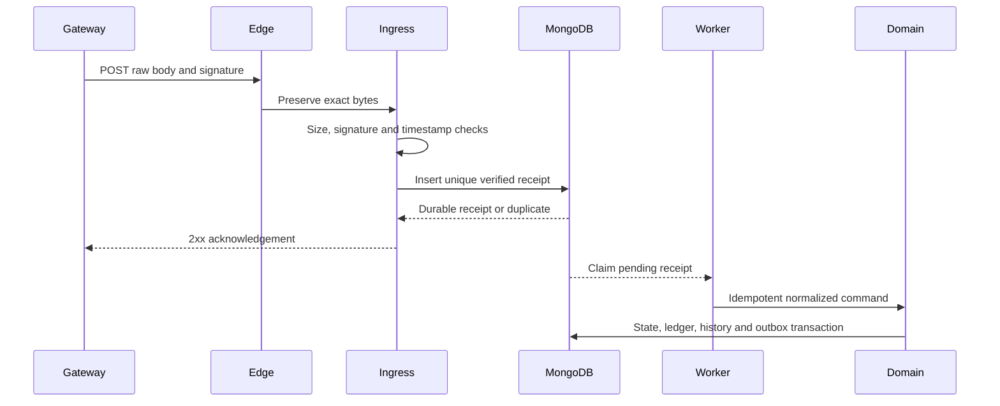
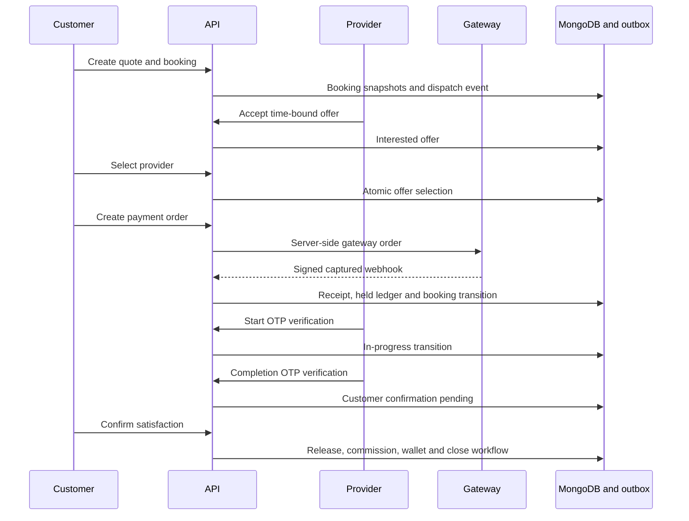
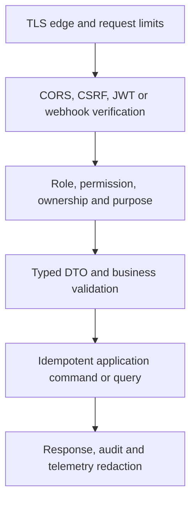

# LocalServe Marketplace — Phase 4 API Design

**Document ID:** LS-API-004  
**Version:** 1.0.0  
**Status:** Phase 4 baseline candidate  
**Date:** 2026-08-06  
**Parent specifications:** `LOCAL_SERVE_PRODUCT_SPECIFICATION.md` v1.0.1, `PHASE_2_SYSTEM_ARCHITECTURE.md` v1.0.0, and `PHASE_3_DATABASE_DESIGN.md` v1.0.0  
**REST base path:** `/api/v1`  
**REST media types:** `application/json` and `application/problem+json`, UTF-8  
**Real-time endpoint:** `/ws` using Spring WebSocket/STOMP; SockJS is an optional web fallback

---

## 1. Purpose and API contract

This document freezes the externally visible REST, webhook, and WebSocket contracts that Phases 5–14 implement. It defines resource paths, methods, authentication, authorization, request/response DTOs, validation, pagination, sorting, idempotency, concurrency, rate limits, errors, webhook security, STOMP destinations, OpenAPI organization, compatibility, and testable acceptance criteria.

API DTOs are not MongoDB documents. Controllers map validated DTOs to application commands/queries; application services own policy, state transitions, transactions, and authorization; persistence adapters own documents described in Phase 3.

### 1.1 Inherited non-negotiable registers

| Register | Frozen values/rule |
|---|---|
| Public roles | `CUSTOMER`, `PROVIDER`; a public identity may hold both but uses one active context |
| Administrative identity | `ADMIN` uses a separate account lifecycle, audience, origin, routes, and sessions; no public registration |
| Booking statuses | `CREATED`, `SEARCHING_PROVIDERS`, `PROVIDERS_FOUND`, `PROVIDER_SELECTED`, `PAYMENT_PENDING`, `PAYMENT_COMPLETED`, `PROVIDER_ASSIGNED`, `PROVIDER_ON_THE_WAY`, `PROVIDER_ARRIVED`, `START_OTP_PENDING`, `IN_PROGRESS`, `COMPLETION_PENDING`, `CUSTOMER_CONFIRMATION_PENDING`, `COMPLETED`, `DISPUTED`, `CANCELLED`, `REFUNDED`, `CLOSED` |
| Payment statuses | `CREATED`, `PENDING`, `AUTHORIZED`, `CAPTURED`, `HELD`, `RELEASE_PENDING`, `RELEASED`, `PARTIALLY_REFUNDED`, `REFUNDED`, `FAILED`, `CANCELLED`, `DISPUTED`, `FROZEN` |
| Provider offers | `PENDING`, `ACCEPTED_BY_PROVIDER`, `REJECTED_BY_PROVIDER`, `SELECTED_BY_CUSTOMER`, `EXPIRED`, `WITHDRAWN`, `NOT_SELECTED` |
| Provider verification | `DRAFT`, `SUBMITTED`, `UNDER_REVIEW`, `MORE_INFORMATION_REQUIRED`, `APPROVED`, `REJECTED`, `SUSPENDED`, `EXPIRED` |
| Disputes | `OPEN`, `EVIDENCE_COLLECTION`, `UNDER_REVIEW`, `CUSTOMER_RESPONSE_REQUIRED`, `PROVIDER_RESPONSE_REQUIRED`, `RESOLVED_REFUND`, `RESOLVED_PARTIAL_REFUND`, `RESOLVED_RELEASE`, `CLOSED`, `APPEALED` |
| Payouts | `REQUESTED`, `UNDER_REVIEW`, `APPROVED`, `PROCESSING`, `PAID`, `FAILED`, `REVERSED`, `REJECTED`, `FROZEN` |
| Notification delivery | `QUEUED`, `SCHEDULED`, `SENT`, `DELIVERED`, `READ`, `FAILED`, `DEAD_LETTERED`, `CANCELLED` |
| IDs | Lowercase canonical UUIDv7 strings; MongoDB `_id` is never exposed |
| Money | Signed 64-bit integer `amountMinor` plus ISO 4217 `currency`; no floating-point money |
| Time | ISO-8601 UTC instants; schedules also carry IANA `timeZone` |
| Location | GeoJSON `[longitude, latitude]`; precision is reduced unless exact disclosure is authorized |
| Correlation | `X-Correlation-Id`; server generates a UUIDv7 when absent/invalid and returns it |
| Idempotency | `Idempotency-Key` on all retry-sensitive commands; frontend payment success is never authoritative |

### 1.2 Capability boundary

The API supports a complete final-year demonstration with real backend security/state/ledger/idempotency logic and sandbox adapters. A response never claims live KYC, police verification, face match, legal escrow, payment settlement, SMS/WhatsApp delivery, or production scale when the configured adapter is simulated. Integration status uses one of:

| Status | Meaning |
|---|---|
| `IMPLEMENTED_AND_TESTED` | Core logic is executable with automated evidence |
| `SANDBOX_INTEGRATED` | A real provider sandbox/test adapter and signed callbacks are exercised |
| `SIMULATED_BEHIND_REAL_PORT` | A deterministic non-production adapter implements the production interface |
| `ARCHITECTURE_READY` | Contract exists, but the external capability is not represented as executed |

---

## 2. HTTP and resource conventions

### 2.1 URI rules

- Paths use lower-case plural nouns and hyphens: `/customer/bookings/{bookingId}/cancellation-preview`.
- The active role is explicit in protected route roots: `/customer`, `/provider`, or `/admin`; a role cannot cross roots merely by changing a path.
- Child resources are nested only when ownership/authorization is essential. Deep nesting beyond two resource relationships is avoided.
- Commands that are not natural CRUD resources use named command subresources, such as `/provider/bookings/{id}/arrival` or `/admin/refund-proposals/{id}/approval`.
- Identifiers in paths are UUIDv7 except stable slugs/codes explicitly documented.
- Query strings are for reads only. Secrets, tokens, OTPs, exact addresses, signed URLs, and payment data never appear in a URL.
- A trailing slash is normalized by the edge or rejected consistently; canonical OpenAPI paths have no trailing slash.

### 2.2 Request headers

| Header | Required | Contract |
|---|---|---|
| `Authorization: Bearer <JWT>` | Protected API | Short-lived access JWT with correct issuer, audience, session, role/context, and permission version |
| `Content-Type` | Body requests | `application/json`; upload completion is JSON; file bytes use presigned object storage, not the API process |
| `Accept` | Recommended | `application/json`; errors may be `application/problem+json` |
| `X-Correlation-Id` | Optional | Valid UUID; untrusted value is replaced when invalid; returned on every response |
| `Idempotency-Key` | Required where marked | 16–128 printable ASCII characters; UUIDv7 recommended; scoped to principal, method, canonical route, and operation |
| `If-Match` | Required where marked | Strong entity tag form `"v<version>"`, for example `"v7"` |
| `X-CSRF-Token` | Web refresh/logout/account-link flows | Double-submit or server-bound token coupled with Origin validation when refresh credential is a cookie |
| `Accept-Language` | Optional | BCP 47 locale from supported allowlist; fallback is account/platform default |
| `X-Device-Id` | Authentication/device operations | App-generated random installation ID; not a hardware identifier; normalized and risk-scoped |
| `User-Agent` | Standard | Stored only as a safe parsed summary for security/session history |

Unknown client headers are ignored unless blocked by the edge. Proxy-controlled identity headers are stripped at the trust boundary.

### 2.3 Response headers

| Header | Use |
|---|---|
| `X-Correlation-Id` | Every response |
| `Location` | `201 Created` resource URI |
| `ETag: "v<version>"` | Mutable aggregate reads |
| `Cache-Control` | `no-store` for auth/private/financial/location; public catalog/provider content uses explicit short cache plus revalidation |
| `Vary` | `Authorization`, `Accept-Language`, `Origin`, or encoding where applicable |
| `RateLimit-Limit`, `RateLimit-Remaining`, `RateLimit-Reset` | Rate-limited endpoints; values do not reveal another principal's policy |
| `Retry-After` | `429`, overload, or temporary asynchronous retry guidance |
| `Deprecation`, `Sunset`, `Link` | Published deprecation workflow |
| Security headers | CSP, HSTS in HTTPS production, frame restrictions, referrer/permissions policy, MIME sniffing protection |

### 2.4 Successful response envelope

Single resources and command results use:

```json
{
  "data": {
    "id": "0191265e-8c2f-7a1b-8d90-22ac9e464001",
    "status": "CREATED",
    "version": 1
  },
  "meta": {
    "correlationId": "0191265e-8c2f-7a1b-8d90-22ac9e468010",
    "timestamp": "2026-08-06T12:08:00Z"
  }
}
```

Collections use `data` as an array plus pagination metadata. `204 No Content` has no body. A command that starts a durable asynchronous operation returns `202 Accepted` with an `OperationResponse`, `Location`, and safe polling interval.

### 2.5 Status-code contract

| Status | Meaning |
|---:|---|
| `200` | Successful read, idempotent replay, or command returning an existing/current representation |
| `201` | New durable resource created |
| `202` | Accepted asynchronous work; not proof of downstream completion |
| `204` | Successful delete/revoke/read-state command with no response body |
| `304` | Public/revalidatable resource unchanged |
| `400` | Malformed JSON/header/query or syntactically invalid request |
| `401` | Missing/invalid/expired authentication or reauthentication required |
| `403` | Authenticated but role/permission/ownership/purpose/step-up policy denies action |
| `404` | Resource absent or deliberately concealed from an unauthorized principal |
| `409` | Domain/state/idempotency/resource conflict |
| `412` | `If-Match` precondition failed |
| `413` | Request/file exceeds approved size |
| `415` | Unsupported media/file type |
| `422` | Well-formed input violates semantic/business validation |
| `423` | Resource/account/financial amount is intentionally locked/frozen |
| `428` | Required precondition such as `If-Match` or idempotency key is absent |
| `429` | Rate limit exceeded |
| `503` | Required dependency/unavailable safe path; no fabricated result |

### 2.6 Common response schemas

| Schema | Required fields |
|---|---|
| `ApiMeta` | `correlationId`, `timestamp`; optional `requestId`, `warnings[]` |
| `CursorPageMeta` | `limit`, `hasNext`, nullable `nextCursor`; optional `snapshotAt`, `totalEstimate` only when cheap/safe |
| `PageMeta` | `page`, `size`, `totalElements`, `totalPages`; bounded admin datasets only |
| `Money` | `amountMinor: int64`, `currency: ISO-4217` |
| `MoneyBreakdown` | `subtotal`, `discount`, `promotionalCredit`, `convenienceFee`, `emergencyFee`, `cancellationFee`, `tax`, `total`; every item is `Money` |
| `GeoPointInput` | `type: "Point"`, `coordinates: [longitude, latitude]`, optional `accuracyMeters`, `observedAt` |
| `MaskedContact` | `emailMask`, `phoneMask`; never a full contact unless a specific disclosure policy succeeds |
| `ResourceRef` | `id`, optional `displayName`; no persistence internals |
| `OperationResponse` | `id`, `type`, `status`, `submittedAt`, nullable `completedAt`, `resourceUrl`, `resultSummary`, `failureCode` |
| `CapabilityStatus` | `capability`, one of the four capability statuses, `provider`, `lastCheckedAt`, safe `message` |

---

## 3. Error contract and catalogue

### 3.1 Problem Details envelope

All REST errors use `application/problem+json`:

```json
{
  "type": "https://api.localserve.example/problems/booking-invalid-transition",
  "title": "Booking transition is not allowed",
  "status": 409,
  "code": "BOOKING.INVALID_TRANSITION",
  "detail": "The booking cannot move from PAYMENT_PENDING to IN_PROGRESS.",
  "instance": "/api/v1/provider/bookings/0191265e-8c2f-7a1b-8d90-22ac9e464001/start-verifications",
  "correlationId": "0191265e-8c2f-7a1b-8d90-22ac9e468010",
  "timestamp": "2026-08-06T12:08:00Z",
  "violations": [],
  "currentVersion": 8,
  "currentState": "PAYMENT_PENDING",
  "retryable": false
}
```

`detail` is safe and localized only when stable client behavior does not depend on it; clients depend on `code`. Stack traces, classes, queries, raw gateway bodies/errors, provider secrets, tokens, OTPs, document numbers, exact unauthorized locations, and internal account IDs never appear.

### 3.2 Validation violations

Each violation has `code`, JSON Pointer `path`, safe `message`, and optional safe `rejectedValue`. Passwords, OTPs, tokens, identity numbers, bank/UPI data, free-form evidence/chat, exact addresses, and file contents are always omitted or replaced with `[REDACTED]`.

```json
{
  "code": "VALIDATION.FAILED",
  "path": "/estimatedPrice/amountMinor",
  "message": "must be between 10000 and 5000000"
}
```

### 3.3 Stable error-code catalogue

| Namespace | Representative stable codes | HTTP |
|---|---|---|
| Request | `REQUEST.MALFORMED`, `REQUEST.UNSUPPORTED_MEDIA_TYPE`, `VALIDATION.FAILED`, `PRECONDITION.REQUIRED`, `PRECONDITION.VERSION_MISMATCH` | 400/415/422/428/412 |
| Authentication | `AUTH.INVALID_CREDENTIALS`, `AUTH.TOKEN_EXPIRED`, `AUTH.REFRESH_REUSE_DETECTED`, `AUTH.OTP_INVALID`, `AUTH.OTP_EXPIRED`, `AUTH.OTP_ATTEMPTS_EXCEEDED`, `AUTH.MFA_REQUIRED`, `AUTH.STEP_UP_REQUIRED`, `AUTH.CSRF_INVALID` | 401/403/429 |
| Account | `ACCOUNT.SUSPENDED`, `ACCOUNT.BANNED`, `ACCOUNT.DELETION_PENDING`, `ACCOUNT.LOGIN_METHOD_REQUIRED`, `SESSION.NOT_FOUND` | 403/409/404 |
| Authorization | `ACCESS.DENIED`, `ACCESS.ROLE_CONTEXT_REQUIRED`, `ACCESS.OWNERSHIP_REQUIRED`, `ACCESS.PURPOSE_REQUIRED`, `ACCESS.DISCLOSURE_NOT_ALLOWED` | 403/404 |
| Catalog/search | `CATALOG.NOT_FOUND`, `SEARCH.QUERY_TOO_BROAD`, `SERVICE.NOT_AVAILABLE`, `LOCATION.STALE`, `LOCATION.OUTSIDE_SERVICE_AREA` | 404/422/503 |
| Provider | `PROVIDER.NOT_APPROVED`, `PROVIDER.OFFLINE`, `PROVIDER.DOCUMENT_EXPIRED`, `PROVIDER.CAPACITY_EXCEEDED`, `OFFER.EXPIRED`, `OFFER.ALREADY_DECIDED` | 403/409/422 |
| Booking | `BOOKING.NOT_FOUND`, `BOOKING.INVALID_TRANSITION`, `BOOKING.VERSION_CONFLICT`, `BOOKING.OFFER_NOT_SELECTABLE`, `BOOKING.CANCELLATION_NOT_ALLOWED`, `BOOKING.RESCHEDULE_NOT_ALLOWED`, `BOOKING.OTP_PURPOSE_MISMATCH` | 404/409/412/422 |
| Payment | `PAYMENT.QUOTE_EXPIRED`, `PAYMENT.AMOUNT_MISMATCH`, `PAYMENT.ALREADY_CAPTURED`, `PAYMENT.SIGNATURE_INVALID`, `PAYMENT.RECONCILIATION_REQUIRED`, `PAYMENT.GATEWAY_UNAVAILABLE` | 409/422/400/503 |
| Finance | `FUNDS.FROZEN`, `FUNDS.INSUFFICIENT_AVAILABLE`, `REFUND.AMOUNT_EXCEEDS_AVAILABLE`, `PAYOUT.DESTINATION_COOLING`, `PAYOUT.DUAL_APPROVAL_REQUIRED`, `LEDGER.INVARIANT_VIOLATION` | 409/422/423/503 |
| File | `FILE.TYPE_NOT_ALLOWED`, `FILE.SIZE_EXCEEDED`, `FILE.CHECKSUM_MISMATCH`, `FILE.QUARANTINED`, `FILE.SCAN_FAILED`, `FILE.ACCESS_DENIED` | 413/415/409/423/403 |
| Communication | `CHAT.NOT_AVAILABLE`, `CHAT.MESSAGE_DUPLICATE`, `CHAT.PARTICIPANT_REQUIRED`, `REALTIME.TICKET_INVALID`, `REALTIME.SUBSCRIPTION_DENIED` | 409/403/401 |
| Review/coupon | `REVIEW.NOT_ELIGIBLE`, `REVIEW.ALREADY_EXISTS`, `COUPON.NOT_ELIGIBLE`, `COUPON.BUDGET_EXHAUSTED`, `COUPON.ALREADY_USED` | 409/422 |
| Case/support | `DISPUTE.WINDOW_CLOSED`, `DISPUTE.ALREADY_OPEN`, `DISPUTE.RESOLUTION_CONFLICT`, `SUPPORT.TRANSITION_NOT_ALLOWED` | 409/422 |
| Idempotency/rate | `IDEMPOTENCY.KEY_REQUIRED`, `IDEMPOTENCY.PAYLOAD_MISMATCH`, `IDEMPOTENCY.IN_PROGRESS`, `RATE_LIMIT.EXCEEDED` | 428/409/429 |
| Integration | `INTEGRATION.UNAVAILABLE`, `WEBHOOK.SIGNATURE_INVALID`, `WEBHOOK.REPLAY_REJECTED`, `WEBHOOK.PAYLOAD_INVALID` | 400/409/503 |

Unexpected errors return `INTERNAL.UNEXPECTED` with a correlation ID and no internal detail. Ledger invariant failure, uncertain payout, or inconsistent verified payment fails closed, alerts operations, and returns a safe retry/non-retry decision.

---

## 4. Authentication and authorization contract

### 4.1 OpenAPI security schemes

| Scheme | OpenAPI type | Applies to |
|---|---|---|
| `PublicAccessToken` | HTTP bearer JWT | `/customer`, `/provider`, `/files`, `/realtime`; audience `localserve-api` |
| `AdminAccessToken` | HTTP bearer JWT | `/admin`; audience `localserve-admin-api`, admin principal only |
| `RefreshCookie` | Secure HttpOnly cookie | Web refresh/logout; host-only cookie and CSRF/Origin validation |
| `MobileRefreshToken` | Opaque bearer in JSON body over TLS | Mobile refresh only; held in platform secure storage, never logged |
| `RazorpayWebhookSignature` | `apiKey` header | Raw Razorpay webhook ingress |
| `StripeWebhookSignature` | `apiKey` header | Raw Stripe webhook ingress |
| `ServiceIdentity` | mTLS/workload identity | Non-public operational endpoints; not accepted from internet edge |

JWT claims are minimal: `iss`, `sub`, `aud`, `iat`, `exp`, `jti`, `sid`, `roles`, `active_role`, `permission_version`, `auth_time`, and `acr`. Authorization never trusts user IDs, role names, prices, states, or permissions supplied in a request body.

### 4.2 Role and ownership policy

| Route root | Required context | Additional policy |
|---|---|---|
| `/public` | Anonymous or authenticated | Published/safe data only; stricter anonymous rate limits |
| `/auth` | Anonymous/session-specific | Anti-enumeration, CSRF where cookie involved, brute-force controls |
| `/account` | Authenticated public identity | Own profile, login methods, sessions, devices, security activity, deletion; no admin principal |
| `/customer` | `CUSTOMER` active role | Customer owns resource or is authorized booking participant |
| `/provider` | `PROVIDER` active role | Approved/status/skill/booking relationship checked per operation |
| `/admin` | Separate admin token | Explicit permission, purpose, step-up, and maker-checker where marked |
| `/files` | Authenticated role/admin | File owner/purpose/status/classification and booking/case relationship |
| `/realtime` | Authenticated role/admin | Single-use ticket bound to session, origin, active role, allowed channel class |
| `/integrations/webhooks` | Provider signature | Raw body verification, IP signals only as defense-in-depth, deduplication |

Public/provider/customer resources use concealed `404` where revealing existence would leak private data. A provider cannot access customer routes with provider context, and an admin JWT cannot be used as a public user token.

### 4.3 Permission catalogue for admin APIs

| Domain | Permission codes |
|---|---|
| Dashboard/analytics | `admin.dashboard.read`, `analytics.read`, `analytics.export` |
| Customer | `customer.read`, `customer.status.manage`, `customer.deletion.manage`, `customer.export` |
| Provider | `provider.read`, `provider.status.manage`, `provider.ranking.manage`, `provider.export` |
| Verification/files | `provider.verification.read`, `provider.verification.review`, `identity.document.view`, `identity.document.export` |
| Booking/location | `booking.read`, `booking.manage`, `location.restricted.read` |
| Payment/ledger/refund | `payment.read`, `ledger.read`, `payment.refund.propose`, `payment.refund.approve`, `payment.release.manage`, `finance.adjustment.propose`, `finance.adjustment.approve` |
| Payout/reconciliation | `payout.read`, `payout.approve`, `payout.reject`, `reconciliation.read`, `reconciliation.manage` |
| Dispute | `dispute.read`, `dispute.manage`, `dispute.internal-note`, `dispute.resolve.propose`, `dispute.resolve.approve` |
| Support | `support.read`, `support.manage`, `support.internal-note` |
| Catalog/growth/content | `catalog.read`, `catalog.manage`, `coupon.read`, `coupon.manage`, `notification.template.manage`, `campaign.manage`, `cms.manage` |
| Administration | `admin.user.read`, `admin.user.manage`, `admin.role.read`, `admin.role.manage` |
| Governance/operations | `audit.read`, `audit.export`, `settings.read`, `settings.manage`, `feature-flag.read`, `feature-flag.manage`, `monitoring.read`, `failed-job.manage` |

Read permission never implies mutation. Internal notes, restricted location, identity document, ledger, and export permissions are independent of broader case/user access.

### 4.4 Step-up and maker-checker

Recent step-up (`acr` and `auth_time` policy) is required for:

- Admin role/permission changes, admin MFA changes, privileged exports, identity-document access, payout/refund/release approval, finance adjustments, restricted-location access, feature kill switches, and high-impact settings.
- Public user payout-destination change, password/login-method change, account deletion confirmation, and logout-all if risk policy requires it.

Above configured money/risk thresholds, one admin creates an immutable proposal and a different eligible admin approves/rejects it. The API compares actor IDs and proposal version; same-actor approval returns `403`. Emergency override uses a separate permission, reason/evidence, shorter step-up, alert, and post-action review—it never writes arbitrary database state.

### 4.5 Data masking and field authorization

- Provider discovery never returns precise provider coordinates, private contact, home address, identity number, payout information, or document objects.
- An unselected provider sees approximate zone/distance and request requirements; exact customer address/contact appears only after selection, payment/assignment, and disclosure policy.
- Customer payment responses show brand/type, last safe digits/reference mask, and status—not raw card, UPI PIN, bank credential, gateway secret, or internal ledger account.
- Normal admin lists are masked. Restricted details require a purpose code, permission, recent step-up, short-lived response/link, and an audit record.
- Internal notes and moderation/risk signals use distinct schemas and are never embedded in external comments or public responses.

---

## 5. Cross-cutting command and query rules

### 5.1 Idempotency

Endpoints marked `I` require `Idempotency-Key`. The server stores request method, normalized route, principal, active role, request-body hash, response status/body reference, resource ID, and expiry in `idempotency_records`.

| Condition | Result |
|---|---|
| First valid request | Claim key atomically, execute once, persist terminal response |
| Same key + same normalized payload after completion | Replay original safe response with `Idempotent-Replayed: true` |
| Same key + different payload/target | `409 IDEMPOTENCY.PAYLOAD_MISMATCH` |
| Same operation still running | `409 IDEMPOTENCY.IN_PROGRESS` plus bounded retry guidance |
| Worker/gateway outcome uncertain | Return operation/current state; never retry money movement blindly |

Default retention is 24 hours for ordinary commands and at least the relevant gateway/retry/reconciliation window for payment, refund, payout, coupon, and dispute commands. Redis may accelerate lookup; MongoDB is authoritative.

### 5.2 Optimistic concurrency

Mutable aggregate reads return `ETag: "v<version>"`. Commands marked `V` require `If-Match`; the application and MongoDB predicate compare the expected version. A stale version returns `412 PRECONDITION.VERSION_MISMATCH` with safe `currentVersion` and `currentState`. Idempotency prevents duplicate intent; versioning prevents lost/racing updates. Both are required on high-risk commands.

### 5.3 Cursor pagination

High-volume feeds use opaque, authenticated/signed, base64url cursor tokens containing sort keys, filters hash, direction, snapshot time, and expiry. Clients cannot construct or modify cursors.

```json
{
  "data": [],
  "meta": {
    "correlationId": "0191265e-8c2f-7a1b-8d90-22ac9e468010",
    "timestamp": "2026-08-06T12:08:00Z",
    "page": {
      "limit": 20,
      "hasNext": true,
      "nextCursor": "eyJ2IjoxLCJrIjoiLi4uIn0",
      "snapshotAt": "2026-08-06T12:08:00Z"
    }
  }
}
```

- Default/maximum sizes: customer/provider feeds 20/100, chat 50/100, audit 50/200, bounded admin pages 25/100.
- Changing a filter, sort, role, or principal invalidates the cursor.
- Stable tie-breaker is public `id`; forward pagination is default. Chat may support `beforeCursor` for older messages.
- Exact totals are omitted on hot feeds. Bounded admin lists may use `page`/`size` and totals; exports are asynchronous.

### 5.4 Filtering and sorting

- Each endpoint has an allowlist; arbitrary Mongo field names/operators are rejected.
- Repeated values use repeated query parameters, for example `status=COMPLETED&status=CLOSED`.
- Text query `q` is normalized, Unicode-safe, bounded to 2–100 characters, and never interpreted as regex supplied by the client.
- Date filters are inclusive `from` and exclusive `to`, maximum range per endpoint, and always UTC instants.
- Sort syntax is `sort=<field>,<asc-or-desc>`; only documented fields are accepted. Default tie-breaker `id` is applied server-side.
- Geo filters have server-set radius caps; client coordinates are range/accuracy checked and never interpolated into a query expression.

### 5.5 Rate-limit classes

| Class | Examples | Baseline per principal/IP/device | Failure mode |
|---|---|---|---|
| `AUTH_CRITICAL` | Login, reset, refresh, MFA | 5–20 per 15 min plus progressive backoff/global defense | Fail closed |
| `OTP_SEND` | OTP/email verification send | 3 per 15 min, 10/day per subject plus IP/device/global limits | Fail closed |
| `OTP_VERIFY` | Phone/booking OTP verify | 5 attempts per challenge plus account/device limits | Lock/consume challenge |
| `MONEY_COMMAND` | Payment/refund/withdrawal/payout approval | 10–30/min plus idempotency/risk limits | Fail closed |
| `BOOKING_COMMAND` | Create/select/cancel/reschedule/status commands | 10–60/min by command risk | Fail closed or safe retry |
| `SEARCH_READ` | Search/catalog/provider cards | Auth 120/min, anonymous 60/min; caching/bot controls | Bounded degrade |
| `CHAT_DURABLE` | Send message | 30/min and attachment/content limits | Reject excess |
| `REALTIME_EPHEMERAL` | Typing/location/presence | Typing 1/2s; location policy 1–5/s with coalescing | Sample/drop ephemeral only |
| `UPLOAD` | Create/complete upload | Count and bytes per hour/day/purpose | Fail closed |
| `ADMIN_READ` | Admin queues/search | 120/min plus query-cost/export controls | Reject/async export |
| `ADMIN_MUTATION` | Decisions/configuration | 30/min plus step-up/maker-checker | Fail closed |
| `WEBHOOK` | Provider callbacks | High bounded edge/service quota plus signature/replay control | Durable receipt or safe retry |

Numbers are launch defaults, not guarantees. Typed settings may lower them by environment/risk, but cannot disable critical controls silently. Responses use rate-limit headers and `429` with jittered `Retry-After`.

### 5.6 Safe retries, timeouts, and asynchronous operations

- GET/HEAD may be retried with bounded exponential backoff and jitter. POST/PATCH commands are retried only with the same idempotency key.
- Edge and application timeouts are lower than upstream timeouts and never allow unbounded calls. Map/search may degrade; booking/payment writes return a verifiable state/operation when outcome is uncertain.
- Invoice generation, exports, bulk notification, reconciliation, deletion, large analytics, verification adapter checks, and selected admin reports return an operation resource.
- Operation polling is owner/permission scoped. Completion notifications may arrive through STOMP, but clients reconcile with REST.

### 5.7 File upload protocol

1. Client requests an upload session with purpose, declared filename/MIME/size/checksum and intended owner/resource.
2. Server validates role, ownership, purpose, quota, extension/MIME allowlist, expected size/count, and returns a short-lived private object-storage upload instruction.
3. Client uploads directly to private object storage.
4. Client calls completion with checksum/ETag. Server verifies object, signature bytes, size, checksum, ownership and moves it to quarantine.
5. Scan/metadata stripping/transform occurs asynchronously. Only `AVAILABLE` purpose-authorized files may be linked/viewed.
6. Read access uses a purpose-bound, short-lived signed download response generated after authorization and audit. Signed URLs are never durable API fields or events.

### 5.8 Reusable validation limits

| Field | Rule |
|---|---|
| Names/labels | Trimmed Unicode, 1–100 characters; control/bidi abuse rejected; output encoded |
| Email | Normalized for lookup, maximum 254; verification required for email login |
| Phone | E.164, allowed launch countries, verified before phone login/disclosure |
| Password | 12–128 Unicode code points, breached-password check when configured; no silent truncation |
| OTP | 6 digits for configured flow, 5-minute default, purpose-bound, maximum attempts |
| Free text | Problem 1–2,000; review 1–2,000; chat 1–4,000; dispute/support 1–5,000; sanitized for rendering, not destructively rewritten |
| UUID | Canonical lowercase UUIDv7 |
| Currency | Launch allowlist; `INR` initially; immutable per financial aggregate |
| Money | `int64`, nonnegative unless schema explicitly permits signed adjustment; endpoint/policy min/max |
| Rating | Integer 1–5 |
| Radius | Positive meters; public search maximum 50 km and provider service radius policy maximum |
| Coordinates | Longitude −180..180, latitude −90..90, realistic accuracy, timestamp skew/sequence policy |
| Date range | `from < to`; endpoint maximum; scheduled time respects service lead/horizon and zone timezone |
| Arrays | Explicit maximum count; duplicates rejected or normalized deterministically |
| URLs/slugs | Server-created/allowlisted schemes and hosts; no client-controlled redirect/storage URL |

---

## 6. Reusable API schemas

### 6.1 Identity and session DTOs

| Schema | Fields and validation |
|---|---|
| `CustomerRegistrationRequest` | `email?`, `phone?`, `password`, `displayName`, `acceptedTermsVersion`, `locale`, `timeZone`, `marketingConsent`; at least email or phone; password required unless verified OAuth bootstrap |
| `ProviderRegistrationRequest` | Customer fields plus `businessDisplayName`, `primaryServiceZoneId`; creates public identity plus `PROVIDER` onboarding context, never approval |
| `PasswordLoginRequest` | `login` (email/phone), `password`, `rememberMe`, `device: DeviceInput`; anti-enumeration response |
| `OtpChallengeRequest` | `phone`, `purpose`, `device`, optional `captchaToken`; purpose allowlist |
| `OtpVerificationRequest` | `challengeId`, `code`, `rememberMe`, `device` |
| `TokenResponse` | `accessToken`, `tokenType: Bearer`, `expiresInSeconds`, `session`, `roles`, `activeRole`; web refresh token stays cookie-only |
| `RefreshRequest` | Web: CSRF header, no token body; mobile: `refreshToken`, `deviceId` |
| `SessionResponse` | `id`, `deviceName`, `platform`, `browserOrApp`, `approximateRegion`, `createdAt`, `lastSeenAt`, `current`, `remembered`, `riskStatus`; no raw IP/token |
| `UserSummaryResponse` | `id`, `displayName`, masked contacts and verification, `roles`, `activeRole`, `accountStatus`, locale/timezone, onboarding state |
| `MfaVerificationRequest` | `challengeId`, one of `totpCode` or `recoveryCode`; never both |
| `StepUpResponse` | `expiresAt`, `acr`, `allowedActionClasses`; reflected in a newly issued short access token/session proof, not a URL token |

### 6.2 Catalog, provider, location, and address DTOs

| Schema | Fields and validation |
|---|---|
| `CategoryResponse` | `id`, `slug`, localized `name`, `description`, safe icon/media, `displayOrder`, child summary |
| `ServiceResponse` | `id`, category/subcategory refs, slug/name/description, duration guidance, booking types, requirements, evidence rules, public price guidance, zone availability |
| `ProviderCardResponse` | `id`, public name/avatar, verified badges/skills, experience years, rating/weighted rating/count, estimated price range, approximate distance, ETA/next availability, service area label, availability freshness; no precise point/contact |
| `ProviderProfileResponse` | Card fields plus public bio, service list/prices, certificates safe summaries, rating distribution, review preview and policy-safe service area |
| `AddressInput` | `type` is `HOME`, `WORK`, or `OTHER`; `label`, encrypted-at-rest address fields, locality, postalCode, `point`, `placeProviderRef?`, `instructions?`, `isDefault`; serviceability checked server-side |
| `AddressResponse` | Public ID, masked/role-authorized formatted address, point precision appropriate to owner, zone/serviceability/accuracy, label/default, version |
| `LocationUpdateRequest` | `point`, `accuracyMeters`, `observedAt`, `sequence`, `trackingSessionId`, optional safe device integrity signals; sequence strictly increases |
| `EtaResponse` | `durationSeconds`, `distanceMeters`, `calculatedAt`, `source`, `confidence`, `stale`, optional safe fallback message |

### 6.3 Booking and offer DTOs

| Schema | Fields and validation |
|---|---|
| `BookingQuoteRequest` | `serviceId`, `bookingType`, `addressId` or one-time `AddressInput`, schedule, bounded `problemDescription`, `attachmentIds[]`, optional `couponCode`, credit intent; no client price |
| `BookingQuoteResponse` | `quoteId`, service/zone/schedule snapshots, `MoneyBreakdown`, policy/cancellation/settlement summary, `expiresAt`, `pricingVersion`, serviceability and required acknowledgements |
| `CreateBookingRequest` | `quoteId`, selected address reference/snapshot confirmation, `problemDescription`, attachment IDs, acknowledgement codes; immutable price comes from quote |
| `BookingSummaryResponse` | `id`, bookingType, service summary, status, schedule, provider/customer safe counterpart, money summary, nextActions, createdAt/updatedAt, version |
| `BookingDetailResponse` | Summary plus policy-safe address, problem/evidence summaries, offer/assignment, payment summary, OTP purpose status (never code/hash), timeline preview, contact-disclosure state |
| `ProviderOfferDecisionRequest` | Accept: `estimatedPrice: Money`, bounded line-item explanation, `etaSeconds`, optional note; reject: `reasonCode`; offer/booking versions checked |
| `OfferResponse` | `id`, booking/provider card, status, price estimate/breakdown, ETA, conditions, expiresAt, versions; customer sees accepted offers, provider sees own |
| `SelectOfferRequest` | `offerId`, required acknowledgements; server verifies accepted/unexpired/owned and atomically expires others |
| `CancellationPreviewRequest` | `reasonCode`, optional safe statement; response calculates eligibility, fees/refund/payout effects and expiry |
| `CancellationRequest` | `previewId`, `reasonCode`, optional statement/evidence IDs; server recomputes before commit |
| `ReschedulePreviewRequest` | Desired schedule and reason; response includes provider reconfirm/redispatch and price/policy effects |
| `OtpVerificationCommand` | `challengeId`, `code`; route fixes booking and purpose; idempotent, attempt-limited |
| `SatisfactionConfirmationRequest` | `satisfied: true`, optional completion note; dissatisfaction uses dispute workflow, not `false` auto-release |

### 6.4 Payment and finance DTOs

| Schema | Fields and validation |
|---|---|
| `PaymentOrderRequest` | `bookingId`, `quoteId`; `gateway` is `RAZORPAY`, `STRIPE`, or `PROMOTIONAL_CREDIT`; safe return-context token; server owns amount/currency |
| `PaymentOrderResponse` | `paymentId`, `attemptId`, gateway public order/session data allowlist, amount/currency, status, `expiresAt`; never secret or success assertion |
| `PaymentResponse` | Payment/booking IDs, gateway type, status, captured/held/released/refunded amounts, safe method/ref masks, attempts, timestamps, reconciliation state |
| `WalletResponse` | Owner/type, pending/available/frozen/payout-clearing/paid-out or promotional components, currency, as-of/reconciled time; no arbitrary transfer action |
| `WithdrawalRequest` | `amount: Money`, verified `destinationId`; min/max/available/cooling/risk policy |
| `RefundRequest` | Customer request: reason/amount preference/evidence; admin proposal: exact amount, reason, policy/evidence; final amount server-bounded |
| `FinanceProposalResponse` | `id`, action type, target refs, amount, reason, maker, state, approval requirement, version, audit summary; no editable ledger lines from client |
| `TransactionLineResponse` | User-facing type, amount, direction, booking/payment/payout safe refs, status, occurredAt, balance-after when projection verified |

### 6.5 File, communication, review, case, and notification DTOs

| Schema | Fields and validation |
|---|---|
| `CreateUploadSessionRequest` | `purpose`, `ownerType`, `ownerId`, `fileName`, `declaredMimeType`, `sizeBytes`, `sha256`; purpose-specific allowlist/quota |
| `UploadSessionResponse` | Session/file IDs, approved object endpoint/method/required headers, expiry, maximum bytes; private target only |
| `CompleteUploadRequest` | `sha256`, object ETag/version when storage provides it; idempotent completion |
| `FileResponse` | `id`, purpose, safe name/type/size, checksum status, scan/status, createdAt; no object key |
| `MessageCreateRequest` | `clientMessageId` UUID; `type` is `TEXT`, `IMAGE`, `FILE`, or `SYSTEM_ACTION`; bounded content for text, scanned attachment IDs for files, optional reply ID |
| `MessageResponse` | `id`, conversationId, sender safe summary, type/content authorized to participant, attachments safe summaries, sequence, sent/delivered/read timestamps, moderation state |
| `ReviewRequest` | `rating` 1–5, optional text, 0–5 approved review image IDs; booking fixed by route |
| `DisputeCreateRequest` | `categoryCode`, statement; requested outcome is `FULL_REFUND`, `PARTIAL_REFUND`, `RELEASE_REVIEW`, or `OTHER`; optional requested amount, evidence IDs |
| `DisputeResponse` | Case/booking IDs, external status/timeline/deadlines, frozen amount summary, participant submissions, public admin comments, resolution; never internal notes |
| `SupportTicketRequest` | Category, subject, description, priority hint, optional booking/payment IDs and attachment IDs; server owns final priority/SLA |
| `NotificationResponse` | `id`, category, localized title/body safe for recipient, action type/resource ID, delivery/read state, createdAt/expiresAt |

### 6.6 Admin DTOs

| Schema | Fields and validation |
|---|---|
| `AdminActionRequest` | `reasonCode`, human-readable reason, optional evidence/reference IDs, notification policy; target fixed by route |
| `VerificationDecisionRequest` | `decision` is `APPROVE`, `REJECT`, or `REQUEST_MORE_INFORMATION`; reason code/message, required document/action codes; application version required |
| `DisputeResolutionProposalRequest` | Outcome, exact bounded amount, reason code/external explanation/internal rationale/evidence refs; internal rationale never copied outward |
| `ConfigChangeRequest` | Typed value, scope, effective interval, reason, ticket/reference; schema validated and versioned |
| `FeatureFlagChangeRequest` | Typed rules/default, environments, owner, purpose, expiry/review date, reason; emergency kill switch is separate action |
| `ExportRequest` | Export type, allowlisted filters/fields, purpose code; format is `CSV`, `JSON`, or `PDF`; expiry; privileged types require step-up/approval |
| `AuditEventResponse` | Actor/target/action/outcome/time/correlation, redacted before/after, reason/purpose, safe IP/device summary, integrity reference |

---

## 7. Endpoint inventory notation

Every row is part of the Phase 4 contract. `—` means no request body. Query DTOs still undergo allowlist validation.

| Marker | Meaning |
|---|---|
| `I` | `Idempotency-Key` required |
| `V` | `If-Match` version required |
| `S` | Recent step-up authentication required |
| `M` | Maker-checker proposal/approval separation applies |
| `A` | Asynchronous operation may return `202` |
| `P:<code>` | Required admin permission |

Default ownership, active-role, account/status, masking, correlation, audit, and rate-limit controls apply even when a row does not repeat them.

### 7.1 Inventory coverage

| Surface | Operations |
|---|---:|
| Public, authentication, and shared public account | 58 |
| Customer | 92 |
| Provider | 92 |
| Isolated admin | 184 |
| Shared file, asynchronous operation, and real-time ticket | 10 |
| Signed integration webhooks | 5 |
| **Total unique method/path contracts** | **441** |

The count reflects a complete product contract, not 441 controllers to build at once. Phase 5 implements module-oriented controllers and the critical end-to-end vertical slice first; later feature phases expand against these same frozen contracts. Shared policies, DTO components, query objects, command handlers, mappers, errors, security annotations and tests prevent copy-paste implementation.

---

## 8. Public, authentication, and account APIs

### 8.1 Public discovery and content

| ID | Method and path | Access | Request → response | Controls/validation |
|---|---|---|---|---|
| `PUB-001` | `GET /public/bootstrap` | Anonymous | — → locale, public feature/capability, support, minimum-client and catalog-version summary | No secrets/internal flags; short public cache |
| `PUB-002` | `GET /public/categories` | Anonymous | `locale`, `zoneId?` → cursor/page of `CategoryResponse` | Published/effective records only |
| `PUB-003` | `GET /public/categories/{categoryId}` | Anonymous | — → `CategoryResponse` | Published/effective only |
| `PUB-004` | `GET /public/subcategories` | Anonymous | `categoryId`, `locale` → subcategory list | Category required; bounded list |
| `PUB-005` | `GET /public/services` | Anonymous | `q?`, category/subcategory/zone/bookingType filters, cursor, limit, sort → `ServiceResponse[]` | Normalized query; allowlisted sort |
| `PUB-006` | `GET /public/services/{serviceId}` | Anonymous | `zoneId?`, `locale` → `ServiceResponse` | Public price is guidance, not quote |
| `PUB-007` | `GET /public/services/popular` | Anonymous | `zoneId?`, `limit<=20` → safe ranked service summaries | Privacy-minimized aggregation |
| `PUB-008` | `GET /public/categories/trending` | Anonymous | `zoneId?`, `limit<=20` → category summaries | No individual behavior exposed |
| `PUB-009` | `GET /public/search/suggestions` | Anonymous | `q`, `zoneId?`, `limit<=10` → typed service/category suggestions | `q` 2–100; bot/cost limits |
| `PUB-010` | `GET /public/providers` | Anonymous | `serviceId`, zone/approximate point, price/rating/experience/distance/availability filters, cursor, sort → `ProviderCardResponse[]` | Reduced precision; no exact coordinates/contact; max radius |
| `PUB-011` | `GET /public/providers/{providerId}` | Anonymous | `serviceId?`, `zoneId?` → `ProviderProfileResponse` | Approved/public projection only |
| `PUB-012` | `GET /public/providers/{providerId}/reviews` | Anonymous | rating filter, cursor, sort → moderated verified review summaries | Hidden/restricted author identity |
| `PUB-013` | `POST /public/serviceability-checks` | Anonymous | postcode/zone or approximate point plus `serviceId?` → serviceable zone/categories | Rate/cost limited; no address persisted by default |
| `PUB-014` | `GET /public/pages/{slug}` | Anonymous | `locale` → published CMS page | Safe rendered content/CSP; cacheable |
| `PUB-015` | `GET /public/homepage-banners` | Anonymous | locale/zone/audience-safe context → active banner list | Labels promotions; no private targeting fields |
| `PUB-016` | `GET /public/legal-documents/{type}/current` | Anonymous | locale → current terms/privacy/cancellation document/version | Immutable version reference |
| `PUB-017` | `GET /public/platform-status` | Anonymous | — → coarse operational status and incident link | No infrastructure topology/internal metrics |

### 8.2 Public authentication

| ID | Method and path | Access | Request → response | Controls/validation |
|---|---|---|---|---|
| `AUTH-001` | `POST /auth/customer-registrations` | Anonymous | `CustomerRegistrationRequest` → `UserSummaryResponse` plus verification next steps | `I`; registration/abuse limits; `201` |
| `AUTH-002` | `POST /auth/provider-registrations` | Anonymous | `ProviderRegistrationRequest` → user plus provider onboarding summary | `I`; creates `DRAFT`, never approved |
| `AUTH-003` | `POST /auth/password-sessions` | Anonymous | `PasswordLoginRequest` → `TokenResponse` or MFA challenge | Enumeration-safe; `AUTH_CRITICAL` |
| `AUTH-004` | `POST /auth/phone-otp-challenges` | Anonymous | `OtpChallengeRequest` purpose `LOGIN`, `REGISTER`, or `VERIFY_PHONE` → generic challenge summary | `I`; `OTP_SEND`; always safe generic response |
| `AUTH-005` | `POST /auth/phone-otp-verifications` | Anonymous | `OtpVerificationRequest` → `TokenResponse` or verification result | `I`; `OTP_VERIFY`; challenge consumed |
| `AUTH-006` | `POST /auth/email-verification-challenges` | Anonymous/session-limited | email plus purpose/token context → generic acknowledgement | `I`; enumeration-safe; send limits |
| `AUTH-007` | `POST /auth/email-verifications` | Anonymous | verification token → verified result/optional session bootstrap | Single-use, expiring, token body redacted |
| `AUTH-008` | `POST /auth/password-recovery-requests` | Anonymous | email/phone → generic acknowledgement | `I`; enumeration-safe; send/global limits |
| `AUTH-009` | `POST /auth/password-resets` | Anonymous | reset token, new password, device → session/revocation summary | `I`; token single-use; revoke families |
| `AUTH-010` | `POST /auth/token-refreshes` | Refresh credential | Web cookie+CSRF or mobile refresh body → rotated `TokenResponse` | `I`; reuse revokes family; `no-store` |
| `AUTH-011` | `POST /auth/logout` | Session/refresh credential | optional `allCurrentClientCredentials` → no content | `I`; revoke current refresh/session; CSRF on web |
| `AUTH-012` | `POST /auth/oauth/google/authorization-requests` | Anonymous | platform, approved redirect target, device → authorization URL/state cookie expiry | `I`; state/nonce/PKCE; exact redirect allowlist |
| `AUTH-013` | `GET /auth/oauth/google/callback` | OAuth provider browser | provider `code`/`state` → fixed frontend redirect with one-time exchange result | Protocol query is access-log-redacted; no LocalServe access/refresh/exchange token in URL |
| `AUTH-014` | `POST /auth/oauth/google/result-exchanges` | Anonymous | one-time result code + device → `TokenResponse`/link challenge | Single-use 60–120s code; no unverified auto-link |
| `AUTH-015` | `POST /auth/mfa-verifications` | Login/step-up challenge | `MfaVerificationRequest` → `TokenResponse` or `StepUpResponse` | `I`; attempts/rate limit; recovery code one-time |
| `AUTH-016` | `GET /auth/jwks` | Public infrastructure | — → current/overlap public signing JWKs | Cacheable; private keys never exposed |

### 8.3 Authenticated public-account APIs

| ID | Method and path | Access | Request → response | Controls/validation |
|---|---|---|---|---|
| `ACC-001` | `GET /account` | Public user | — → `UserSummaryResponse` | Own identity only; `no-store`; ETag |
| `ACC-002` | `PATCH /account` | Public user | locale/timezone/display name and permitted preferences → user summary | `V`; allowlisted fields only |
| `ACC-003` | `POST /account/active-role-selections` | Public user | role `CUSTOMER` or `PROVIDER` → rotated access token context | `I`; membership/status required |
| `ACC-004` | `GET /account/login-methods` | Public user | — → masked email/phone/OAuth/password method summaries | No hashes/provider subject |
| `ACC-005` | `POST /account/password-changes` | Public user | current password or step-up proof, new password → revocation/session policy result | `I,S`; notify; revoke other families by policy |
| `ACC-006` | `POST /account/email-change-challenges` | Public user | new email → generic pending-change summary | `I,S`; proof old/new; no immediate switch |
| `ACC-007` | `POST /account/email-changes` | Public user | challenge/token → updated masked method | `I`; uniqueness/replay controls |
| `ACC-008` | `POST /account/phone-change-challenges` | Public user | new E.164 phone → challenge summary | `I,S`; OTP limits |
| `ACC-009` | `POST /account/phone-changes` | Public user | challenge ID/code → updated masked method | `I`; OTP controls |
| `ACC-010` | `POST /account/oauth/google/link-requests` | Public user | approved redirect/device → authorization request | `I,S`; proof existing session + Google control |
| `ACC-011` | `DELETE /account/login-methods/{methodId}` | Public user | — → no content | `I,S,V`; cannot remove last viable method |
| `ACC-012` | `GET /account/sessions` | Public user | cursor → `SessionResponse[]` | Own sessions; no raw IP/token |
| `ACC-013` | `DELETE /account/sessions/{sessionId}` | Public user | — → no content | `I`; own session; current session policy explicit |
| `ACC-014` | `POST /account/session-revocations` | Public user | scope `ALL_OTHER` or `ALL` → revocation summary | `I,S`; current token may be revoked |
| `ACC-015` | `GET /account/auth-activity` | Public user | event/outcome/date filters, cursor → safe activity feed | Own data; approximate region only |
| `ACC-016` | `GET /account/consents` | Public user | cursor → consent history/current states | Append-only history projection |
| `ACC-017` | `POST /account/consent-decisions` | Public user | purpose, noticeVersion, decision → consent response | `I`; core/legal basis not misrepresented as optional |
| `ACC-018` | `GET /account/device-tokens` | Public user | — → device/app/channel summaries | Never return raw push token |
| `ACC-019` | `POST /account/device-tokens` | Public user | platform, app, push token, device ID → device token summary | `I`; encrypted/hash; replace same token safely |
| `ACC-020` | `DELETE /account/device-tokens/{deviceTokenId}` | Public user | — → no content | `I,V`; own token only |
| `ACC-021` | `POST /account/deletion-previews` | Public user | optional reason → obligations/holds/retention/impact/expiry | `S`; no deletion yet |
| `ACC-022` | `POST /account/deletion-requests` | Public user | preview ID, confirmation, reason → `OperationResponse` | `I,S,A`; revoke sessions; legal holds respected |
| `ACC-023` | `GET /account/deletion-request` | Public user | — → deletion workflow/status/retention summary | Pending identity recovery policy |
| `ACC-024` | `DELETE /account/deletion-request` | Public user | — → no content | `I,V,S`; only before irreversible stage |
| `ACC-025` | `POST /account/data-export-requests` | Public user | allowed categories/format → `OperationResponse` | `I,S,A`; private expiring audited file |

---

## 9. Customer APIs

### 9.1 Dashboard, onboarding, profile, address, and location

| ID | Method and path | Access | Request → response | Controls/validation |
|---|---|---|---|---|
| `CUS-001` | `GET /customer/dashboard` | Customer | zone/context → active booking, recommended/popular services, activity, unread summary | User-specific `no-store`; projections show freshness |
| `CUS-002` | `GET /customer/profile` | Customer | — → customer profile/onboarding state | Own only; ETag |
| `CUS-003` | `PATCH /customer/profile` | Customer | permitted profile fields → profile | `V`; no role/security field |
| `CUS-004` | `GET /customer/onboarding` | Customer | — → stages, completion, required actions | Server-derived |
| `CUS-005` | `PATCH /customer/onboarding` | Customer | stage-scoped profile/consent/preferences/address refs → state | `I,V`; resumable; stage validation |
| `CUS-006` | `POST /customer/onboarding-submissions` | Customer | acknowledgements → completed onboarding | `I,V`; required stages/consents |
| `CUS-007` | `GET /customer/addresses` | Customer | cursor/type → `AddressResponse[]` | Own; precise data `no-store` |
| `CUS-008` | `POST /customer/addresses` | Customer | `AddressInput` → address | `I`; serviceability/reverse-geocode safe validation; `201` |
| `CUS-009` | `GET /customer/addresses/{addressId}` | Customer | — → address | Own; ETag |
| `CUS-010` | `PATCH /customer/addresses/{addressId}` | Customer | `AddressInput` mutable fields → address | `V`; active booking snapshots unaffected |
| `CUS-011` | `DELETE /customer/addresses/{addressId}` | Customer | — → no content | `I,V`; soft delete; active snapshots preserved |
| `CUS-012` | `POST /customer/addresses/{addressId}/default-selections` | Customer | type/context → address | `I,V`; atomically replace default |
| `CUS-013` | `POST /customer/location-autocomplete-queries` | Customer | text, country/zone, session token → suggestions | No raw query logs; provider cost/rate bounds |
| `CUS-014` | `POST /customer/geocoding-queries` | Customer | selected provider place ref or bounded address → candidates | Provider abstraction; no silent persist |
| `CUS-015` | `POST /customer/reverse-geocoding-queries` | Customer | point/accuracy → address candidate | No silent persist; rate/cost limits |
| `CUS-016` | `POST /customer/serviceability-checks` | Customer | address ID or point plus service ID → zone/serviceability/alternatives | Server authority |
| `CUS-017` | `POST /customer/route-estimates` | Customer | authorized origin/destination refs → `EtaResponse` | Exact coordinates only if caller owns/participates |

### 9.2 Customer search, discovery, favorites, and history

| ID | Method and path | Access | Request → response | Controls/validation |
|---|---|---|---|---|
| `CUS-018` | `GET /customer/search/services` | Customer | q/category/subcategory/location/availability filters, cursor, sort → services | Records privacy-aware search history if consent/policy |
| `CUS-019` | `GET /customer/search/providers` | Customer | service/location, price/rating/availability/experience/distance, cursor, sort → provider cards | Eligible projection; no precise provider point |
| `CUS-020` | `GET /customer/search/suggestions` | Customer | q/location/limit → personalized + public typed suggestions | Bounded, deletable history; no sensitive inference |
| `CUS-021` | `GET /customer/search-history` | Customer | cursor → recent searches | Own only |
| `CUS-022` | `DELETE /customer/search-history/{searchId}` | Customer | — → no content | `I`; own only |
| `CUS-023` | `DELETE /customer/search-history` | Customer | — → no content | `I`; bounded async if needed |
| `CUS-024` | `GET /customer/favorite-providers` | Customer | cursor → provider cards | Own only |
| `CUS-025` | `PUT /customer/favorite-providers/{providerId}` | Customer | — → favorite state | `I`; provider public/eligible reference |
| `CUS-026` | `DELETE /customer/favorite-providers/{providerId}` | Customer | — → no content | `I` |
| `CUS-027` | `GET /customer/recently-viewed-providers` | Customer | cursor → provider cards | Retention/deletion controls |
| `CUS-028` | `DELETE /customer/recently-viewed-providers` | Customer | — → no content | `I` |

### 9.3 Customer booking, offer, payment, tracking, and invoice

| ID | Method and path | Access | Request → response | Controls/validation |
|---|---|---|---|---|
| `CUS-BKG-001` | `POST /customer/booking-quotes` | Customer | `BookingQuoteRequest` → `BookingQuoteResponse` | `I`; server price/serviceability; quote expiry |
| `CUS-BKG-002` | `POST /customer/bookings` | Customer | `CreateBookingRequest` → `BookingDetailResponse` | `I`; quote ownership/hash/expiry; `201` |
| `CUS-BKG-003` | `GET /customer/bookings` | Customer | status/type/date/service filters, cursor, sort → summaries | Own only; stable cursor |
| `CUS-BKG-004` | `GET /customer/bookings/{bookingId}` | Customer | — → detail | Own; ETag; masked contact policy |
| `CUS-BKG-005` | `GET /customer/bookings/{bookingId}/timeline` | Customer | cursor → external timeline | No internal/admin/risk notes |
| `CUS-BKG-006` | `GET /customer/bookings/{bookingId}/offers` | Customer | cursor/sort → accepted active/terminal safe offers | Own; only comparable fields |
| `CUS-BKG-007` | `POST /customer/bookings/{bookingId}/provider-selections` | Customer | `SelectOfferRequest` → booking detail | `I,V`; atomic select/expire; state machine |
| `CUS-BKG-008` | `POST /customer/bookings/{bookingId}/payment-orders` | Customer | `PaymentOrderRequest` → `PaymentOrderResponse` | `I,V`; server amount; owner/state/quote |
| `CUS-BKG-009` | `GET /customer/bookings/{bookingId}/payment` | Customer | — → `PaymentResponse` | Verified server state only; `no-store` |
| `CUS-BKG-010` | `POST /customer/bookings/{bookingId}/payment-retries` | Customer | gateway choice/current attempt ref → new payment order | `I,V`; abandoned/failed only; duplicate capture defense |
| `CUS-BKG-011` | `POST /customer/bookings/{bookingId}/cancellation-previews` | Customer | `CancellationPreviewRequest` → fee/refund/state preview | `I,V`; short expiry; no mutation |
| `CUS-BKG-012` | `POST /customer/bookings/{bookingId}/cancellations` | Customer | `CancellationRequest` → booking/payment outcome | `I,V`; state machine; financial transaction |
| `CUS-BKG-013` | `POST /customer/bookings/{bookingId}/reschedule-previews` | Customer | `ReschedulePreviewRequest` → effects/availability | `I,V`; scheduled/eligible states only |
| `CUS-BKG-014` | `POST /customer/bookings/{bookingId}/reschedules` | Customer | preview ID/acknowledgements → booking detail | `I,V`; provider reconfirm or redispatch |
| `CUS-BKG-015` | `POST /customer/bookings/{bookingId}/repeat-previews` | Customer | desired address/schedule/type → quote | `I`; source booking owned; current catalog/policy |
| `CUS-BKG-016` | `POST /customer/bookings/{bookingId}/start-otp-challenges` | Customer | authorized delivery channel → challenge summary | `I,V`; correct state/assignment; send limits |
| `CUS-BKG-017` | `POST /customer/bookings/{bookingId}/completion-otp-challenges` | Customer | authorized delivery channel → challenge summary | `I,V`; separate purpose/state; send limits |
| `CUS-BKG-018` | `POST /customer/bookings/{bookingId}/satisfaction-confirmations` | Customer | `SatisfactionConfirmationRequest` → booking/release status | `I,V,S?`; completion verified; no active dispute |
| `CUS-BKG-019` | `GET /customer/bookings/{bookingId}/tracking` | Customer | — → provider tracking point/ETA/freshness/route summary | Assigned active booking only; `no-store` |
| `CUS-BKG-020` | `GET /customer/bookings/{bookingId}/contact-disclosure` | Customer | — → configured contact/call options | Confirmed booking and disclosure policy; audited if sensitive |
| `CUS-BKG-021` | `POST /customer/bookings/{bookingId}/call-sessions` | Customer | channel preference → privacy-preserving call action/capability | `I`; assigned participant; integration status explicit |
| `CUS-BKG-022` | `GET /customer/bookings/{bookingId}/invoice` | Customer | format `PDF` or `JSON` → invoice metadata or signed download response | Completed/available; private short-lived access |
| `CUS-BKG-023` | `POST /customer/bookings/{bookingId}/invoice-generation-requests` | Customer | — → invoice/`OperationResponse` | `I,A`; immutable booking/tax snapshot |

### 9.4 Customer wallet, coupons, referrals, loyalty, and transaction exports

| ID | Method and path | Access | Request → response | Controls/validation |
|---|---|---|---|---|
| `CUS-FIN-001` | `GET /customer/wallet` | Customer | — → promotional/refund projection | Non-withdrawable policy explicit; reconciled timestamp |
| `CUS-FIN-002` | `GET /customer/wallet/transactions` | Customer | type/status/date filters, cursor → transaction lines | Own only; cursor |
| `CUS-FIN-003` | `GET /customer/payments` | Customer | status/date/booking filters, cursor → payment summaries | Masked, own only |
| `CUS-FIN-004` | `GET /customer/refunds` | Customer | status/date, cursor → refund summaries | Own only |
| `CUS-FIN-005` | `POST /customer/refund-requests` | Customer | booking/payment, reason, preferred amount, evidence → request/case | `I`; eligibility/amount server-bounded |
| `CUS-FIN-006` | `POST /customer/transaction-export-requests` | Customer | date range/format/categories → `OperationResponse` | `I,S,A`; private expiring audited output |
| `CUS-GRW-001` | `GET /customer/coupons/eligible` | Customer | service/zone/booking/payment context → safe campaign offers | Server eligibility; no reservation |
| `CUS-GRW-002` | `POST /customer/coupon-evaluations` | Customer | code + booking quote context → eligibility/discount/reason | `I`; server amount; abuse/budget checks |
| `CUS-GRW-003` | `GET /customer/referral` | Customer | — → own code/status/terms/capability | V1 Growth; no contact exposure |
| `CUS-GRW-004` | `POST /customer/referral-redemptions` | Customer | referral code → pending relationship/result | `I`; self/device/household abuse controls |
| `CUS-GRW-005` | `GET /customer/loyalty` | Customer | — → balance/tier/policy/expiry summary | V1 Growth; ledger projection |
| `CUS-GRW-006` | `GET /customer/loyalty/transactions` | Customer | cursor/type → loyalty history | Own only |

### 9.5 Customer reviews, disputes, support, notifications, and chat

| ID | Method and path | Access | Request → response | Controls/validation |
|---|---|---|---|---|
| `CUS-REV-001` | `POST /customer/bookings/{bookingId}/review` | Customer | `ReviewRequest` → verified review | `I`; one per eligible booking; window; `201` |
| `CUS-REV-002` | `GET /customer/reviews` | Customer | cursor/status → own reviews | Own; includes moderation status |
| `CUS-REV-003` | `GET /customer/reviews/{reviewId}` | Customer | — → own review/version | ETag |
| `CUS-REV-004` | `PATCH /customer/reviews/{reviewId}` | Customer | rating/text/image IDs → updated review | `V`; edit window; version history |
| `CUS-REV-005` | `POST /customer/reviews/{reviewId}/reports` | Customer | reason/evidence → report | `I`; cannot spam/duplicate |
| `CUS-DSP-001` | `POST /customer/disputes` | Customer | `DisputeCreateRequest` → `DisputeResponse` | `I`; window/booking; atomic financial freeze |
| `CUS-DSP-002` | `GET /customer/disputes` | Customer | status/date/cursor → disputes | Own participation only |
| `CUS-DSP-003` | `GET /customer/disputes/{disputeId}` | Customer | — → external dispute view | No internal notes; ETag |
| `CUS-DSP-004` | `POST /customer/disputes/{disputeId}/evidence` | Customer | file ID, description, evidence type → evidence summary | `I,V`; available private file; append-only |
| `CUS-DSP-005` | `POST /customer/disputes/{disputeId}/responses` | Customer | statement/evidence IDs → activity | `I,V`; required-response state/deadline |
| `CUS-DSP-006` | `POST /customer/disputes/{disputeId}/appeals` | Customer | reason/new evidence IDs → appeal stage | `I,V`; policy/window; original preserved |
| `CUS-SUP-001` | `POST /customer/support-tickets` | Customer | `SupportTicketRequest` → ticket | `I`; `201`; safety disclaimer/urgent routing |
| `CUS-SUP-002` | `GET /customer/support-tickets` | Customer | status/category/cursor → tickets | Own only |
| `CUS-SUP-003` | `GET /customer/support-tickets/{ticketId}` | Customer | — → external ticket/conversation | Own; no internal notes |
| `CUS-SUP-004` | `POST /customer/support-tickets/{ticketId}/messages` | Customer | text/attachment IDs/client ID → message | `I,V`; open/reply-allowed state |
| `CUS-SUP-005` | `POST /customer/support-tickets/{ticketId}/closures` | Customer | reason/satisfaction → ticket | `I,V`; eligible state |
| `CUS-NTF-001` | `GET /customer/notifications` | Customer | status/category/cursor → notifications | Own only |
| `CUS-NTF-002` | `POST /customer/notifications/{notificationId}/read-receipts` | Customer | — → no content | `I`; own only |
| `CUS-NTF-003` | `POST /customer/notification-read-receipts` | Customer | notification IDs up to 100 or `allBefore` → count | `I`; own only |
| `CUS-NTF-004` | `GET /customer/notification-preferences` | Customer | — → category/channel preferences | Mandatory categories labeled |
| `CUS-NTF-005` | `PATCH /customer/notification-preferences` | Customer | category/channel/quiet hours/locale → preferences | `V`; cannot disable mandatory notices |
| `CUS-CHAT-001` | `GET /customer/conversations` | Customer | booking/status/cursor → conversations | Participant only |
| `CUS-CHAT-002` | `GET /customer/conversations/{conversationId}` | Customer | — → conversation/participant/disclosure state | Participant only; ETag |
| `CUS-CHAT-003` | `GET /customer/conversations/{conversationId}/messages` | Customer | cursor/beforeCursor/limit → messages | Participant; ordered sequence |
| `CUS-CHAT-004` | `POST /customer/conversations/{conversationId}/messages` | Customer | `MessageCreateRequest` → message | `I`; participant/stage; durable REST fallback |
| `CUS-CHAT-005` | `POST /customer/conversations/{conversationId}/read-receipts` | Customer | highest sequence read → receipt | `I`; monotonic only |
| `CUS-CHAT-006` | `POST /customer/conversations/{conversationId}/abuse-reports` | Customer | reason/message IDs/evidence → report/ticket | `I`; purpose-limited moderation |
| `CUS-CHAT-007` | `PUT /customer/blocked-users/{targetUserId}` | Customer | scope/reason → block | `I`; no effect on active safety/support duties |
| `CUS-CHAT-008` | `DELETE /customer/blocked-users/{targetUserId}` | Customer | — → no content | `I,V` |

---

## 10. Provider APIs

### 10.1 Provider dashboard, onboarding, profile, skills, and verification

| ID | Method and path | Access | Request → response | Controls/validation |
|---|---|---|---|---|
| `PRV-001` | `GET /provider/dashboard` | Provider | — → availability, current/next booking, offers, actions, earnings, document/support alerts | Provider-context `no-store`; projection freshness |
| `PRV-002` | `GET /provider/onboarding` | Provider | — → staged onboarding data/completion/requirements | Own draft/application; ETag |
| `PRV-003` | `PATCH /provider/onboarding` | Provider | stage-scoped identity/business/service/availability/payout/consent data → state | `I,V`; resumable; no approval self-grant |
| `PRV-004` | `POST /provider/onboarding-submissions` | Provider | acknowledgements → verification request | `I,V`; all required stages/files/checks; `201` |
| `PRV-005` | `GET /provider/profile` | Provider | — → own full safe profile/approval/operational state | Own; ETag; restricted fields masked by purpose |
| `PRV-006` | `PATCH /provider/profile` | Provider | permitted public/business fields/service radius → profile/change-review status | `V`; risk-sensitive change may require reapproval |
| `PRV-007` | `GET /provider/public-profile-preview` | Provider | locale/zone → exact public projection clients would see | No private fields |
| `PRV-008` | `GET /provider/skills` | Provider | status/cursor → skill/service offerings | Own |
| `PRV-009` | `POST /provider/skills` | Provider | service ID, experience, credentials, permitted pricing → skill | `I`; service/category requirements; `201` |
| `PRV-010` | `PATCH /provider/skills/{providerSkillId}` | Provider | experience/pricing/status/evidence → skill/change-review | `V`; approval rules |
| `PRV-011` | `DELETE /provider/skills/{providerSkillId}` | Provider | — → no content | `I,V`; active booking/history preserved |
| `PRV-012` | `GET /provider/availability` | Provider | effective date range → weekly schedule/exceptions/capacity | Own; ETag |
| `PRV-013` | `PUT /provider/availability` | Provider | timezone, weekly rules, breaks/exceptions, effectiveFrom → availability | `I,V`; overlap/timezone/horizon validation |
| `PRV-014` | `GET /provider/documents` | Provider | status/type/cursor → masked document summaries | Own; no storage key/signed URL |
| `PRV-015` | `POST /provider/documents` | Provider | document type, masked identifier data, issue/expiry, available file ID → document summary | `I`; purpose/type/checksum/scan; `201` |
| `PRV-016` | `PATCH /provider/documents/{documentId}` | Provider | draft metadata/replacement file reference → new version/summary | `I,V`; append version; cannot edit reviewed evidence |
| `PRV-017` | `DELETE /provider/documents/{documentId}` | Provider | — → no content | `I,V`; draft/unsubmitted only; retention/legal hold |
| `PRV-018` | `GET /provider/verification` | Provider | — → application status, document decisions, required actions, external comments | Own; no internal admin notes |
| `PRV-019` | `POST /provider/verification/resubmissions` | Provider | required response and new document IDs → application | `I,V`; only more-information/rejected appeal policy |
| `PRV-020` | `GET /provider/document-expiry-alerts` | Provider | cursor/status → alerts and restriction effects | Own |
| `PRV-021` | `GET /provider/integration-capabilities` | Provider | — → configured face/background/police verification capabilities | Explicit capability statuses; no fake pass |

### 10.2 Availability, presence, location, and service operations

| ID | Method and path | Access | Request → response | Controls/validation |
|---|---|---|---|---|
| `PRV-OPS-001` | `GET /provider/operational-status` | Provider | — → online/offline, availability, eligibility blockers, active tracking | Own; Redis freshness + Mongo authority |
| `PRV-OPS-002` | `POST /provider/online-transitions` | Provider | desired state `ONLINE` or `OFFLINE`, location permission/point when online → status | `I,V`; approval/docs/skill/zone/location/capacity checks |
| `PRV-OPS-003` | `POST /provider/location-updates` | Provider | `LocationUpdateRequest` → accepted sequence/freshness | `I` only for REST retry key; location rate/sequence/spoof checks |
| `PRV-OPS-004` | `POST /provider/tracking-sessions` | Provider | booking ID/device/location permission proof → tracking session | `I`; assigned active booking only; `201` |
| `PRV-OPS-005` | `DELETE /provider/tracking-sessions/{trackingSessionId}` | Provider | — → no content | `I`; terminal/offline cleanup; server may end automatically |
| `PRV-OPS-006` | `POST /provider/route-estimates` | Provider | assigned booking ID/current point → `EtaResponse` and navigation token/URL allowlist | Exact destination only after disclosure policy |
| `PRV-OPS-007` | `GET /provider/service-area` | Provider | — → zones/radius/policy/current eligibility | Own; ETag |
| `PRV-OPS-008` | `PATCH /provider/service-area` | Provider | radius/zones permitted by policy → service area/change-review | `V`; maximum/category/approval checks |

### 10.3 Provider offer and booking operations

| ID | Method and path | Access | Request → response | Controls/validation |
|---|---|---|---|---|
| `PRV-OFR-001` | `GET /provider/offers` | Provider | status/date/service/cursor → own incoming/history offer summaries | Approved/eligible provider; exact address withheld |
| `PRV-OFR-002` | `GET /provider/offers/{offerId}` | Provider | — → own request/offer detail | Zone/approx distance, requirements, guidance only; ETag |
| `PRV-OFR-003` | `POST /provider/offers/{offerId}/acceptances` | Provider | `ProviderOfferDecisionRequest` accept variant → accepted offer | `I,V`; atomic own offer; expiry/eligibility/capacity/price bounds |
| `PRV-OFR-004` | `POST /provider/offers/{offerId}/rejections` | Provider | reject reason → rejected offer | `I,V`; no punitive hidden state mutation |
| `PRV-OFR-005` | `POST /provider/offers/{offerId}/withdrawals` | Provider | reason → withdrawn offer | `I,V`; only before selection/expiry |
| `PRV-BKG-001` | `GET /provider/bookings` | Provider | current/upcoming/history/status/type/date filters, cursor → summaries | Assigned/selected participant only |
| `PRV-BKG-002` | `GET /provider/bookings/{bookingId}` | Provider | — → provider-authorized booking detail/action checklist | ETag; exact contact/location only when policy allows |
| `PRV-BKG-003` | `GET /provider/bookings/{bookingId}/timeline` | Provider | cursor → external/provider timeline | No customer/admin internal notes |
| `PRV-BKG-004` | `GET /provider/bookings/{bookingId}/navigation` | Provider | current point → route/ETA/destination disclosure | Assigned/paid/active state; `no-store` |
| `PRV-BKG-005` | `POST /provider/bookings/{bookingId}/journey-starts` | Provider | current location/ETA → booking | `I,V`; `PROVIDER_ASSIGNED` → `PROVIDER_ON_THE_WAY` |
| `PRV-BKG-006` | `POST /provider/bookings/{bookingId}/arrivals` | Provider | point/accuracy/observed time, optional note → booking | `I,V`; on-way only; geofence is evidence, not authority |
| `PRV-BKG-007` | `POST /provider/bookings/{bookingId}/start-verifications` | Provider | `OtpVerificationCommand` → booking | `I,V`; start challenge/purpose/attempt/state/assignment checks |
| `PRV-BKG-008` | `POST /provider/bookings/{bookingId}/completion-requests` | Provider | completion note, required after-evidence IDs → booking | `I,V`; in-progress; evidence requirement |
| `PRV-BKG-009` | `POST /provider/bookings/{bookingId}/completion-verifications` | Provider | `OtpVerificationCommand` → booking | `I,V`; completion purpose; no satisfaction/release bypass |
| `PRV-BKG-010` | `POST /provider/bookings/{bookingId}/service-evidence` | Provider | stage `BEFORE` or `AFTER`, available file IDs, consent/description → evidence summaries | `I,V`; stage/category/count/type/scan rules |
| `PRV-BKG-011` | `POST /provider/bookings/{bookingId}/cancellation-previews` | Provider | reason → fee/payout/customer impact preview | `I,V`; provider policy |
| `PRV-BKG-012` | `POST /provider/bookings/{bookingId}/cancellations` | Provider | preview ID/reason/evidence → booking/finance outcome | `I,V`; state machine; reliability/audit |
| `PRV-BKG-013` | `GET /provider/bookings/{bookingId}/reschedule-request` | Provider | — → customer request/effects/expiry | Assigned provider only |
| `PRV-BKG-014` | `POST /provider/bookings/{bookingId}/reschedule-decisions` | Provider | accept/reject, reason, ETA confirmation → booking/redispatch outcome | `I,V`; scheduled eligible state |
| `PRV-BKG-015` | `GET /provider/bookings/{bookingId}/contact-disclosure` | Provider | — → configured contact/call options | Confirmed/assigned and policy; audited |
| `PRV-BKG-016` | `POST /provider/bookings/{bookingId}/call-sessions` | Provider | channel preference → privacy-preserving call action/capability | `I`; assigned participant; explicit integration status |

### 10.4 Provider earnings, wallet, payout destinations, withdrawals, and analytics

| ID | Method and path | Access | Request → response | Controls/validation |
|---|---|---|---|---|
| `PRV-FIN-001` | `GET /provider/earnings/summary` | Provider | period/timezone → gross, fees, commission, tax, held/available/paid and trends | Ledger-derived; freshness/reconciliation shown |
| `PRV-FIN-002` | `GET /provider/earnings` | Provider | status/date/booking filters, cursor → earning lines | Own; reconciled money projection |
| `PRV-FIN-003` | `GET /provider/earnings/{bookingId}` | Provider | — → booking earning breakdown | Own assigned booking; immutable snapshot |
| `PRV-FIN-004` | `GET /provider/wallet` | Provider | — → pending/available/frozen/payout-clearing/paid-out | Ledger-derived; `no-store` |
| `PRV-FIN-005` | `GET /provider/wallet/transactions` | Provider | type/status/date/cursor → transactions | Own; cursor |
| `PRV-FIN-006` | `GET /provider/payout-destinations` | Provider | — → verified/masked destination summaries | Own; no full bank/UPI data |
| `PRV-FIN-007` | `POST /provider/payout-destinations` | Provider | type, encrypted/tokenizable details, account-holder/tax-safe inputs → pending destination | `I,S`; verification + cooling; `201` |
| `PRV-FIN-008` | `POST /provider/payout-destinations/{destinationId}/verification-challenges` | Provider | provider-specific verification intent → challenge/capability | `I,S`; sandbox/simulated status explicit |
| `PRV-FIN-009` | `POST /provider/payout-destinations/{destinationId}/verifications` | Provider | challenge/result proof → destination state | `I,S,V`; provider API/server verification |
| `PRV-FIN-010` | `DELETE /provider/payout-destinations/{destinationId}` | Provider | — → no content | `I,S,V`; cannot remove destination used by processing payout |
| `PRV-FIN-011` | `POST /provider/withdrawal-previews` | Provider | amount/destination → limits, reserve, fee, cooling/approval preview | `S`; no mutation |
| `PRV-FIN-012` | `POST /provider/withdrawal-requests` | Provider | preview ID + `WithdrawalRequest` → withdrawal | `I,S,V`; available funds reserved atomically; `201` |
| `PRV-FIN-013` | `GET /provider/withdrawal-requests` | Provider | status/date/cursor → withdrawals | Own |
| `PRV-FIN-014` | `GET /provider/withdrawal-requests/{withdrawalId}` | Provider | — → withdrawal/payout timeline | Own; masked destination |
| `PRV-FIN-015` | `POST /provider/withdrawal-requests/{withdrawalId}/cancellations` | Provider | reason → outcome | `I,V,S`; requested/review only; release reserve |
| `PRV-FIN-016` | `GET /provider/payouts` | Provider | status/date/cursor → payout history | Own; masked refs |
| `PRV-FIN-017` | `GET /provider/payouts/{payoutId}` | Provider | — → payout timeline/reconciliation-safe status | Own |
| `PRV-ANL-001` | `GET /provider/analytics/performance` | Provider | period/granularity → acceptance/completion/cancellation/rating/response/arrival/service metrics | Definitions/version/freshness included |
| `PRV-ANL-002` | `GET /provider/analytics/earnings` | Provider | period/granularity → earnings trend | Ledger-reconciled source label |

### 10.5 Provider reviews, cases, support, notifications, and chat

| ID | Method and path | Access | Request → response | Controls/validation |
|---|---|---|---|---|
| `PRV-REV-001` | `GET /provider/reviews` | Provider | rating/status/date/cursor → own public/moderated reviews | Reviewer identity privacy policy |
| `PRV-REV-002` | `GET /provider/ratings/summary` | Provider | — → mean/weighted/count/distribution/trend/freshness | Recomputable aggregate |
| `PRV-REV-003` | `POST /provider/reviews/{reviewId}/reports` | Provider | reason/evidence → report | `I`; one active report/reason policy |
| `PRV-DSP-001` | `POST /provider/customer-issue-reports` | Provider | booking, category/safety flag, statement, evidence, requested action → dispute/support route | `I`; assigned participation; urgent route if safety-critical |
| `PRV-DSP-002` | `GET /provider/disputes` | Provider | status/date/cursor → disputes | Participant only |
| `PRV-DSP-003` | `GET /provider/disputes/{disputeId}` | Provider | — → external dispute view | No internal notes; ETag |
| `PRV-DSP-004` | `POST /provider/disputes/{disputeId}/evidence` | Provider | file ID/description/type → evidence | `I,V`; append-only/private/scan complete |
| `PRV-DSP-005` | `POST /provider/disputes/{disputeId}/responses` | Provider | statement/evidence IDs → activity | `I,V`; deadline/state |
| `PRV-DSP-006` | `POST /provider/disputes/{disputeId}/appeals` | Provider | reason/new evidence → appeal stage | `I,V`; original resolution preserved |
| `PRV-SUP-001` | `POST /provider/support-tickets` | Provider | `SupportTicketRequest` → ticket | `I`; provider-specific category/appeal routes |
| `PRV-SUP-002` | `GET /provider/support-tickets` | Provider | status/category/cursor → tickets | Own |
| `PRV-SUP-003` | `GET /provider/support-tickets/{ticketId}` | Provider | — → external ticket/conversation | No internal notes |
| `PRV-SUP-004` | `POST /provider/support-tickets/{ticketId}/messages` | Provider | text/attachments/client ID → message | `I,V`; state/purpose |
| `PRV-SUP-005` | `POST /provider/support-tickets/{ticketId}/closures` | Provider | reason/satisfaction → ticket | `I,V` |
| `PRV-NTF-001` | `GET /provider/notifications` | Provider | status/category/cursor → notifications | Own |
| `PRV-NTF-002` | `POST /provider/notifications/{notificationId}/read-receipts` | Provider | — → no content | `I` |
| `PRV-NTF-003` | `GET /provider/notification-preferences` | Provider | — → preferences | Mandatory operational/security categories labeled |
| `PRV-NTF-004` | `PATCH /provider/notification-preferences` | Provider | channels/categories/quiet hours → preferences | `V`; critical offer/security policy |
| `PRV-CHAT-001` | `GET /provider/conversations` | Provider | booking/status/cursor → conversations | Participant only |
| `PRV-CHAT-002` | `GET /provider/conversations/{conversationId}/messages` | Provider | cursor/beforeCursor → messages | Participant/stage; sequence order |
| `PRV-CHAT-003` | `POST /provider/conversations/{conversationId}/messages` | Provider | `MessageCreateRequest` → message | `I`; durable REST fallback |
| `PRV-CHAT-004` | `POST /provider/conversations/{conversationId}/read-receipts` | Provider | highest sequence → receipt | `I`; monotonic |
| `PRV-CHAT-005` | `POST /provider/conversations/{conversationId}/abuse-reports` | Provider | reason/message IDs/evidence → report | `I`; purpose-limited |

---

## 11. Admin APIs

The admin API is served only on the approved admin origin/ingress, accepts only `AdminAccessToken`, and has no registration or public-role upgrade endpoint. All mutations require reason/audit metadata; high-risk rows additionally mark `S` and/or `M`.

### 11.1 Admin authentication and own security

| ID | Method and path | Access | Request → response | Controls/validation |
|---|---|---|---|---|
| `ADM-AUTH-001` | `POST /admin/auth/password-sessions` | Anonymous admin origin | admin email/password/device → token or MFA challenge | No remember-me for privileged admins; strict enumeration/rate control |
| `ADM-AUTH-002` | `POST /admin/auth/mfa-verifications` | Admin challenge | `MfaVerificationRequest` → admin token/session | `I`; mandatory by role policy; recovery code one-time |
| `ADM-AUTH-003` | `POST /admin/auth/token-refreshes` | Admin refresh | cookie+CSRF or approved managed client flow → rotated token | `I`; admin audience; shorter absolute/inactivity limits |
| `ADM-AUTH-004` | `POST /admin/auth/logout` | Admin session | — → no content | `I`; revoke current session; CSRF/origin |
| `ADM-AUTH-005` | `POST /admin/auth/step-up-challenges` | Admin | action class → MFA challenge | `I`; current password/MFA/risk policy |
| `ADM-AUTH-006` | `POST /admin/auth/step-up-verifications` | Admin challenge | MFA proof → short step-up token/context | `I`; bound to session/action class |
| `ADM-AUTH-007` | `GET /admin/me` | Admin | — → profile, roles/permissions, MFA/session/step-up summary | Own; `no-store` |
| `ADM-AUTH-008` | `GET /admin/me/sessions` | Admin | cursor → admin sessions | Own; masked IP/device |
| `ADM-AUTH-009` | `DELETE /admin/me/sessions/{sessionId}` | Admin | — → no content | `I,S`; own session controls |
| `ADM-AUTH-010` | `POST /admin/me/session-revocations` | Admin | scope → revocation summary | `I,S` |
| `ADM-AUTH-011` | `POST /admin/me/mfa-enrollments` | Admin | method `TOTP` → secret enrollment response | `I,S`; secret shown once; not enabled yet |
| `ADM-AUTH-012` | `POST /admin/me/mfa-enrollment-confirmations` | Admin | enrollment ID/TOTP → recovery codes once | `I,S`; recovery codes hashes only after display |
| `ADM-AUTH-013` | `POST /admin/me/mfa-recovery-code-rotations` | Admin | MFA proof → replacement codes once | `I,S`; invalidates prior codes |

### 11.2 Dashboard and analytics

| ID | Method and path | Access | Request → response | Controls/validation |
|---|---|---|---|---|
| `ADM-ANL-001` | `GET /admin/dashboard` | `P:admin.dashboard.read` | period/zone → headline finance, bookings, users/providers, cases, operations, alerts | Data freshness/source and masked drilldowns |
| `ADM-ANL-002` | `GET /admin/analytics/revenue` | `P:analytics.read` | period/granularity/zone/service → GTV, recognized commission, tax, fees, refunds, payouts | Ledger reconciliation flag; analytics not money authority |
| `ADM-ANL-003` | `GET /admin/analytics/bookings` | `P:analytics.read` | cohort/period/granularity/dimensions → created/accepted/completed/cancelled/disputed and funnel | Metric definition/version/freshness |
| `ADM-ANL-004` | `GET /admin/analytics/users` | `P:analytics.read` | customer/provider/cohort/period → acquisition/activation/retention/repeat growth | Privacy thresholds |
| `ADM-ANL-005` | `GET /admin/analytics/providers` | `P:analytics.read` | period/zone/category → supply, online, acceptance, completion, arrival, utilization | Aggregate only |
| `ADM-ANL-006` | `GET /admin/analytics/payments` | `P:analytics.read` | period/gateway/method → attempts, capture/failure/refund/reconciliation | Masked gateway info |
| `ADM-ANL-007` | `GET /admin/analytics/notifications` | `P:analytics.read` | period/channel/template → queued/sent/delivered/failed/DLQ | No recipient content |
| `ADM-ANL-008` | `GET /admin/analytics/rankings` | `P:analytics.read` | dimension `PROVIDER`, `SERVICE`, or `CATEGORY`, filters, cursor → ranked metrics | Definition and promotion labels |
| `ADM-ANL-009` | `GET /admin/analytics/heatmaps` | `P:analytics.read` | type `DEMAND` or `SUPPLY`, period/zone/grid resolution → aggregate cells | Minimum cohort/blur; no exact history |
| `ADM-ANL-010` | `GET /admin/analytics/metric-definitions` | `P:analytics.read` | q/domain/version → definitions | Versioned dictionary |
| `ADM-ANL-011` | `POST /admin/analytics/export-requests` | `P:analytics.export` | `ExportRequest` → `OperationResponse` | `I,S,A`; purpose, field/range limits, audited |

### 11.3 Customer and provider management

| ID | Method and path | Access | Request → response | Controls/validation |
|---|---|---|---|---|
| `ADM-CUS-001` | `GET /admin/customers` | `P:customer.read` | q/status/verification/date/zone/page/sort → masked customers | Bounded filters; sensitive search purpose logged |
| `ADM-CUS-002` | `GET /admin/customers/{customerId}` | `P:customer.read` | — → masked profile/activity/risk/booking summary | Field permissions; ETag |
| `ADM-CUS-003` | `POST /admin/customers/{customerId}/status-action-previews` | `P:customer.status.manage` | action/reason/duration → impact preview | `S`; sessions/bookings/notifications effects |
| `ADM-CUS-004` | `POST /admin/customers/{customerId}/suspensions` | `P:customer.status.manage` | preview ID + `AdminActionRequest` → status action | `I,V,S`; notify/audit; no arbitrary state |
| `ADM-CUS-005` | `POST /admin/customers/{customerId}/bans` | `P:customer.status.manage` | preview/action request → status action | `I,V,S`; evidence/duration/appeal policy |
| `ADM-CUS-006` | `POST /admin/customers/{customerId}/reactivations` | `P:customer.status.manage` | reason/reference → status action | `I,V,S`; policy prerequisites |
| `ADM-CUS-007` | `GET /admin/customers/{customerId}/deletion-request` | `P:customer.deletion.manage` | — → deletion/hold/module progress | Restricted/masked |
| `ADM-CUS-008` | `POST /admin/customers/{customerId}/deletion-holds` | `P:customer.deletion.manage` | legal/policy basis, scope, review/expiry → hold | `I,S`; legal basis/audit required |
| `ADM-CUS-009` | `DELETE /admin/customers/{customerId}/deletion-holds/{holdId}` | `P:customer.deletion.manage` | reason → no content | `I,V,S`; authorized hold release |
| `ADM-CUS-010` | `POST /admin/customers/export-requests` | `P:customer.export` | `ExportRequest` → operation | `I,S,A`; masked default; purpose/access audit |
| `ADM-PRV-001` | `GET /admin/providers` | `P:provider.read` | q/status/approval/service/zone/rating/doc expiry/date/page/sort → masked providers | Bounded filters |
| `ADM-PRV-002` | `GET /admin/providers/{providerId}` | `P:provider.read` | — → provider operational/public/verification/earnings-safe summary | Independent restricted permissions; ETag |
| `ADM-PRV-003` | `POST /admin/providers/{providerId}/status-action-previews` | `P:provider.status.manage` | action/reason/duration → active offers/bookings/payout/doc impact | `S` |
| `ADM-PRV-004` | `POST /admin/providers/{providerId}/suspensions` | `P:provider.status.manage` | preview + action request → status | `I,V,S`; immediately remove discovery/offers |
| `ADM-PRV-005` | `POST /admin/providers/{providerId}/reactivations` | `P:provider.status.manage` | reason/evidence → status | `I,V,S`; verification/docs/serviceability recheck |
| `ADM-PRV-006` | `POST /admin/providers/{providerId}/ranking-adjustment-proposals` | `P:provider.ranking.manage` | bounded transparent adjustment/reason/effective interval → proposal | `I,V,S`; cannot edit rating; promotion labeled |
| `ADM-PRV-007` | `POST /admin/provider-ranking-adjustments/{proposalId}/approval` | `P:provider.ranking.manage` | approval/rejection reason → adjustment | `I,V,S,M`; different actor |
| `ADM-PRV-008` | `POST /admin/providers/export-requests` | `P:provider.export` | export request → operation | `I,S,A`; masking/purpose |

### 11.4 Provider verification and restricted documents

| ID | Method and path | Access | Request → response | Controls/validation |
|---|---|---|---|---|
| `ADM-VRF-001` | `GET /admin/verification-requests` | `P:provider.verification.read` | status/priority/zone/category/assignee/SLA/page/sort → queue | Masked; bounded work queue |
| `ADM-VRF-002` | `GET /admin/verification-requests/{requestId}` | `P:provider.verification.read` | — → application snapshot, checks, decisions, document summaries | No raw docs without separate permission; ETag |
| `ADM-VRF-003` | `POST /admin/verification-requests/{requestId}/assignments` | `P:provider.verification.review` | reviewer ID/queue → assignment | `I,V`; assignment/capacity policy |
| `ADM-VRF-004` | `POST /admin/verification-requests/{requestId}/decisions` | `P:provider.verification.review` | `VerificationDecisionRequest` → request/provider status | `I,V,S`; reason/requirements; notify/audit |
| `ADM-VRF-005` | `POST /admin/verification-requests/{requestId}/external-checks` | `P:provider.verification.review` | check type/provider/consent ref → `OperationResponse` | `I,S,A`; capability status explicit; no false pass |
| `ADM-VRF-006` | `GET /admin/provider-documents/{documentId}` | `P:provider.verification.read` | — → masked metadata/history/check result | No file bytes/storage key |
| `ADM-VRF-007` | `POST /admin/provider-documents/{documentId}/access-grants` | `P:identity.document.view` | purpose code/case/request/action → short-lived download response | `I,S`; available scanned file; every grant audited |
| `ADM-VRF-008` | `POST /admin/provider-documents/{documentId}/decisions` | `P:provider.verification.review` | approve/reject/more-info + reason → document decision | `I,V,S`; request state aligned |
| `ADM-VRF-009` | `GET /admin/document-expiry-queue` | `P:provider.verification.read` | date/type/status/category/page → expiries | Masked summaries |

### 11.5 Admin users, roles, and permissions

| ID | Method and path | Access | Request → response | Controls/validation |
|---|---|---|---|---|
| `ADM-IAM-001` | `GET /admin/admin-users` | `P:admin.user.read` | q/status/role/page → admin summaries | Masked; no MFA secrets |
| `ADM-IAM-002` | `POST /admin/admin-users` | `P:admin.user.manage` | verified corporate identity/invite, initial role IDs, expiry → pending admin | `I,S,M?`; no shared password; `201` |
| `ADM-IAM-003` | `GET /admin/admin-users/{adminId}` | `P:admin.user.read` | — → admin roles/status/session/security summary | ETag; masked |
| `ADM-IAM-004` | `PATCH /admin/admin-users/{adminId}` | `P:admin.user.manage` | display/assignment metadata → admin | `V,S`; no credential mutation |
| `ADM-IAM-005` | `POST /admin/admin-users/{adminId}/role-assignment-proposals` | `P:admin.role.manage` | role IDs/reason/effective interval → proposal | `I,V,S,M` |
| `ADM-IAM-006` | `POST /admin/admin-role-assignment-proposals/{proposalId}/approval` | `P:admin.role.manage` | approve/reject reason → role assignment | `I,V,S,M`; different actor; revoke/invalidate sessions |
| `ADM-IAM-007` | `POST /admin/admin-users/{adminId}/suspensions` | `P:admin.user.manage` | action request → status | `I,V,S`; revoke sessions immediately |
| `ADM-IAM-008` | `POST /admin/admin-users/{adminId}/reactivations` | `P:admin.user.manage` | reason → status | `I,V,S`; MFA/policy recheck |
| `ADM-IAM-009` | `POST /admin/admin-users/{adminId}/session-revocations` | `P:admin.user.manage` | scope/reason → revocation | `I,S`; audit/notify |
| `ADM-IAM-010` | `GET /admin/roles` | `P:admin.role.read` | realm/status/page → roles | ETag |
| `ADM-IAM-011` | `POST /admin/roles` | `P:admin.role.manage` | code/name/permission codes/risk metadata → role | `I,S,M`; stable code; `201` |
| `ADM-IAM-012` | `PATCH /admin/roles/{roleId}` | `P:admin.role.manage` | name/permission changes/status → proposal or role | `I,V,S,M`; permission-version invalidation |
| `ADM-IAM-013` | `GET /admin/permissions` | `P:admin.role.read` | domain/risk/status → permission catalogue | Stable read-only codes |

### 11.6 Booking and dispatch administration

| ID | Method and path | Access | Request → response | Controls/validation |
|---|---|---|---|---|
| `ADM-BKG-001` | `GET /admin/bookings` | `P:booking.read` | q/status/type/service/zone/provider/customer/date/anomaly/page/sort → masked bookings | Bounded search; contact/location masked |
| `ADM-BKG-002` | `GET /admin/bookings/{bookingId}` | `P:booking.read` | — → admin-safe booking, snapshots, offers, payment/case summary | Field permissions; ETag |
| `ADM-BKG-003` | `GET /admin/bookings/{bookingId}/timeline` | `P:booking.read` | cursor/include safe streams → timeline | Internal events governed; no raw chat/file |
| `ADM-BKG-004` | `GET /admin/bookings/{bookingId}/dispatch` | `P:booking.read` | — → waves/candidate decision factors/safe exclusions/offers | No secret risk features or precise nonparticipant locations |
| `ADM-BKG-005` | `POST /admin/bookings/{bookingId}/cancellation-previews` | `P:booking.manage` | reason/policy override request → financial/participant impact | `S`; state machine calculates |
| `ADM-BKG-006` | `POST /admin/bookings/{bookingId}/cancellations` | `P:booking.manage` | preview + action request → booking/finance result | `I,V,S`; no arbitrary status write |
| `ADM-BKG-007` | `POST /admin/bookings/{bookingId}/reschedule-proposals` | `P:booking.manage` | desired schedule/reason/redispatch policy → proposal/outcome | `I,V,S`; participant notification/acceptance rules |
| `ADM-BKG-008` | `POST /admin/bookings/{bookingId}/recovery-commands` | `P:booking.manage` | allowlisted recovery type/reason/evidence → operation | `I,V,S,A`; only documented transitions/repairs; audit/alert |
| `ADM-BKG-009` | `POST /admin/bookings/{bookingId}/restricted-location-access-grants` | `P:location.restricted.read` | purpose/case/duration → short-lived location view | `I,S`; participant/safety/legal policy and access audit |

### 11.7 Payment, held funds, ledger, refunds, payouts, and reconciliation

| ID | Method and path | Access | Request → response | Controls/validation |
|---|---|---|---|---|
| `ADM-PAY-001` | `GET /admin/payments` | `P:payment.read` | q/status/gateway/date/reconciliation/booking/page → masked payments | No secrets/raw method data |
| `ADM-PAY-002` | `GET /admin/payments/{paymentId}` | `P:payment.read` | — → payment attempts/refunds/holds/reconciliation summary | ETag; gateway refs masked |
| `ADM-PAY-003` | `GET /admin/payments/{paymentId}/attempts` | `P:payment.read` | cursor → attempts | Safe provider errors only |
| `ADM-PAY-004` | `GET /admin/payment-webhook-receipts` | `P:payment.read` | gateway/event/status/date/page → receipt metadata | Digest/status only; no raw restricted body by default |
| `ADM-PAY-005` | `POST /admin/payments/{paymentId}/verification-requests` | `P:payment.read` | provider query/reconcile reason → operation/current state | `I,S,A`; authenticated provider API, no forced success |
| `ADM-PAY-006` | `GET /admin/ledger/transactions` | `P:ledger.read` | account/booking/payment/payout/type/date/cursor → balanced transaction summaries | Append-only; debits=credits; internal IDs purpose-scoped |
| `ADM-PAY-007` | `GET /admin/ledger/transactions/{transactionId}` | `P:ledger.read` | — → transaction/lines/refs/integrity | No edit/delete action |
| `ADM-PAY-008` | `GET /admin/ledger/accounts` | `P:ledger.read` | owner/type/currency/status/page → account balances | Restricted finance view |
| `ADM-PAY-009` | `GET /admin/financial-holds` | `P:payment.read` | state/type/booking/provider/date/page → holds | Reason/evidence masks |
| `ADM-PAY-010` | `POST /admin/financial-holds` | `P:payment.release.manage` | target/amount/reason/evidence/review date → hold | `I,S,M?`; bounded available amount; append workflow |
| `ADM-PAY-011` | `POST /admin/financial-holds/{holdId}/release-proposals` | `P:payment.release.manage` | reason/evidence → proposal | `I,V,S,M` |
| `ADM-PAY-012` | `POST /admin/financial-hold-release-proposals/{proposalId}/approval` | `P:payment.release.manage` | approval/rejection → result | `I,V,S,M`; different actor |
| `ADM-PAY-013` | `GET /admin/refund-requests` | `P:payment.read` | status/reason/date/amount/page → requests/refunds | Masked |
| `ADM-PAY-014` | `POST /admin/refund-proposals` | `P:payment.refund.propose` | payment/booking/exact amount/reason/evidence → proposal | `I,V,S`; refundable amount/reconciliation checks |
| `ADM-PAY-015` | `POST /admin/refund-proposals/{proposalId}/approval` | `P:payment.refund.approve` | approve/reject/reason → refund operation | `I,V,S,M,A`; different actor above policy |
| `ADM-PAY-016` | `GET /admin/refunds/{refundId}` | `P:payment.read` | — → refund/gateway/ledger/timeline | Masked; ETag |
| `ADM-PAY-017` | `POST /admin/finance-adjustment-proposals` | `P:finance.adjustment.propose` | allowlisted adjustment type/amount/accounts/target/reason/evidence → proposal | `I,S,M`; no arbitrary journal lines from browser |
| `ADM-PAY-018` | `POST /admin/finance-adjustment-proposals/{proposalId}/approval` | `P:finance.adjustment.approve` | approve/reject → compensating ledger operation | `I,V,S,M,A`; original entry unchanged |
| `ADM-PAY-019` | `GET /admin/withdrawal-requests` | `P:payout.read` | status/provider/risk/date/page → withdrawals | Masked destination |
| `ADM-PAY-020` | `POST /admin/withdrawal-requests/{withdrawalId}/approvals` | `P:payout.approve` | reason/evidence → payout submission/operation | `I,V,S,M,A`; reserve/eligibility/destination checks |
| `ADM-PAY-021` | `POST /admin/withdrawal-requests/{withdrawalId}/rejections` | `P:payout.reject` | reason/external message → rejected/released reserve | `I,V,S`; notify/audit |
| `ADM-PAY-022` | `GET /admin/payouts` | `P:payout.read` | status/provider/gateway/date/reconciliation/page → payouts | Masked |
| `ADM-PAY-023` | `GET /admin/payouts/{payoutId}` | `P:payout.read` | — → payout/provider response/ledger/reconciliation timeline | ETag |
| `ADM-PAY-024` | `POST /admin/payouts/{payoutId}/verification-requests` | `P:reconciliation.manage` | provider query/reason → operation | `I,S,A`; uncertain stays clearing |
| `ADM-REC-001` | `GET /admin/reconciliation-runs` | `P:reconciliation.read` | type/status/date/page → runs | Summary/count/totals |
| `ADM-REC-002` | `POST /admin/reconciliation-runs` | `P:reconciliation.manage` | scope/date/provider/source file ID → operation | `I,S,A`; private file/unique run |
| `ADM-REC-003` | `GET /admin/reconciliation-runs/{runId}` | `P:reconciliation.read` | — → run/checkpoints/totals/exceptions | ETag |
| `ADM-REC-004` | `GET /admin/reconciliation-exceptions` | `P:reconciliation.read` | state/type/age/amount/owner/page → exceptions | Masked/priority queue |
| `ADM-REC-005` | `POST /admin/reconciliation-exceptions/{exceptionId}/assignments` | `P:reconciliation.manage` | owner/team → exception | `I,V` |
| `ADM-REC-006` | `POST /admin/reconciliation-exceptions/{exceptionId}/resolutions` | `P:reconciliation.manage` | resolution code/evidence/linked proposal → exception | `I,V,S`; cannot invent ledger/gateway state |

### 11.8 Dispute and support administration

| ID | Method and path | Access | Request → response | Controls/validation |
|---|---|---|---|---|
| `ADM-DSP-001` | `GET /admin/disputes` | `P:dispute.read` | status/category/SLA/amount/zone/assignee/page → queue | Masked participants; priority/SLA |
| `ADM-DSP-002` | `GET /admin/disputes/{disputeId}` | `P:dispute.read` | — → case, external timeline, payment freeze, evidence summaries | Internal notes only with separate permission; ETag |
| `ADM-DSP-003` | `POST /admin/disputes/{disputeId}/assignments` | `P:dispute.manage` | assignee/team → dispute | `I,V`; workload/policy |
| `ADM-DSP-004` | `POST /admin/disputes/{disputeId}/external-comments` | `P:dispute.manage` | recipient scope/comment/deadline → activity | `I,V`; notification; never internal text |
| `ADM-DSP-005` | `POST /admin/disputes/{disputeId}/internal-notes` | `P:dispute.internal-note` | note/evidence refs → internal activity | `I,V`; classified; cannot be sent externally |
| `ADM-DSP-006` | `POST /admin/disputes/{disputeId}/evidence-access-grants` | `P:dispute.read` plus file permission | purpose/evidence ID → short-lived access | `I,S`; audited; scan/hold policy |
| `ADM-DSP-007` | `POST /admin/disputes/{disputeId}/chat-evidence-requests` | `P:dispute.manage` | legal/policy purpose, bounded sequence/time range → evidence snapshot | `I,S`; participant notice/policy; audited; no casual browsing |
| `ADM-DSP-008` | `POST /admin/disputes/{disputeId}/resolution-proposals` | `P:dispute.resolve.propose` | `DisputeResolutionProposalRequest` → proposal | `I,V,S`; amount/outcome/evidence/freeze checks |
| `ADM-DSP-009` | `POST /admin/dispute-resolution-proposals/{proposalId}/approval` | `P:dispute.resolve.approve` | approve/reject/external explanation → resolution operation | `I,V,S,M,A`; different actor by threshold |
| `ADM-DSP-010` | `POST /admin/disputes/{disputeId}/closures` | `P:dispute.manage` | reason/obligation checklist → closed case | `I,V,S`; resolved finance/notices/deadlines |
| `ADM-SUP-001` | `GET /admin/support-tickets` | `P:support.read` | q/status/category/priority/SLA/assignee/page → queue | Masked/purpose-limited |
| `ADM-SUP-002` | `GET /admin/support-tickets/{ticketId}` | `P:support.read` | — → external conversation/context | Internal notes separately authorized; ETag |
| `ADM-SUP-003` | `POST /admin/support-tickets/{ticketId}/assignments` | `P:support.manage` | assignee/team → ticket | `I,V` |
| `ADM-SUP-004` | `POST /admin/support-tickets/{ticketId}/messages` | `P:support.manage` | external message/attachments → activity | `I,V`; template/attachment controls |
| `ADM-SUP-005` | `POST /admin/support-tickets/{ticketId}/internal-notes` | `P:support.internal-note` | note/refs → internal activity | `I,V`; never external payload |
| `ADM-SUP-006` | `POST /admin/support-tickets/{ticketId}/status-transitions` | `P:support.manage` | allowed target/reason → ticket | `I,V`; SLA/state machine |

### 11.9 Catalog, service zones, pricing, coupons, notifications, campaigns, and CMS

| ID | Method and path | Access | Request → response | Controls/validation |
|---|---|---|---|---|
| `ADM-CAT-001` | `GET /admin/categories` | `P:catalog.read` | status/effective/q/page → categories | All lifecycle states |
| `ADM-CAT-002` | `POST /admin/categories` | `P:catalog.manage` | localized content/slug/media/order/effective state → category | `I,S`; unique slug; `201` |
| `ADM-CAT-003` | `PATCH /admin/categories/{categoryId}` | `P:catalog.manage` | permitted versioned fields → category | `V,S`; snapshots unaffected |
| `ADM-CAT-004` | `POST /admin/categories/{categoryId}/publication-transitions` | `P:catalog.manage` | target lifecycle/effectiveAt/reason → category | `I,V,S`; draft/schedule/publish/archive rules |
| `ADM-CAT-005` | `GET /admin/subcategories` | `P:catalog.read` | category/status/page → subcategories | Bounded |
| `ADM-CAT-006` | `POST /admin/subcategories` | `P:catalog.manage` | category/content/slug/order/effective state → subcategory | `I,S`; unique per category |
| `ADM-CAT-007` | `PATCH /admin/subcategories/{subcategoryId}` | `P:catalog.manage` | versioned fields → subcategory | `V,S` |
| `ADM-CAT-008` | `POST /admin/subcategories/{subcategoryId}/publication-transitions` | `P:catalog.manage` | target/effectiveAt/reason → subcategory | `I,V,S` |
| `ADM-CAT-009` | `GET /admin/services` | `P:catalog.read` | category/status/zone/q/page → services | All lifecycle states |
| `ADM-CAT-010` | `POST /admin/services` | `P:catalog.manage` | category/subcategory/content/requirements/duration/booking/evidence rules → service | `I,S`; `201` |
| `ADM-CAT-011` | `PATCH /admin/services/{serviceId}` | `P:catalog.manage` | versioned service fields → service | `V,S`; active booking snapshots immutable |
| `ADM-CAT-012` | `POST /admin/services/{serviceId}/publication-transitions` | `P:catalog.manage` | target/effectiveAt/reason → service | `I,V,S`; provider/customer impact preview |
| `ADM-CAT-013` | `GET /admin/service-pricing` | `P:catalog.read` | service/zone/effective/page → pricing versions | Versioned/effective-dated |
| `ADM-CAT-014` | `POST /admin/service-pricing` | `P:catalog.manage` | service/zone/model/guidance/fees/tax/commission/rules/effectiveAt → pricing | `I,S,M?`; no overlap; `201` |
| `ADM-CAT-015` | `PATCH /admin/service-pricing/{pricingId}` | `P:catalog.manage` | future/draft corrections → version | `I,V,S`; published financial rule creates new version |
| `ADM-CAT-016` | `GET /admin/service-zones` | `P:catalog.read` | status/q/page → zones | Polygon summary; ETag |
| `ADM-CAT-017` | `POST /admin/service-zones` | `P:catalog.manage` | code/name/boundary/timezone/policies → zone | `I,S`; valid GeoJSON/no invalid geometry |
| `ADM-CAT-018` | `PATCH /admin/service-zones/{zoneId}` | `P:catalog.manage` | boundary/policy/effective changes → zone version | `I,V,S`; provider/booking impact preview |
| `ADM-CUP-001` | `GET /admin/coupons` | `P:coupon.read` | status/code/scope/date/page → campaigns | Budget/usage summaries |
| `ADM-CUP-002` | `POST /admin/coupons` | `P:coupon.manage` | code/scope/funding/benefit/caps/budget/window/limits/rules → draft coupon | `I,S`; typed rule schema; unique code/version |
| `ADM-CUP-003` | `GET /admin/coupons/{couponId}` | `P:coupon.read` | — → coupon/version/usage/budget | ETag |
| `ADM-CUP-004` | `PATCH /admin/coupons/{couponId}` | `P:coupon.manage` | draft/future fields → coupon/version | `V,S`; consumed contract preserved |
| `ADM-CUP-005` | `POST /admin/coupons/{couponId}/previews` | `P:coupon.manage` | sample/customer-safe context → evaluation/budget impact | No reservation/consumption |
| `ADM-CUP-006` | `POST /admin/coupons/{couponId}/lifecycle-transitions` | `P:coupon.manage` | schedule/activate/pause/expire + reason → coupon | `I,V,S`; budget/effective validation |
| `ADM-CUP-007` | `GET /admin/coupons/{couponId}/usage` | `P:coupon.read` | outcome/date/cursor → masked usage | No unnecessary customer details |
| `ADM-NTF-001` | `GET /admin/notification-templates` | `P:notification.template.manage` | channel/category/locale/status/page → templates | Content safe preview |
| `ADM-NTF-002` | `POST /admin/notification-templates` | `P:notification.template.manage` | category/channel/locale/subject/body/variables/fallback → draft template | `I,S`; allowlisted variables/escaping; `201` |
| `ADM-NTF-003` | `PATCH /admin/notification-templates/{templateId}` | `P:notification.template.manage` | draft fields → new version/template | `V,S`; sent version immutable |
| `ADM-NTF-004` | `POST /admin/notification-templates/{templateId}/previews` | `P:notification.template.manage` | safe sample data/channel → rendered preview | No real recipient/send |
| `ADM-NTF-005` | `POST /admin/notification-templates/{templateId}/approval-transitions` | `P:notification.template.manage` | approve/reject/activate/archive + reason → template | `I,V,S`; maker-checker by campaign policy |
| `ADM-NTF-006` | `GET /admin/notification-failures` | `P:monitoring.read` | provider/channel/template/error/date/page → failures | No secrets/full content |
| `ADM-NTF-007` | `POST /admin/notification-failures/{failureId}/retry-requests` | `P:failed-job.manage` | reason → operation | `I,V,A`; retryability/dedup/consent recheck |
| `ADM-CMP-001` | `GET /admin/promotional-campaigns` | `P:campaign.manage` | status/channel/date/page → campaigns | Metrics/consent summary |
| `ADM-CMP-002` | `POST /admin/promotional-campaigns` | `P:campaign.manage` | audience rules/suppression/budget/schedule/frequency/templates/experiment → draft campaign | `I,S`; `201`; typed bounded audience |
| `ADM-CMP-003` | `PATCH /admin/promotional-campaigns/{campaignId}` | `P:campaign.manage` | draft/future fields → campaign | `V,S`; audience snapshot rules |
| `ADM-CMP-004` | `POST /admin/promotional-campaigns/{campaignId}/audience-previews` | `P:campaign.manage` | — → estimated count/privacy/budget | `I,A`; no message send |
| `ADM-CMP-005` | `POST /admin/promotional-campaigns/{campaignId}/lifecycle-transitions` | `P:campaign.manage` | approve/schedule/start/pause/cancel + reason → campaign/operation | `I,V,S,A`; consent/quiet hours/frequency |
| `ADM-CMS-001` | `GET /admin/cms-pages` | `P:cms.manage` | status/locale/q/page → pages | All lifecycle states |
| `ADM-CMS-002` | `POST /admin/cms-pages` | `P:cms.manage` | slug/type/localized safe content/SEO/effective state → draft page | `I,S`; sanitizer/CSP; `201` |
| `ADM-CMS-003` | `PATCH /admin/cms-pages/{pageId}` | `P:cms.manage` | content/metadata → version | `V,S`; history retained |
| `ADM-CMS-004` | `POST /admin/cms-pages/{pageId}/publication-transitions` | `P:cms.manage` | preview/approve/schedule/publish/archive → page | `I,V,S` |
| `ADM-CMS-005` | `GET /admin/homepage-banners` | `P:cms.manage` | status/audience/zone/date/page → banners | All states |
| `ADM-CMS-006` | `POST /admin/homepage-banners` | `P:cms.manage` | media/content/target allowlist/audience/schedule/order/labels → banner | `I,S`; safe URL/labels; `201` |
| `ADM-CMS-007` | `PATCH /admin/homepage-banners/{bannerId}` | `P:cms.manage` | versioned fields → banner | `V,S` |
| `ADM-CMS-008` | `POST /admin/homepage-banners/{bannerId}/lifecycle-transitions` | `P:cms.manage` | approve/schedule/publish/pause/archive → banner | `I,V,S` |

### 11.10 Audit, authentication logs, settings, feature flags, and monitoring

| ID | Method and path | Access | Request → response | Controls/validation |
|---|---|---|---|---|
| `ADM-AUD-001` | `GET /admin/audit-events` | `P:audit.read` | actor/action/target/outcome/correlation/date/cursor → redacted events | Immutable; bounded date; purpose logged |
| `ADM-AUD-002` | `GET /admin/audit-events/{eventId}` | `P:audit.read` | — → `AuditEventResponse`/integrity summary | No edit/delete; field permissions |
| `ADM-AUD-003` | `POST /admin/audit-export-requests` | `P:audit.export` | export request → operation | `I,S,A`; purpose/range/fields/approval/expiry |
| `ADM-AUD-004` | `GET /admin/authentication-logs` | `P:audit.read` | principal/outcome/event/risk/date/cursor → safe auth logs | Approximate IP region; no credential/token |
| `ADM-AUD-005` | `GET /admin/admin-action-logs` | `P:audit.read` | admin/action/target/date/cursor → action logs | Redacted diffs |
| `ADM-CFG-001` | `GET /admin/system-settings` | `P:settings.read` | scope/key/status/effective/page → typed settings | Secret values never returned |
| `ADM-CFG-002` | `GET /admin/system-settings/{settingId}` | `P:settings.read` | — → setting/version/history | ETag; secret reference only |
| `ADM-CFG-003` | `POST /admin/system-settings` | `P:settings.manage` | `ConfigChangeRequest` → setting/version/proposal | `I,S,M?`; schema/scope/effective overlap validation |
| `ADM-CFG-004` | `PATCH /admin/system-settings/{settingId}` | `P:settings.manage` | config change → new version/proposal | `I,V,S,M?`; kill-risk impact preview |
| `ADM-FLG-001` | `GET /admin/feature-flags` | `P:feature-flag.read` | owner/status/environment/expiry/page → flags | No secret values |
| `ADM-FLG-002` | `POST /admin/feature-flags` | `P:feature-flag.manage` | code/type/default/rules/environments/owner/purpose/review/expiry → flag | `I,S`; stable code; `201` |
| `ADM-FLG-003` | `PATCH /admin/feature-flags/{flagId}` | `P:feature-flag.manage` | `FeatureFlagChangeRequest` → flag version | `I,V,S`; audit/cache invalidation |
| `ADM-FLG-004` | `POST /admin/feature-flags/{flagId}/kill-switch-activations` | `P:feature-flag.manage` | reason/ticket/duration → flag | `I,V,S`; immediate audit/alert/review deadline |
| `ADM-MON-001` | `GET /admin/monitoring/health` | `P:monitoring.read` | — → sanitized component readiness/degradation | No secrets/host topology |
| `ADM-MON-002` | `GET /admin/monitoring/queues` | `P:monitoring.read` | system/status → Kafka lag, job queues, DLQs, age/saturation | Sanitized identifiers |
| `ADM-MON-003` | `GET /admin/monitoring/failed-jobs` | `P:monitoring.read` | type/status/age/owner/page → failed jobs | Sanitized error; no payload secrets |
| `ADM-MON-004` | `GET /admin/monitoring/failed-jobs/{jobId}` | `P:monitoring.read` | — → attempts/safe error/refs/replay eligibility | ETag |
| `ADM-MON-005` | `POST /admin/monitoring/failed-jobs/{jobId}/retry-requests` | `P:failed-job.manage` | reason → operation | `I,V,S,A`; idempotency/retryability/current state recheck |
| `ADM-MON-006` | `POST /admin/monitoring/failed-jobs/{jobId}/dead-letter-resolutions` | `P:failed-job.manage` | resolution/evidence → job | `I,V,S`; never mark successful without effect evidence |
| `ADM-MON-007` | `GET /admin/monitoring/integration-capabilities` | `P:monitoring.read` | — → configured adapters/circuit/last success/capability status | No credentials/endpoints that aid attack |

---

## 12. Shared file, operation, and real-time ticket APIs

These APIs retain the caller's authenticated realm/active role and apply the referenced purpose resource's ownership/permission policy.

| ID | Method and path | Access | Request → response | Controls/validation |
|---|---|---|---|---|
| `FIL-API-001` | `POST /files/upload-sessions` | Customer/provider/admin with purpose permission | `CreateUploadSessionRequest` → `UploadSessionResponse` | `I`; quota/purpose/type/size/checksum/owner; `201` |
| `FIL-API-002` | `POST /files/upload-sessions/{uploadSessionId}/completions` | Session creator | `CompleteUploadRequest` → `FileResponse`/scan operation | `I,V,A`; object size/signature/checksum/ownership; quarantine |
| `FIL-API-003` | `GET /files/{fileId}` | Purpose-authorized principal | — → `FileResponse` metadata | No storage key/signed URL; ETag |
| `FIL-API-004` | `POST /files/{fileId}/access-grants` | Purpose-authorized principal | purpose code, target/case/booking ref → short-lived signed download response | `I,S?`; scan available; audit restricted access |
| `FIL-API-005` | `DELETE /files/{fileId}` | Owner/purpose policy | — → no content | `I,V`; only unlinked/draft or retention-eligible; soft lifecycle |
| `FIL-API-006` | `GET /files/{fileId}/processing-status` | Owner/reviewer | — → upload/scan/transform/status and safe failure code | No scanner internals/signature payload |
| `OPS-API-001` | `GET /operations/{operationId}` | Operation owner/permission | — → `OperationResponse` | Realm/owner scoped; ETag; `Retry-After` while active |
| `OPS-API-002` | `POST /operations/{operationId}/cancellations` | Owner/permission | reason → operation state | `I,V`; only cancellable pre-side-effect stage |
| `RT-API-001` | `POST /realtime/tickets` | Authenticated user/admin | requested channel class/client transport → ticket response | `I`; single-use 60s, session/role/origin bound; `201` |
| `RT-API-002` | `GET /realtime/configuration` | Authenticated user/admin | — → endpoint/transports/heartbeat/frame limits/reconnect policy | No Redis/node/internal channel data |

`UploadSessionResponse` contains a provider upload target that expires quickly and accepts only the approved object key, size, content headers, checksum, and method. The API never proxies unrestricted file bytes, accepts public bucket ACLs, or trusts client MIME/extension alone.

---

## 13. Payment and delivery webhooks

### 13.1 Internet webhook endpoints

| ID | Method and path | Sender | Required evidence | Accepted effects |
|---|---|---|---|---|
| `WH-RZP-001` | `POST /integrations/webhooks/razorpay` | Razorpay | Raw bytes, `X-Razorpay-Signature`, configured secret/key version, provider event ID/type | Payment/order/refund/transfer/payout/settlement events supported by configured product |
| `WH-STR-001` | `POST /integrations/webhooks/stripe` | Stripe | Raw bytes, `Stripe-Signature`, timestamp tolerance, endpoint secret version, event ID/type | Payment Intent/charge/refund/transfer/payout/dispute events supported by account/region |
| `WH-NTF-001` | `POST /integrations/webhooks/notifications/{providerCode}` | Approved email/SMS provider | Provider-specific signature/timestamp/event ID and exact provider allowlist | Delivery/bounce/failure/unsubscribe receipts only |
| `WH-FIL-001` | `POST /integrations/webhooks/file-scanner` | Private scanner workload | mTLS/workload identity plus signed result/checksum | Quarantine scan result for a known file/version only |
| `WH-KYC-001` | `POST /integrations/webhooks/verifications/{providerCode}` | Approved verification adapter | Provider signature/timestamp/correlation/check ID | Integration result/evidence reference; never auto-approve outside policy |

Provider-specific event schemas remain provider-owned and are not exposed as LocalServe DTOs. The ingress stores a body digest and restricted payload reference only when policy requires it, then maps a verified receipt to a versioned internal command/event.

### 13.2 Mandatory webhook processing order



1. Edge applies TLS, exact route/method, body-size/content-type, coarse rate and optional IP-signal checks without altering body bytes.
2. Ingress reads raw bytes once. JSON deserialization never precedes cryptographic verification.
3. Signature is verified with constant-time comparison/provider SDK or approved implementation and bounded timestamp/replay policy where supported.
4. Provider account/environment, event ID/type, livemode/testmode, expected currency/reference, and configured capability are checked.
5. A unique receipt is persisted before `2xx`. Duplicate valid receipts return `200` with no duplicate domain effect.
6. Downstream processing is asynchronous. The inbox/idempotency key plus local transaction guarantees one effective payment/refund/payout/booking/ledger transition.
7. Unknown/unsupported but valid event types are durably classified and safely acknowledged according to adapter policy; they never mutate money accidentally.
8. Invalid signatures receive `400`, no receipt with trusted status, no domain change, and a security metric. Secrets/raw restricted bodies are not logged.

### 13.3 Webhook response semantics

| Outcome | HTTP | Body/behavior |
|---|---:|---|
| Verified and durably recorded | `200` | `{"received":true}`; not proof downstream completed |
| Verified duplicate already recorded | `200` | Same body; no repeat effect |
| Valid but intentionally unsupported event | `200` or provider-documented safe acknowledgement | Receipt classified `IGNORED_UNSUPPORTED`; monitored |
| Signature/timestamp invalid | `400` | Generic problem code `WEBHOOK.SIGNATURE_INVALID`; no secret/detail |
| Malformed/oversized body | `400`/`413` | Generic problem; no trusted financial effect |
| Transient inability to durably persist | `503` | Provider retries; no `2xx` before durable receipt |

### 13.4 Normalized payment event

After verification, adapters create an internal command containing only allowlisted fields:

```json
{
  "provider": "RAZORPAY",
  "providerAccount": "marketplace_in_test",
  "eventId": "evt_safe_reference_01",
  "eventType": "PAYMENT_CAPTURED",
  "occurredAt": "2026-08-06T12:08:00Z",
  "paymentId": "0191265e-8c2f-7a1b-8d90-22ac9e465001",
  "attemptId": "0191265e-8c2f-7a1b-8d90-22ac9e465002",
  "providerPaymentReference": "pay_masked_reference",
  "amountMinor": 100000,
  "currency": "INR",
  "verifiedReceiptId": "0191265e-8c2f-7a1b-8d90-22ac9e469001",
  "testMode": true
}
```

The application verifies expected payment/attempt/booking/amount/currency/state against MongoDB and, where required, the authenticated provider API before capture/held ledger posting. A frontend return URL or SDK callback is UI context only.

### 13.5 Reconciliation and webhook recovery

- Missing webhook: scheduled authenticated provider query/reconciliation may create a verified normalized result using its own unique evidence ID.
- Out-of-order webhook: receipt remains stored; state handler applies a valid later fact or waits/reconciles rather than forcing a backward transition.
- Conflicting amount/currency/reference: payment enters exception/manual review; booking is not assigned.
- Unknown payout outcome: funds remain in payout clearing and cannot be spent again.
- Chargeback/reversal: mapped to finance/risk case, available balance freeze where possible, append-only compensating ledger workflow, and participant/admin notices.

---

## 14. WebSocket/STOMP contract

### 14.1 Connection and session establishment

1. Authenticated client calls `POST /api/v1/realtime/tickets` over HTTPS.
2. Server returns `ticket`, `expiresAt`, endpoint `/ws`, allowed transport class, heartbeat and maximum frame size. The random ticket is stored only as a hash, lives 60 seconds, and is bound to principal, session, active role, origin and channel class.
3. Client connects to `/ws?ticket=<single-use-ticket>` or the approved SockJS equivalent. Access logs redact the ticket query value. The server atomically consumes it.
4. STOMP `CONNECT` establishes the principal. A second use, wrong origin/role/session, expired/revoked session, or suspended account is rejected.
5. Subscription and send interceptors authorize every destination/message. Session revocation or permission/status change disconnects affected sockets.

Reusable access/refresh JWTs are never placed in the WebSocket URL. Native clients may use an equivalent protected ticket transport approved by the gateway, but the same one-time semantics apply.

### 14.2 Server event envelope

```json
{
  "eventId": "0191265e-8c2f-7a1b-8d90-22ac9e468001",
  "eventType": "localserve.booking.booking-status-changed.v1",
  "eventVersion": 1,
  "occurredAt": "2026-08-06T12:08:00Z",
  "aggregateType": "BOOKING",
  "aggregateId": "0191265e-8c2f-7a1b-8d90-22ac9e464001",
  "aggregateVersion": 9,
  "sequence": 42,
  "correlationId": "0191265e-8c2f-7a1b-8d90-22ac9e468010",
  "data": {
    "fromStatus": "PAYMENT_COMPLETED",
    "toStatus": "PROVIDER_ASSIGNED",
    "nextActions": ["VIEW_TRACKING", "OPEN_CHAT"]
  }
}
```

Payloads are recipient-specific and minimal. They never contain OTPs/hashes, reusable tokens, identity/payment secrets, unapproved contact, raw chat evidence for admin monitoring, document/storage references, or precise locations outside an active authorized booking.

### 14.3 Client command envelope

```json
{
  "commandId": "0191265e-8c2f-7a1b-8d90-22ac9e468021",
  "commandType": "localserve.chat.send-message.v1",
  "sentAt": "2026-08-06T12:08:01Z",
  "aggregateId": "0191265e-8c2f-7a1b-8d90-22ac9e467001",
  "expectedVersion": 12,
  "data": {
    "clientMessageId": "0191265e-8c2f-7a1b-8d90-22ac9e467020",
    "type": "TEXT",
    "content": "I have reached the building entrance."
  }
}
```

Server acknowledgements are delivered to `/user/queue/command-results` and include `commandId`, status `ACCEPTED` or `REJECTED`, persisted resource ID/version/sequence when durable, or stable safe error code. `ACCEPTED` for a durable chat message is emitted only after MongoDB message and outbox persistence.

### 14.4 Subscription destinations

Clients may subscribe only to documented destinations. Spring's user-destination resolver binds `/user` to the authenticated principal/session; client-supplied user IDs are not accepted.

| Destination | Recipients | Event types/payload |
|---|---|---|
| `/user/queue/command-results` | Current session/user | Command accept/reject acknowledgements |
| `/user/queue/booking-events` | Customer or selected/assigned provider | Booking status, timeline, next action, cancellation/reschedule |
| `/user/queue/provider-requests` | Approved online eligible provider | Time-bound approximate service request; no exact address/contact |
| `/user/queue/offer-events` | Offer provider or booking customer | Offer accepted/rejected/expired/selected/not-selected |
| `/user/queue/payment-events` | Owning customer/provider-safe view | Payment held/released/refund/payout state; masked/minimal |
| `/user/queue/notifications` | Recipient | New/update/read notification and unread-count delta |
| `/user/queue/operations` | Operation owner/admin permission | Async operation progress/terminal status |
| `/user/queue/conversations/{conversationId}` | Active authorized booking participants | Durable message and delivery/read receipt |
| `/user/queue/typing/{conversationId}` | Active authorized participants | Ephemeral typing start/stop, no history |
| `/user/queue/tracking/{bookingId}` | Customer and assigned provider | Sampled latest point/ETA/freshness for active tracking window |
| `/user/queue/presence/{conversationId}` | Authorized participants | Coarse online/offline/last-active policy summary |
| `/user/queue/admin-monitoring` | Admin with `monitoring.read` | Sanitized aggregate alert/queue/health changes only |

Subscription authorization is reevaluated on booking/case/status/permission change. Guessing an ID returns an ERROR frame and security metric without revealing resource existence.

### 14.5 Client send destinations

| Destination | Command | Authorization and processing |
|---|---|---|
| `/app/chat/messages` | Durable `send-message` | Booking participant/stage/block/size/content/file checks; unique `(sender, conversation, clientMessageId)`; persist then acknowledge |
| `/app/chat/read-receipts` | Durable receipt high-water mark | Participant; sequence exists; monotonic/idempotent update |
| `/app/chat/typing` | Ephemeral start/stop | Participant; ≤1 update/2s; 5–10s TTL; never durable/Kafka business event |
| `/app/location/updates` | High-frequency provider point | Assigned approved provider/tracking session; rate/sequence/accuracy/time checks; coalesce Redis, sampled durable path |
| `/app/presence/heartbeats` | Session liveness | Authenticated session; server timestamps; bounded interval/TTL |
| `/app/provider-request-receipts` | Ephemeral delivered/viewed acknowledgement | Intended provider/request; does not accept/reject booking offer |

Booking creation, provider offer acceptance/rejection, provider selection, payment, OTP, cancellation, reschedule, satisfaction, refund, dispute resolution and payout remain REST/application commands. STOMP cannot invoke these transitions.

### 14.6 Delivery, ordering, reconnect, and backpressure

- Durable ordering is per aggregate/conversation using `aggregateVersion` or server `sequence`; client timestamp does not order effects.
- STOMP uses `client-individual` acknowledgement where supported for delivered frames, but acknowledgement is transport evidence, not business completion.
- Redis Pub/Sub frames may be missed. After reconnect, clients call authoritative GET endpoints using last known version/sequence; message history uses cursor recovery.
- Duplicate frames are ignored by `eventId`; stale aggregate versions are ignored and trigger REST refresh when a gap is detected.
- Heartbeats default to 20 seconds each direction; presence expires after approximately 90 seconds. Values are server configuration returned by `RT-API-002`.
- Frame size defaults to 64 KiB. Files never travel over STOMP. Per-session subscriptions, outbound buffer, send rate and connection counts are capped.
- Under pressure, typing/presence/location samples may be coalesced/dropped. Durable booking/payment/chat events remain recoverable through Kafka/MongoDB/REST; the server may disconnect with jittered reconnect guidance.
- SockJS is enabled only when required; transports with weaker security/capacity are disabled, origin/CORS remains strict, and sticky sessions are used only for a transport that technically requires them.

---

## 15. Representative end-to-end API examples

Examples use test IDs and omit only standard response `meta` where the surrounding text says so. They demonstrate contract shape, not a frontend-controlled business decision.

### 15.1 Create an immutable server quote

`POST /api/v1/customer/booking-quotes` with `Idempotency-Key: 0191265e-8c2f-7a1b-8d90-22ac9e468101`:

```json
{
  "serviceId": "0191265e-8c2f-7a1b-8d90-22ac9e463001",
  "bookingType": "INSTANT",
  "addressId": "0191265e-8c2f-7a1b-8d90-22ac9e461001",
  "schedule": {
    "requestedStartAt": "2026-08-06T13:00:00Z",
    "timeZone": "Asia/Kolkata"
  },
  "problemDescription": "The kitchen tap is leaking continuously.",
  "attachmentIds": [],
  "couponCode": "WELCOME100",
  "usePromotionalCredit": true
}
```

The server calculates serviceability, rules, tax, coupon and credit; it returns:

```json
{
  "data": {
    "quoteId": "0191265e-8c2f-7a1b-8d90-22ac9e464100",
    "service": {
      "id": "0191265e-8c2f-7a1b-8d90-22ac9e463001",
      "name": "Plumbing Repair"
    },
    "bookingType": "INSTANT",
    "serviceZoneId": "0191265e-8c2f-7a1b-8d90-22ac9e462001",
    "money": {
      "subtotal": {"amountMinor": 90000, "currency": "INR"},
      "discount": {"amountMinor": 10000, "currency": "INR"},
      "promotionalCredit": {"amountMinor": 0, "currency": "INR"},
      "convenienceFee": {"amountMinor": 5000, "currency": "INR"},
      "emergencyFee": {"amountMinor": 0, "currency": "INR"},
      "cancellationFee": {"amountMinor": 0, "currency": "INR"},
      "tax": {"amountMinor": 15300, "currency": "INR"},
      "total": {"amountMinor": 100300, "currency": "INR"}
    },
    "pricingVersion": 4,
    "requiredAcknowledgements": ["PRICE_ESTIMATE", "CANCELLATION_POLICY"],
    "expiresAt": "2026-08-06T12:23:00Z"
  },
  "meta": {
    "correlationId": "0191265e-8c2f-7a1b-8d90-22ac9e468010",
    "timestamp": "2026-08-06T12:08:00Z"
  }
}
```

### 15.2 Create booking and receive provider offers

`POST /api/v1/customer/bookings`:

```json
{
  "quoteId": "0191265e-8c2f-7a1b-8d90-22ac9e464100",
  "addressId": "0191265e-8c2f-7a1b-8d90-22ac9e461001",
  "problemDescription": "The kitchen tap is leaking continuously.",
  "attachmentIds": [],
  "acknowledgementCodes": ["PRICE_ESTIMATE", "CANCELLATION_POLICY"]
}
```

The server returns `201`, `Location`, `ETag: "v1"`, status `CREATED`, and snapshots. Dispatch transitions through the state machine asynchronously. Interested providers accept through their own offer endpoints. A provider sends:

```json
{
  "decision": "ACCEPT",
  "estimatedPrice": {"amountMinor": 95000, "currency": "INR"},
  "lineItems": [
    {"code": "LABOUR_ESTIMATE", "amountMinor": 75000},
    {"code": "EXPECTED_SMALL_PARTS", "amountMinor": 20000}
  ],
  "etaSeconds": 1200,
  "note": "Price may change only after customer-approved scope change."
}
```

`POST /api/v1/provider/offers/{offerId}/acceptances` validates that provider approval, availability, skill, location freshness, capacity, price and expiry still hold. It creates an interested offer, not assignment.

### 15.3 Customer selects one provider atomically

`POST /api/v1/customer/bookings/{bookingId}/provider-selections`, same request `Idempotency-Key` on retries and `If-Match: "v5"`:

```json
{
  "offerId": "0191265e-8c2f-7a1b-8d90-22ac9e464201",
  "acknowledgements": ["ESTIMATE_NOT_FINAL_UNTIL_SCOPE_CONFIRMED"]
}
```

The transaction changes that offer to `SELECTED_BY_CUSTOMER`, changes other active offers to `NOT_SELECTED`/`EXPIRED`, updates booking to `PROVIDER_SELECTED`, appends status/timeline records and outbox events, and returns `ETag: "v6"`. Two concurrent selections yield one success; the loser receives a replay or version/state conflict, never a second assignment.

### 15.4 Create payment order without trusting the frontend

`POST /api/v1/customer/bookings/{bookingId}/payment-orders`:

```json
{
  "bookingId": "0191265e-8c2f-7a1b-8d90-22ac9e464001",
  "quoteId": "0191265e-8c2f-7a1b-8d90-22ac9e464100",
  "gateway": "RAZORPAY",
  "returnContext": "customer_web_booking_detail"
}
```

Response:

```json
{
  "data": {
    "paymentId": "0191265e-8c2f-7a1b-8d90-22ac9e465001",
    "attemptId": "0191265e-8c2f-7a1b-8d90-22ac9e465002",
    "gateway": "RAZORPAY",
    "status": "PENDING",
    "amount": {"amountMinor": 100300, "currency": "INR"},
    "gatewayPublicData": {
      "orderReference": "order_test_masked_01",
      "publicKeyId": "rzp_test_public_key_id"
    },
    "expiresAt": "2026-08-06T12:38:00Z"
  },
  "meta": {
    "correlationId": "0191265e-8c2f-7a1b-8d90-22ac9e468010",
    "timestamp": "2026-08-06T12:08:00Z"
  }
}
```

The frontend may open the provider SDK and show “verifying” after the SDK callback. Only the verified webhook/provider reconciliation causes `CAPTURED`/`HELD`, balanced ledger posting and the permitted booking transition.

### 15.5 Verify Start OTP

The customer requests the challenge; only the OTP delivery adapter receives the plaintext code. The provider submits:

```json
{
  "challengeId": "0191265e-8c2f-7a1b-8d90-22ac9e466001",
  "code": "482931"
}
```

`POST /api/v1/provider/bookings/{bookingId}/start-verifications` binds route booking, assigned provider, challenge customer, purpose `BOOKING_START`, issuance version, state, expiry and attempt count. Success consumes the challenge and moves only the valid booking from `START_OTP_PENDING` to `IN_PROGRESS`. API/log/event responses never echo the code.

### 15.6 Open a dispute and freeze funds

```json
{
  "bookingId": "0191265e-8c2f-7a1b-8d90-22ac9e464001",
  "categoryCode": "WORK_NOT_COMPLETED",
  "statement": "The agreed repair is still leaking after completion.",
  "requestedOutcome": "PARTIAL_REFUND",
  "requestedAmount": {"amountMinor": 40000, "currency": "INR"},
  "evidenceIds": ["0191265e-8c2f-7a1b-8d90-22ac9e467101"]
}
```

`POST /api/v1/customer/disputes` validates participation/window/evidence and, in one idempotent application workflow, creates the dispute, freezes eligible held/provider-payable funds, marks the payment/booking dispute relationship, appends histories and publishes notices. If any invariant fails, neither an unfrozen dispute nor an orphan financial freeze is committed.

### 15.7 Critical API sequence



---

## 16. OpenAPI and contract publication

### 16.1 Springdoc groups

Phase 5 configures OpenAPI 3.1 through Springdoc with these independently publishable groups:

| Group | Included paths | Audience/access |
|---|---|---|
| `public-auth-v1` | `/api/v1/public/**`, `/api/v1/auth/**` | Public developer documentation; secrets/examples sanitized |
| `customer-v1` | `/api/v1/account/**`, `/api/v1/customer/**`, applicable `/files` and `/realtime` | Authenticated developer portal/build artifact |
| `provider-v1` | `/api/v1/account/**`, `/api/v1/provider/**`, applicable shared APIs | Authenticated developer portal/build artifact |
| `admin-v1` | `/api/v1/admin/**` | Admin network/permission only; not public Swagger UI |
| `integration-webhooks-v1` | `/api/v1/integrations/webhooks/**` | Partner/internal documentation with secret values absent |

Production may serve immutable generated specs from an artifact portal instead of enabling interactive Swagger UI on application instances. “Try it” is disabled for admin/webhook groups outside protected non-production environments.

### 16.2 OpenAPI requirements

Every operation defines:

- Stable `operationId` equal to the endpoint ID in lower camel form, tags, summary, description, owner module and release capability.
- Security scheme and admin permission/step-up/maker-checker requirements.
- Required headers including idempotency and `If-Match` where applicable.
- Path/query/request schema with Jakarta Validation-compatible constraints and examples.
- Success bodies/headers and all applicable problem responses by stable error code.
- Data classification/redaction notes for restricted fields.
- Rate-limit class, audit category, synchronous timeout, idempotency retention, and emitted domain-event names using vendor extensions such as `x-rate-limit-class` and `x-required-permissions`.
- Deprecation/sunset metadata when applicable.

### 16.3 Representative OpenAPI operation

```yaml
paths:
  /api/v1/customer/bookings/{bookingId}/provider-selections:
    post:
      operationId: cusBkg007SelectProvider
      tags: [Customer Bookings]
      security:
        - PublicAccessToken: []
      parameters:
        - $ref: '#/components/parameters/BookingId'
        - $ref: '#/components/parameters/IdempotencyKey'
        - $ref: '#/components/parameters/IfMatch'
      requestBody:
        required: true
        content:
          application/json:
            schema:
              $ref: '#/components/schemas/SelectOfferRequest'
      responses:
        '200':
          description: Provider selected atomically
          headers:
            ETag:
              $ref: '#/components/headers/ETag'
          content:
            application/json:
              schema:
                $ref: '#/components/schemas/BookingDetailEnvelope'
        '409':
          $ref: '#/components/responses/ConflictProblem'
        '412':
          $ref: '#/components/responses/PreconditionFailedProblem'
        '428':
          $ref: '#/components/responses/PreconditionRequiredProblem'
      x-rate-limit-class: BOOKING_COMMAND
      x-idempotency-retention: PT24H
      x-owner-module: booking-dispatch
      x-events:
        - localserve.booking.provider-selected.v1
```

The full generated specification in Phase 5 is executable source-of-contract. This Phase 4 document remains the human baseline; CI fails if generated routes/security/error/header semantics drift from it without an approved contract change.

### 16.4 WebSocket documentation

Phase 5 adds `docs/asyncapi/localserve-realtime-v1.yaml` using AsyncAPI 3.x-compatible tooling where stable. It defines `/ws`, ticket establishment, STOMP destinations, command/event envelopes, schemas, authorization notes, heartbeats, sequence/recovery behavior and examples from Section 14. REST OpenAPI links to the AsyncAPI document; socket contracts are not forced into inaccurate REST operations.

### 16.5 Generated clients and contract tests

- TypeScript clients for customer/provider/admin web and React Native are generated or type-derived from the frozen OpenAPI artifact, then wrapped by role-specific API packages.
- Java provider-adapter/webhook contracts are tested against saved signed fixtures and official sandbox behavior.
- Consumer-driven tests validate critical response fields/error codes without forcing internal implementation coupling.
- OpenAPI lint rejects missing operation IDs, security, problems, validation, examples, 429/5xx responses, idempotency declarations, or undocumented endpoints.
- Schemathesis/REST Assured exercise generated positive/negative cases in CI; Dredd-like tools may be used if they support the chosen OpenAPI features reliably.

---

## 17. API compatibility, lifecycle, and mobile evolution

### 17.1 Compatibility rules

- Additive optional response fields and new endpoints may remain in `/api/v1`; clients ignore unknown response fields.
- Required request fields, field type/meaning changes, removed/renamed fields, changed authorization, and incompatible enum/status behavior require `/api/v2` or a specifically versioned contract with migration.
- Canonical booking/payment/offer/dispute/payout statuses cannot change silently. Adding a state requires an ADR, state-machine/data/event/client compatibility plan and migration.
- Request schemas default to `additionalProperties: false` at trust boundaries. New optional request fields therefore require coordinated generated-client/spec rollout, not undocumented passthrough.
- Money/currency, public IDs, timestamps, location order, correlation, idempotency and error semantics remain stable within the major version.
- Kafka/real-time event payloads follow their explicit `.vN` contracts; REST version does not substitute for event version.

### 17.2 Deprecation process

1. Publish replacement, migration guide, impacted clients and planned dates.
2. Add `Deprecation: true`, standards-compatible `Sunset`, and `Link: <replacement>; rel="successor-version"`.
3. Maintain at least 180 days for public/mobile contracts unless a security/legal emergency requires a reviewed shorter window.
4. Measure calls by client/version without logging restricted payloads; contact controlled clients.
5. Remove only after owner/security/product approval and a rollback plan.

Mobile bootstrap may enforce minimum secure versions, but must preserve account access/deletion/support alternatives and communicate why an update is required.

### 17.3 Regional and provider variation

Provider/gateway availability is returned as a capability, not encoded as unstable resource shapes. Razorpay/Stripe and future map/notification/verification adapters keep provider-specific public initialization fields inside a bounded `gatewayPublicData`/capability schema; core payment, booking, refund and payout resources remain provider-neutral. Unsupported region/product flows return a precise safe capability error rather than pretending a legal escrow/payout feature exists.

---

## 18. API security and privacy controls

### 18.1 Request security pipeline



- TLS is mandatory outside isolated local development. Edge headers are trusted only from known proxies and normalized once.
- Request method/path/content type/size are checked before parsing. JSON depth, token count, strings, arrays and multipart metadata are bounded.
- Jackson deserializes typed allowlisted DTOs with unknown-field rejection at trust boundaries. Client Mongo operators, property paths, Java type metadata and arbitrary maps never reach repositories.
- Jakarta Validation covers shape; reusable validators cover UUIDv7, E.164, ISO currency, GeoJSON, schedule, file purpose and cross-field constraints; application policies cover ownership/state/money.
- Output uses JSON encoding and frontend safe rendering. Rich CMS content is sanitized by an allowlist and served under CSP; user text is treated as text, not HTML.
- High-risk repository mutations include owner/state/version predicates after authorization to prevent time-of-check/time-of-use races and BOLA/IDOR.

### 18.2 CORS and CSRF

| Surface | CORS |
|---|---|
| Public/customer API | Exact configured customer web origins; approved mobile clients do not require browser CORS exemption |
| Provider API | Exact provider web origins; customer origin does not gain provider access |
| Admin API | Exact admin origin only plus network/edge policy; never `*` |
| WebSocket | Same strict origin/host allowlist and one-time ticket binding |
| Webhooks | Not browser CORS-enabled; provider cryptographic authentication |

Credentialed CORS never uses wildcard origins, methods, or headers. Preflight responses are minimal and cached safely.

Bearer-authenticated stateless JSON commands do not use ambient browser credentials and are not protected by cookie CSRF. Web refresh/logout/OAuth/account-link flows that use cookies require secure host-only `HttpOnly` cookies, appropriate `SameSite`, CSRF token, exact Origin/Referer policy and short state/nonce. GET never changes domain business state; the standards-required OAuth callback GET may consume protocol state and mint only a short one-time exchange result.

### 18.3 Token, session, and authorization defenses

- JWT verification allowlists algorithms and validates signature, issuer, audience, expiry/not-before with bounded clock skew, `sid`, account/session status policy and permission version where required.
- Access tokens default to ten minutes. “Remember me” affects refresh/session lifetime only.
- Refresh tokens are opaque, random, hashed, rotated on every use and family-revoked on reuse. Refresh/logout responses are `no-store`.
- Password/OTP/reset/OAuth/MFA responses resist account enumeration. Argon2id, token/OTP hashes and secret references never enter DTOs/logs.
- Admin/public token audiences and principal types are mutually rejected. A normal public account can never acquire `ADMIN` through an API.
- Method security and application policy are both required; hiding a button or knowing an ID never grants access.

### 18.4 Sensitive data and cache policy

| Data | API control |
|---|---|
| Identity documents | Metadata masked; bytes only through short purpose-bound signed access after permission/step-up/audit |
| Payment/bank/UPI | Safe type/mask/reference; no card data, CVV, UPI PIN, bank credential, secret, raw restricted webhook |
| OTP/token/password | Request-only where needed and redacted immediately; never returned except one-time access/refresh/recovery material under its explicit flow |
| Exact address/location | Owner or active authorized participant; `no-store`, short retention/access logging; public results reduced |
| Chat/evidence/support | Participant/purpose permission; private scanned attachments; admin access bounded and audited |
| Internal notes/risk signals | Separate admin-only schemas; never mixed with external comment or public error |

Private/profile/auth/booking/payment/case/location/admin responses use `Cache-Control: no-store` unless a specific safe projection is documented. Public catalog/content may use CDN cache keys that exclude personal inputs and revalidate by version/ETag.

### 18.5 Logging, telemetry, and audit redaction

Structured access logs contain timestamp, method, route template, status, duration, response size, correlation/trace ID, safe principal type/hash, client/app version and safe error code. They exclude query strings for sensitive routes and never record body by default.

Redaction tests cover:

- Authorization/cookie/CSRF/WebSocket ticket/idempotency secrets.
- Password, OTP, refresh/reset/OAuth/MFA material.
- Full email/phone, Aadhaar/PAN/licence, bank/UPI/card data.
- Exact address/location, chat/evidence/free-form content, signed URLs/object keys.
- Webhook raw body/signature and provider credentials.

Audit events are separate from debug/application logs. Auth events, permission denials, restricted reads, state transitions, finance commands, admin actions, exports, configuration changes, webhook failures and break-glass use record actor/action/target/purpose/reason/outcome/correlation and redacted diffs.

### 18.6 Abuse and availability controls

- Edge and Redis-backed limits combine IP, account, session, device, subject hash, role and global dimensions; a single attacker cannot create unbounded keys.
- Query cost is controlled by filter allowlists, range/radius limits, indexed sorts, cursor size, `maxTimeMS`, async exports and result caps.
- File decompression bombs/polyglot/signature mismatch, metadata payloads and malware remain quarantined.
- External calls use timeouts, circuit breakers, bulkheads, retry only when safe and a bounded fallback. Dependency error detail is not forwarded directly.
- Search/map/notification may degrade with honest freshness/capability messages. Authorization, OTP, payment, ledger, payout, webhook persistence and restricted-file access fail closed.
- Security headers include HSTS, CSP with nonces/hashes, `frame-ancestors`/frame restrictions, `nosniff`, referrer policy and permissions policy. Legacy `X-XSS-Protection` is not treated as a defense.

---

## 19. Observability and audit contract

### 19.1 Correlation and tracing

`X-Correlation-Id` flows through REST, application commands, MongoDB/outbox, Kafka, workers, notifications and recipient-safe real-time envelopes. W3C `traceparent` is accepted/generated under trust controls; trace IDs are distinct from public business IDs. Payment/webhook/ledger/refund/payout traces are sampled preferentially but still redact restricted attributes.

### 19.2 Required metrics

| Layer | Metrics |
|---|---|
| REST | Request rate/error/duration by route template, method, status family, role surface; payload rejection/rate limit/idempotent replay/version conflict |
| Auth/security | Login/OTP/MFA/refresh outcome, reuse detection, lockout, permission denial, CSRF/CORS/signature failure, admin step-up |
| Booking | Quote/create/dispatch/offer/select/state-transition latency/outcome; invalid transitions/concurrency conflicts |
| Finance | Order/webhook receipt/process/capture/hold/release/refund/payout/reconcile latency/outcome; duplicate/unknown/invariant exceptions |
| WebSocket | Connections, admission/rejection, subscriptions, inbound/outbound rate, buffer, dropped ephemeral frames, reconnect and delivery latency |
| External | Map/payment/notification/storage/scanner/verification calls, timeout/circuit/bulkhead/retry by provider/capability |

Metric labels never include user/booking/payment IDs, raw paths, phone/email, exact coordinates, free text, provider request payloads or unbounded error strings.

### 19.3 SLO-relevant API targets inherited from Phase 1

- Core authenticated API and booking read availability: 99.95% monthly target.
- Payment webhook ingestion: 99.99% monthly target, with durable buffering/retry.
- Payment webhook acknowledgement: p95 ≤500 ms after verification and durable receipt.
- Targets are measured with route-class histograms and error-budget policy; a documentation target is not a claim of achieved production capacity.

### 19.4 Audit classification

| Class | Examples | Required evidence |
|---|---|---|
| Security authentication | Login, OTP, password/reset, OAuth link, refresh reuse, session revoke, MFA/step-up | Outcome/reason, safe device/region, principal/session/correlation |
| Restricted read | Identity file, exact location, chat evidence, finance export | Actor, permission, purpose, target, time, outcome/expiry |
| Domain command | Booking selection/status/cancel/reschedule/OTP, review moderation, dispute response | Actor, previous/next state/version, reason, correlation/idempotency hash ref |
| Financial command | Capture evidence, hold/release, refund, adjustment, withdrawal/payout/reconcile | Proposal/approvers, amounts/currency, ledger refs, gateway evidence, outcome |
| Administration | User/provider status, roles, catalog/config/flag/campaign/CMS/job replay | Redacted before/after, reason/evidence, step-up/maker-checker, outcome |

---

## 20. API test strategy and contract quality gates

### 20.1 Test layers

| Layer | Tools/evidence | Minimum scope |
|---|---|---|
| DTO/validator unit | JUnit 5, AssertJ, property tests | Boundary/Unicode/money/time/location/array/unknown-field cases |
| Controller slice | MockMvc, Spring Security Test | Status, headers, media types, problem shapes, method security, CORS/CSRF |
| Module integration | Spring Boot Test, Testcontainers MongoDB replica set/Redis/Kafka | Policies, transactions, indexes, idempotency, optimistic locking, outbox/inbox |
| API integration | REST Assured | Every operation's positive, validation, authentication, authorization, ownership and state cases |
| OpenAPI contract | Springdoc artifact lint, schema tests, Schemathesis | Documented route/schema/security/error/header parity; no undocumented endpoint |
| Webhook | WireMock/provider SDK/signed fixtures | Exact raw-body signatures, timestamp, mutation, duplicate ×10, out-of-order, retry, provider API verify |
| WebSocket | Spring WebSocket/STOMP test client plus Redis/Kafka containers | Ticket replay/origin/session, subscribe/send authorization, sequence, duplicate/gap/reconnect/backpressure |
| Frontend/E2E | Playwright; Cypress where retained | Customer/provider/admin critical journeys, accessibility, session refresh, error/reconnect recovery |
| Security | OWASP ZAP, dependency/SAST/secret/container scans, custom BOLA matrix | Injection, BOLA/IDOR, mass assignment, CSRF/CORS, rate limits, file abuse, redaction |
| Performance | Gatling or JMeter | Search, booking reads/commands, webhook burst, provider dispatch, chat/location/socket concurrency |

### 20.2 Mandatory authorization matrix

For every protected operation CI tests:

1. Missing, expired, wrong issuer/audience/algorithm token.
2. Wrong active role and wrong public/admin principal realm.
3. Correct role but wrong resource owner/booking participant.
4. Missing fine-grained admin permission.
5. Permission present but missing purpose/step-up/maker-checker separation.
6. Suspended/banned/deletion-pending public user, unapproved/suspended/expired-document provider, suspended admin/session.
7. Race where authorization/state/version changes after initial read; repository/application predicate must reject.
8. Response-field and error-existence leakage under denied access.

### 20.3 Mandatory idempotency and concurrency tests

- Same key/same body sequential and parallel retries return one effect and a stable resource/response.
- Same key/different body returns `IDEMPOTENCY.PAYLOAD_MISMATCH`.
- Two provider acceptances for one provider capacity slot, two customer offer selections, duplicate review, coupon budget last unit, duplicate withdrawal/refund/payout approval produce exactly the permitted winner/effect.
- Ten identical valid webhooks produce one effective capture/ledger/booking event set.
- Stale `If-Match` returns `412` without partial write.
- Timeout after external submission returns/reconciles unknown state without duplicating capture/refund/payout.
- All resulting ledger transactions balance and wallet/payment/booking/dispute projections reconcile.

### 20.4 Critical E2E acceptance journey

Automated E2E creates a customer and two approved seeded providers, verifies role isolation, creates a quote/instant booking, receives two eligible offers, selects one atomically, creates a sandbox payment order, injects a cryptographically valid captured webhook, observes held ledger/assignment, tracks provider, verifies separate Start and Completion OTPs through a test delivery sink, confirms satisfaction, waits/runs settlement eligibility, releases commission/provider wallet, creates invoice/review and closes the booking. A second run opens a dispute, freezes funds, adds scanned evidence, applies maker-checker partial refund, reconciles and preserves an immutable audit/ledger history.

### 20.5 Coverage and merge gates

- Critical booking state machine, authorization, ledger, webhook, refund, OTP, dispute freeze and payout code: at least 95% branch coverage plus useful mutation/property/concurrency tests.
- Other backend modules: at least 80% line and 75% branch coverage, with no critical-path exclusion gaming.
- OpenAPI breaking-change detector, lint, examples, generated-client compile and contract suite must pass.
- No high/critical exploitable dependency/container/SAST/secret finding; documented reviewed exceptions expire.
- Performance thresholds are environment-profiled and results signed; local success is not represented as million-user proof.

---

## 21. Requirement-to-API traceability

| Phase 1 family | Primary API IDs/sections | Key enforcement evidence |
|---|---|---|
| `IAM-*` | `AUTH-*`, `ACC-*`, `ADM-AUTH-*`, `ADM-IAM-*`, Sections 4/18 | Separate realms, token rotation, sessions, OTP/MFA, RBAC/permissions, step-up, anti-enumeration |
| `CUS-*` | `CUS-001`–`CUS-017`, booking/finance/notification APIs | Onboarding, dashboard, addresses, preferences, history, invoices, exports/deletion |
| `PRV-*` | `PRV-*`, `ADM-PRV-*`, `ADM-VRF-*`, `FIL-API-*` | Resumable verification, private documents, approval, skills/availability/payout data |
| `OPS-*` | `PRV-OPS-*`, `PRV-OFR-*`, `PRV-BKG-*`, `PRV-FIN-*`, `PRV-ANL-*` | Online/location, offer, OTP/evidence, earnings/withdrawal/performance |
| `CAT-*`, `SRC-*` | `PUB-002`–`PUB-012`, `CUS-018`–`CUS-028`, `ADM-CAT-*` | Versioned catalog, filters/sorts, nearby eligible projection, public privacy, search history |
| `LOC-*` | `PUB-013`, `CUS-013`–`CUS-017`, `PRV-OPS-003`–`006`, tracking and STOMP location | Serviceability, map abstraction, sequence/accuracy/freshness, progressive location disclosure |
| `BKG-*` | `CUS-BKG-*`, `PRV-OFR-*`, `PRV-BKG-*`, `ADM-BKG-*`, Section 15 | Quotes/snapshots, dispatch/offers, atomic selection, strict state commands, OTP/cancel/reschedule/close |
| `PAY-*` | `CUS-FIN-*`, `PRV-FIN-*`, `ADM-PAY-*`, `ADM-REC-*`, Section 13 | Server price/order, verified webhooks, held ledger, freeze/release/refund/payout/reconcile |
| `RT-*` | `CUS/PRV-CHAT-*`, `RT-API-*`, Section 14 | One-time ticket, authorized destinations, durable chat, ephemeral presence/location, REST recovery |
| `NTF-*` | `CUS/PRV-NTF-*`, `ADM-NTF-*`, `ADM-CMP-*`, notification webhook | Preferences, async delivery, templates, campaigns, failures/retry and receipts |
| `REV-*` | `CUS-REV-*`, `PRV-REV-*`, review portions of public/admin APIs | Completed-booking eligibility, one verified review, edit/report/moderation and aggregates |
| `DSP-*`, `SUP-*` | `CUS/PRV-DSP-*`, `CUS/PRV-SUP-*`, `ADM-DSP-*`, `ADM-SUP-*` | Atomic freeze, append-only evidence, external/internal separation, maker-checker resolution, tickets |
| `CUP-*` | `CUS-GRW-*`, `ADM-CUP-*` | Eligibility, concurrency-safe use/budget, versioned campaign, referrals/loyalty evolution |
| `ADM-*` | All `ADM-*` groups | Isolated app/account, permissions, purpose, masking, audit, step-up and maker-checker |
| `ANL-*`, `AUD-*` | `ADM-ANL-*`, `ADM-AUD-*`, Sections 19/20 | Metric definitions/freshness/reconciliation, immutable redacted audit and controlled exports |
| `FIL-*` | `FIL-API-*`, provider/customer evidence/document endpoints | Direct private upload, signature/checksum/scan/quarantine, purpose signed access/audit |
| `NFR-SEC/PRI` | Sections 3–5, 13, 18 | Problems/redaction, CORS/CSRF/JWT, rate limits, private data, signed webhooks, failure policy |
| `NFR-AVL/PERF/REL/OBS/ENG` | Sections 2, 5, 14, 16–20 | Cursor/cost bounds, idempotency/versioning, recovery/backpressure, OpenAPI, telemetry and tests |

No Phase 1 requirement family lacks an API owner or an explicit non-API enforcement point.

---

## 22. Phase 4 acceptance criteria

| ID | Acceptance criterion |
|---|---|
| `API-AC-001` | Customer, provider and admin operations have separate route roots, security audiences/contexts and authorization policies. |
| `API-AC-002` | Every externally visible endpoint has an ID, method/path, access requirement, request/response contract and critical controls. |
| `API-AC-003` | No endpoint exposes MongoDB documents, internal ObjectIds, encryption/storage internals, OTP/token hashes, raw secrets or arbitrary database query fields. |
| `API-AC-004` | Booking mutation paths map only to legal application commands; there is no generic status setter or admin arbitrary-state endpoint. |
| `API-AC-005` | Payment order amount is server-owned and payment success requires a verified webhook/provider reconciliation, never frontend assertion. |
| `API-AC-006` | Payment, refund, freeze, release, withdrawal, payout and adjustment commands require idempotency and appropriate version/step-up/maker-checker controls. |
| `API-AC-007` | All high-volume lists use bounded indexed filters/sorts and cursor pagination; large exports are asynchronous and audited. |
| `API-AC-008` | Problem responses have stable codes/correlation and do not leak existence or restricted/internal data. |
| `API-AC-009` | File bytes use private direct upload, server verification/quarantine/scan and purpose-bound signed access. |
| `API-AC-010` | Webhooks verify exact raw bodies cryptographically, persist before acknowledgement and deduplicate before effective business/ledger changes. |
| `API-AC-011` | WebSocket uses a single-use session/role/origin-bound ticket and authorizes every subscription/send destination. |
| `API-AC-012` | Missed/duplicate/out-of-order socket frames recover through event IDs, versions/sequences and authoritative REST reads. |
| `API-AC-013` | Admin restricted reads, exports, roles, finance, settings and case resolutions require purpose/step-up/audit and maker-checker where configured. |
| `API-AC-014` | CORS, CSRF, JWT/refresh, rate limits, request bounds, typed validation, output safety, masking and logging redaction are testable. |
| `API-AC-015` | OpenAPI groups and AsyncAPI-compatible real-time contracts can generate/validate client types without sharing persistence classes. |
| `API-AC-016` | The full final-year happy path and dispute/partial-refund path can be demonstrated locally with sandbox/simulated adapters clearly labeled. |
| `API-AC-017` | Contract, security, idempotency, concurrency, webhook, WebSocket, E2E and performance test gates are defined before backend implementation. |
| `API-AC-018` | Every Phase 1 requirement family traces to an API group or explicit internal enforcement point without changing Phase 1–3 names/statuses. |

---

## 23. Phase 4 completion record

### Completed deliverables

- REST conventions, trust-zone route roots, request/response headers, successful envelopes, status codes and Problem Details errors.
- Separate public/customer/provider/admin authentication schemes, role/ownership policy, fine-grained admin permission catalogue, step-up and maker-checker rules.
- Idempotency, optimistic concurrency, cursor/page pagination, allowlisted filtering/sorting, rate-limit classes, safe retry/async operation and file-upload protocols.
- Reusable identity, session, catalog, provider, address/location, booking/offer, payment/finance, file/chat/review/dispute/support/notification and admin DTO contracts.
- Complete inventory of 441 unique method/path contracts for public/auth/account, customer, provider, isolated admin, shared file/operation/realtime and signed webhook surfaces.
- Cryptographically verified Razorpay/Stripe and integration webhook workflow, response semantics, normalized event, replay/idempotency and reconciliation behavior.
- Spring WebSocket/STOMP ticket, envelope, destinations, authorization, acknowledgement, ordering, reconnect/recovery and backpressure contract.
- Representative booking/payment/OTP/dispute request-response examples and a critical API sequence.
- Springdoc OpenAPI groups/requirements/example, AsyncAPI-compatible publication strategy, generated clients and contract testing.
- Compatibility/deprecation, security/privacy, observability/audit, test/coverage gates, Phase 1 traceability and measurable acceptance criteria.

### Important architectural decisions

- REST/application commands remain authoritative for booking and money. STOMP carries chat, receipts, presence/location input and live projections but cannot bypass the state machine.
- Customer/provider/admin route and token boundaries are explicit; admin identity is not a role upgrade on a public user.
- Request DTOs are closed, validated models and response DTOs are purpose-specific projections; persistence documents never cross the API boundary.
- Idempotency and optimistic versioning are complementary and mandatory on retry/race-sensitive commands.
- Payment provider SDK completion is UI context only. Verified server evidence plus balanced ledger posting controls payment/assignment/release state.
- Restricted files and data use separate metadata and purpose-bound short-lived access rather than durable public URLs.
- OpenAPI is split by audience and generated from Phase 5 code under drift checks; WebSocket semantics use an AsyncAPI-compatible companion contract.
- The final-year implementation demonstrates all critical workflows locally/sandboxed while capabilities not actually integrated remain explicitly labeled.

### Project files created

- `docs/PHASE_4_API_DESIGN.md` — complete REST, webhook, WebSocket/STOMP, OpenAPI, security, testing and traceability contract.

### Database changes

- No database instance or data is changed in Phase 4.
- The API relies on Phase 3 idempotency, optimistic version, outbox/inbox, webhook receipt, operation/job, ledger, file and audit collections; it does not redefine their persistence shapes.

### APIs added

- No executable controller is deployed in Phase 4.
- All API operations in Sections 8–14 are now frozen as implementation contracts for Phase 5, subject to the acceptance and compatibility rules in this document.

### Security controls added

- No runtime control is deployed in this documentation phase.
- Authentication schemes, separated admin audience, route/permission/ownership/purpose checks, step-up/maker-checker, CORS/CSRF, DTO validation, rate/request bounds, masking, private-file access, webhook verification, real-time subscription security, redaction and audit requirements are frozen for implementation.

### Tests added

- No executable tests are added in Phase 4.
- Controller, integration, contract, authorization matrix, idempotency/concurrency, webhook, WebSocket, E2E, security and performance test contracts and coverage gates are now specified.

### Environment variables required

- None are required to read or approve Phase 4.
- Phase 5 runtime uses the exact Phase 2 configuration families: `APP_ENV`, `APP_BASE_URL`, `APP_ALLOWED_ORIGINS`, `APP_PUBLIC_HOST`, `APP_PROVIDER_HOST`, `APP_ADMIN_HOST`, `SERVER_PORT`, `CORRELATION_HEADER_NAME`; MongoDB/Redis/Kafka variables; JWT/refresh/cookie/CSRF/key references; Google OAuth; payment/webhook secret references; map/object storage/scanner; notification providers; and observability variables.
- Secret variables ending `_REFERENCE` identify a secret-manager/KMS reference, not a value. Exact optionality/default validation is implemented in Phase 5 and deployment in Phase 13.

### Instructions to run the current phase

Phase 4 is documentation-only. Open this Markdown file in a GitHub-compatible Mermaid viewer. Review endpoint ownership and naming with product/backend/frontend/mobile, permission/step-up/masking with security/admin operations, money/webhooks with finance, and STOMP/reconnect with web/mobile. No database, container, paid integration or credential is needed. Executable OpenAPI, AsyncAPI-compatible files, controllers and tests begin in Phase 5.

### Remaining work for Phase 5 — Backend Development

Phase 5 must:

1. Create the Java 21/Spring Boot Maven multi-module repository frozen in Phase 2, with ArchUnit-enforced boundaries and separate application/domain/infrastructure/API models.
2. Pin compatible production-ready Spring Boot/Springdoc/Security/MongoDB/Redis/Kafka/MapStruct/Testcontainers/Resilience4j/provider SDK versions and commit reproducible Maven configuration.
3. Implement typed configuration/startup validation, security filter chains, access/refresh/session/OTP/OAuth/admin MFA, RBAC/permissions, CORS/CSRF/security headers and rate limits.
4. Implement MongoDB migrations, validators/indexes, repositories, transactions, idempotency, optimistic locks, outbox/inbox and seed data from Phase 3.
5. Implement the complete critical customer/provider/admin REST APIs, DTO validation/mapping, Problem Details, correlation/audit/telemetry and Springdoc groups from this phase.
6. Implement booking state machine, dispatch waves/offers, server pricing/quotes, separate OTP purposes, cancellation/reschedule, evidence and invoices.
7. Implement Razorpay/Stripe sandbox adapters, exact raw-body webhook verification, payment/ledger/held funds/release/freeze/refund/wallet/withdrawal/payout/reconciliation with balanced/idempotent transactions.
8. Implement file storage/scanning ports, chat/notifications/disputes/reviews/support/admin/configuration/analytics projections and deterministic local adapters without false capability claims.
9. Implement Spring WebSocket/STOMP, Redis presence/fan-out, Kafka event consumers and authorized REST recovery; publish OpenAPI and AsyncAPI-compatible artifacts.
10. Add unit, repository, module integration, controller/security, webhook, WebSocket, contract and critical E2E tests using Testcontainers/WireMock/REST Assured, then supply Docker configuration and a verified run guide.

Phase 5 may stage implementation by module and vertical critical journey, but it must not silently rename the API, domain, collection, status, permission or event contracts frozen in Phases 1–4.

---

## Appendix A — Phase 4 review checklist

Approve the Phase 4 baseline when stakeholders confirm that:

- all role-specific journeys have explicit and non-overlapping endpoint ownership;
- request/response DTOs expose enough for web/mobile UX without leaking persistence/security internals;
- booking, payment and dispute commands match the canonical state and held-funds rules;
- every financial/retry-sensitive action has idempotency, version and approval controls appropriate to its risk;
- provider webhook acknowledgement cannot precede cryptographic verification and durable receipt;
- STOMP destinations and payloads are minimal, authorized and recoverable through REST;
- public and admin field masking/purpose access match privacy/operations expectations;
- the final-year demonstration scope is achievable with Docker Compose and sandbox/test adapters; and
- Phase 5 can implement controllers and generated contracts without inventing missing business semantics.
