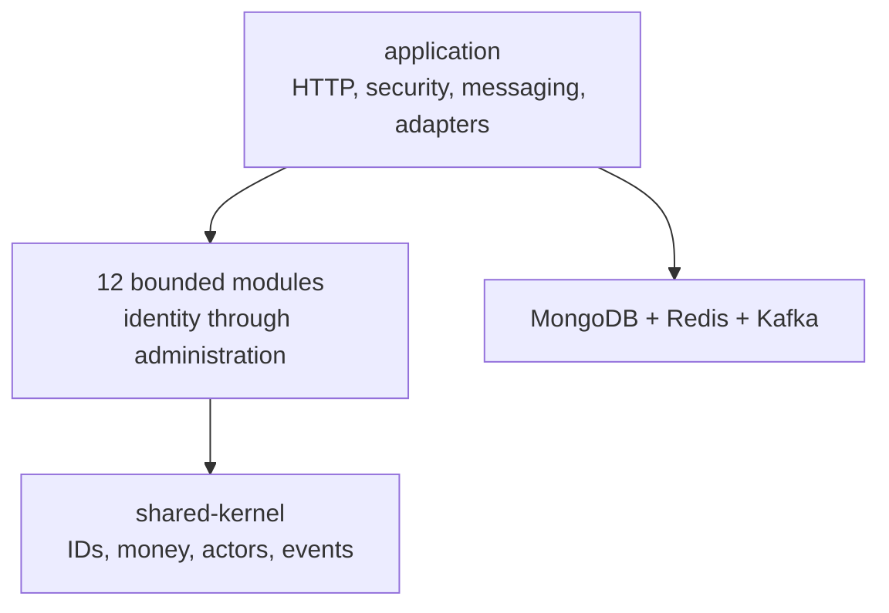

# LocalServe — Phase 5: Backend Development

**Status:** implementation checkpoint complete  
**Date:** 2026-08-06  
**Runtime target:** Java 21, Spring Boot 4.1.0, Maven 3.9.6+  
**Source of truth:** `LOCAL_SERVE_PRODUCT_SPECIFICATION.md`, followed by Phases 2–4

## 1. Outcome

Phase 5 establishes a runnable, testable modular-monolith backend and implements the safety-critical domain foundation. It is intentionally not 441 copy-pasted controllers: Phase 4 froze the complete external contract and explicitly stages controllers through the critical vertical slice and the dedicated feature phases. Phases 7–11 will expose the existing domain/application capabilities through the frozen route names without renaming roles, states, events or collections.

The implementation contains 13 Maven modules, 129 Java source/test files, approximately 4,435 Java lines, 18 focused test classes, runtime configuration, MongoDB migrations, Docker Compose and CI. Domain objects contain real invariants; there are no empty service methods or core `implement later` branches.

## 2. Backend structure



| Module | Implemented responsibility |
|---|---|
| `shared-kernel` | Strict UUIDv7 public IDs, checked minor-unit money, actors, domain errors, idempotency key and event contracts |
| `identity-access` | Purpose-bound OTPs, Argon2 passwords, permission/role checks, refresh rotation and family-reuse detection |
| `people` | Provider approval, activity, availability, skill, location freshness and capacity eligibility policy |
| `catalog-search` | Deterministic quote calculation, emergency surcharge, tax, commission and provider-net arithmetic |
| `location` | GeoJSON coordinate ordering, accuracy/freshness/future-clock checks and device-sequence replay rejection |
| `booking-dispatch` | Aggregate, exact 18-state machine, OTP/payment evidence, Mongo repository, history and outbox transaction |
| `finance` | Payment state rules, verified capture evidence, balanced double-entry postings, releases, refunds, payouts and webhook verification |
| `communication` | Two-party conversations, membership, client-message idempotency, sequence and pre-confirmation contact privacy |
| `reputation-growth` | One verified review per closed booking, rating/image limits, edit window and moderation |
| `case-management` | Dispute evidence, review state and exact refund/release allocation |
| `administration-analytics` | Maker-checker aggregate for sensitive configuration changes |
| `file-management` | Purpose-based size/MIME/name policy before content inspection and malware scanning adapters |
| `application` | Boot entry point, HTTP/STOMP security, Redis adapters, Mongo adapters, webhook routes, outbox publisher, audit and observability configuration |

## 3. Critical implementation decisions

### 3.1 Booking state is not client-controlled

`Booking` exposes business commands rather than `setStatus`. `BookingStateMachine` contains the exact state graph frozen in Phase 1. Every transition records actor, correlation ID, aggregate version, reason and a versioned domain event. Assignment requires server-verified held payment; start and completion use separate challenge purpose, booking ID and issuance version.

MongoDB optimistic locking uses a persistence `@Version` distinct from the domain aggregate version. Aggregate save, status history and outbox insert share a MongoDB transaction and therefore require a replica set.

### 3.2 Platform-held payment, not a false legal-escrow claim

`Payment` records a platform-held delayed-settlement workflow. Only verified gateway evidence may move funds to `HELD`. Release requires completion OTP, customer satisfaction, no dispute and settlement eligibility. A dispute moves funds to `FROZEN`.

`LedgerPostingFactory` emits balanced debit/credit transactions for capture, settlement, release, freezes, refunds, payouts, reversal, promotion and gateway fee. Every allocation operates in integer minor units and must balance exactly. The code does not claim Razorpay or Stripe provides legal escrow; regulated marketplace or escrow adapters can replace the payment port where a region requires one.

### 3.3 Webhooks are hostile input until verified

The ingress preserves raw bytes, caps the body at 1 MiB, validates the Stripe timestamp and HMAC or Razorpay HMAC in constant time, and parses JSON only after verification. Receipt uniqueness is `(provider, providerEventId)` and the stored default is a digest plus metadata, not an unrestricted raw payment payload. Duplicate delivery is safely acknowledged without a second receipt.

### 3.4 Refresh lineage is server-owned

Refresh values are 256-bit random URL-safe tokens; only HMAC hashes and metadata enter Redis. Rotation is one Lua operation. Principal, family, parent and remembered-session lifetime are inherited from the stored parent—not accepted from the frontend. Reusing a rotated value revokes every live token in the family. Logout-all revokes the server-side session set.

### 3.5 Asynchronous consistency

The outbox publisher atomically claims events with a lease, publishes with Kafka `acks=all` and idempotent producer settings, then marks success. A crash between publish and mark can redeliver; downstream consumers must deduplicate by `eventId`. Failures receive bounded exponential retry and a safe error code. Event names remain versioned, for example `localserve.booking.booking-status-changed.v1`.

## 4. Security controls implemented

- Two ordered Spring Security chains isolate `/api/v1/admin/**` from the user API.
- JWT signature/issuer validation is delegated to Spring Security’s resource server; `roles`, Keycloak-style realm roles, scopes and permission claims receive an allowlisted mapping.
- Customer and provider route prefixes are separately authorized. Method security is enabled for permission checks in feature controllers.
- Authentication failures and denials use the same redacted problem format and correlation ID as application errors.
- CORS uses an explicit environment allowlist, credentials policy, allowed headers and bounded preflight cache. Wildcard origins are not enabled.
- Stateless bearer APIs disable CSRF because they do not authenticate with ambient cookies. Phase 7’s refresh-cookie route must use the documented origin/CSRF binding.
- HSTS, CSP and anti-framing policy are set at the API edge; TLS remains mandatory at the ingress/load balancer.
- Redis rate limiting uses HMAC-pseudonymized source addresses. Sensitive authentication routes fail closed if protection is unavailable; ordinary API traffic degrades without silently disabling signature/auth checks.
- Passwords use Argon2 and a k-anonymity breached-password check; only the first five SHA-1 digest characters leave the process.
- OTP codes are HMAC protected, purpose/subject/version bound, attempt-limited, TTL-bound and atomically consumed.
- WebSocket `CONNECT` requires issuer-validated JWT. Client sends are restricted to `/app/**`; subscriptions are private `/user/queue/**` or admin-role `/topic/admin/**`.
- Audit writes reject password, OTP, Aadhaar, PAN, token, card, bank, authorization and secret metadata keys. The service exposes insert only.
- Upload policies reject unexpected purpose/MIME/size and traversal names. Object storage, magic-byte inspection, AV quarantine and signed download adapters remain in the later file-management vertical slice.
- Containers use a non-root UID, read-only filesystem, dropped Linux capabilities, `no-new-privileges`, bounded temporary storage and graceful shutdown.

## 5. Data and integration changes

### MongoDB

The first migration creates critical indexes for bookings, booking history, outbox, provider geospatial search, location TTL, OTP audit TTL, webhook uniqueness, reviews, chat idempotency and audit lookup. Application-side automatic index creation is disabled; deployments run reviewed migrations.

New executable documents/adapters in this phase:

- `bookings` with aggregate and persistence versions.
- `booking_status_history` with unique `(bookingId, aggregateVersion)`.
- `outbox_events` with unique `eventId`, retry, lease and publish metadata.
- `webhook_receipts` with unique `(provider, providerEventId)` and body digest.
- `audit_logs` append-only through `AuditService`.

### Redis

| Key | Purpose | Atomic behavior |
|---|---|---|
| `localserve:otp:{challengeId}` | OTP hash and policy | Lua attempt increment/lock/consume |
| `localserve:rt:{sessionSlot}:{tokenHash}` | Refresh-token metadata | Lua rotate and replay detection |
| `localserve:rt-family:{sessionSlot}:{familyId}` | Token-family membership | Whole-family revocation |
| `localserve:rt-session:{sessionSlot}` | Device-session membership | Logout-all/session revocation |
| `localserve:rate:{class}:{subject}:{bucket}` | Fixed-window guard | `INCR` plus first-write expiry |

### Kafka

`booking.events.v1` receives the Phase 5 booking status envelope. The producer is configured with `acks=all` and idempotence. The topic catalog and schemas remain those frozen in Phase 3; consumers are added with their owning feature phases.

Refresh-token keys use a Redis Cluster hash tag derived from the server-validated session ID, so the token, family and session sets touched by one Lua rotation remain in the same slot.

## 6. APIs and real-time surfaces added

| Surface | Authorization | Behavior |
|---|---|---|
| `GET /api/v1/public/platform-status` | Anonymous | Coarse application identity/version only |
| `POST /api/v1/integrations/webhooks/razorpay` | HMAC | Verify raw bytes, record/dedupe receipt, return `202` |
| `POST /api/v1/integrations/webhooks/stripe` | HMAC + timestamp | Verify raw bytes, record/dedupe receipt, return `202` |
| `/ws` | JWT STOMP `CONNECT` | Native WebSocket endpoint |
| `/ws-sockjs` | JWT STOMP `CONNECT` | SockJS fallback endpoint |
| `/user/queue/**` | Authenticated connection | Private event subscription boundary |
| `/topic/admin/**` | `ADMIN` connection | Admin monitoring subscription boundary |
| `/actuator/health/liveness` | Anonymous/coarse | Container liveness |
| `/actuator/health/readiness` | Anonymous/coarse | Dependency-aware readiness |

The complete API surface remains frozen in Phase 4. This phase wires only endpoints with implemented effects; it does not generate placeholder controllers returning fake success.

## 7. Tests added

| Area | Assertions |
|---|---|
| Shared kernel | UUIDv7 validation/generation; currency and overflow-safe money math |
| Booking | Happy path to `CLOSED`; invalid transitions; payment verification; assigned-provider authorization; OTP purpose isolation |
| Finance | Every posting balances; allocation mismatch fails; unverified/mismatched capture fails; release conditions; webhook verify-before-parse and dedupe |
| Identity | OTP single use/replay; refresh rotation preserves family; reuse revokes family |
| Dispatch/location | Complete provider eligibility reasons; stale, inaccurate and replayed samples rejected |
| Pricing/review/chat/dispute | Deterministic minor-unit quote; closed-booking-only review; conversation privacy/idempotency; exact dispute allocation |
| Files/admin | MIME/path policy; maker cannot self-approve |
| Application | Correlation-ID sanitization; ArchUnit framework/domain and web/persistence boundaries |

Phase 12 remains responsible for broad MockMvc, Testcontainers, WireMock, REST Assured, WebSocket, browser E2E, load and security suites and enforced aggregate coverage thresholds.

## 8. Environment variables

Required at application startup:

- `APP_ENVIRONMENT`, `MONGODB_URI`, `REDIS_URL`, `KAFKA_BOOTSTRAP_SERVERS`, `JWT_ISSUER_URI`, `CORS_ALLOWED_ORIGINS`
- `OTP_HMAC_PEPPER`, `REFRESH_TOKEN_PEPPER`, `RATE_LIMIT_PEPPER` — independently generated values of at least 32 bytes
- `RAZORPAY_WEBHOOK_SECRET`, `STRIPE_WEBHOOK_SECRET`

Optional or feature-adapter variables are documented in `.env.example`: gateway API credentials, Google Maps, Firebase, private S3-compatible storage, SMTP, OpenTelemetry and Sentry. Blank optional adapters are not instantiated in this checkpoint. No secret is committed.

## 9. Run and verification

### Developer verification

```bash
cd localserve
./scripts/verify-phase5.sh
```

The script validates all POMs, package/path consistency, placeholder bans, exact booking-status drift and then executes the Maven reactor when Maven is installed.

### Local services

```bash
cd localserve
cp .env.example .env
# Replace secret placeholders and set a reachable OIDC issuer.
docker compose -f infrastructure/compose/docker-compose.yml up --build
```

MongoDB runs as a single-node replica set because transactions are mandatory. Redis uses AOF/no-eviction for local correctness, and Redpanda provides the Kafka-compatible development broker. These settings are for workstation integration, not a production cluster topology.

### Production build

```bash
mvn --batch-mode --no-transfer-progress -pl backend/application -am verify
docker build -f backend/Dockerfile -t localserve-api:1.0.0 .
```

Run `001_core_indexes.js` through the deployment migration job before shifting traffic. Production must provide a managed OIDC issuer, TLS ingress, authenticated clustered data services, private object storage, managed secrets, monitoring and backups.

### Verification evidence in this workspace

- 15 Maven POMs parsed successfully.
- 129 Java files parsed successfully with a Java grammar parser; zero syntax failures.
- 75 framework-free production sources compiled with the available embedded JDK compiler using `-Xlint:all -Werror`; zero warnings or errors.
- Application, local, Compose and GitHub Actions YAML parsed successfully.
- Static invariants passed across 129 Java files.
- The full Spring dependency graph, Java 21 reactor, JUnit suite and Docker health checks were **not executed in this workspace** because it provides only a Java 17 runtime and has no Maven, `javac` launcher or Docker. CI is configured to perform the authoritative Java 21 `mvn verify` run.

## 10. Phase completion ledger

### Completed deliverables

- Java 21 Maven modular-monolith project and application bootstrap.
- Clean domain code for the safety-critical booking/payment/identity path and meaningful supporting module policies.
- MongoDB, Redis and Kafka integration foundations, transactional outbox, structured errors/logging, metrics/health configuration.
- Docker build, local Compose topology, reviewed migration script and GitHub Actions verification workflow.
- Unit/architecture test suite and deterministic static verifier.

### Important architectural decisions

- Public IDs are UUIDv7 strings; database implementation IDs never cross APIs.
- Money is immutable integer minor units with explicit deterministic rounding.
- Booking status changes only through aggregate commands and one state machine.
- Payment uses platform-held delayed settlement and double-entry records, not an unsupported legal-escrow claim.
- Redis Lua owns one-time/replay-sensitive mutations.
- MongoDB outbox plus Kafka provides at-least-once delivery with consumer deduplication.
- Framework-specific code stays in adapters/application; domain packages remain framework-free.
- Resilience4j core registries are used programmatically. The Spring starter is not pinned until its Spring Boot 4 compatibility is verified for the selected release line.

### Project files created

- Root Maven/README/environment/ignore/CI files.
- Thirteen backend module POMs and their `src/main`/`src/test` trees.
- Application YAML, Dockerfile, Compose file, Mongo migration and verification script.
- This Phase 5 implementation record.

### Database changes

- Added executable booking, status history, outbox, webhook receipt and audit document mappings.
- Added critical unique, compound, TTL and `2dsphere` migration indexes.
- Kept automatic production index creation disabled.

### APIs added

- Platform status, Razorpay webhook, Stripe webhook, STOMP/WebSocket endpoints and Actuator probes listed in Section 6.

### Security controls added

- JWT/RBAC/permission mapping, separate admin filter chain, CORS, HSTS/CSP, problem responses, correlation IDs, Redis throttling, Argon2/breach screening, OTP protection, refresh rotation/revocation, webhook signatures, STOMP destination authorization, audit redaction and upload policy.

### Tests added

- Eighteen test classes across domain, security-support and architecture behavior; see Section 7.

### Environment variables required

- Listed in Section 8 and fully enumerated in `.env.example`.

### Instructions to run the current phase

- Listed in Section 9. A reachable standards-compliant OIDC issuer and real development webhook secrets are required; fake payment success is not provided.

### Remaining work for Phase 6

- Build the shared Next.js/Tailwind/ShadCN design system and separate customer, provider and admin route groups.
- Implement typed API client, token/session boundary, React Query cache policy, Redux UI/session state, React Hook Form/Zod forms, responsive navigation, dark/light themes and accessibility primitives.
- Connect only currently implemented surfaces; Phases 7–11 add the role-specific authentication, booking, finance, real-time and admin vertical controllers against the frozen Phase 4 contract.

Phase 6 must not move authorization into the browser, expose refresh tokens to JavaScript, infer payment success, or bypass the server state machine.
