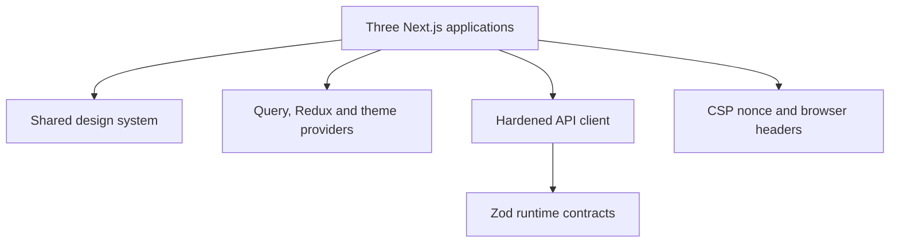

# LocalServe — Phase 6: Frontend Development

**Status:** implementation checkpoint complete  
**Date:** 2026-08-06  
**Runtime target:** Node.js 24 LTS, Next.js 16.3, React 19.2, TypeScript 5.9  
**Source of truth:** `LOCAL_SERVE_PRODUCT_SPECIFICATION.md`, followed by Phases 2–5

## 1. Outcome

Phase 6 delivers three separately deployable web applications—customer, provider and admin—plus a shared design system, runtime contracts, query/state foundation, hardened API client and browser security boundary. The result is an advanced final-year capstone implementation: it is polished, explainable in a viva, runnable on one development machine and shaped like a real startup codebase.

This phase does not pretend that unfinished backend feature routes already work. Dashboard values and records are clearly compile-time preview fixtures. Buttons with future server effects do not display fake success, payments are never inferred in the browser, and the provider availability control is explicitly labelled as a preview. Phases 7–11 replace these fixtures with authenticated vertical slices against the frozen Phase 4 contract.

The frontend workspace contains 95 source/configuration files before generated dependencies and build output. All eight workspaces pass strict TypeScript and ESLint checks; ten unit, component, contract and security tests pass; and all three applications produce standalone production builds.

## 2. Frontend architecture



### 2.1 Workspace map

| Workspace | Responsibility | Deployment unit |
|---|---|---|
| `apps/customer` | Discovery, booking draft, bookings, tracking and account experience | Customer origin, port `3000` locally |
| `apps/provider` | Availability, incoming jobs, schedule, earnings and verification profile | Provider origin, port `3001` locally |
| `apps/admin` | Operations overview, providers, bookings, finance, disputes and settings | Restricted admin origin, port `3002` locally |
| `packages/ui` | Accessible primitives, cards, tables, status vocabulary, role shell, tokens and motion | Transpiled into each app |
| `packages/contracts` | Zod schemas and inferred TypeScript contracts | Shared browser/server contract vocabulary |
| `packages/api-client` | Timeout, safe error, idempotency, optimistic version and response-validation policy | Shared transport adapter |
| `packages/app-core` | Redux Toolkit UI state, TanStack Query policy and theme provider | Per-request/per-tab application state |
| `packages/app-security` | Per-request CSP nonce and security response headers | Next.js Proxy boundary |

The applications import packages through npm workspaces. They do not import another role application, so customer, provider and admin can be built, deployed, scaled and rolled back independently.

### 2.2 State ownership

| State | Owner | Reason |
|---|---|---|
| Remote resources and mutation lifecycle | TanStack Query | Deduplication, stale policy, cancellation and invalidation |
| Transient UI state | Redux Toolkit | Explicit cross-component state without duplicating server records |
| Form state | React Hook Form | Isolated field updates and accessible validation lifecycle |
| Runtime validation | Zod contracts | Reject malformed API data before it reaches views |
| Authentication/session truth | Spring backend and server-side session boundary in Phase 7 | Authorization must never depend on browser state |
| Booking/payment truth | Spring domain state machine and verified payment webhooks | The client renders status; it never promotes status itself |

Redux deliberately does not mirror bookings, payments, profiles or query results. Refresh tokens are not stored in Redux, Web Storage, IndexedDB or JavaScript-readable cookies.

## 3. Application routes delivered

### Customer application

| Route | Experience |
|---|---|
| `/` | Premium mobile-first home, popular services, active booking tracker and nearby providers |
| `/search` | Location-aware query presentation, filters, sorting, provider comparison and empty result state |
| `/book` | React Hook Form + Zod instant/scheduled/emergency booking draft and honest review step |
| `/bookings` | Active and historical booking presentation with canonical state badges |
| `/bookings/[bookingId]` | Timeline, ETA map treatment, provider details and held-payment explanation |
| `/account` | Addresses, wallet, notification preferences, favourites and account controls |

### Provider application

| Route | Experience |
|---|---|
| `/` | Availability preview, earnings, service performance, current job and incoming request |
| `/jobs` | Current, upcoming and historical work queues |
| `/earnings` | Daily/weekly/monthly earnings, held balance, payout and transaction views |
| `/schedule` | Working hours, breaks and availability planning |
| `/profile` | Verification state, skills, documents, service radius and pricing readiness |

### Admin application

| Route | Experience |
|---|---|
| `/` | Operational KPIs, revenue trend, service health and attention queues |
| `/providers` | Verification and provider risk review table |
| `/bookings` | Cross-platform booking operations view |
| `/finance` | Held funds, payout, refund and reconciliation overview |
| `/disputes` | Evidence and resolution queue |
| `/settings` | Feature flags and maker-checker configuration presentation |

Admin metadata is `noindex, nofollow`. This is defense in depth, not access control; Phase 7 enforces separate admin authentication, permissions and step-up controls.

## 4. Design system and UX

The design is based on Material Design 3 principles with an original LocalServe visual language: deep teal, warm accents, high-radius surfaces, restrained shadows and dense operational tables where appropriate.

Implemented shared primitives include:

- buttons with variants, sizes, disabled states and Radix `Slot` composition;
- cards, badges, inputs, labelled fields, search fields, avatars, progress, toggles and skeletons;
- section headings, statistic cards, empty states and accessible data tables;
- booking status badges backed by the exact 18 canonical status values;
- responsive role shells with desktop sidebar, mobile bottom navigation, drawer overlay and offline indicator;
- system/light/dark themes using semantic CSS tokens;
- reduced-motion-aware entrance animation using Motion;
- consistent currency and date formatters.

The source remains intentionally understandable for final-year students: shared abstractions remove duplication, but business concepts are visible and packages have one clear reason to change.

## 5. Accessibility

The implemented baseline targets WCAG 2.2 AA:

- semantic landmarks and labelled desktop/mobile navigation;
- a first-focus “Skip to content” link;
- keyboard-visible focus rings and minimum touch-target sizing;
- real button, link, table, fieldset, radio and switch semantics;
- `aria-current`, `aria-checked`, `aria-invalid`, live loading status and alert error states;
- screen-reader-only captions and loading labels;
- light/dark contrast tokens and offline state that is not colour-only;
- global `prefers-reduced-motion` handling plus component-level motion reduction;
- route-level loading, error and not-found states for all three applications.

Automated browser accessibility auditing and manual screen-reader/high-contrast matrices remain Phase 12 release gates.

## 6. API and security decisions

### 6.1 Browser API client

`ApiClient` provides:

- mandatory Zod response parsing;
- `credentials: include` for the Phase 7 same-origin cookie boundary;
- abortable ten-second default timeouts;
- safe `LocalServeApiError` instances carrying status, stable code and correlation ID;
- one retry only for idempotent `GET` requests returning `502`, `503` or `504`;
- no automatic mutation retries;
- `Idempotency-Key` for retry-sensitive commands;
- `If-Match: "v<n>"` for optimistic concurrency;
- optional CSRF token injection;
- `cache: no-store` by default.

The client never accepts “payment successful” as trusted frontend state. A future payment screen only advances after the backend consumes and verifies a signed gateway webhook.

### 6.2 Browser security headers

Every role app runs a Next.js Proxy that creates a per-request nonce and sets:

- a deny-by-default Content Security Policy with `strict-dynamic` scripts;
- `frame-ancestors 'none'` and `object-src 'none'`;
- restricted forms, images, connections, workers and base URI;
- `X-Content-Type-Options: nosniff`;
- strict-origin referrer policy;
- a restrictive Permissions Policy;
- same-origin opener policy;
- production HSTS for two years with subdomains and preload policy;
- production-only upgrade of insecure requests.

The current CSP includes only the documented Maps and LocalServe API origins. Payment provider frames/scripts must be added narrowly during Phase 9 after choosing the provider-hosted checkout mode.

### 6.3 Authentication boundary

Phase 6 prepares the boundary but does not implement fake login. Phase 7 will use a short-lived access token and rotating server-owned refresh lineage. The preferred web flow is a same-origin BFF or HttpOnly/Secure/SameSite cookie boundary with CSRF and Origin validation. Refresh tokens must never become JavaScript-readable.

The Phase 4 real-time contract requires a one-time WebSocket ticket. The Phase 5 backend checkpoint currently validates JWT on STOMP `CONNECT`; Phase 10 must close this planned contract gap before real-time browser integration is enabled.

## 7. Progressive Web App boundary

Customer and provider applications expose installable manifests and role-specific SVG icons. They set standalone display, theme colour and viewport fit. No service worker caches authenticated or financial responses in this phase. Offline support is limited to connection awareness; safe offline queues require explicit idempotency, expiry and conflict policy in Phase 10/12.

The admin console is intentionally not promoted as an installable PWA.

## 8. Build and dependency policy

- Versions are exact-pinned in `package.json` and resolved by `package-lock.json`.
- Node.js 24 and npm 11 are the CI baseline.
- TypeScript uses strict mode and exact optional property types.
- Next.js emits `standalone` server output for each deployment unit.
- Webpack is selected explicitly for deterministic production builds; Next.js 16 still supports this production builder.
- Builds use one CPU lane and worker threads in constrained environments. Type checking remains enabled inside every Next production build.
- The GitHub workflow uses least-privilege repository permissions, lockfile installs, concurrency cancellation and separate lint/type/test/build gates.

## 9. Tests added

| Suite | Count | Coverage in this phase |
|---|---:|---|
| API client unit | 2 | Runtime response validation and safe API problem mapping |
| Design-system component | 2 | Native button behavior and assistive switch semantics |
| Contract unit | 3 | Booking draft rules and frozen 18-status vocabulary |
| Security proxy unit | 3 | Nonced CSP, anti-framing/content-sniffing, permissions policy and production HSTS |
| Playwright specifications | 2 scenarios × 3 projects | Role navigation and keyboard skip-link smoke paths; execution staged below |

Playwright projects cover customer desktop, provider mobile and admin desktop. Their specs are committed, but browser binaries are not installed in this execution workspace, so those six browser cases were not run here. Phase 12 expands this into complete E2E, visual, accessibility and failure-path coverage.

## 10. Environment variables

| Variable | Exposure | Purpose |
|---|---|---|
| `NEXT_PUBLIC_APP_ENV` | Browser-safe | Environment label only |
| `NEXT_PUBLIC_API_BASE_PATH` | Browser-safe | Same-origin API prefix, default `/api/v1` |
| `NEXT_PUBLIC_GOOGLE_MAPS_BROWSER_KEY` | Browser-visible by design | Restrict by exact HTTPS origin and Maps APIs in Google Cloud |
| `BACKEND_API_ORIGIN` | Server only | Upstream Spring API for the Phase 7 BFF/proxy boundary |

No payment secret, OAuth client secret, Firebase service account, JWT private key or identity-document credential may use a `NEXT_PUBLIC_` variable.

## 11. Run and verification

### Development

```bash
cd localserve/frontend
cp .env.example .env.local
npm ci --ignore-scripts
npm run dev
```

Open customer `http://localhost:3000`, provider `http://localhost:3001` and admin `http://localhost:3002`.

### Static and production verification

```bash
cd localserve
./scripts/verify-phase6.sh
```

Equivalent manual commands:

```bash
cd localserve/frontend
npm run lint
npm run typecheck
npm run test
NEXT_TELEMETRY_DISABLED=1 TURBO_TELEMETRY_DISABLED=1 npm run build -- --concurrency=1
```

### Optional browser smoke suite

```bash
cd localserve/frontend
npx playwright install chromium
npm run test:e2e
```

## 12. Verification evidence

- ESLint: eight of eight workspaces passed with zero reported errors or warnings after a forced non-cached run.
- TypeScript: eight of eight workspaces passed strict `tsc --noEmit` checks.
- Vitest: four test files, ten tests, all passed.
- Customer production build: compiled, type-checked and generated eight routes.
- Provider production build: compiled, type-checked and generated eight routes.
- Admin production build: compiled, type-checked and generated eight routes.
- Each app emitted Next.js standalone output.
- Production HTTP smoke: customer home and booking draft returned `200`; the manifest rendered; CSP nonce, HSTS, no-sniff, referrer, opener and permissions headers were present.
- Browser E2E was authored but not run because this workspace has no installed browser binary.

The runner initially rejected Next’s child-process TypeScript CLI. The committed configuration uses Next’s supported in-process TypeScript API with worker threads; type checking remains enabled and all three builds completed. This is not an `ignoreBuildErrors` bypass.

## 13. Phase completion ledger

### Completed deliverables

- Separate customer, provider and admin Next.js applications.
- Shared responsive design system, theme, role shell, query/store providers, contracts, API client and browser security proxy.
- Customer discovery, booking draft, tracking and account pages.
- Provider availability, jobs, schedule, earnings and verification pages.
- Admin analytics, provider, booking, finance, dispute and settings pages.
- Responsive, dark/light, loading, error, empty, offline and reduced-motion states.
- Locked dependency graph, production builds, CI and focused frontend tests.

### Important architectural decisions

- Each role application is a separate deployment and trust experience.
- TanStack Query owns server state; Redux owns only cross-component UI state.
- Zod validates both user drafts and server payloads at runtime.
- Browser code never owns authorization, refresh lineage, booking state or payment truth.
- Preview fixtures cannot create side effects and are removed incrementally as vertical APIs land.
- Customer/provider are PWA-ready; admin remains restricted web-only.
- Webpack plus worker threads is the deterministic production build path for this pinned Next release.

### Project files created

- `frontend/apps/customer`, `frontend/apps/provider`, `frontend/apps/admin`.
- `frontend/packages/contracts`, `api-client`, `app-core`, `ui`, `app-security`.
- Frontend workspace, TypeScript, ESLint, Turbo, Playwright, Tailwind/PostCSS and environment configuration.
- `.github/workflows/frontend-ci.yml`, `scripts/verify-phase6.sh` and this implementation record.

### Database changes

- None. Phase 6 consumes the collection and event contracts frozen in Phase 3.

### APIs added

- No Spring REST endpoints were added. Phase 6 adds typed client transport and browser route surfaces only.
- No fake API, authentication or payment-success endpoint was introduced.

### Security controls added

- Nonced CSP, anti-framing, content-sniffing prevention, referrer/permissions/opener policy.
- Runtime response validation, safe errors, timeout, read-only retry policy, idempotency and optimistic concurrency headers.
- No browser token persistence and no JavaScript-readable refresh token design.
- Admin search-engine exclusion and separate deployment boundary.

### Tests added

- Ten executed unit/component/contract/security tests and six authored Playwright smoke cases across three projects.

### Environment variables required

- Listed in Section 10 and in `frontend/.env.example`; all are optional for the fixture-backed Phase 6 presentation build.

### Instructions to run the current phase

- Listed in Section 11. No backend, database or gateway sandbox is required to inspect the role experiences. Phase 7 integration requires the Spring API and identity provider.

### Remaining work for Phase 7

- Implement customer/provider registration and email/password login.
- Implement phone OTP issue/verify with Redis rate and attempt controls.
- Integrate Google OAuth 2.0 authorization code flow.
- Implement short-lived access JWTs, rotating refresh tokens, replay detection and device sessions.
- Add verified email/phone, forgot/reset password, logout, logout-all and account suspension checks.
- Add separate admin authentication, optional TOTP/WebAuthn, step-up and permission loading.
- Replace shell fixture identities with server-resolved sessions and protect every role route on the server.
- Add CSRF/Origin binding for cookie-authenticated commands and security-focused integration/E2E tests.

Phase 7 must preserve all frozen roles, API paths and token rules and must not store refresh credentials in Web Storage.
